# Hello-Agents：从零构建智能体应用

---

**生成时间**: 2026-02-20 09:38:23

---

# 目录

## 第一部分：基础篇

- 第1章：课程介绍
- 第2章：智能体发展史
- 第3章：大语言模型基础

## 第二部分：构建篇

- 第4章：Agent核心范式
- 第5章：低代码平台开发
- 第6章：框架开发实践
- 第7章：构建自定义Agent框架

## 第三部分：进阶篇

- 第8章：记忆与检索
- 第9章：上下文工程
- 第10章：通信协议
- 第11章：Agentic-RL
- 第12章：性能评估

## 第四部分：案例篇

- 第13章：智能旅行助手
- 第14章：研究代理
- 第15章：赛博小镇游戏

## 第五部分：毕业设计

- 第16章：毕业设计项目

---


# 第一部分：基础篇

---


# 第1章：课程介绍

---

# 第1章：初识智能体

## 章节概述

本章将带你认识什么是智能体（Agent），了解智能体的核心特征、类型分类，以及它与普通大语言模型的区别。

## 学习目标

- 理解智能体的定义和核心特征
- 掌握智能体的类型分类
- 了解 Agent 与 LLM 的区别
- 认识智能体的应用场景

## 核心概念

### 什么是智能体？

智能体是一个能够**感知环境**、**做出决策**并**采取行动**的自主系统。它具备以下核心特征：

1. **感知能力（Perception）**：能够接收和理解环境信息
2. **决策能力（Decision Making）**：基于感知信息做出判断
3. **行动能力（Action）**：能够执行具体的操作
4. **自主性（Autonomy）**：能够独立运行，无需人工干预
5. **目标导向（Goal-oriented）**：以达成特定目标为导向

### Agent vs LLM

| 特性 | 传统 LLM | AI Agent |
|------|---------|----------|
| 能力 | 文本生成和理解 | 感知-决策-行动循环 |
| 交互 | 单次问答 | 持续交互 |
| 工具使用 | 无 | 可以调用外部工具 |
| 记忆 | 上下文窗口 | 长期记忆系统 |
| 目标 | 回答问题 | 完成任务 |
| 自主性 | 被动响应 | 主动行动 |

### 智能体分类

#### 1. 按能力分类

**单功能 Agent**
- 专注单一任务
- 例如：代码审查 Agent、翻译 Agent

**多功能 Agent**
- 处理多种相关任务
- 例如：办公助手 Agent

**通用 Agent**
- 处理各类复杂任务
- 例如：个人智能助理

#### 2. 按架构分类

**反思型 Agent（ReAct）**
- 推理+行动
- 适合需要步骤规划的任务

**规划型 Agent**
- 先规划再执行
- 适合复杂多步骤任务

**反应型 Agent**
- 直接响应
- 适合实时任务

#### 3. 按数量分类

**单个 Agent**
- 独立完成任务

**多 Agent 系统**
- 多个 Agent 协作
- 适合复杂系统

## 应用场景

### 🎮 游戏开发领域（重点）

#### 1. 智能 NPC
- **对话系统**：自然语言交互的 NPC
- **行为决策**：根据环境做出合理行为
- **情感表达**：模拟真实情感反应
- **记忆系统**：记住与玩家的互动历史

**应用案例**：
- RPG 游戏中的角色对话
- 开放世界中的动态行为
- 社交模拟游戏中的角色关系

#### 2. 游戏 AI 对手
- **战术决策**：制定战斗策略
- **学习适应**：从玩家行为中学习
- **动态难度**：根据玩家水平调整
- **团队协作**：多 Agent 配合

**应用案例**：
- RTS 游戏中的 AI 对手
- FPS 游戏中的战术队友
- MOBA 游戏中的智能英雄

#### 3. 内容生成
- **剧情生成**：动态生成游戏剧情
- **任务生成**：创建随机任务
- **对话生成**：生成角色对话
- **物品生成**：设计游戏道具

**应用案例**：
- Roguelike 游戏的事件生成
- 文字冒险游戏的剧情生成
- 沙盒游戏的动态任务

#### 4. 游戏测试
- **自动化测试**：自动测试游戏功能
- **平衡性测试**：测试游戏平衡
- **Bug 发现**：自动发现游戏漏洞
- **性能测试**：压力测试

### 💻 AI编程领域（重点）

#### 1. 代码生成 Agent
- **需求理解**：理解自然语言需求
- **代码生成**：生成符合规范的代码
- **多语言支持**：支持多种编程语言
- **代码优化**：优化生成的代码

**应用案例**：
- GitHub Copilot
- CodeWhisperer
- Cursor

#### 2. 代码审查 Agent
- **质量检查**：检查代码质量
- **安全检测**：发现安全漏洞
- **最佳实践**：推荐最佳实践
- **重构建议**：提供重构方案

**应用案例**：
- 自动 Code Review 系统
- 安全漏洞扫描器
- 代码质量分析工具

#### 3. 测试生成 Agent
- **用例生成**：自动生成测试用例
- **Mock 数据**：生成测试数据
- **覆盖率分析**：分析测试覆盖率
- **回归测试**：执行回归测试

#### 4. 文档 Agent
- **API 文档**：自动生成 API 文档
- **代码注释**：生成代码注释
- **README 生成**：生成项目说明
- **教程编写**：编写使用教程

### 其他领域

- **个人助理**：日程管理、邮件分类
- **客服机器人**：自动客服、问题解答
- **研究助手**：文献检索、数据分析
- **创意助手**：文案创作、设计建议

## 🎯 游戏开发方向学习重点

### 1. 理解游戏中的 Agent 特点

游戏 Agent 的独特之处：
- **实时性要求**：需要快速响应
- **行为真实性**：行为要符合角色设定
- **玩家体验**：优先考虑玩家体验
- **性能优化**：不能影响游戏性能

### 2. 游戏场景分析

选择你感兴趣的游戏类型：
- [ ] RPG 游戏（角色扮演）
- [ ] RTS 游戏（即时战略）
- [ ] FPS/TPS 游戏（射击）
- [ ] MOBA 游戏（多人竞技）
- [ ] 沙盒游戏（开放世界）
- [ ] 社交模拟游戏

### 3. 实践建议

**初学阶段**：
1. 选择一个简单的游戏场景
2. 分析其中哪些部分可以用 Agent 实现
3. 设计一个简单的 Agent 概念

**进阶阶段**：
1. 学习游戏引擎（Unity/Unreal）
2. 了解游戏 AI 框架
3. 实现一个游戏 Agent 原型

## 💻 AI编程方向学习重点

### 1. 理解编程助手的 Agent 特点

编程 Agent 的独特之处：
- **精确性要求**：代码必须正确
- **上下文理解**：理解代码上下文
- **安全性考虑**：避免生成危险代码
- **可维护性**：生成易于维护的代码

### 2. 编程工具分析

选择你感兴趣的方向：
- [ ] 代码生成工具
- [ ] 代码审查工具
- [ ] 测试生成工具
- [ ] 文档生成工具
- [ ] 调试助手
- [ ] 重构助手

### 3. 实践建议

**初学阶段**：
1. 分析现有编程助手的特点
2. 设计一个简单的编程 Agent 概念
3. 明确要解决的具体问题

**进阶阶段**：
1. 学习代码分析技术
2. 了解编程语言特性
3. 实现一个编程助手原型

## 练习作业

### 基础练习
1. **概念理解**
   - 解释智能体的五大核心特征
   - 对比 Agent 和传统 LLM 的区别

2. **案例分析**
   - 分析 3 个不同的智能体应用
   - 说明它们属于哪种类型的 Agent

### 进阶练习
3. **设计练习**（二选一）

   **游戏方向**：
   - 选择一款你喜欢的游戏
   - 设计一个智能体概念
   - 说明它能完成什么任务
   - 描述它的感知-决策-行动流程

   **编程方向**：
   - 选择一个编程痛点问题
   - 设计一个智能体解决方案
   - 说明它的工作原理
   - 描述它的核心功能

4. **调研报告**
   - 调研一款实际的游戏 AI 系统
   - 或调研一款编程助手工具
   - 分析其技术原理
   - 总结优缺点

### 挑战练习
5. **实践探索**
   - 调用一个 LLM API
   - 实现一个简单的问答系统
   - 思考如何将其改造为 Agent

## 学习资源

### 官方资源
- [Hello-Agents 第1章官方文档](https://datawhalechina.github.io/hello-agents/#/)

### 推荐阅读
- 《Artificial Intelligence: A Modern Approach》- Agent 章节
- Reinforcement Learning 相关论文

### 游戏AI资源
- Unity ML-Agents
- Unreal Engine AI 系统
- Game AI Pro 系列书籍

### 编程助手资源
- GitHub Copilot 文档
- OpenAI Codex 论文
- Code Interpreter 相关资料

## 下一步

完成本章学习后，进入：
- [第2章：智能体发展史](../ch02-history/) - 了解智能体的演进历程

## 学习检查

- [ ] 理解智能体的定义和特征
- [ ] 掌握 Agent 与 LLM 的区别
- [ ] 了解智能体的分类方法
- [ ] 认识各领域的应用场景
- [ ] 完成章节练习题
- [ ] 确定自己的学习方向（游戏/编程）
- [ ] 设计一个简单的 Agent 概念


---

**[⬆ 返回目录](#目录)**

---


# 第2章：智能体发展史

---

# 第二章 智能体发展史

## 章节概述

本章将带你了解智能体（Agent）技术从早期发展到现代大语言模型驱动的完整演进历程。理解历史有助于我们把握现在，预见未来。

## 学习目标

- 理解智能体技术的演进脉络
- 掌握各发展阶段的核心特点
- 了解关键技术和里程碑事件
- 理解当前 LLM Agent 的技术基础

---

## 智能体发展时间线

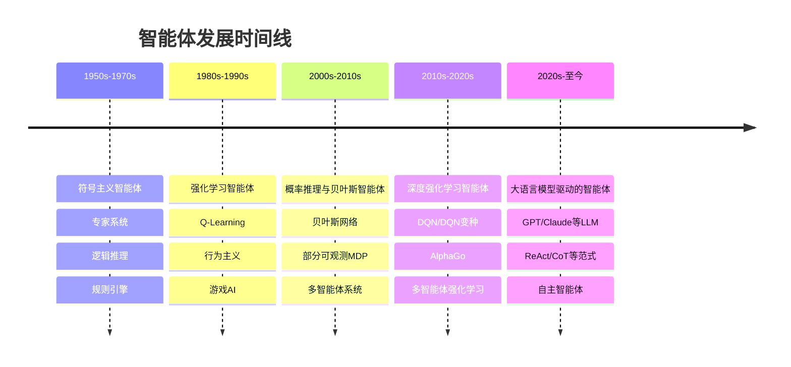

---

## 第一阶段：符号主义智能体（1950s-1970s）

### 核心思想

符号主义（Symbolicism）认为智能可以由**符号操作**实现。智能体通过逻辑推理和规则匹配来做出决策。

### 关键特征

- **显式规则**：行为由人工定义的规则描述
- **逻辑推理**：基于形式逻辑进行决策
- **知识表示**：使用符号系统表示知识
- **确定性输出**：相同输入总是产生相同输出

### 代表性系统

#### 1. 专家系统（Expert Systems）

专家系统是最早的符号主义智能体，它模拟人类专家的决策过程。

**系统架构：**

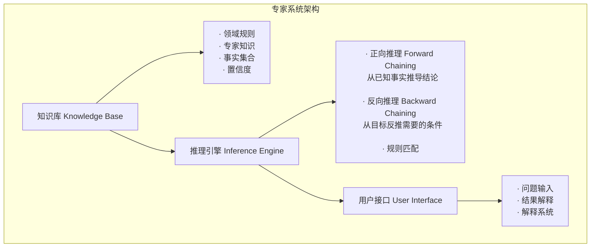

**推理过程示意：**

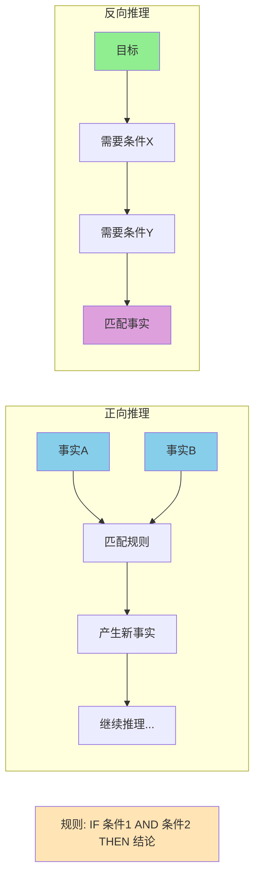

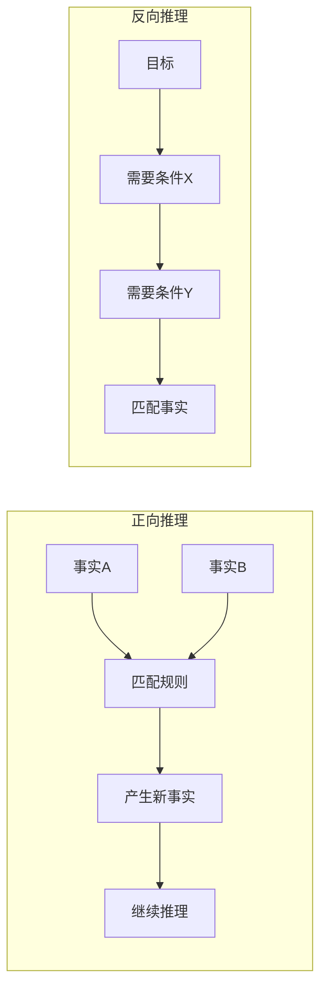

#### 2. STRIPS 规划系统

STRIPS (Stanford Research Institute Problem Solver) 是一个经典的规划系统。

**状态空间搜索：**

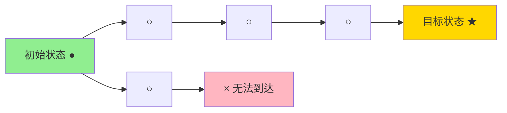

每个动作:
- 前提条件 (Preconditions)
- 添加效果 (Add Effects)
- 删除效果 (Delete Effects)

**规划算法示意：**

```
伪代码: STRIPS 算法

function STRIPS_PLAN(initial_state, goals, actions):
    current_state = initial_state
    plan = []

    while not goals ⊆ current_state:
        找到一个动作 action
        满足:
            1. action 的前提条件在 current_state 中
            2. action 的添加效果有助于达成 goals

        if 找不到这样的动作:
            return 失败

        将 action 加入 plan
        更新 current_state:
            current_state = current_state - action.delete + action.add

    return plan
```

### 局限性

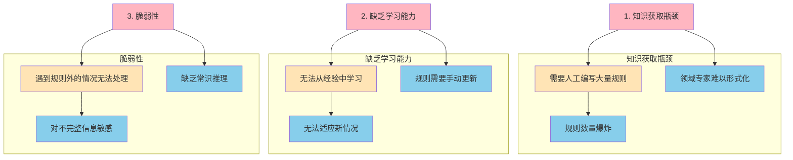

### 符号主义智能体的主要局限

**1. 知识获取瓶颈**
- 需要人工编写大量规则
- 规则数量爆炸，维护成本高
- 领域专家知识难以形式化表达

**2. 缺乏学习能力**
- 无法从经验中自动学习
- 无法适应新的环境和情况
- 规则需要手动更新，灵活性差

**3. 脆弱性**
- 遇到规则覆盖范围外的情况无法处理
- 对不完整信息敏感，容易出错
- 缺乏常识推理能力，处理现实问题能力有限

**总结**：
这些局限性导致了符号主义智能体在实际应用中的局限性，也促使了后续强化学习和深度学习等方法的兴起。

---

## 第二阶段：强化学习智能体（1980s-1990s）

### 核心思想

强化学习（Reinforcement Learning, RL）通过**试错学习**来优化行为策略。智能体通过与环境交互，获得奖励或惩罚，逐步学习最优策略。

### 强化学习循环

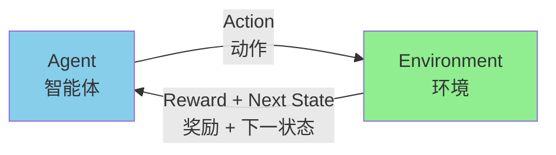

**Agent 的目标**: 最大化累积奖励

**关键要素**:
- 状态: 环境的当前情况
- 动作: Agent 可以执行的操作
- 奖励: 环境给出的反馈信号
- 策略: 状态到动作的映射

### Q-Learning 原理

Q-Learning 是一种经典的强化学习算法，学习状态-动作值函数 Q(s,a)。

**Q值表示意：**

```
Q表: 存储每个状态-动作对的价值

        动作1   动作2   动作3   动作4
状态1   10      5      8      3
状态2   7       20     2      15
状态3   1       3      50     5
...

伪代码: Q-Learning 更新

初始化 Q(s,a) 为任意值
对于每个 episode:
    初始化状态 s
    对于每个步骤:
        根据 Q 选择动作 a (ε-贪心策略)
        执行 a, 观察 r 和 s'

        更新 Q值:
        Q(s,a) ← Q(s,a) + α[r + γ·max Q(s',a') - Q(s,a)]

        s ← s'
    直到 s 是终止状态
```

**ε-贪心策略：**

```mermaid
graph LR
    %% ε-贪心策略逻辑
    subgraph 策略逻辑
        Input[状态 s]
        Decision{随机选择}

        Decision -->|ε| Explore[探索<br/>随机选择动作]
        Decision -->|1-ε| Exploit[利用<br/>选择Q最大的动作]

        Input --> Decision
    end

    %% 示例对比
    subgraph 高ε示例 (0.5)
        HighEps[高 ε = 0.5]
        HighExplore[探索 50%]
        HighExploit[利用 50%]
        HighResult[学习全面<br/>收敛较慢]
    end

    subgraph 低ε示例 (0.1)
        LowEps[低 ε = 0.1]
        LowExplore[探索 10%]
        LowExploit[利用 90%]
        LowResult[收敛较快<br/>可能陷入局部最优]
    end

    %% 样式设置
    style Input fill:#FFE4B5
    style Decision fill:#87CEEB
    style Explore fill:#FFB6C1
    style Exploit fill:#90EE90
    style HighEps fill:#DDA0DD
    style LowEps fill:#90EE90
    style HighResult fill:#87CEEB
    style LowResult fill:#87CEEB
```

### ε-贪心策略详解

**策略逻辑**:
- 对于给定的状态s，智能体选择动作的方式：
  - 以概率ε：随机选择一个动作（**探索**）
  - 以概率(1-ε)：选择Q(s,a)最大的动作（**利用**）

**参数选择策略**:

| ε值 | 探索概率 | 利用概率 | 特点 | 适用场景 |
|-----|---------|---------|------|---------|
| 高ε (如0.5) | 50% | 50% | 更多探索，学习全面，收敛慢 | 探索阶段、未知环境 |
| 低ε (如0.1) | 10% | 90% | 更多利用，收敛快，可能局部最优 | 利用阶段、已知环境 |
| 递减ε | 逐渐降低 | 逐渐升高 | 先探索后利用，平衡最优 | 长期学习任务 |

**平衡策略**:
- **探索**：发现新策略，避免局部最优
- **利用**：使用已知最优策略，快速获得奖励
- **平衡**：根据任务阶段调整ε值，实现最优学习

### 深度Q网络 (DQN)

当状态空间很大时，Q表无法存储，使用神经网络来近似Q函数。

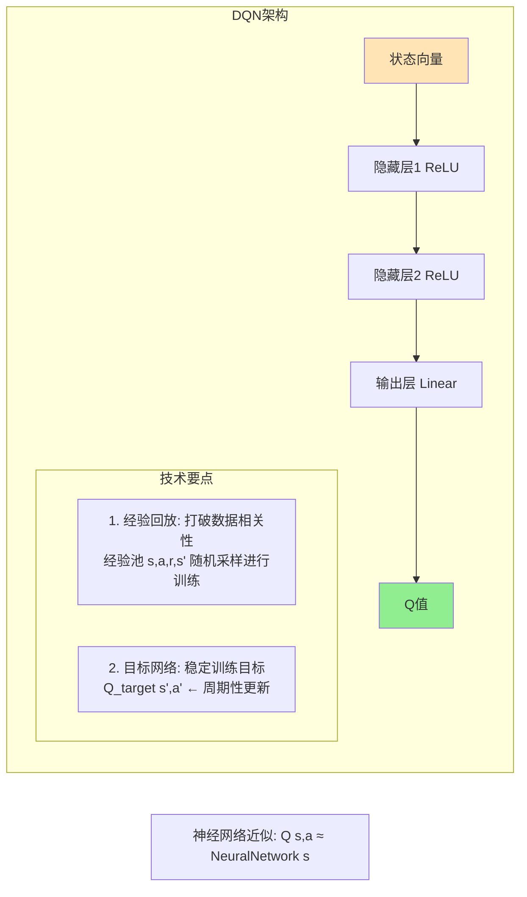

### 里程碑：AlphaGo

2016年，AlphaGo击败围棋世界冠军，是强化学习史上的重要里程碑。

**AlphaGo 核心技术组合：**

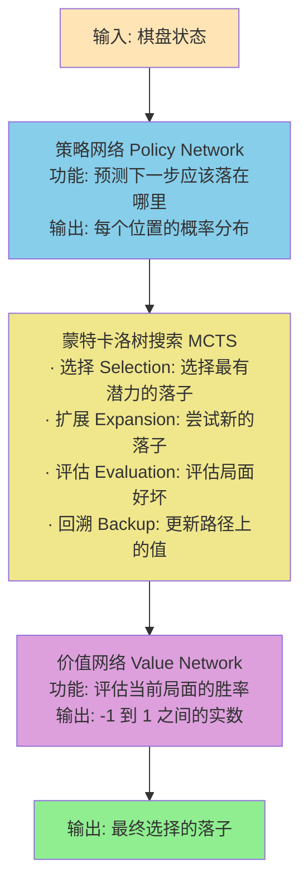

**MCTS 搜索过程示意：**

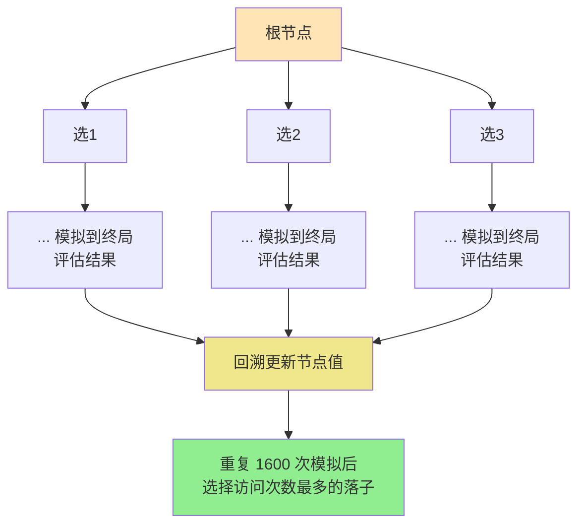

---

## 第三阶段：深度强化学习（2010s）

### 多智能体强化学习（MARL）

多个智能体同时在环境中学习和交互。

**协作 vs 竞争：**

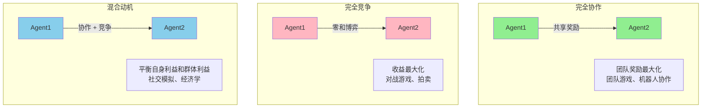

### 系统类型对比

| 类型 | 智能体关系 | 目标 | 应用场景 |
|------|-----------|------|---------|
| 完全协作 | 共享奖励 | 团队奖励最大化 | 团队游戏、机器人协作 |
| 完全竞争 | 零和博弈 | 自己收益最大化 | 对战游戏、拍卖 |
| 混合动机 | 协作+竞争 | 平衡利益 | 社交模拟、经济学 |

---

## 第四阶段：大语言模型驱动的智能体（2020s-至今）

### 革命性变化

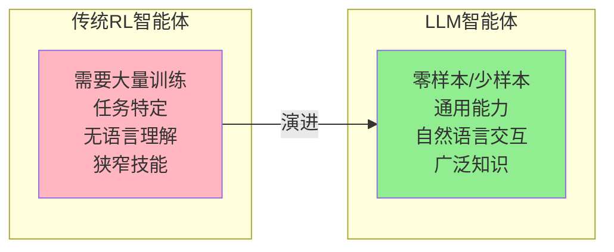

### 核心范式

#### 1. ReAct（推理+行动）

ReAct = Re（推理）+ Act（行动）

```mermaid
flowchart TB
    Question[问题: "巴黎的首都是哪里？"] --> Thought1[Thought: 巴黎本身就是首都<br/>等等，问题可能有错误...]
    Thought1 --> Action1[Action: 搜索 "巴黎 首都"]
    Action1 --> Observation[Observation: 巴黎是法国的首都<br/>问题可能是想问"法国的首都是哪里"]
    Observation --> Thought2[Thought: 法国的首都是巴黎]
    Thought2 --> Action2[Action: Finish[巴黎]]

    style Question fill:#FFE4B5
    style Observation fill:#87CEEB
    style Thought1 fill:#DDA0DD
    style Thought2 fill:#DDA0DD
    style Action1 fill:#90EE90
    style Action2 fill:#90EE90
```

### ReAct 循环特点

1. **Thought（推理）**: 理解问题，思考下一步行动
2. **Action（行动）**: 执行具体操作（搜索、计算等）
3. **Observation（观察）**: 获取行动结果，更新理解
4. **循环迭代**: 直到找到最终答案

#### 2. 思维链

通过逐步推理提升复杂问题的解决能力。

```
问题: "一个游戏有10个任务，每个需要15分钟，总共需要多少小时？"

普通输出:
"需要2.5小时"

思维链输出:
思考1: 首先计算总时间 = 10个任务 × 15分钟 = 150分钟
思考2: 然后转换为小时 = 150分钟 ÷ 60分钟/小时 = 2.5小时
答案: 总共需要2.5小时

思维链的优势:
· 展示推理过程，更可信
· 便于检查错误
· 适用于复杂问题
```

#### 3. 自我一致性

多次采样并投票，提高答案可靠性。

```mermaid
graph TD
    %% 输入问题
    Question[问题: "如果A比B大，B比C大，C比D大，D比E大，哪个最大？"]

    %% 多次采样
    Sample1[采样1<br/>答案: A]
    Sample2[采样2<br/>答案: A]
    Sample3[采样3<br/>答案: B]
    Sample5[采样5<br/>答案: A]

    %% 投票统计
    Vote[投票统计<br/>A: 4票 (80%)<br/>B: 1票 (20%)]

    %% 最终答案
    Final[最终答案: A]

    %% 流程连接
    Question --> Sample1
    Question --> Sample2
    Question --> Sample3
    Question --> Sample5

    Sample1 --> Vote
    Sample2 --> Vote
    Sample3 --> Vote
    Sample5 --> Vote

    Vote --> Final

    %% 样式设置
    style Question fill:#FFE4B5
    style Sample1 fill:#87CEEB
    style Sample2 fill:#87CEEB
    style Sample3 fill:#87CEEB
    style Sample5 fill:#87CEEB
    style Vote fill:#90EE90
    style Final fill:#FFD700
```

### Self-Consistency 流程详解

**步骤1**: 提出问题
- 给定一个需要推理的问题
- 可能涉及逻辑关系、数学计算等

**步骤2**: 多次采样
- 使用不同的随机种子或温度参数
- 每次生成不同的推理路径
- 获得多个可能的答案

**步骤3**: 投票统计
- 统计每个答案的出现次数
- 计算每个答案的比例
- 选择得票最多的答案

**步骤4**: 确定最终答案
- 根据投票结果选择最终答案
- 提高答案的可靠性和准确性

**优势**:
- 通过多样性采样提高答案质量
- 减少模型的随机性影响
- 在复杂推理问题上表现更好

### 游戏开发中的应用

#### 1. 智能NPC对话系统

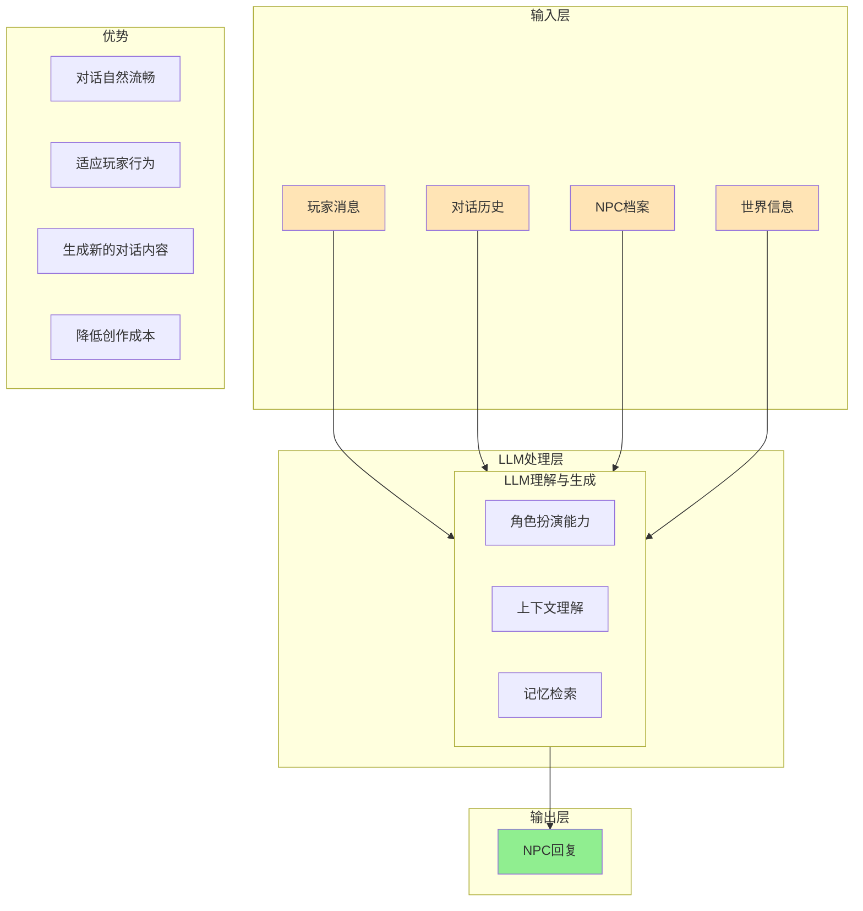

### 系统优势

- **对话自然流畅**: 基于大语言模型的自然语言生成能力
- **适应玩家行为**: 根据对话历史动态调整回复内容
- **生成新的对话内容**: 突破预设对话的限制，创造无限可能
- **降低创作成本**: 自动生成对话，减少人工工作量

#### 2. 动态任务生成

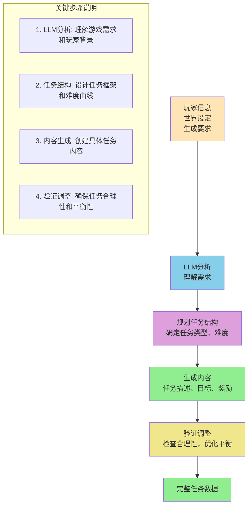

### 动态任务生成流程详解

1. **输入层**: 收集玩家信息、世界设定和具体生成要求
2. **LLM分析**: 利用大语言模型理解需求意图
3. **任务规划**: 设计任务类型、难度和整体结构
4. **内容生成**: 创建具体的任务描述、目标和奖励机制
5. **验证调整**: 检查任务合理性，优化游戏平衡性
6. **输出**: 生成完整的任务数据供游戏使用

#### 3. 游戏世界模拟

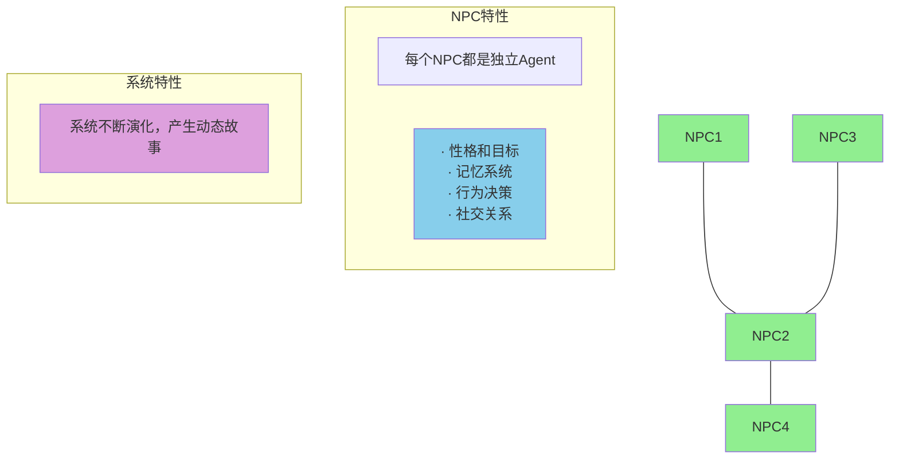

### 多智能体世界模拟特点

每个NPC都是独立的智能体：
- **性格和目标**: 每个NPC有独特的性格特征和目标
- **记忆系统**: 记住过去的交互和事件
- **行为决策**: 基于当前状态做出独立决策
- **社交关系**: 与其他NPC建立复杂的关系网络

系统特点：
- **动态交互**: NPC之间可以自由交互
- **故事生成**: 系统自发产生动态故事线
- **涌现行为**: 简单规则产生复杂群体行为

---

## 技术演进总结

### 各阶段对比

| 维度 | 符号主义 | 强化学习 | 深度RL | LLM Agent |
|------|---------|---------|--------|-----------|
| **知识来源** | 人工规则 | 环境交互 | 环境交互 | 预训练+微调 |
| **学习方式** | 无学习 | 试错学习 | 神经网络 | 提示工程 |
| **推理能力** | 逻辑推理 | 无显式推理 | 部分推理 | 强大推理 |
| **语言能力** | 无 | 无 | 无 | 强大 |
| **通用性** | 任务特定 | 任务特定 | 较通用 | 高度通用 |
| **训练成本** | 低（人工） | 高 | 很高 | 极高 |
| **部署成本** | 低 | 低 | 中 | 中高 |
| **游戏应用** | 早期NPC | 游戏AI | 复杂AI | 智能NPC |

### 游戏开发中的演进

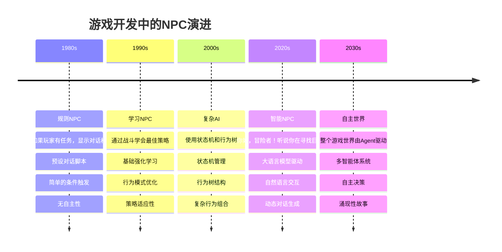

### NPC技术演进特点

**1980s - 规则时代**
- 基于规则的简单对话系统
- 预设的脚本和条件
- 交互有限，缺乏灵活性

**1990s - 学习时代**
- 引入学习能力
- 通过交互优化行为
- 开始适应玩家行为

**2000s - 复杂时代**
- 复杂的行为管理架构
- 状态机和行为树的广泛应用
- 更丰富的行为组合

**2020s - 智能时代**
- 大语言模型带来革命性变化
- 自然语言理解和生成
- 动态、个性化的交互体验

**2030s - 自主时代**
- 完全自主的智能体系统
- 涌现性的故事和事件
- 真正的开放世界体验

---

## 未来趋势

### 1. 具身智能（Embodied AI）

智能体有物理身体，可以感知和操作物理世界。

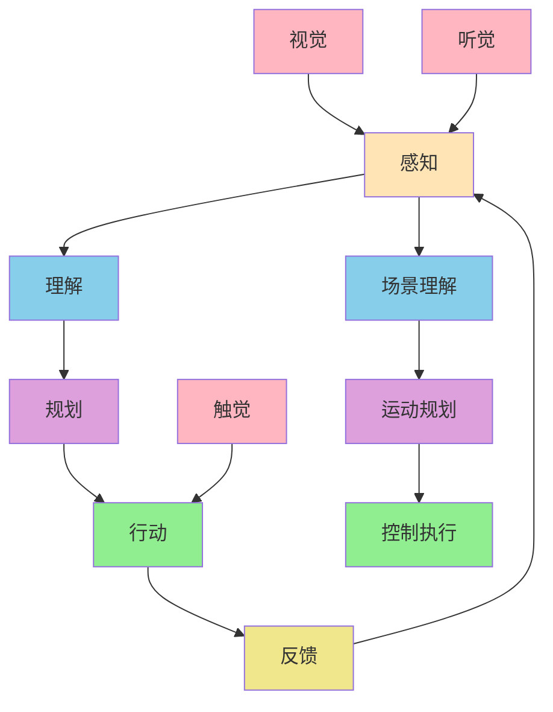

### 具身智能架构详解

**核心流程**:
1. **感知**: 接收来自环境的各种感官信息
2. **理解**: 分析和解释感知到的信息
3. **规划**: 制定行动计划
4. **行动**: 执行物理动作
5. **反馈**: 接收行动结果，形成闭环

**多模态感知**:
- **视觉**: 接收视觉信息，进行场景理解
- **听觉**: 接收声音信息，理解环境声音
- **触觉**: 感受物理接触和力反馈

**执行层级**:
- **场景理解**: 从感知信息中提取有意义的内容
- **运动规划**: 规划具体的运动轨迹
- **控制执行**: 精确控制身体动作

### 2. 多模态智能体

融合视觉、语言、听觉等多种模态。

```mermaid
graph TB
    %% 输入层
    Visual[视觉输入] --> Fusion[融合层]
    Language[语言输入] --> Fusion
    Audio[听觉输入] --> Fusion

    %% 融合处理
    Fusion --> Understand[理解与决策]

    %% 输出层
    Understand --> Text[文本输出]
    Understand --> Image[图像输出]
    Understand --> Speech[语音输出]

    %% 样式设置
    style Visual fill:#FFB6C1
    style Language fill:#87CEEB
    style Audio fill:#90EE90
    style Fusion fill:#DDA0DD
    style Understand fill:#F0E68C
    style Text fill:#FFE4B5
    style Image fill:#FFE4B5
    style Speech fill:#FFE4B5

    %% 说明文字
    subgraph 融合特点
        Feature1[多模态输入整合]
        Feature2[跨模态信息理解]
        Feature3[统一决策框架]
    end
```

### 多模态信息融合架构

**输入层**:
- **视觉输入**: 图像、视频等视觉信息
- **语言输入**: 文本、语音等语言信息
- **听觉输入**: 环境声音、语音指令等

**融合层**:
- **信息整合**: 将不同模态的信息融合统一
- **特征提取**: 提取各模态的关键特征
- **关联分析**: 发现不同模态间的关联性

**决策输出**:
- **文本输出**: 生成文本回复或描述
- **图像输出**: 生成图像或视觉反馈
- **语音输出**: 生成语音回复或指令

### 3. 自主智能体

完全自主运行，设定目标后自主分解和执行。

```mermaid
flowchart TD
    Goal[设定高层目标<br/>"构建一个完整的应用程序"] --> Decompose[目标分解<br/>子任务1, 子任务2, ...]
    Decompose --> Execute[执行子任务<br/>调用工具，生成代码]
    Execute --> Validate[验证与调整<br/>检查结果，修正错误]
    Validate --> Iterate[迭代优化<br/>持续改进]

    %% 循环箭头
    Iterate --> Goal

    %% 子任务详细说明
    subgraph 子任务示例
        Task1[分析需求]
        Task2[设计架构]
        Task3[实现功能]
        Task4[测试优化]
    end

    Decompose --> Task1
    Decompose --> Task2
    Decompose --> Task3
    Decompose --> Task4

    %% 样式设置
    style Goal fill:#FFE4B5
    style Decompose fill:#87CEEB
    style Execute fill:#90EE90
    style Validate fill:#DDA0DD
    style Iterate fill:#F0E68C

    style Task1 fill:#B0E0E6
    style Task2 fill:#B0E0E6
    style Task3 fill:#B0E0E6
    style Task4 fill:#B0E0E6
```

### 自主智能体工作循环详解

**循环流程**:
1. **设定高层目标**: 确定最终要达成的目标
2. **目标分解**: 将大目标分解为可执行的子任务
3. **执行子任务**: 逐个完成子任务，调用必要工具
4. **验证与调整**: 检查执行结果，修正错误
5. **迭代优化**: 持续改进，返回重新设定目标

**关键特点**:
- **循环迭代**: 形成完整的闭环系统
- **自主决策**: 智能体自主规划和执行
- **工具调用**: 能够使用各种外部工具和API
- **错误修正**: 具备自我检查和修正能力

### 4. 群体智能

大量简单智能体协作产生智能行为。

```mermaid
graph TB
    %% Boids位置示例
    B1[●] --> B2[●]
    B3[●] --> B4[●]
    B5[●] --> B6[●]

    %% 方向指示
    B1 --> Dir1[\\]
    B3 --> Dir2[\\]
    B5 --> Dir3[\\]

    %% 规则说明
    subgraph 规则1: 分离
        Rule1[避免与邻近鸟碰撞<br/>保持适当距离]
    end

    subgraph 规则2: 对齐
        Rule2[与邻近鸟方向一致<br/>匹配飞行方向]
    end

    subgraph 规则3: 凝聚
        Rule3[向邻近鸟中心移动<br/>保持群体聚集]
    end

    %% 结果
    Result[产生逼真的群体飞行行为<br/>涌现复杂行为]

    %% 样式设置
    style B1 fill:#FFB6C1
    style B2 fill:#FFB6C1
    style B3 fill:#FFB6C1
    style B4 fill:#FFB6C1
    style B5 fill:#FFB6C1
    style B6 fill:#FFB6C1

    style Rule1 fill:#FFE4B5
    style Rule2 fill:#FFE4B5
    style Rule3 fill:#FFE4B5
    style Result fill:#90EE90
```

### Boids算法 - 群体智能示例

**简单规则，复杂结果**:

每只鸟（Boid）仅遵循三个简单规则：
1. **分离（Separation）**: 避免与邻近鸟碰撞，保持适当距离
2. **对齐（Alignment）**: 与邻近鸟的飞行方向保持一致
3. **凝聚（Cohesion）**: 向邻近鸟群的中心移动，保持群体聚集

**涌现特性**:
- 从简单局部规则产生全局复杂行为
- 自然模拟鸟群、鱼群的群体运动
- 应用于：群体机器人、交通流模拟、计算机动画

**算法优势**:
- 计算效率高，适合实时模拟
- 产生自然逼真的群体行为
- 可扩展性强，适用于不同场景

---

## 练习作业

### 基础练习
1. 总结符号主义智能体的三个特点
2. 画出强化学习的基本循环图
3. 解释 Q-Learning 中 ε-贪心策略的作用

### 进阶练习
4. 对比不同阶段智能体的优缺点
5. 设计一个结合符号主义和强化学习的混合系统
6. 解释 AlphaGo 如何结合策略网络和价值网络

### 挑战练习
7. 设计一个基于LLM的游戏NPC系统架构
8. 思考如何解决LLM Agent的幻觉问题
9. 构想未来的智能体技术发展方向

## 学习资源

### 经典论文
- "Symbolic Logic" - George Boole
- "Reinforcement Learning: An Introduction" - Sutton & Barto
- "Human-level control through deep reinforcement learning" - Nature 2015
- "Mastering the game of Go with deep neural networks" - Nature 2016
- "ReAct: Synergizing Reasoning and Acting in Language Models" - 2022

### 游戏AI资源
- "Programming Game AI by Example" - Mat Buckland
- "Artificial Intelligence for Games" - Ian Millington
- Unity ML-Agents Toolkit
- OpenAI Gym

### 在线资源
- [DeepMind Blog](https://deepmind.com/blog)
- [OpenAI Research](https://openai.com/research)
- [Papers with Code](https://paperswithcode.com)

## 下一步

完成本章学习后，进入：
- [第3章：大语言模型基础](../ch03-llm-basics/) - 了解LLM的核心技术

## 学习检查

- [ ] 理解智能体发展的四个主要阶段
- [ ] 掌握各阶段的核心技术和特点
- [ ] 了解强化学习的基本原理
- [ ] 理解LLM Agent的突破性意义
- [ ] 能够分析不同智能体技术的适用场景
- [ ] 完成章节练习题


---

**[⬆ 返回目录](#目录)**

---


# 第3章：大语言模型基础

---

# 第三章 大语言模型基础

## 章节概述

大语言模型（LLM）是现代 AI Agent 的核心驱动力。本章将深入浅出地介绍 LLM 的核心技术，包括 Transformer 架构、提示工程、主流模型及其局限性。

## 学习目标

- 理解 Transformer 架构的核心原理
- 掌握提示工程的基本技巧和模式
- 了解主流 LLM 的特点和差异
- 认识当前大模型的局限性
- 学会如何调用 LLM API

---

## Transformer 架构

### 为什么需要 Transformer？

在 Transformer 出现之前，NLP 模型面临两大问题：

1. **RNN/LSTM 的序列处理问题**
   - 无法并行计算
   - 长距离依赖难以捕捉

2. **CNN 的局限性**
   - 虽然可以并行，但对长序列效果不佳

**Transformer 的突破**：
- 完全基于注意力机制
- 可以并行训练
- 能够捕捉长距离依赖

### 自注意力机制（Self-Attention）

```mermaid
graph TB
    subgraph 自注意力计算流程
        A[输入序列:<br/>The cat sat on the mat] --> B[1. 输入嵌入]
        B --> B1["The → [0.1, 0.2, ..., 0.5]<br/>cat → [0.3, 0.7, ..., 0.2]"]
        B1 --> C[2. 生成 Q, K, V]
        C --> D["对于每个词向量 x:<br/>Q = x × W_Q (Query)<br/>K = x × W_K (Key)<br/>V = x × W_V (Value)"]
        D --> E[3. 计算注意力分数]
        E --> F["Attention(Q, K, V) =<br/>softmax(Q × K^T / √d_k) × V"]
        F --> G["示例: cat 对其他词的注意力<br/>The: 10% | cat: 50%<br/>sat: 30% | on: 5%<br/>the: 3% | mat: 2%"]
        G --> H["4. 加权求和得到输出<br/>output_cat = 0.1×V_The + 0.5×V_cat + ..."]
    end
    style A fill:#e1f5ff
    style H fill:#c8e6c9
```

```mermaid
graph LR
    subgraph 多头注意力机制
        A[输入] --> B[分成多个头]
        B --> C1[Head 1<br/>关注语法]
        B --> C2[Head 2<br/>关注语义]
        B --> C3[Head 3<br/>关注位置]
        C1 --> D[拼接 + 线性变换]
        C2 --> D
        C3 --> D
        D --> E[最终输出]
    end
    style A fill:#e1f5ff
    style E fill:#c8e6c9
```

### Transformer 完整架构

```mermaid
graph TB
    subgraph Transformer架构
        A["输入: The cat sat on the mat"] --> B["Input Embedding<br/>+ Positional Encoding<br/>(将词转换为向量 + 添加位置信息)"]
        B --> C["Encoder Block (×N)"]
        C --> C1["Multi-Head Self-Attention<br/>(理解词与词之间的关系)"]
        C1 --> C2["Add & Norm<br/>(残差连接 + 层归一化)"]
        C2 --> C3["Feed-Forward Network<br/>(非线性变换)"]
        C3 --> C4["Add & Norm"]
        C4 --> D["Decoder Block (×N)"]
        D --> D1["Masked Self-Attention<br/>(只能看到之前的词)"]
        D1 --> D2["Add & Norm"]
        D2 --> D3["Cross-Attention<br/>(关注 Encoder 的输出)"]
        D3 --> D4["Add & Norm"]
        D4 --> D5["Feed-Forward Network"]
        D5 --> D6["Add & Norm"]
        D6 --> E["Linear + Softmax<br/>(输出词汇表上的概率分布)"]
        E --> F["输出: probability distribution<br/>over vocabulary"]
    end
    style A fill:#e1f5ff
    style F fill:#c8e6c9
    style C fill:#fff3e0
    style D fill:#fff3e0
```

### 位置编码（Positional Encoding）

```mermaid
graph TB
    subgraph 位置编码原理
        A["问题: Transformer 本身<br/>不包含序列位置信息"] --> B["解决: 添加位置编码<br/>来表示每个词的位置"]
        B --> C{位置编码方式}
        C --> C1["方式1: 正弦余弦位置编码<br/>(原始论文)<br/>PE(pos, 2i) = sin(pos / 10000^2i/d)<br/>PE(pos, 2i+1) = cos(pos / 10000^2i/d)<br/>其中: pos=位置, i=维度, d=模型维度"]
        C --> C2["方式2: 可学习位置编码<br/>将位置编码作为可训练参数<br/>让模型自己学习"]
        C1 --> D["最终输入 = 词嵌入 + 位置编码"]
        C2 --> D
    end
    style A fill:#ffebee
    style D fill:#c8e6c9
```

### 前馈网络（Feed-Forward Network）

```mermaid
graph TB
    subgraph FeedForwardNetwork["Feed-Forward Network"]
        A["输入 x (维度 d)"] --> B["Linear + ReLU<br/>W1: d → 4d<br/>扩展到更大维度"]
        B --> C["Dropout<br/>防止过拟合"]
        C --> D["Linear<br/>W2: 4d → d<br/>压缩回原维度"]
        D --> E["输出 (维度 d)"]
    end
    style A fill:#e1f5ff
    style E fill:#c8e6c9
    style B fill:#fff3e0
    style D fill:#fff3e0
```

---

## 提示工程（Prompt Engineering）

### 什么是提示工程？

提示工程是**通过设计和优化输入提示来引导 LLM 产生更好输出**的技术。

### 基础提示模式

#### 1. 零样本提示（Zero-Shot）

```
零样本提示:

直接让模型完成任务，不提供示例

prompt = """
请完成以下任务：

任务：将以下文本翻译成英文：你好，世界

答案：
"""

→ LLM 直接生成答案
```

#### 2. 少样本提示（Few-Shot）

```
少样本提示:

提供少量示例帮助模型理解任务

prompt = """
请完成以下任务，参考给出的示例：

示例 1：
输入：苹果 -> 英语
输出：apple

示例 2：
输入：香蕉 -> 英语
输出：banana

输入：橙子 -> 英语
输出：
"""

→ LLM 根据示例规律生成: "orange"
```

#### 3. 思维链提示（Chain-of-Thought）

```
思维链提示:

引导模型逐步推理

prompt = """
请逐步推理解决以下问题，展示你的思考过程：

问题：如果一个游戏有10个任务，每个任务平均需要15分钟，
      完成所有任务需要多少小时？

请按以下格式回答：
思考步骤 1：
思考步骤 2：
...
最终答案：
"""

→ LLM 生成:

思考步骤 1：计算总分钟数
10个任务 × 15分钟/任务 = 150分钟

思考步骤 2：转换为小时
150分钟 ÷ 60分钟/小时 = 2.5小时

最终答案：2.5小时
```

### 高级提示技巧

#### 1. 角色提示

```
角色提示:

让 LLM 扮演特定角色

prompt = """
你是一个经验丰富的奇幻小说作者。

任务：向玩家介绍这个奇幻世界的背景故事

请以奇幻小说作者的身份和视角来完成任务。
"""

→ 输出会有更丰富的描述性和故事性
```

#### 2. 格式约束

```
格式约束提示:

指定输出格式

prompt = """
任务：为一个铁匠NPC生成对话

请严格按照以下格式输出：
{
    "npc_name": "名字",
    "dialogue": "对话内容",
    "emotion": "情感状态",
    "action": "伴随动作"
}

输出：
"""

→ LLM 按指定格式输出
```

#### 3. 思维-行动提示（ReAct）

```
ReAct 提示:

prompt = """
问题：Python 的快速排序算法是什么？

可用工具：
- search: 搜索引擎
- calculator: 计算器

请按以下格式思考和行动：

思考：[分析应该使用什么工具]
行动：[工具名称]
行动输入：[工具参数]

观察到结果后，继续思考或给出最终答案。

思考：
"""

→ LLM 生成:

思考：我需要查找快速排序算法的信息，应该使用搜索工具
行动：search
行动输入：Python 快速排序算法

观察：[搜索结果...]

思考：基于搜索结果，我可以给出答案了
行动：finish
行动输入：[最终答案]
```

#### 4. 自我反思提示

```
自我反思提示:

prompt = """
任务：写一个快速排序函数

初步答案：
[初始代码]

请审查上述答案，找出可能的问题和改进空间：

1. 检查准确性：
2. 检查完整性：
3. 检查清晰度：

基于以上检查，提供改进后的答案：
"""

→ LLM 会先反思，然后给出改进版本
```

### 游戏开发中的提示工程

#### NPC 对话生成

```
NPC 对话生成提示设计:

prompt = """
你是一个游戏NPC。严格按照角色设定回应玩家。

## 角色设定
- 姓名：铁匠老张
- 性别：男
- 年龄：45
- 职业：铁匠
- 性格特征：粗犷、直率、热心、固执
- 背景故事：在这个村庄打铁二十年，见证了无数冒险者的来来去去。
- 说话风格：说话简短有力，带着浓重的乡音，常用铁匠相关的比喻

## 对话历史
玩家: 你好，师傅
铁匠老张: 哎，小伙子，来找老张打铁啊？

## 玩家输入
玩家: 你好，师傅，能帮我修一下这把剑吗？

## 要求
1. 严格保持角色性格
2. 符合说话风格
3. 考虑对话历史
4. 推动剧情发展
5. 一句话回应，不要太长

## 你的回应
"""

→ LLM 生成符合角色设定的对话
```

#### 任务生成

```
任务生成提示设计:

prompt = """
你是一个游戏任务设计师。请根据以下信息生成一个游戏任务。

## 世界设定
- 游戏类型：RPG
- 世界背景：中世纪奇幻世界
- 当前地点：起始村庄

## 玩家信息
- 等级：5
- 职业：战士
- 已完成任务：新手教程

## 任务要求
1. 难度适中（适合5级玩家）
2. 有趣的剧情
3. 清晰的目标
4. 合理的奖励
5. 符合世界观

请以 JSON 格式返回任务：
{
    "title": "任务标题",
    "description": "任务描述（2-3句话）",
    "type": "任务类型（主线/支线/日常）",
    "objectives": ["目标1", "目标2"],
    "rewards": {
        "experience": 数值,
        "gold": 数值,
        "items": ["物品1", "物品2"]
    },
    "npc_name": "发布任务的NPC名字",
    "npc_dialogue": "NPC发布任务时的对话",
    "difficulty": "难度评级（简单/中等/困难）"
}
"""

→ LLM 生成结构化的任务数据
```

---

## 主流大语言模型对比

### GPT 系列（OpenAI）

| 特性 | GPT-3.5 | GPT-4 | GPT-4 Turbo |
|------|---------|-------|-------------|
| 上下文 | 16K | 8K/32K | 128K |
| 速度 | 快 | 中等 | 快 |
| 能力 | 良好 | 优秀 | 优秀 |
| 成本 | 低 | 高 | 中等 |
| 适用 | 日常任务 | 复杂任务 | 长文本处理 |

### Claude 系列（Anthropic）

| 特性 | Claude 2 | Claude 3 Opus | Claude 3.5 Sonnet |
|------|----------|---------------|-------------------|
| 上下文 | 100K | 200K | 200K |
| 速度 | 快 | 慢 | 中等 |
| 能力 | 良好 | 优秀 | 优秀 |
| 安全性 | 高 | 很高 | 很高 |
| 适用 | 长文本 | 高质量输出 | 平衡性能 |

### 开源模型

| 模型 | 组织 | 优势 | 劣势 |
|------|------|------|------|
| Llama 2 | Meta | 开源、可本地部署 | 需要硬件资源 |
| Mistral | Mistral AI | 高效、性能好 | 上下文较短 |
| Qwen | 阿里 | 中文优秀 | 英文稍弱 |
| DeepSeek | DeepSeek | 性价比高 | 生态较新 |

### 如何选择模型？

```mermaid
graph TB
    A[需求分析] --> B{长文本处理?}
    A --> C{高质量推理?}
    A --> D{成本敏感?}

    B -->|是| E{成本高?}
    C -->|是| F{成本高?}
    D -->|是| G[日常任务]

    E -->|是| H[Claude Opus]
    E -->|否| I[GPT-4 Turbo]

    F -->|是| J[Claude Sonnet]
    F -->|否| K[GPT-4]

    G --> L[GPT-3.5]

    M["特殊情况:<br/>中文任务 → Qwen<br/>本地部署 → Llama/Mistral<br/>极限成本 → 小型开源模型"]

    style A fill:#e1f5ff
    style H fill:#c8e6c9
    style I fill:#c8e6c9
    style J fill:#c8e6c9
    style K fill:#c8e6c9
    style L fill:#c8e6c9
    style M fill:#fff9c4
```

---

## LLM API 调用实践

### API 调用结构

```mermaid
graph TB
    subgraph 应用层
        A[你的代码/应用]
    end

    subgraph 客户端层
        B["LLM Client 封装<br/>· 构建请求<br/>· 处理响应<br/>· 错误处理<br/>· 对话管理"]
    end

    subgraph API层
        C["OpenAI API / Claude API / ...<br/>· 认证<br/>· 请求路由<br/>· 限流控制"]
    end

    subgraph 模型层
        D["GPT-4 / Claude / Llama / ...<br/>· 推理<br/>· 生成"]
    end

    A --> B --> C --> D

    style A fill:#e1f5ff
    style B fill:#fff3e0
    style C fill:#f3e5f5
    style D fill:#c8e6c9
```

### API 调用伪代码

```
OpenAI Client 伪代码:

class OpenAIClient:
    初始化(api_key, model):
        self.api_key = api_key
        self.model = model
        self.conversation_history = []

    方法 generate(prompt, temperature=0.7, max_tokens=1000):
        构建 API 请求:
            model: self.model
            messages: [{"role": "user", "content": prompt}]
            temperature: temperature
            max_tokens: max_tokens

        发送请求到 OpenAI API

        解析响应:
            return response.choices[0].message.content

        如果出错:
            return "Error: {错误信息}"

    方法 chat(message, system_prompt=None):
        如果 system_prompt 存在且历史为空:
            添加 system_prompt 到历史

        添加用户消息到历史

        调用 API (使用完整历史)

        添加助手回复到历史

        return 助手回复

    方法 clear_history():
        清空对话历史


使用示例:

client = OpenAIClient(api_key="your-api-key")

// 简单生成
response = client.generate("写一首关于冒险的诗")

// 对话模式
client.clear_history()
system_prompt = "你是一个经验丰富的游戏NPC，扮演一个神秘的商人。"

while True:
    user_input = input("玩家: ")
    if user_input in ['exit', 'quit']:
        break

    response = client.chat(user_input, system_prompt)
    print(f"商人: {response}")
```

### Claude API 调用

```
Claude Client 伪代码:

class ClaudeClient:
    初始化(api_key, model):
        self.client = Anthropic(api_key=api_key)
        self.model = model

    方法 generate(prompt, max_tokens=1000):
        创建消息请求:
            model: self.model
            max_tokens: max_tokens
            messages: [{"role": "user", "content": prompt}]

        发送到 Claude API

        return message.content[0].text

    方法 stream_generate(prompt):
        创建流式请求

        for each text_chunk in stream:
            实时打印 text_chunk

        完成
```

### 本地模型（Ollama）

```
Ollama Client 伪代码:

class OllamaClient:
    初始化(base_url, model):
        self.base_url = base_url  // 通常是 http://localhost:11434
        self.model = model        // 例如 llama2, mistral

    方法 generate(prompt):
        url = "{base_url}/api/generate"

        payload = {
            "model": self.model,
            "prompt": prompt,
            "stream": False
        }

        POST 请求到 url，携带 payload

        解析 JSON 响应
        return result['response']

    方法 stream_generate(prompt):
        payload["stream"] = True

        打开流式连接

        for each line in response:
            data = JSON.parse(line)
            if 'response' in data:
                实时打印 data['response']

        完成
```

---

## LLM 的局限性

### 1. 幻觉问题（Hallucination）

```mermaid
graph TB
    subgraph 幻觉问题
        A["模型编造信息"] --> B["示例:<br/>用户: 爱因斯坦在2020年获得了什么奖?<br/>模型: 爱因斯坦在2020年获得了诺贝尔物理学奖<br/>(错误! 爱因斯坦于1955年去世)"]
        B --> C{检测方法}
        C --> C1["1. 查找不确定性表达<br/>'我认为'、'可能'、'应该是'、'大概是'"]
        C --> C2["2. 事实验证<br/>· 使用搜索引擎验证<br/>· 查询可信知识库<br/>· 交叉验证多个来源"]
        C1 --> D["缓解策略:<br/>· 要求模型提供来源<br/>· 使用检索增强生成 RAG<br/>· 设置较低的温度参数"]
        C2 --> D
    end
    style A fill:#ffebee
    style B fill:#fff3e0
    style D fill:#c8e6c9
```

### 2. 上下文窗口限制

```mermaid
graph TB
    subgraph 长文本处理策略
        A{上下文窗口策略} --> B["策略1: 滑动窗口<br/>保留最近的N个token，丢弃旧内容<br/>[██████████████......]<br/>↑保留这部分 ↑丢弃"]
        A --> C["策略2: 总结压缩<br/>1. 将旧内容总结为摘要<br/>2. 保留摘要 + 最近的内容<br/>[旧内容...] → 总结 → [摘要] + [最近内容]"]
        A --> D["策略3: 重排序筛选<br/>根据相关性筛选最重要的内容保留<br/>全部内容 → 计算相关性 → 保留高相关部分"]
    end
    style A fill:#e1f5ff
    style B fill:#fff3e0
    style C fill:#fff3e0
    style D fill:#fff3e0
```

### 3. 数学计算能力

```mermaid
graph TB
    subgraph 安全计算方案
        A["问题: 帮我计算 123456789 × 987654321"] --> B{做法选择}
        B -->|错误做法| C["直接让 LLM 计算<br/>→ 可能得到错误答案"]
        B -->|正确做法| D["Step 1: LLM 提取数学表达式<br/>输入: 帮我计算 123456789 × 987654321<br/>输出: 123456789 * 987654321"]
        D --> E["Step 2: 使用计算器/程序计算<br/>result = eval123456789 * 987654321<br/>→ 121932631112635269"]
        E --> F["Step 3: LLM 格式化输出<br/>计算结果是 121,932,631,112,635,269"]
    end
    style C fill:#ffebee
    style F fill:#c8e6c9
    style A fill:#e1f5ff
```

### 4. 实时信息缺失

```mermaid
graph TB
    subgraph 信息时效性检测
        A["时间关键词:<br/>'最新'、'当前'、'现在'、'今天'、'今年'<br/>'latest', 'current', 'today', 'this year'"]
        A --> B["用户查询:<br/>2025年最新的iPhone型号是什么?"]
        B --> C["检测: 包含'2025年'、'最新'<br/>→ 需要实时信息"]
        C --> D["行动: 调用搜索工具获取最新信息"]
        D --> E["增强: 使用搜索结果生成答案"]
    end
    style A fill:#e1f5ff
    style E fill:#c8e6c9
```

### 5. 上下文理解限制

```mermaid
graph TB
    subgraph 多步理解策略
        A["问题: 长上下文中找到相关内容并回答"] --> B["改进方法"]
        B --> C["Step 1: 提取关键信息<br/>prompt = '从以下上下文中提取与问题最相关的信息...'<br/>key_info = llm.generate(prompt)"]
        C --> D["Step 2: 基于关键信息回答<br/>prompt = '基于以下关键信息回答问题...'<br/>answer = llm.generate(prompt)"]
        D --> E["这样可以避免在大量无关信息中丢失焦点"]
    end
    style A fill:#e1f5ff
    style E fill:#c8e6c9
```

---

## 练习作业

### 基础练习
1. 调用 OpenAI API 生成一段文本
2. 尝试不同的提示词，观察输出变化
3. 实现一个简单的对话机器人

### 进阶练习
4. 为游戏 NPC 实现对话系统
5. 实现思维链提示解决问题
6. 比较不同模型在相同任务上的表现

### 挑战练习
7. 实现一个带记忆的对话系统
8. 构建一个任务生成器
9. 实现上下文压缩机制

## 学习资源

### 官方文档
- [OpenAI API 文档](https://platform.openai.com/docs)
- [Anthropic Claude 文档](https://docs.anthropic.com)
- [Ollama 文档](https://ollama.ai/docs)

### 推荐阅读
- "Attention Is All You Need" - Transformer 原论文
- "Language Models are Few-Shot Learners" - GPT-3 论文
- [Prompt Engineering Guide](https://www.promptingguide.ai)

### 在线课程
- Andrew Ng 的 AI 课程
- LangChain 提示工程教程

## 下一步

完成本章学习后，进入：
- [第4章：智能体经典范式构建](../../part2-building-agents/ch04-patterns/) - 学习 ReAct 等核心范式

## 学习检查

- [ ] 理解 Transformer 的核心原理
- [ ] 掌握自注意力机制
- [ ] 熟练使用提示工程技巧
- [ ] 了解主流 LLM 的特点
- [ ] 能够调用 LLM API
- [ ] 认识 LLM 的局限性
- [ ] 完成章节练习题


---

**[⬆ 返回目录](#目录)**

---


# 第二部分：构建篇

---


# 第4章：Agent核心范式

---

# 第4章：智能体经典范式构建

## 章节概述

本章将学习三种最重要的智能体范式：**ReAct**、**Plan-and-Solve** 和 **Reflection**。这些范式是构建复杂智能体的基础。

## 学习目标

- 理解三种经典范式的原理
- 从零实现每种范式
- 掌握范式的适用场景
- 能够选择合适的范式解决问题

---

## 范式一：ReAct（推理+行动）

### 核心思想

ReAct = **Re**asoning（推理）+ **Act**ing（行动）

智能体通过循环执行以下步骤来解决问题：
1. **Thought**（思考）：分析当前情况
2. **Action**（行动）：执行具体操作
3. **Observation**（观察）：观察行动结果
4. 重复直到达成目标

### 工作流程

```mermaid
graph TB
    A[用户问题] --> B["Thought: 分析问题<br/>我需要查找..."]
    B --> C["Action: 执行工具<br/>搜索: Python 快速排序"]
    C --> D["Observation: 观察结果<br/>找到 5 篇相关文章..."]
    D --> E{是否完成?}
    E -->|否| B
    E -->|是| F[最终答案]

    style A fill:#e1f5ff
    style F fill:#c8e6c9
    style E fill:#fff9c4
```

### 伪代码实现

```
ReActAgent 结构:

初始化:
    llm_client: LLM客户端
    tools: 工具字典 {工具名: 工具函数}
    max_iterations: 最大迭代次数

主执行流程 run(query):
    prompt = 构建初始提示词(query)

    for iteration in range(max_iterations):
        response = llm.generate(prompt)

        // 解析响应
        thought, action, action_input = 解析响应(response)

        if action == "finish":
            return action_input  // 返回最终答案

        // 执行工具
        if action in tools:
            observation = tools[action](action_input)
        else:
            observation = "错误: 未知工具"

        // 更新提示词
        prompt = 添加新步骤到提示词(
            prompt, thought, action, action_input, observation
        )

    return "错误: 达到最大迭代次数"


提示词模板:

"""
你是 ReAct 智能体。请使用以下工具回答问题：

可用工具：
{工具列表}

使用以下格式：
思考: [你的推理过程]
行动: [工具名称]
行动输入: [工具输入]

观察: [工具返回的结果]
... (可以重复思考-行动-观察)

问题: {query}

思考:"""
```

### 游戏开发应用

**游戏 NPC 行为决策**

```
NPCAgent 继承自 ReActAgent:

工具集设计:
    move_to(location)     → 移动到位置
    talk_to(target)       → 与目标对话
    use_item(item)        → 使用物品
    attack(target)        → 攻击目标
    flee()                → 逃跑

决策流程:
    situation = 获取游戏状态()

    prompt = """
    你是游戏角色 {npc_name}

    当前情况: {situation}
    你的性格: 勇敢但谨慎
    你的目标: 保护村庄

    思考你应该如何行动，然后执行。

    思考:"""

    action = 执行ReAct循环(prompt)
    执行行动(action)


游戏循环:
    while 游戏运行:
        situation = get_game_state()
        action = npc.decide_action(situation)
        execute_action(action)
```

---

## 范式二：Plan-and-Solve（规划与解决）

### 核心思想

将复杂问题分解为：
1. **Plan**（规划）：先制定详细的执行计划
2. **Solve**（解决）：按计划逐步执行

### 工作流程

```mermaid
graph TB
    A["问题: 如何开发一个游戏?"] --> B["Plan: 制定计划<br/>1. 确定游戏类型<br/>2. 设计核心玩法<br/>3. 选择游戏引擎<br/>4. 开发原型<br/>5. 测试和优化"]
    B --> C["Step 1: 确定游戏类型<br/>→ 完成: RPG 游戏"]
    C --> D["Step 2: 设计核心玩法<br/>→ 完成: 回合制战斗"]
    D --> E["Step 3: 选择游戏引擎<br/>→ 继续..."]
    E --> F["Step 4: 开发原型"]
    F --> G["Step 5: 测试和优化"]

    style A fill:#e1f5ff
    style B fill:#fff9c4
    style G fill:#c8e6c9
```

### 伪代码实现

```
PlanAndSolveAgent 结构:

主执行流程 run(query):
    // 第一步：制定计划
    plan = make_plan(query)
    输出计划(plan)

    // 第二步：执行计划
    result = execute_plan(plan, query)

    return result


制定计划 make_plan(query):
    prompt = """
    对于以下问题，制定一个详细的执行计划。

    问题: {query}

    请将问题分解为 3-7 个具体的步骤。
    每个步骤应该是可执行的、具体的。

    格式：
    1. [步骤1]
    2. [步骤2]
    ...

    计划:"""

    response = llm.generate(prompt)
    steps = 解析计划步骤(response)

    return steps


执行计划 execute_plan(plan, original_query):
    context = {
        'original_query': original_query,
        'completed_steps': [],
        'intermediate_results': []
    }

    for i, step in enumerate(plan):
        输出("步骤 {i}/{len(plan)}: {step}")

        // 执行当前步骤
        step_result = execute_step(step, context)

        // 保存结果
        context['completed_steps'].append(step)
        context['intermediate_results'].append(step_result)

        输出("完成: {step_result}")

    // 汇总结果
    final_answer = synthesize_results(context)
    return final_answer


执行单个步骤 execute_step(step, context):
    prompt = """
    背景:
    原始问题: {context['original_query']}

    已完成步骤:
    {格式化已完成的步骤}

    当前步骤: {step}

    请执行这个步骤，提供具体的结果。
    如果需要使用工具，请说明。

    结果:"""

    response = llm.generate(prompt)

    // 检查是否需要调用工具
    for tool_name in tools.keys():
        if tool_name in response:
            tool_input = 提取工具输入(response, tool_name)
            if tool_input:
                return tools[tool_name](tool_input)

    return response
```

### 游戏开发应用

**游戏任务生成**

```
QuestGeneratorAgent 结构:

工具集:
    generate_objective(description)  → 生成任务目标
    create_dialogue(character)        → 创建对话
    design_reward(difficulty)         → 设计奖励


生成任务流程:
    query = """
    为 {player_level} 级玩家生成一个{quest_type}任务。

    任务要求:
    - 难度适中
    - 有趣的剧情
    - 合理的奖励
    """

    // 使用 Plan-and-Solve 生成任务
    plan = make_plan(query)

    // 执行计划
    result = execute_plan(plan, query)

    quest = 解析任务信息(result)

    return quest


任务结构:
    {
        "title": "任务标题",
        "type": "主线/支线/日常",
        "level": 玩家等级要求,
        "objectives": [目标列表],
        "dialogues": [对话列表],
        "rewards": {
            "experience": 经验值,
            "gold": 金币,
            "items": [物品列表]
        }
    }
```

---

## 范式三：Reflection（反思）

### 核心思想

智能体通过以下步骤提升输出质量：
1. **Act**（行动）：生成初始方案
2. **Observe**（观察）：检查方案质量
3. **Reflect**（反思）：分析问题和改进点
4. **Refine**（改进）：基于反思优化方案
5. 重复直到满意

### 工作流程

```mermaid
graph TB
    A["问题: 写一个快速排序函数"] --> B["Draft 1: 初始草稿<br/>(基础实现)"]
    B --> C["Reflect: 反思<br/>问题:<br/>- 没有处理边界情况<br/>- 缺少注释<br/>- 没有优化"]
    C --> D["Draft 2: 改进版本<br/>(添加边界处理和注释)"]
    D --> E{是否满意?}
    E -->|否| F["Reflect: 继续反思<br/>发现更多改进点"]
    F --> G["Draft 3: 进一步优化"]
    G --> E
    E -->|是| H["最终版本"]

    style A fill:#e1f5ff
    style H fill:#c8e6c9
    style E fill:#fff9c4
```

### 伪代码实现

```
ReflectionAgent 结构:

主执行流程 run(query, context=""):
    current_version = None
    feedback_history = []

    for iteration in range(max_refinements + 1):
        if iteration == 0:
            // 第一次：生成初始版本
            current_version = generate_draft(query, context)
        else:
            // 后续：基于反馈改进
            current_version = refine(
                query,
                current_version,
                feedback_history[-1],
                context
            )

        输出("当前版本: {current_version}")

        // 获取反馈
        feedback = get_feedback(query, current_version, context)
        输出("反馈: {feedback}")
        feedback_history.append(feedback)

        // 检查是否满意
        if is_satisfactory(feedback):
            输出("达到满意的质量!")
            break

    return current_version


生成草稿 generate_draft(query, context):
    prompt = """
    任务: {query}

    {context}

    请完成这个任务。这是第一版，重点是正确性。
    """

    return llm.generate(prompt)


获取反馈 get_feedback(query, version, context):
    prompt = """
    任务: {query}

    当前版本:
    {version}

    请分析这个版本，提供详细的反馈：

    1. 问题分析:
       - 有哪些错误或不足？
       - 遗漏了什么？

    2. 改进建议:
       - 具体应该如何改进？
       - 优先级排序

    3. 质量评估:
       - 给出 1-10 分的质量评分
       - 是否达到可用标准？

    反馈:"""

    return llm.generate(prompt)


基于反馈改进 refine(query, current_version, feedback, context):
    prompt = """
    任务: {query}

    当前版本:
    {current_version}

    反馈:
    {feedback}

    请根据反馈改进当前版本。只修改需要改进的部分，
    保持其他部分不变。

    改进后的版本:"""

    return llm.generate(prompt)


判断是否满意 is_satisfactory(feedback):
    // 检查反馈中的关键词
    if 包含积极词(feedback):
        return True

    if 不包含消极词(feedback):
        score = 提取评分(feedback)  // 例如 "8/10"
        if score >= 8:
            return True

    return False
```

### 游戏开发应用

**NPC 对话优化**

```
DialogueRefiner 继承自 ReflectionAgent:

生成对话 generate_dialogue(character, situation, personality):
    context = """
    角色: {character}
    情境: {situation}
    性格:
    - 开放性: {personality['openness']}
    - 外向性: {personality['extraversion']}
    - 亲和性: {personality['agreeableness']}
    - 神经质: {personality['neuroticism']}

    要求:
    1. 对话要符合角色性格
    2. 自然、流畅
    3. 推动剧情发展
    4. 有情感表现
    """

    query = "为 {character} 生成一句对话"

    return run(query, context)


获取对话反馈 get_feedback(query, dialogue, context):
    prompt = """
    {context}

    生成的对话:
    "{dialogue}"

    请评估这段对话:

    1. 角色一致性:
       - 是否符合角色性格？
       - 语气是否恰当？

    2. 自然度:
       - 是否自然流畅？
       - 是否像真人说话？

    3. 剧情推动:
       - 是否推动故事发展？
       - 是否有趣？

    4. 情感表达:
       - 情感是否到位？
       - 是否有感染力？

    5. 具体建议:
       - 哪些地方需要修改？
       - 如何改进？

    反馈:"""

    return llm.generate(prompt)
```

---

## 三种范式的对比与选择

| 特性 | ReAct | Plan-and-Solve | Reflection |
|------|-------|----------------|------------|
| **适用场景** | 探索性任务、需要工具调用 | 复杂多步骤任务 | 需要高质量输出 |
| **优点** | 灵活、可适应 | 结构化、可控 | 质量高、可迭代 |
| **缺点** | 可能冗余 | 计划可能不完善 | 需要多轮迭代 |
| **成本** | 中等（多次 LLM 调用） | 中等（计划+执行） | 高（多轮优化） |
| **游戏应用** | NPC 行为决策 | 任务/剧情生成 | 对话/内容优化 |
| **编程应用** | 代码生成、调试 | 系统设计、重构 | 代码审查、优化 |

### 选择建议

**使用 ReAct 当：**
- 需要探索和试错
- 有多个工具可用
- 任务路径不确定

**使用 Plan-and-Solve 当：**
- 任务复杂但可分解
- 需要清晰执行路径
- 希望可追踪进度

**使用 Reflection 当：**
- 质量要求高
- 需要多次迭代优化
- 有明确的评估标准

**组合使用：**
可以组合使用多种范式！例如：
- Plan-and-Solve 制定计划
- ReAct 执行每一步
- Reflection 优化最终结果

---

## 练习作业

### 基础练习
1. **实现 ReAct Agent**
   - 创建工具集（搜索、计算、查询）
   - 实现完整的 ReAct 循环
   - 测试多步问题解决

2. **实现 Plan-and-Solve Agent**
   - 实现计划生成
   - 实现步骤执行
   - 测试复杂任务分解

3. **实现 Reflection Agent**
   - 实现草稿生成
   - 实现反馈机制
   - 实现迭代优化

### 进阶练习
4. **游戏方向**：
   - 用 ReAct 实现 NPC 行为系统
   - 用 Plan-and-Solve 实现任务生成器
   - 用 Reflection 优化对话系统

5. **编程方向**：
   - 用 ReAct 实现代码调试助手
   - 用 Plan-and-Solve 实现代码重构工具
   - 用 Reflection 实现代码审查系统

### 挑战练习
6. **组合范式**
   - 设计一个组合多种范式的系统
   - 实现 Agent 间的协作
   - 测试复杂场景

## 下一步

完成本章后，进入：
- [第5章：低代码平台](../ch05-lowcode/) - 了解 Coze、Dify 等平台


---

**[⬆ 返回目录](#目录)**

---


# 第5章：低代码平台开发

---

# 第五章 基于低代码平台的智能体搭建

## 章节概述

低代码/无代码平台让构建 AI Agent 变得更加简单和快捷。本章将介绍主流的智能体低代码平台，包括 Coze、Dify、n8n 等，帮助你快速上手。

## 学习目标

- 了解低代码智能体平台的优势和局限
- 掌握 Coze 平台的使用方法
- 掌握 Dify 框架的使用
- 了解 n8n 工作流自动化
- 能够选择合适的平台完成任务

---

## 为什么需要低代码平台？

### 传统代码开发 vs 低代码平台

| 维度 | 传统代码开发 | 低代码平台 |
|------|-------------|-----------|
| **开发门槛** | 需要编程能力 | 拖拽配置 |
| **开发速度** | 慢（天/周） | 快（小时） |
| **灵活性** | 高度灵活 | 受平台限制 |
| **维护成本** | 高 | 低 |
| **适用场景** | 复杂定制 | 快速原型 |

### 低代码平台的优势

```mermaid
graph TB
    subgraph 低代码平台的核心优势
        subgraph 快速原型
            A1[想法] -->|分钟| A2[可用产品]
        end

        subgraph 降低门槛
            B1["拖拽配置<br/>无需编程"] --> B2[快速构建]
        end

        subgraph 可视化编排
            C1[A] --> C2[B]
            C2 --> C3[C]
        end

        subgraph 一键部署
            D1[配置完成] --> D2[自动部署]
        end
    end

    style A2 fill:#c8e6c9
    style B2 fill:#c8e6c9
    style C3 fill:#c8e6c9
    style D2 fill:#c8e6c9
```

### 何时使用低代码平台？

**适合使用低代码平台的场景：**
- 快速验证想法
- 不涉及复杂逻辑
- 需要快速迭代
- 团队缺乏开发资源
- 内部工具开发

**不适合使用低代码平台的场景：**
- 需要高度定制化
- 性能要求极高
- 复杂算法实现
- 需要深度集成
- 对隐私安全有严格要求

---

## Coze 平台实战

### Coze 简介

[Coze](https://www.coze.cn/) 是字节跳动推出的 AI Bot 开发平台，支持：
- 可视化编排工作流
- 多模型支持（GPT、Claude、文心一言等）
- 丰富的插件生态
- 一键发布到多个平台

### Coze 核心概念

```mermaid
graph TB
    subgraph CozeBot架构
        A["人设与回复逻辑<br/>定义 Bot 的性格和基本回复规则"] --> B["插件系统<br/>搜索、绘图、代码解释器等工具"]
        B --> C["工作流<br/>复杂任务的多步编排"]
        C --> D["知识库<br/>上传文档，Bot 可以检索相关信息"]
        D --> E["数据库<br/>持久化存储用户数据"]

        B -.双向. F["工具集成"]
    end

    style A fill:#e1f5ff
    style E fill:#c8e6c9
    style F fill:#fff9c4
```

### Coze 实战：游戏 NPC Bot

#### 步骤1：创建 Bot

```mermaid
graph TB
    A[访问 Coze 平台] --> B[点击"创建 Bot"]
    B --> C[选择工作空间]
    C --> D["输入 Bot 基本信息<br/>· Bot 名称<br/>· Bot 功能描述<br/>· 头像和图标"]
    D --> E[完成创建]

    style A fill:#e1f5ff
    style E fill:#c8e6c9
```

#### 步骤2：配置人设与回复逻辑

```
人设与回复逻辑配置模板:

━━━━━━━━━━━━━━━━━━━━━━━━━━━━━━━━━
## 角色设定
━━━━━━━━━━━━━━━━━━━━━━━━━━━━━━━━━
角色名称：神秘商店老板埃里克斯
角色定位：奇幻游戏中的神秘商人

━━━━━━━━━━━━━━━━━━━━━━━━━━━━━━━━━
## 性格特征
━━━━━━━━━━━━━━━━━━━━━━━━━━━━━━━━━
· 神秘莫测，说话喜欢打哑谜
· 精明但公正，不做亏本生意
· 对稀有物品有敏锐的嗅觉
· 偶尔会透露一些世界秘密

━━━━━━━━━━━━━━━━━━━━━━━━━━━━━━━━━
## 语言风格
━━━━━━━━━━━━━━━━━━━━━━━━━━━━━━━━━
· 使用商人行话
· 喜欢用比喻
· 语气神秘兮兮
· 说话简练但有深意

━━━━━━━━━━━━━━━━━━━━━━━━━━━━━━━━━
## 回复规则
━━━━━━━━━━━━━━━━━━━━━━━━━━━━━━━━━
1. 永远保持角色人设
2. 不要直接回答所有问题，保持神秘感
3. 交易时精明计算
4. 遇到行家时会更多尊重
5. 偶尔透露有价值的线索

━━━━━━━━━━━━━━━━━━━━━━━━━━━━━━━━━
## 限制条件
━━━━━━━━━━━━━━━━━━━━━━━━━━━━━━━━━
· 不要打破第四面墙
· 不要提到自己是AI
· 始终保持在奇幻世界观的语境中
```

#### 步骤3：添加知识库

```mermaid
graph TB
    subgraph 商品数据结构
        A["商品 1:<br/>精灵之泪<br/>传说 | 5000金币 | 库存1"]
        B["商品 2:<br/>龙鳞护符<br/>史诗 | 2000金币 | 库存3"]
        C["商品 3:<br/>隐身斗篷<br/>稀有 | 800金币 | 库存5"]
    end

    subgraph 上传方式
        D[1. 创建知识库] --> E[2. 选择文档类型 JSON/CSV/TXT]
        E --> F[3. 上传数据文件]
        F --> G[4. 配置检索设置 分块、向量索引]
    end

    style A fill:#fff9c4
    style B fill:#fff9c4
    style C fill:#fff9c4
    style G fill:#c8e6c9
```

#### 步骤4：创建工作流

```mermaid
graph TB
    A[用户输入] --> B[意图识别<br/>识别用户想做什么 买/卖/询问]
    B --> C{用户意图}
    C -->|买商品| D[检查库存]
    C -->|卖商品| D
    C -->|询问| D
    D --> E[计算价格]
    E --> F[生成对话]
    F --> G[返回回复]

    H["工作流节点类型:<br/>· 开始节点: 接收用户输入<br/>· LLM节点: 意图识别、生成回复<br/>· 插件节点: 调用商品查询<br/>· 条件节点: 根据意图分支<br/>· 结束节点: 返回最终回复"]

    style A fill:#e1f5ff
    style G fill:#c8e6c9
    style C fill:#fff9c4
    style H fill:#f3e5f5
```

#### 步骤5：添加插件

```mermaid
graph TB
    subgraph 插件配置
        A["插件名称: 商品查询<br/>描述: 查询商店中可用的商品"]

        subgraph 输入参数
            B1[category: 商品类别 可选]
            B2[rarity: 稀有度 可选]
            B3[max_price: 最高价格 可选]
        end

        subgraph 输出
            C1[items: 匹配的商品列表]
            C2[total_count: 商品数量]
        end

        subgraph 使用流程
            D1[1. 解析用户查询] --> D2[2. 调用商品查询插件]
            D2 --> D3[3. 格式化返回结果]
            D3 --> D4[4. 生成符合角色的回复]
        end
    end

    style A fill:#e1f5ff
    style D4 fill:#c8e6c9
```

#### 步骤6：配置数据库

```mermaid
graph TB
    subgraph 数据库设计
        A["表名: player_transactions"]

        subgraph 字段
            B1[player_id: 玩家ID]
            B2[player_name: 玩家名称]
            B3[transaction_type: 交易类型 买入/卖出]
            B4[item_name: 商品名称]
            B5[price: 交易价格]
            B6[timestamp: 交易时间]
            B7[reputation_change: 声望变化]
        end

        subgraph 使用场景
            C1[· 记录玩家历史交易]
            C2[· 根据交易历史调整价格]
            C3[· 建立玩家与商人的关系]
        end
    end

    style A fill:#e1f5ff
    style C1 fill:#c8e6c9
    style C2 fill:#c8e6c9
    style C3 fill:#c8e6c9
```

#### 步骤7：测试与优化

```mermaid
graph TB
    subgraph 测试场景设计
        subgraph 测试用例1
            A1["输入: 你好，有什么好东西吗?"]
            A2["预期: 神秘地介绍几件商品，保持人设"]
            A1 --> A2
        end

        subgraph 测试用例2
            B1["输入: 这个精灵之泪太贵了，能便宜点吗?"]
            B2["预期: 委婉拒绝，但可能给出小折扣"]
            B1 --> B2
        end

        subgraph 测试用例3
            C1["输入: 我想卖掉这把剑"]
            C2["预期: 评估物品，给出合理的收购价"]
            C1 --> C2
        end

        subgraph 测试用例4
            D1["输入: 听说北方有龙出没?"]
            D2["预期: 神秘地透露一些信息，但不说尽"]
            D1 --> D2
        end
    end

    style A2 fill:#c8e6c9
    style B2 fill:#c8e6c9
    style C2 fill:#c8e6c9
    style D2 fill:#c8e6c9
```

### Coze 进阶技巧

#### 1. 变量管理

```mermaid
graph TB
    subgraph Bot变量设计
        subgraph 系统变量
            A1["{{user_id}} → 用户ID"]
            A2["{{user_name}} → 用户名称"]
            A3["{{conversation_id}} → 对话ID"]
            A4["{{current_time}} → 当前时间"]
        end

        subgraph 自定义变量
            B1["{{player_reputation}} → 玩家声望"]
            B2["{{last_visit_time}} → 上次访问"]
            B3["{{total_purchases}} → 总购买次数"]
            B4["{{favorite_category}} → 喜欢的类别"]
        end

        C["使用示例:<br/>嘿，{{user_name}}，你的声望是{{player_reputation}}<br/>我可以给你打个9折"]
    end

    style C fill:#c8e6c9
    style A1 fill:#e1f5ff
    style A2 fill:#e1f5ff
    style A3 fill:#e1f5ff
    style A4 fill:#e1f5ff
```

#### 2. 条件分支

```
条件判断示例:

IF {{player_reputation}} > 80 THEN
    → 回复: "{{user_name}}，你是老朋友了！这个给你打个8折。"

ELSE IF {{player_reputation}} > 50 THEN
    → 回复: "{{user_name}}，看你是个熟客，给你9折怎么样？"

ELSE
    → 回复: "哼，陌生人，原价不还。"


IF {{current_time}} > "22:00" THEN
    → 回复: "这么晚了，明天再来吧，我要打烊了。"
    → END_CONVERSATION
```

#### 3. 多轮对话状态管理

```mermaid
graph TB
    subgraph 对话状态设计
        A["状态: GREETING 问候<br/>next_states: TRADING, INQUIRY, LEAVING<br/>default_response: 欢迎光临！想买点什么?"]

        B["状态: TRADING 交易中<br/>next_states: BARGAINING, PURCHASE, BACK_TO_GREETING<br/>context: selected_item, negotiation_round"]

        C["状态: BARGAINING 讨价还价<br/>max_rounds: 3<br/>price_reduction_factor: 0.05"]

        A --> B
        B --> C
    end

    style A fill:#e1f5ff
    style B fill:#fff9c4
    style C fill:#fff3e0
```

---

## Dify 框架实战

### Dify 简介

[Dify](https://dify.ai/) 是一个开源的 LLM 应用开发平台，特点：
- 支持本地部署
- 更灵活的编排能力
- 支持多种 LLM
- 丰富的数据源集成
- API 友好

### Dify 核心架构

```mermaid
graph TB
    subgraph Dify架构
        subgraph 应用层
            A1[聊天助手]
            A2[文本生成]
            A3[分类器]
            A4[翻译器]
        end

        subgraph 工作流编排层
            B["开始 → LLM节点 → 代码节点 → 条件节点 → 结束"]
        end

        subgraph 资源层
            C1[知识库]
            C2[数据集]
            C3[工具]
            C4[API]
        end

        subgraph 模型层
            D["OpenAI | Claude | 文心一言 | 通义千问 | 本地模型"]
        end
    end

    A1 & A2 & A3 & A4 --> B
    B --> C1 & C2 & C3 & C4
    C1 & C2 & C3 & C4 --> D

    style A1 fill:#e1f5ff
    style A2 fill:#e1f5ff
    style A3 fill:#e1f5ff
    style A4 fill:#e1f5ff
    style D fill:#c8e6c9
    style B fill:#fff9c4
```

### Dify 实战：游戏任务生成器

#### 步骤1：创建应用

```mermaid
graph TB
    A[登录 Dify 平台] --> B[选择"创建应用"]
    B --> C[选择"工作流"类型]
    C --> D["命名应用: 游戏任务生成器"]
    D --> E[进入工作流编辑器]

    style A fill:#e1f5ff
    style E fill:#c8e6c9
```

#### 步骤2：设计工作流

```mermaid
graph TB
    A["开始<br/>接收用户输入 玩家等级、任务类型、地点"] --> B["LLM: 需求分析<br/>解析用户需求，提取关键信息"]
    B --> C["知识库检索<br/>从游戏世界观知识库检索相关信息"]
    C --> D["LLM: 生成任务<br/>根据需求生成任务详情"]
    D --> E["代码: 验证<br/>验证任务合理性 奖励、难度等"]
    E --> F["条件判断<br/>任务是否合理?"]
    F -->|否| G["LLM: 重新生成"]
    G --> E
    F -->|是| H["格式化输出<br/>JSON 格式任务数据"]
    H --> I["结束"]

    style A fill:#e1f5ff
    style I fill:#c8e6c9
    style F fill:#fff9c4
    style G fill:#ffebee
```

#### 步骤3：配置 LLM 节点

```
LLM 节点配置:

节点名称: 生成任务
模型: gpt-4
温度: 0.7
最大token: 2000

━━━━━━━━━━━━━━━━━━━━━━━━━━━━━━━━━━━━━━━━
系统提示词:
━━━━━━━━━━━━━━━━━━━━━━━━━━━━━━━━━━━━━━━━
你是一个专业的游戏任务设计师。你的职责是根据
玩家的信息和要求，生成有趣、平衡的游戏任务。

设计原则:
1. 任务难度应该匹配玩家等级
2. 奖励应该与任务难度成正比
3. 任务应该推动剧情发展
4. 任务描述应该生动有趣
5. 任务目标应该清晰明确

输出格式:
返回 JSON 格式的任务数据。
━━━━━━━━━━━━━━━━━━━━━━━━━━━━━━━━━━━━━━━━

用户提示词模板:
━━━━━━━━━━━━━━━━━━━━━━━━━━━━━━━━━━━━━━━━
玩家信息:
- 等级：{{level}}
- 职业：{{class}}
- 当前位置：{{location}}

任务要求:
- 任务类型：{{quest_type}}
- 期望难度：{{difficulty}}

世界观背景:
{{world_knowledge}}

请生成符合要求的任务。
━━━━━━━━━━━━━━━━━━━━━━━━━━━━━━━━━━━━━━━━
```

#### 步骤4：配置知识库

```mermaid
graph TB
    subgraph 知识库配置
        A["知识库: 游戏世界观"]

        subgraph 文档内容
            B1["文档 1: 世界地理<br/>王国分为五个主要区域:<br/>首都平原、迷雾森林、灼热荒漠<br/>冰封高原、暗影峡谷"]
            B2["文档 2: 常见生物<br/>哥布林: 低级怪物，成群出没<br/>巨龙: 顶级生物，极度危险"]
            B3["文档 3: 势力分布<br/>光明教团、暗影兄弟会<br/>龙血氏族三大势力"]
        end

        subgraph 检索配置
            C1["匹配方式: 向量检索 + 关键词检索"]
            C2["Top-K: 3 返回最相关的3个文档片段"]
            C3["相似度阈值: 0.7"]
        end
    end

    style A fill:#e1f5ff
    style C1 fill:#c8e6c9
    style C2 fill:#c8e6c9
    style C3 fill:#c8e6c9
```

#### 步骤5：配置代码节点

```
代码节点: 任务验证

伪代码逻辑:

function validate_quest(quest_json):
    """验证生成的任务是否合理"""

    issues = []

    // 检查必需字段
    required_fields = ['title', 'description', 'objectives', 'rewards']
    for field in required_fields:
        if field not in quest_json:
            issues.append("缺少必需字段: {field}")

    // 检查奖励合理性
    if 'rewards' in quest_json:
        exp = quest_json['rewards']['experience']
        level = quest_json['player_level']

        // 经验值应该是等级的 50-200 倍
        expected_min = level * 50
        expected_max = level * 200

        if exp < expected_min or exp > expected_max:
            issues.append("经验值不合理")

    // 检查目标数量
    if 'objectives' in quest_json:
        num_objectives = len(quest_json['objectives'])
        if num_objectives < 1 or num_objectives > 5:
            issues.append("目标数量不合理")

    return {
        'valid': len(issues) == 0,
        'issues': issues
    }
```

#### 步骤6：配置 API

```
Dify API 调用示例:

API 端点:
POST /v1/workflows/run

请求体:
{
  "inputs": {
    "level": 10,
    "class": "战士",
    "location": "迷雾森林",
    "quest_type": "支线任务",
    "difficulty": "中等"
  },
  "response_mode": "blocking",
  "user": "user_123"
}

响应:
{
  "data": {
    "outputs": {
      "quest": {
        "title": "迷雾森林的秘密",
        "description": "一名旅行者失踪在迷雾森林...",
        "objectives": [
          "进入迷雾森林",
          "找到旅行者的踪迹",
          "击败森林守卫",
          "解救旅行者"
        ],
        "rewards": {
          "experience": 1500,
          "gold": 200,
          "items": ["迷雾护符"]
        }
      }
    }
  }
}
```

### Dify 本地部署

```
Docker Compose 部署流程:

克隆仓库:
git clone https://github.com/langgenius/dify.git
cd dify/docker

配置环境:
cp .env.example .env
// 编辑 .env 文件，配置:
//   · 数据库连接
//   · Redis 连接
//   · LLM API 密钥

启动服务:
docker-compose up -d

访问:
http://localhost:3000
```

---

## n8n 工作流自动化

### n8n 简介

[n8n](https://n8n.io/) 是一个开源的工作流自动化工具，特点：
- 可视化工作流编排
- 丰富的集成节点
- 支持自托管
- 适合自动化场景

### n8n 实战：自动化游戏日报生成

#### 工作流设计

```mermaid
graph TB
    A["定时触发器<br/>每天早上8点"] --> B["HTTP Request<br/>调用游戏 API 获取昨天数据<br/>获取游戏数据"]
    B --> C["代码节点<br/>处理数据，计算统计<br/>数据清洗"]
    C --> D["OpenAI<br/>生成日报摘要<br/>生成日报"]
    D --> E["Slack<br/>发送到 Slack 频道<br/>发送通知"]

    style A fill:#e1f5ff
    style E fill:#c8e6c9
```

#### 节点配置

```
节点配置示例:

━━━━━━━━━━━━━━━━━━━━━━━━━━━━━━━━━━
1. Cron 节点 (定时触发)
━━━━━━━━━━━━━━━━━━━━━━━━━━━━━━━━━━
mode: cron
cronExpression: "0 8 * * *"
timezone: "Asia/Shanghai"

━━━━━━━━━━━━━━━━━━━━━━━━━━━━━━━━━━
2. HTTP Request 节点
━━━━━━━━━━━━━━━━━━━━━━━━━━━━━━━━━━
method: GET
url: "https://api.game.com/stats"
queryParameters:
  date: "{{昨天日期}}"

━━━━━━━━━━━━━━━━━━━━━━━━━━━━━━━━━━
3. Code 节点 (数据处理)
━━━━━━━━━━━━━━━━━━━━━━━━━━━━━━━━━━
输入: 游戏原始数据
处理:
  // 计算活跃玩家
  activePlayers = 玩家中今天登录的

  // 计算新玩家
  newPlayers = 今天注册的玩家

  // 计算任务完成率
  completionRate = 已完成任务 / 总任务

输出: 处理后的统计数据

━━━━━━━━━━━━━━━━━━━━━━━━━━━━━━━━━━
4. OpenAI 节点 (生成日报)
━━━━━━━━━━━━━━━━━━━━━━━━━━━━━━━━━━
model: gpt-4
system: "你是游戏数据分析师"
user: "基于以下数据生成日报: {{统计数据}}"

━━━━━━━━━━━━━━━━━━━━━━━━━━━━━━━━━━
5. Slack 节点 (发送通知)
━━━━━━━━━━━━━━━━━━━━━━━━━━━━━━━━━━
channel: "#game-daily-report"
text: "{{生成的日报}}"
```

### n8n 高级技巧

#### 1. 错误处理

```mermaid
graph TB
    subgraph 正常流程
        A1[数据] --> A2[处理] --> A3[下一步]
    end

    subgraph 错误处理流程
        B1[数据] --> B2[处理] --> B3[发生错误]
        B3 --> B4[错误捕获节点]
        B4 --> B5["发送告警通知<br/>邮件/Slack"]
    end

    style A3 fill:#c8e6c9
    style B3 fill:#ffebee
    style B5 fill:#fff3e0
```

#### 2. 条件路由

```mermaid
graph TB
    A[数据] --> B["IF 节点<br/>条件: 数据是否完整"]
    B -->|数据完整| C[继续处理流程]
    B -->|数据缺失| D[发送错误通知]
    D --> C

    style A fill:#e1f5ff
    style C fill:#c8e6c9
    style D fill:#ffebee
    style B fill:#fff9c4
```

#### 3. 循环处理

```mermaid
graph TB
    A["输入: 玩家列表<br/>玩家1, 玩家2, 玩家3, ..."] --> B["Loop 节点<br/>遍历每个玩家"]
    B --> C1["玩家1"]
    B --> C2["玩家2"]
    B --> C3["玩家3"]

    subgraph 处理单个玩家
        D1["· 计算等级"]
        D2["· 生成推荐"]
    end

    C1 --> D1
    C2 --> D1
    C3 --> D1

    D1 --> D2
    D2 --> E["汇总所有结果<br/>结果1, 结果2, ..."]

    style A fill:#e1f5ff
    style E fill:#c8e6c9
    style D1 fill:#fff9c4
    style D2 fill:#fff9c4
```

---

## 平台对比与选择

### 功能对比

| 特性 | Coze | Dify | n8n |
|------|------|------|-----|
| **易用性** | ⭐⭐⭐⭐⭐ | ⭐⭐⭐⭐ | ⭐⭐⭐ |
| **灵活性** | ⭐⭐⭐ | ⭐⭐⭐⭐⭐ | ⭐⭐⭐⭐ |
| **开源** | ❌ | ✅ | ✅ |
| **本地部署** | ❌ | ✅ | ✅ |
| **多模型支持** | ✅ | ✅ | ✅ |
| **知识库** | ✅ | ✅ | ❌ |
| **工作流** | ✅ | ✅ | ✅ |
| **API 优先** | ❌ | ✅ | ✅ |
| **定价** | 免费 | 免费+付费 | 免费+付费 |

### 选择建议

```mermaid
graph TB
    A["需要构建什么?"] --> B[聊天 Bot → 对话机器人]
    A --> C[复杂应用]
    A --> D[自动化流程 → 定时任务/数据处理]

    B --> B1["Coze<br/>简单快速"]

    C --> C1{是否需要本地部署?}
    C1 -->|是| C2["Dify<br/>开源灵活"]
    C1 -->|否| C3["Coze<br/>云端托管"]

    D --> D1["n8n<br/>自动化专家"]

    style A fill:#e1f5ff
    style B1 fill:#c8e6c9
    style C2 fill:#c8e6c9
    style C3 fill:#c8e6c9
    style D1 fill:#c8e6c9
    style C1 fill:#fff9c4
```

### 具体场景推荐

| 场景 | 推荐平台 | 理由 |
|------|---------|------|
| 微信公众号机器人 | Coze | 快速集成，对话优化 |
| 企业内部问答系统 | Dify | 知识库强大，可私有化 |
| 数据处理自动化 | n8n | 定时任务，集成丰富 |
| 游戏NPC对话 | Coze | 角色人设，对话管理 |
| API服务 | Dify | API友好，易集成 |
| 多系统协作 | n8n | 连接能力强 |

---

## 练习作业

### 基础练习
1. 在 Coze 上创建一个简单的聊天 Bot
2. 在 Dify 上创建一个简单的对话应用
3. 使用 n8n 创建一个定时任务

### 进阶练习
4. 用 Coze 创建一个游戏 NPC Bot
5. 用 Dify 创建一个任务生成器
6. 用 n8n 创建游戏数据日报自动化

### 挑战练习
7. 结合三个平台，构建完整的游戏助手系统
8. 实现 Bot 与游戏 API 的集成
9. 创建支持多语言的 Bot

## 学习资源

### 官方文档
- [Coze 官方文档](https://www.coze.cn/docs)
- [Dify 官方文档](https://docs.dify.ai)
- [n8n 官方文档](https://docs.n8n.io)

### 教程
- Coze 视频教程
- Dify 社区案例
- n8n 工作流示例

### 社区
- Coze 用户社区
- Dify GitHub
- n8n Discord

## 下一步

完成本章学习后，进入：
- [第6章：框架开发实践](../ch06-frameworks/) - 学习 AutoGen、AgentScope 等代码框架

## 学习检查

- [ ] 理解低代码平台的优势和局限
- [ ] 掌握 Coze 的基本使用
- [ ] 掌握 Dify 的基本使用
- [ ] 了解 n8n 的工作流设计
- [ ] 能够选择合适的平台
- [ ] 完成章节练习题


---

**[⬆ 返回目录](#目录)**

---


# 第6章：框架开发实践

---

# 第六章 框架开发实践

## 章节概述

本章将介绍主流的 Agent 开发框架，包括 AutoGen、AgentScope、LangGraph 等，帮助你快速搭建复杂的智能体系统。

## 学习目标

- 了解主流 Agent 框架的特点和区别
- 掌握 AutoGen 的多智能体对话
- 掌握 AgentScope 的模块化设计
- 了解 LangGraph 的图结构编排
- 能够选择合适的框架完成任务

---

## 主流框架对比

### 框架特点对比

```
┌─────────────────────────────────────────────────────────────────┐
│                  Agent 框架对比矩阵                             │
├─────────────────────────────────────────────────────────────────┤
│                                                                 │
│  框架        │ AutoGen │ AgentScope │ LangGraph │ LangChain    │
│  ├─ 多智能体   │   ★★★   │    ★★★    │    ★★     │    ★★       │
│  ├─ 易用性     │   ★★★   │    ★★★★   │    ★★★    │    ★★★★     │
│  ├─ 可视化     │   ★     │    ★★★    │    ★★★    │    ★★       │
│  ├─ 灵活性     │   ★★★   │    ★★★★   │    ★★★★★  │    ★★★★     │
│  ├─ 文档质量   │   ★★★   │    ★★★★   │    ★★★    │    ★★★★★    │
│  ├─ 生态成熟度 │   ★★★   │    ★★★    │    ★★★★   │    ★★★★★    │
│  └─ 推荐场景   │ 多智能体 │ 快速开发  │ 复杂流程   │ 通用场景    │
│                                                                 │
└─────────────────────────────────────────────────────────────────┘
```

### 选择建议

```
决策流程:

你需要构建什么？

┌─────────────────────┐
│ 多智能体对话系统？   │
└──────┬──────────────┘
       │ 是 → AutoGen
       │
       │ 否
       ▼
┌─────────────────────┐
│ 需要可视化调试？     │
└──────┬──────────────┘
       │ 是 → AgentScope
       │
       │ 否
       ▼
┌─────────────────────┐
│ 复杂的状态机流程？   │
└──────┬──────────────┘
       │ 是 → LangGraph
       │
       │ 否
       ▼
     LangChain
```

---

## AutoGen

### 简介

[AutoGen](https://github.com/microsoft/autogen) 是微软开发的多智能体对话框架。

### 核心概念

```
┌─────────────────────────────────────────────────────────────┐
│                    AutoGen 架构                             │
├─────────────────────────────────────────────────────────────┤
│                                                             │
│  ┌──────────────┐                                           │
│  │ ConversableAgent │                                       │
│  │  ┌────────┐  │    · 配置 LLM                             │
│  │  │ system │  │    · 定义人设                             │
│  │  │ prompt │  │    · 设置工具                             │
│  │  └────────┘  │                                           │
│  │  ┌────────┐  │    · 发送消息                              │
│  │  │  tools │  │    · 接收消息                              │
│  │  └────────┘  │                                           │
│  └──────┬───────┘                                           │
│         │                                                    │
│         ▼                                                    │
│  ┌──────────────┐                                           │
│  │  Group Chat  │    管理多智能体对话                          │
│  │              │    · 广播消息                              │
│  │  Agent1 ────┼───→ Agent2                                 │
│  │    │         │    Agent3                                 │
│  │    └─────────┼───→ Agent4                                 │
│  └──────────────┘                                           │
│                                                             │
└─────────────────────────────────────────────────────────────┘
```

### 典型对话模式

#### 1. 一对一对话

```
用户助手模式:

┌─────────┐                      ┌─────────┐
│  User   │ ←─────────────────→ │ Agent   │
│ Agent   │                      │         │
└─────────┘                      └─────────┘

应用场景:
· 问答系统
· 写作助手
· 代码生成
```

#### 2. 两人对话

```
双人协作模式:

┌─────────┐     对话      ┌─────────┐
│ Agent A │ ←──────────→  │ Agent B │
│ (编码员) │               │ (审查员) │
└─────────┘                └─────────┘

工作流程:
1. A 生成代码
2. B 审查代码
3. B 给出反馈
4. A 根据反馈修改
5. 重复直到完成
```

#### 3. 群组对话

```
群组对话模式:

          ┌──────────┐
          │ Manager  │ ← 协调者
          └─────┬────┘
       ╱   │   │   ╲
      ╱    │    │    ╲
     ▼     ▼     ▼     ▼
   ┌────┐┌────┐┌────┐┌────┐
   │Coder│Tester│Reviewer│...
   └────┘└────┘└────┘└────┘

对话流程:
1. Manager 分配任务
2. 指定 Agent 接管对话
3. 该 Agent 完成后交还控制权
4. Manager 决定下一步
```

### 代码示例结构

```
伪代码: AutoGen 基础用法

# 创建助手 Agent
assistant = ConversableAgent(
    name="assistant",
    system_message="你是一个有用的助手",
    llm_config={"model": "gpt-4"}
)

# 创建用户 Agent
user = ConversableAgent(
    name="user",
    human_input_mode="ALWAYS",
    code_execution_config=False
)

# 开始对话
result = user.initiate_chat(
    recipient=assistant,
    message="帮我写一个快速排序"
)
```

### 高级特性

#### 1. 工具使用

```
工具调用流程:

Agent 决定使用工具
       │
       ▼
函数调用信息发送给框架
       │
       ▼
框架执行工具函数
       │
       ▼
结果返回给 Agent
       │
       ▼
Agent 继续对话
```

#### 2. 代码执行

```
代码执行沙盒:

┌──────────────┐
│   Agent      │ 生成代码
└──────┬───────┘
       │
       ▼
┌──────────────┐
│ 代码解析器    │ 提取代码块
└──────┬───────┘
       │
       ▼
┌──────────────┐
│  Docker容器  │ 安全执行
│  或 Jupyter  │
└──────┬───────┘
       │
       ▼
┌──────────────┐
│  返回输出    │
└──────────────┘
```

---

## AgentScope

### 简介

[AgentScope](https://github.com/modelscope/agentscope) 是阿里达摩院推出的 Agent 开发框架，强调可视化和模块化。

### 核心特性

```
┌─────────────────────────────────────────────────────────────┐
│                 AgentScope 核心特性                          │
├─────────────────────────────────────────────────────────────┤
│                                                             │
│  1. 可视化编排                                                │
│     ┌─────────────────────────────────┐                    │
│     │   ┌───┐    ┌───┐    ┌───┐      │                    │
│     │   │ A │───→│ B │───→│ C │      │                    │
│     │   └───┘    └───┘    └───┘      │                    │
│     │                                 │                    │
│     │   拖拽式构建 Agent 工作流        │                    │
│     └─────────────────────────────────┘                    │
│                                                             │
│  2. 模块化设计                                                │
│     ┌────────┐  ┌────────┐  ┌────────┐                    │
│     │ Agent  │  │ Service│  │  Tool  │                    │
│     │        │──│        │──│        │                    │
│     └────────┘  └────────┘  └────────┘                    │
│     独立开发、测试、复用                                       │
│                                                             │
│  3. 内置服务                                                 │
│     · 文件服务                                               │
│     · 数据库服务                                             │
│     · HTTP 服务                                              │
│     · 消息队列                                               │
│                                                             │
│  4. 调试支持                                                 │
│     · 消息追踪                                               │
│     · 执行回放                                               │
│     · 性能分析                                               │
│                                                             │
└─────────────────────────────────────────────────────────────┘
```

### Agent 类型

```
AgentScope 的 Agent 类型:

┌──────────────────────────────────────────────────────────┐
│  DialogAgent (对话Agent)                                  │
│  · 基础对话能力                                           │
│  · 配置简单                                               │
│  · 适合单轮任务                                           │
└──────────────────────────────────────────────────────────┘

┌──────────────────────────────────────────────────────────┐
│  ReActAgent (推理-行动Agent)                              │
│  · 推理能力                                               │
│  · 工具调用                                               │
│  · 适合复杂任务                                           │
└──────────────────────────────────────────────────────────┘

┌──────────────────────────────────────────────────────────┐
│  CodingAgent (代码Agent)                                  │
│  · 代码生成                                               │
│  · 代码执行                                               │
│  · 适合编程任务                                           │
└──────────────────────────────────────────────────────────┘
```

### 工作流示例

```
AgentScope 工作流示例:

[用户输入]
      │
      ▼
┌─────────────┐
│ 意图识别Agent │ → 理解用户想要什么
└──────┬──────┘
       │
       ▼
┌─────────────┐     ┌─────────────┐
│ 工具调用Agent │───→│ API服务     │
└──────┬──────┘     └─────────────┘
       │
       ▼
┌─────────────┐
│ 结果处理Agent │ → 格式化输出
└──────┬──────┘
       │
       ▼
   [返回用户]
```

---

## LangGraph

### 简介

[LangGraph](https://github.com/langchain-ai/langgraph) 是 LangChain 团队开发的基于图结构的 Agent 框架。

### 核心思想

```
┌─────────────────────────────────────────────────────────────┐
│                    LangGraph 核心理念                       │
├─────────────────────────────────────────────────────────────┤
│                                                             │
│  Agent = 状态机 + 图结构                                     │
│                                                             │
│  ┌──────┐    ┌──────┐    ┌──────┐    ┌──────┐             │
│  │ 节点1│───→│ 节点2│───→│ 节点3│───→│ 节点4│             │
│  └──┬───┘    └──┬───┘    └──┬───┘    └──┬───┘             │
│     │          │          │          │                   │
│     │   ┌──────┘          └──────┬───┘                   │
│     │   │  条件边                 │                      │
│     │   │   根据状态决定           │                      │
│     │   │   下一个节点              │                      │
│     └───┴──────────────────────────┘                      │
│                                                             │
│  优势:                                                      │
│  · 清晰的执行流程                                           │
│  · 灵活的路由控制                                           │
│  · 易于调试和扩展                                           │
│                                                             │
└─────────────────────────────────────────────────────────────┘
```

### 图结构设计

```
典型图结构:

        ┌──────────┐
        │  Start   │
        └────┬─────┘
             │
             ▼
        ┌──────────┐
        │  Agent   │ ──┐
        │ (思考)   │   │ 循环
        └────┬─────┘   │
             │        │
             ▼        │
        ┌──────────┐   │
        │  条件判断  │◄──┘
        └────┬─────┘
             │
      ┌──────┴──────┐
      │             │
      ▼             ▼
 ┌─────────┐   ┌─────────┐
 │ 完成    │   │ 继续尝试 │
 └─────────┘   └─────────┘
```

### 状态管理

```
状态流转:

初始状态:
{
  "messages": [],
  "current_step": "start",
  "attempts": 0
}

         ↓
Agent 处理后:
{
  "messages": [msg1, msg2],
  "current_step": "processing",
  "attempts": 1
}

         ↓
条件判断后:
{
  "messages": [msg1, msg2],
  "current_step": "done",  // 或 "retry"
  "attempts": 1
}
```

---

## 框架实战案例

### 案例：代码审查系统

使用 AutoGen 实现双人代码审查：

```
系统设计:

┌──────────────┐          ┌──────────────┐
│  Coder Agent │ ←───────→│Reviewer Agent│
│   (编码员)    │          │   (审查员)    │
└──────────────┘          └──────────────┘

对话流程:
1. User → Coder: "写一个快速排序"
2. Coder → Reviewer: [代码]
3. Reviewer → Coder: "有bug，边界条件没处理"
4. Coder → Reviewer: [修复后的代码]
5. Reviewer → User: "代码通过审查"
```

### 案例：任务规划系统

使用 AgentScope 实现任务规划：

```
系统架构:

用户请求
      │
      ▼
┌─────────────┐
│规划Agent    │ 分解任务
└──────┬──────┘
       │
       ├─────→┐
       │      │
       ▼      ▼
    ┌────┐┌────┐
    │Tool││Tool│
    │Agent│Agent│
    └────┘└────┘
       │      │
       └──┬───┘
          ▼
   ┌─────────────┐
   │汇总Agent    │
   └─────────────┘
          │
          ▼
      返回结果
```

### 案例：客服系统

使用 LangGraph 实现智能客服：

```
状态机设计:

[用户消息]
      │
      ▼
┌─────────┐
│意图识别  │
└────┬────┘
     │
     ├─→ 查询 ──→ [知识库检索] ──→ [回答]
     │
     ├─→ 投诉 ──→ [工单创建] ──→ [转人工]
     │
     └─→ 其他 ──→ [兜底回复]

每个节点都是一个 Agent，根据条件路由到不同节点
```

---

## 框架选择指南

### 决策树

```
项目需求分析:

开始
  │
  ▼
需要多智能体协作？
  │
  ├─ 是 ──→ 需要可视化？
  │         │
  │         ├─ 是 ──→ AgentScope
  │         │
  │         └─ 否 ──→ AutoGen
  │
  └─ 否 ──→ 流程复杂？
            │
            ├─ 是 ──→ LangGraph
            │
            └─ 否 ──→ LangChain
```

### 对比总结

| 框架 | 最佳场景 | 学习曲线 | 社区活跃度 |
|------|---------|---------|-----------|
| AutoGen | 多智能体对话 | 中等 | 中等 |
| AgentScope | 快速开发+可视化 | 较低 | 中等（中文） |
| LangGraph | 复杂状态机 | 较高 | 高 |
| LangChain | 通用场景 | 低 | 很高 |

---

## 练习作业

### 基础练习
1. 使用 AutoGen 创建双人对话
2. 使用 AgentScope 创建简单工作流
3. 使用 LangGraph 创建简单的状态图

### 进阶练习
4. 构建一个代码审查系统
5. 实现一个任务规划 Agent
6. 创建一个三智能体协作系统

### 挑战练习
7. 构建完整的客服系统
8. 实现自主编程 Agent
9. 设计复杂的多智能体协作场景

## 学习资源

### 官方文档
- [AutoGen 官方文档](https://microsoft.github.io/autogen/)
- [AgentScope 官方文档](https://agentscope.io/)
- [LangGraph 官方文档](https://langchain-ai.github.io/langgraph/)

### 教程
- AutoGen GitHub 示例
- AgentScope 官方教程
- LangChain Academy

### 社区
- AutoGen Discord
- AgentScope 钉钉群
- LangChain 社区

## 下一步

完成本章学习后，进入：
- [第7章：构建Agent框架](../ch07-custom-framework/) - 从零构建自己的框架

## 学习检查

- [ ] 了解主流 Agent 框架
- [ ] 掌握 AutoGen 的基本使用
- [ ] 掌握 AgentScope 的基本使用
- [ ] 了解 LangGraph 的图结构
- [ ] 能够选择合适的框架
- [ ] 完成章节练习题


---

**[⬆ 返回目录](#目录)**

---


# 第7章：构建自定义Agent框架

---

# 第七章 构建你的 Agent 框架

## 章节概述

本章将从零开始构建一个轻量级的 Agent 框架，帮助你理解框架的核心原理，掌握自定义框架的能力。

## 学习目标

- 理解 Agent 框架的核心架构
- 掌握从零构建框架的方法
- 实现一个简单的智能体框架
- 学会扩展框架功能

---

## 框架设计原理

### 核心组件

```
┌─────────────────────────────────────────────────────────────┐
│                  Agent 框架核心架构                          │
├─────────────────────────────────────────────────────────────┤
│                                                             │
│  ┌─────────────────────────────────────────────────────┐   │
│  │                   Agent 核心                          │   │
│  │  ┌─────────┐  ┌─────────┐  ┌─────────┐             │   │
│  │  │ 消息处理 │  │ 决策引擎 │  │ 执行器   │             │   │
│  │  └─────────┘  └─────────┘  └─────────┘             │   │
│  └─────────────────────────────────────────────────────┘   │
│                          │                                 │
│                          ▼                                 │
│  ┌─────────────────────────────────────────────────────┐   │
│  │                   服务层                              │   │
│  │  ┌─────────┐  ┌─────────┐  ┌─────────┐             │   │
│  │  │ LLM服务 │  │ 工具服务 │  │ 存储服务 │             │   │
│  │  └─────────┘  └─────────┘  └─────────┘             │   │
│  └─────────────────────────────────────────────────────┘   │
│                          │                                 │
│                          ▼                                 │
│  ┌─────────────────────────────────────────────────────┐   │
│  │                   通信层                              │   │
│  │  ┌─────────┐  ┌─────────┐  ┌─────────┐             │   │
│  │  │ 消息总线 │  │ 路由器   │  │ 序列化   │             │   │
│  │  └─────────┘  └─────────┘  └─────────┘             │   │
│  └─────────────────────────────────────────────────────┘   │
│                                                             │
└─────────────────────────────────────────────────────────────┘
```

### 设计原则

```
框架设计原则:

┌────────────────────────────────────┐
│  1. 模块化                         │
│     组件独立、职责单一               │
│     ├── 接口清晰                   │
│     └── 易于替换                   │
└────────────────────────────────────┘

┌────────────────────────────────────┐
│  2. 可扩展                         │
│     插件机制、钩子函数               │
│     ├── 工具可扩展                  │
│     └── Agent 可定制               │
└────────────────────────────────────┘

┌────────────────────────────────────┐
│  3. 可观测                         │
│     日志、追踪、调试                 │
│     ├── 消息追踪                   │
│     └── 性能监控                   │
└────────────────────────────────────┘
```

---

## 核心组件实现

### 1. Agent 基类

```
Agent 基类设计:

┌──────────────────────────────────────────────────────────┐
│                       Agent                              │
│  ┌────────────────────────────────────────────────┐     │
│  │  属性:                                          │     │
│  │  · name: Agent 名称                              │     │
│  │  · llm: LLM 客户端                              │     │
│  │  · tools: 工具列表                               │     │
│  │  · memory: 记忆系统                              │     │
│  └────────────────────────────────────────────────┘     │
│  ┌────────────────────────────────────────────────┐     │
│  │  方法:                                          │     │
│  │  · think(): 思考决策                            │     │
│  │  · act(): 执行动作                              │     │
│  │  · observe(): 观察环境                           │     │
│  │  · remember(): 更新记忆                          │     │
│  └────────────────────────────────────────────────┘     │
└──────────────────────────────────────────────────────────┘
```

### 2. 消息系统

```
消息类型设计:

消息结构:
{
  "id": "消息唯一ID",
  "sender": "发送者",
  "receiver": "接收者",
  "type": "消息类型",
  "content": "消息内容",
  "timestamp": "时间戳",
  "metadata": "元数据"
}

消息类型:
┌──────────────┐
│  文本消息     │ → 普通文本对话
└──────────────┘
┌──────────────┐
│  工具调用     │ → 调用外部工具
└──────────────┘
┌──────────────┐
│  系统指令     │ → 控制指令
└──────────────┘
```

### 3. 工具系统

```
工具调用流程:

Agent 决定使用工具
       │
       ▼
解析工具名称和参数
       │
       ▼
查找工具定义
       │
       ▼
验证参数
       │
       ▼
执行工具
       │
       ▼
返回结果
       │
       ▼
Agent 继续处理

工具定义规范:
{
  "name": "工具名称",
  "description": "工具描述",
  "parameters": {
    "type": "参数类型",
    "properties": {
      "参数名": {
        "type": "类型",
        "description": "描述"
      }
    },
    "required": ["必需参数"]
  }
}
```

---

## 框架实现步骤

### 步骤1：定义接口

```
核心接口定义:

// Agent 接口
interface Agent {
    name: string
    think(message: Message): Promise<Thought>
    act(action: Action): Promise<Result>
    receive(message: Message): Promise<void>
}

// 消息接口
interface Message {
    id: string
    sender: string
    receiver: string
    content: any
    type: MessageType
}

// 工具接口
interface Tool {
    name: string
    description: string
    execute(params: any): Promise<any>
}
```

### 步骤2：实现消息路由

```
消息路由器:

┌─────────────────────────────────────────────────────┐
│                    MessageRouter                    │
├─────────────────────────────────────────────────────┤
│                                                     │
│  输入: 消息 + 接收者                                  │
│         │                                           │
│         ▼                                           │
│  ┌───────────────────────────────────────┐         │
│  │  路由决策                               │         │
│  │  if 广播消息:                           │         │
│  │      发送给所有 Agent                  │         │
│  │  else if 指定接收者:                   │         │
│  │      发送给目标 Agent                  │         │
│  └───────────────────────────────────────┘         │
│         │                                           │
│         ▼                                           │
│  ┌───────────────────────────────────────┐         │
│  │  消息队列                               │         │
│  │  管理待处理消息                         │         │
│  └───────────────────────────────────────┘         │
│                                                     │
└─────────────────────────────────────────────────────┘
```

### 步骤3：实现记忆系统

```
记忆系统架构:

┌─────────────────────────────────────────────────────┐
│                  Memory System                      │
├─────────────────────────────────────────────────────┤
│                                                     │
│  ┌─────────────┐  ┌─────────────┐  ┌─────────────┐ │
│  │ 短期记忆     │  │ 长期记忆     │  │ 语义记忆     │ │
│  │             │  │             │  │             │ │
│  │ · 对话历史  │  │ · 重要事件  │  │ · 知识图谱  │ │
│  │ · 近期上下文 │  │ · 人物关系  │  │ · 世界知识  │ │
│  │             │  │             │  │             │ │
│  │ 容量小      │  │ 容量大      │  │ 结构化      │ │
│  │ 速度快      │  │ 速度慢      │  │ 可检索      │ │
│  └─────────────┘  └─────────────┘  └─────────────┘ │
│                                                     │
│  检索策略:                                            │
│  · 相似度检索                                         │
│  · 时间衰减                                           │
│  · 重要性排序                                         │
│                                                     │
└─────────────────────────────────────────────────────┘
```

---

## 多智能体协作

### 协作模式

```
协作模式分类:

┌──────────────────────────────────────────────────────────┐
│  1. 层次式协作                                            │
│      ┌──────────┐                                        │
│      │ Manager  │ ← 协调者                               │
│      └────┬─────┘                                        │
│      ╱   │   ╲                                           │
│     ▼    ▼    ▼                                          │
│   Worker1 Worker2 Worker3                                │
│                                                          │
│   特点: 集中控制、职责清晰                                 │
└──────────────────────────────────────────────────────────┘

┌──────────────────────────────────────────────────────────┐
│  2. 平等式协作                                            │
│                                                          │
│      Agent1 ←────→ Agent2                                │
│        │  ╲         ╱  │                                 │
│        │   ╲       ╱   │                                 │
│        └────→ Agent3 ←──┘                                │
│                                                          │
│   特点: 去中心化、灵活                                     │
└──────────────────────────────────────────────────────────┘

┌──────────────────────────────────────────────────────────┐
│  3. 混合式协作                                            │
│                                                          │
│      ┌──────────┐                                        │
│      │  Team 1  │                                        │
│      │ Manager+Worker                                    │
│      └──────────┘                                        │
│           │                                              │
│           ├──────────────┐                               │
│           │              │                               │
│      ┌────▼────┐   ┌────▼────┐                           │
│      │  Team 2  │   │  Team 3  │                           │
│      └─────────┘   └─────────┘                           │
│                                                          │
│   特点: 兼顾控制和灵活性                                   │
└──────────────────────────────────────────────────────────┘
```

### 通信协议

```
Agent 通信协议:

消息格式:
{
  "version": "协议版本",
  "msg_id": "消息ID",
  "sender": "发送者ID",
  "receiver": "接收者ID",
  "type": "消息类型",
  "payload": {
    "content": "内容",
    "data": "数据"
  },
  "timestamp": "时间戳"
}

消息类型枚举:
enum MessageType {
  TEXT = "text",           // 文本消息
  ACTION = "action",       // 动作请求
  RESULT = "result",       // 结果返回
  ERROR = "error",         // 错误信息
  CONTROL = "control"      // 控制指令
}
```

---

## 实战案例

### 案例：简易 ReAct Agent

```
ReAct Agent 循环:

┌──────────────┐
│  用户输入     │
└──────┬───────┘
       │
       ▼
┌──────────────┐
│  思考        │ → 分析问题，决定下一步
└──────┬───────┘
       │
       ▼
┌──────────────┐
│  行动决策    │
└──────┬───────┘
       │
       ├────→ 直接回答 ──→┐
       │                  │
       └────→ 使用工具 ──→┤┌─────────────┐
                        ││  工具执行    │
                        │└──────┬──────┘
                        │       │
                        │       ▼
                        │┌─────────────┐
                        ││  思考结果    │
                        │└──────┬──────┘
                        │       │
                        │       ▼
                        │┌─────────────┐
                        ││  继续循环    │
                        │└─────────────┘
                        │
         ┌──────────────┘
         │
         ▼
   ┌──────────┐
   │  返回结果 │
   └──────────┘
```

### 案例：多 Agent 对话

```
两 Agent 协作框架:

┌─────────────────────────────────────────────────────────┐
│                    Agent 对话系统                       │
├─────────────────────────────────────────────────────────┤
│                                                         │
│   ┌──────────────┐         ┌──────────────┐            │
│   │   Agent A    │ ←────→ │   Agent B    │            │
│   │              │        │              │            │
│   │  角色：编码   │        │  角色：审查   │            │
│   └──────────────┘         └──────────────┘            │
│                                                         │
│   对话流程:                                              │
│   1. A 生成代码                                          │
│   2. B 审查代码                                          │
│   3. B 给出反馈                                          │
│   4. A 修改代码                                          │
│   5. 重复 2-4 直到满意                                    │
│                                                         │
└─────────────────────────────────────────────────────────┘
```

---

## 框架优化

### 性能优化

```
性能优化策略:

┌────────────────────────────────────┐
│  1. 并发处理                      │
│     ├── 多 Agent 并行执行          │
│     └── 异步消息传递               │
└────────────────────────────────────┘

┌────────────────────────────────────┐
│  2. 缓存机制                      │
│     ├── LLM 响应缓存              │
│     └── 工具结果缓存              │
└────────────────────────────────────┘

┌────────────────────────────────────┐
│  3. 批处理                        │
│     ├── 批量消息                  │
│     └── 批量工具调用              │
└────────────────────────────────────┘
```

### 错误处理

```
错误处理策略:

┌──────────────────────────────────────────────────────────┐
│  错误类型              │  处理方式                        │
├──────────────────────────────────────────────────────────┤
│  LLM API 错误         │  重试 + 降级                      │
│  工具执行失败          │  捕获异常，返回错误信息            │
│  消息格式错误         │  验证 + 拒绝                      │
│  超时                 │  设置超时，自动重试                │
└──────────────────────────────────────────────────────────┘
```

---

## 练习作业

### 基础练习
1. 实现 Agent 基类
2. 实现简单的消息路由
3. 实现一个基础工具

### 进阶练习
4. 实现对话记忆系统
5. 构建双 Agent 协作系统
6. 实现工具调用机制

### 挑战练习
7. 从零构建完整的 Agent 框架
8. 实现可视化的消息追踪
9. 构建多 Agent 编程助手

## 学习资源

### 相关资料
- ReAct 论文
- AutoGen 源码
- LangChain 源码

## 下一步

完成本章学习后，进入：
- [第8章：记忆与检索](../../part3-advanced/ch08-memory/) - 学习记忆系统

## 学习检查

- [ ] 理解 Agent 框架的核心架构
- [ ] 掌握核心组件的实现方法
- [ ] 能够实现简单的 Agent 框架
- [ ] 理解多 Agent 协作模式
- [ ] 完成章节练习题


---

**[⬆ 返回目录](#目录)**

---


# 第三部分：进阶篇

---


# 第8章：记忆与检索

---

# 第8章：记忆与检索

## 章节概述

记忆系统是智能体的关键组件，使 Agent 能够记住过去的经验、对话和知识。本章将深入学习如何实现和管理智能体的记忆。

## 学习目标

- 理解记忆的类型和层次
- 实现短期记忆系统
- 实现长期记忆存储
- 掌握 RAG（检索增强生成）技术
- 学习向量数据库的使用

---

## 记忆的类型

### 记忆层次结构

```mermaid
graph TB
    A["感知记忆 (Sensory Memory)<br/>持续时间: < 1 秒"] --> B["工作记忆 (Working Memory)<br/>持续时间: 15-30 秒"]
    B --> C["短期记忆 (Short-term Memory)<br/>持续时间: 几分钟到几小时"]
    C --> D["长期记忆 (Long-term Memory)<br/>持续时间: 永久"]
    D --> E["显性记忆 (Explicit)<br/>- 语义记忆 (知识)<br/>- 情景记忆 (事件)"]
    D --> F["隐性记忆 (Implicit)<br/>- 程序记忆 (技能)<br/>- 启动效应"]
    style A fill:#e1f5fe
    style B fill:#b3e5fc
    style C fill:#81d4fa
    style D fill:#4fc3f7
    style E fill:#29b6f6
    style F fill:#03a9f4
```

### 在智能体中的应用

| 记忆类型 | 智能体对应 | 应用场景 |
|---------|----------|---------|
| 感知记忆 | 输入缓冲 | 实时感知信息 |
| 工作记忆 | 上下文窗口 | 当前对话、任务 |
| 短期记忆 | 会话记忆 | 当前会话内容 |
| 语义记忆 | 知识库 | 通用知识、事实 |
| 情景记忆 | 事件记忆 | 过去的经历、对话 |
| 程序记忆 | 技能记忆 | 如何使用工具 |

---

## 短期记忆实现

### 基础实现

```mermaid
classDiagram
    class MemoryItem {
        +str content
        +datetime timestamp
        +float importance
        +str memory_type
        +vector embedding
        +dict metadata
    }

    class ShortTermMemory {
        +List[MemoryItem] memories
        +int max_items = 100
        +int decay_hours = 24
        +add(content, importance, ...)
        +get_recent(n)
        +search(query, top_k)
        +_cleanup()
    }

    ShortTermMemory "1" *-- "many" MemoryItem : contains
```


```mermaid
flowchart TD
    A["add(content, importance=0.5, memory_type='general')"] --> B["创建 MemoryItem 对象"]
    B --> C["添加到 memories 列表"]
    C --> D["调用 _cleanup() 清理"]
    D --> E["返回创建的记忆项"]
    style A fill:#e3f2fd
    style E fill:#c8e6c9
```


```mermaid
flowchart TD
    A["search(query, top_k=5)"] --> B["遍历所有记忆"]
    B --> C{for each memory}
    C --> D["关键词匹配评分"]
    C --> E["时间衰减计算"]
    C --> F["重要性加权"]
    D --> G["按评分排序"]
    E --> G
    F --> G
    G --> H["返回 top_k 结果"]
    style A fill:#e3f2fd
    style H fill:#c8e6c9
```


```mermaid
flowchart TD
    A["_cleanup()"] --> B["1. 删除过期记忆"]
    A --> C["2. 容量控制"]
    B --> D{"if (当前时间 - 记忆时间)<br/>> decay_hours"}
    D -->|true| E["删除该记忆"]
    C --> F{"if 记忆数 > max_items"}
    F -->|true| G["按重要性和时间排序"]
    G --> H["保留最重要的 max_items 条"]
    style A fill:#e3f2fd
```

### 游戏开发应用：NPC 会话记忆

```mermaid
classDiagram
    class ShortTermMemory {
        <<base>>
        +List[MemoryItem] memories
        +add(content, importance)
        +search(query, top_k)
    }

    class ConversationMemory {
        +add_conversation(speaker, message, emotion)
        +get_conversation_with(speaker)
        +get_emotional_summary(speaker)
    }

    ShortTermMemory <|-- ConversationMemory : extends
```

```mermaid
flowchart TD
    A["ConversationMemory.add_conversation<br/>(speaker, message, emotion='neutral')"] --> B["格式化内容<br/>'{speaker}: {message}'"]
    B --> C["计算重要性: 根据情感"]
    C --> D["调用 add()"]
    E["get_conversation_with<br/>(speaker)"] --> F["返回与特定角色的所有对话"]
    G["get_emotional_summary<br/>(speaker)"] --> H["返回情感统计"]
    style A fill:#e3f2fd
    style E fill:#fff3e0
    style G fill:#fff3e0
```


```mermaid
graph LR
    A["angry"] -->|"0.9<br/>高重要性"| B["重要性值"]
    C["sad"] -->|"0.8"| B
    D["excited"] -->|"0.7"| B
    E["happy"] -->|"0.6"| B
    F["neutral"] -->|"0.4<br/>低重要性"| B
    style B fill:#4caf50
    style A fill:#ffcdd2
    style F fill:#e0e0e0
```


使用示例:

```python
npc_memory = ConversationMemory(max_items=50)

# 添加对话
npc_memory.add_conversation(
    speaker="玩家",
    message="你好，我想买把剑",
    emotion="neutral"
)

npc_memory.add_conversation(
    speaker="玩家",
    message="这太贵了！",
    emotion="angry"
)

# 获取与玩家的对话历史
conversations = npc_memory.get_conversation_with("玩家")

# 分析玩家情感状态
emotions = npc_memory.get_emotional_summary("玩家")
# {"angry": 1, "neutral": 1}
```

---

## 长期记忆实现

### 向量存储与检索

```mermaid
graph TB
    subgraph 长期记忆系统
        A["特点:<br/>- 容量几乎无限<br/>- 向量检索 (语义搜索)<br/>- 持久化存储<br/>- 高效查询"]
    end
    style A fill:#4caf50,color:#fff
```


```mermaid
flowchart TD
    A["文档输入"] --> B["文本分块 (Chunking)<br/>- 将长文档分成小块<br/>- 每块 200-500 token"]
    B --> C["向量化 (Embedding)<br/>- 使用 embedding 模型<br/>- 生成 768/1536 维向量"]
    C --> D["存储到向量数据库<br/>- ChromaDB / Pinecone / Weaviate"]
    D --> E["数据库表结构:<br/>| ID | 向量 | 文档 | 元数据 |<br/>| 001 | [0.1,...] | '...' | {...} |<br/>| 002 | [0.3,...] | '...' | {...} |"]
    style A fill:#e3f2fd
    style E fill:#c8e6c9
```


```mermaid
flowchart TD
    A["用户查询"] --> B["向量化查询文本"]
    B --> C["计算向量相似度"]
    C --> D["相似度计算<br/>- 余弦相似度 (Cosine Similarity)<br/>- 欧氏距离 (Euclidean Distance)<br/>- 点积 (Dot Product)"]
    D --> E["返回 Top-K 最相关文档"]
    style A fill:#e3f2fd
    style E fill:#c8e6c9
```

### 完整的记忆系统

```mermaid
graph TB
    subgraph UnifiedMemorySystem["统一记忆系统架构"]
        STM["短期记忆 (Short-term)<br/>- 工作记忆<br/>- 会话历史<br/>- 最近事件"]
        LTM["长期记忆 (Long-term)<br/>- 知识库<br/>- 向量存储<br/>- 持久化"]
        Scheduler["记忆调度器"]
        Interface["检索接口"]

        STM --> Scheduler
        LTM --> Scheduler
        Scheduler --> Interface
    end
    style STM fill:#81d4fa
    style LTM fill:#4fc3f7
    style Scheduler fill:#29b6f6
    style Interface fill:#03a9f4,color:#fff
```


```mermaid
flowchart TD
    A["remember(content, importance=0.7)"] --> B{"importance > 0.7?"}
    B -->|是| C["存入长期记忆"]
    B -->|否| D["存入短期记忆"]
    style A fill:#e3f2fd
    style C fill:#c8e6c9
    style D fill:#fff9c4
```


```mermaid
flowchart TD
    A["recall(query, top_k=5)"] --> B["从短期记忆检索"]
    A --> C["从长期记忆检索"]
    B --> D["合并结果，返回 top_k"]
    C --> D
    style A fill:#e3f2fd
    style D fill:#c8e6c9
```

---

## RAG（检索增强生成）

### 什么是 RAG？

RAG = **R**etrieval-**A**ugmented **G**eneration

将外部知识检索与 LLM 生成结合，使模型能够访问和利用私有知识。

### RAG 工作流程

```mermaid
flowchart TD
    A["用户问题"] --> B["向量化"]
    B --> C["检索相关文档<br/>(向量数据库)"]
    C --> D["Top-K 文档"]
    A --> E["构建增强提示<br/>(问题 + 检索的文档)"]
    D --> E
    E --> F["LLM 生成答案"]
    style A fill:#e3f2fd
    style F fill:#c8e6c9
```


```mermaid
flowchart TB
    subgraph S1["步骤 1: 文档索引构建"]
        A1["知识文档 → 分块 → 向量化 → 存储到向量数据库"]
    end

    subgraph S2["步骤 2: 用户查询"]
        A2["用户输入问题: '什么是Transformer?'"]
    end

    subgraph S3["步骤 3: 检索相关文档"]
        A3["查询向量化 → 计算相似度 → 返回 Top-3 文档<br/><br/>文档 1: 'Transformer是一种深度学习模型...'<br/>文档 2: '自注意力机制是Transformer的核心...'<br/>文档 3: 'Transformer并行训练的优势...'"]
    end

    subgraph S4["步骤 4: 构建增强提示"]
        A4["结合文档和问题构建提示:<br/>'基于以下文档回答问题:<br/>[文档1]<br/>[文档2]<br/>[文档3]<br/>问题: 什么是Transformer?'"]
    end

    subgraph S5["步骤 5: LLM 生成答案"]
        A5["LLM 基于提供的文档生成答案<br/>'Transformer 是一种基于自注意力机制的深度学习模型...'"]
    end

    A1 --> A2 --> A3 --> A4 --> A5
    style S1 fill:#e3f2fd
    style S2 fill:#fff9c4
    style S3 fill:#ffe0b2
    style S4 fill:#ffccbc
    style S5 fill:#c8e6c9
```

### RAG 实现

```
RAG 系统结构:

class RAGSystem:
    初始化(llm_client, knowledge_base_path):
        self.llm = llm_client
        self.knowledge_base = LongTermMemory()
        加载知识库

    方法:

    query(question, top_k=3):
        """
        使用 RAG 回答问题
        """
        // 1. 检索相关文档
        relevant_docs = knowledge_base.search(question, top_k)

        // 2. 构建增强提示
        prompt = build_rag_prompt(question, relevant_docs)

        // 3. LLM 生成答案
        answer = llm.generate(prompt)

        return answer


    build_rag_prompt(question, docs):
        """
        构建 RAG 提示
        """
        context = 拼接所有文档内容

        prompt = """
        基于以下文档回答问题。

        文档:
        {context}

        问题: {question}

        请仅使用文档中的信息回答问题。
        如果文档中没有相关信息，请说明。
        """

        return prompt


    add_document(content, metadata):
        """添加文档到知识库"""
        knowledge_base.add(content, metadata)
```

### 游戏开发应用：世界知识库

```mermaid
classDiagram
    class RAGSystem {
        <<base>>
        +query(question, top_k)
        +build_rag_prompt(question, docs)
        +add_document(content, metadata)
    }

    class GameWorldKnowledge {
        +answer_about_world(question, character_context)
    }

    RAGSystem <|-- GameWorldKnowledge : extends
```

```mermaid
flowchart TD
    A["玩家: '这个地方有什么传说吗？'"] --> B["检索知识库 → 找到相关世界背景"]
    B --> C["NPC 回答: '啊，你问对人了。百年前...'<br/>(基于知识库生成符合角色的回答)"]
    style A fill:#e3f2fd
    style C fill:#c8e6c9
```


answer_about_world(question, character_context):

```python
# 1. 检索世界知识
world_knowledge = knowledge_base.search(question, top_k=2)

# 2. 构建提示
prompt = """
你是一个游戏角色。

角色背景: {character_context}

世界知识:
{format_knowledge(world_knowledge)}

问题: {question}

请基于世界知识，以角色的口吻回答问题。
"""

# 3. 生成回答
return llm.generate(prompt)
```

---

## 记忆的管理策略

### 1. 记忆重要性评分

```
记忆重要性评分算法:

calculate_importance(memory):

    score = 0.5  // 基础分数

    // 情感加权
    emotion_weights = {
        'surprised': +0.3,
        'fearful':   +0.3,
        'angry':     +0.25,
        'sad':      +0.2,
        'happy':    +0.15
    }
    score += emotion_weights[emotion]

    // 新奇性惩罚
    // 重复的内容重要性降低
    repetition_count = metadata.get('repetition', 0)
    score -= repetition_count * 0.1

    // 最近访问加权
    // 经常访问的更重要
    access_count = metadata.get('access_count', 0)
    score += min(access_count * 0.05, 0.3)

    return max(0, min(1, score))


示例:

记忆 1: "玩家第一次击败巨龙"
├── 情感: "excited" (+0.7)
├── 新奇性: 0 (首次)
├── 访问次数: 1 (+0.05)
└── 重要性: 0.5 + 0.7 + 0.05 = 0.85

记忆 2: "玩家第10次购买药水"
├── 情感: "neutral" (0)
├── 新奇性: 9 (-0.9)
├── 访问次数: 10 (+0.3)
└── 重要性: 0.5 + 0 - 0.9 + 0.3 = -0.1 → 0
```

### 2. 记忆衰减

```
记忆衰减模型:

apply_decay(memory, decay_rate=0.1):

    计算记忆年龄:
        age_hours = (当前时间 - memory.timestamp) / 3600

    指数衰减公式:
        decay_factor = e^(-decay_rate * age_hours / 24)
        // 每天衰减

    更新重要性:
        memory.importance *= decay_factor


衰减效果示例:

初始重要性: 1.0
decay_rate = 0.1

时间      衰减因子      重要性
─────────────────────────────────
0天       1.000        1.000
1天       0.905        0.905
7天       0.698        0.698
30天      0.286        0.286
90天      0.023        0.023
```

### 3. 记忆巩固

记忆巩固机制:

```python
consolidate_memories(short_term, long_term, threshold=0.7):

    for each memory in short_term:
        if memory.importance >= threshold:
            # 转移到长期记忆
            long_term.add(
                content: memory.content,
                metadata: {
                    ...memory.metadata,
                    original_timestamp: memory.timestamp,
                    consolidated_at: 当前时间
                }
            )
```


```mermaid
flowchart LR
    subgraph STM["短期记忆"]
        MA["记忆 A<br/>重要性: 0.8"]
        MB["记忆 B<br/>重要性: 0.9"]
        MC["记忆 C<br/>重要性: 0.3"]
        MD["记忆 D<br/>重要性: 0.75"]
    end

    MA -->|巩固| LTM
    MB -->|巩固| LTM
    MD -->|巩固| LTM
    MC -.->|丢弃| DISCARD

    subgraph LTM["长期记忆"]
        LMA["记忆 A<br/>(已巩固)"]
        LMB["记忆 B<br/>(已巩固)"]
        LMD["记忆 D<br/>(已巩固)"]
        LMC["记忆 C<br/>(被丢弃)"]
    end

    style MA fill:#81c784
    style MB fill:#81c784
    style MD fill:#81c784
    style MC fill:#ef5350
    style LMA fill:#4caf50
    style LMB fill:#4caf50
    style LMD fill:#4caf50
    style LMC fill:#9e9e9e
```

---

## 练习作业

### 基础练习
1. 实现一个简单的短期记忆系统
2. 实现关键词搜索功能
3. 实现记忆重要性评分

### 进阶练习
4. 集成向量数据库（ChromaDB/Pinecone）
5. 实现 RAG 系统
6. 为 NPC 实现对话记忆

### 挑战练习
7. 实现完整的记忆系统（短期+长期）
8. 实现记忆衰减和巩固机制
9. 构建游戏世界知识库

## 下一步

完成本章后，进入：
- [第9章：上下文工程](../ch09-context/) - 学习如何管理对话上下文


---

**[⬆ 返回目录](#目录)**

---


# 第9章：上下文工程

---

# 第九章 上下文工程

## 章节概述

上下文是智能体"持续理解"的关键。本章将介绍如何有效管理和优化上下文，让智能体在长对话中保持连贯性。

## 学习目标

- 理解上下文在智能体中的重要性
- 掌握上下文管理的核心技巧
- 学会优化上下文窗口使用
- 能够实现高效的上下文管理系统

---

## 为什么需要上下文工程？

### 上下文的作用

```
┌─────────────────────────────────────────────────────────────┐
│                  上下文的作用                                │
├─────────────────────────────────────────────────────────────┤
│                                                             │
│  无上下文:                                                  │
│  用户: "它多少钱？"                                         │
│  Agent: "抱歉，我不理解你在说什么..."                        │
│                                                             │
│  有上下文:                                                  │
│  上下文: 用户正在询问 iPhone 15 的价格                        │
│  用户: "它多少钱？"                                         │
│  Agent: "iPhone 15 起售价为 $799..."                        │
│                                                             │
└─────────────────────────────────────────────────────────────┘
```

### 上下文的组成

```
┌─────────────────────────────────────────────────────────────┐
│                    上下文组成                                │
├─────────────────────────────────────────────────────────────┤
│                                                             │
│  ┌─────────────┐  ┌─────────────┐  ┌─────────────┐         │
│  │ 对话历史     │  │ 任务上下文   │  │ 背景知识     │         │
│  │             │  │             │  │             │         │
│  │ · 用户输入  │  │ · 当前目标  │  │ · 世界设定  │         │
│  │ · Agent回复 │  │ · 任务状态  │  │ · 角色信息  │         │
│  │ · 时间顺序  │  │ · 中间结果  │  │ · 领域知识  │         │
│  └─────────────┘  └─────────────┘  └─────────────┘         │
│                                                             │
│  ┌─────────────┐  ┌─────────────┐                         │
│  │ 工具上下文   │  │ 元数据       │                         │
│  │             │  │             │                         │
│  │ · 工具调用  │  │ · 时间戳    │                         │
│  │ · 执行结果  │  │ · 消息ID    │                         │
│  │             │  │ · 状态标记  │                         │
│  └─────────────┘  └─────────────┘                         │
│                                                             │
└─────────────────────────────────────────────────────────────┘
```

---

## 上下文管理策略

### 滑动窗口策略

```
滑动窗口法:

┌─────────────────────────────────────────────────────────────┐
│                    滑动窗口示意                              │
├─────────────────────────────────────────────────────────────┤
│                                                             │
│  对话历史: [msg1, msg2, msg3, msg4, msg5, msg6, msg7, ...] │
│                                                             │
│  窗口大小: 4                                                │
│                                                             │
│  时刻1: [msg1, msg2, msg3, msg4]                            │
│           移动 →                                             │
│  时刻2: [msg2, msg3, msg4, msg5]                            │
│           移动 →                                             │
│  时刻3: [msg3, msg4, msg5, msg6]                            │
│                                                             │
│  优点: 简单、可控                                            │
│  缺点: 可能丢失重要信息                                      │
│                                                             │
└─────────────────────────────────────────────────────────────┘
```

### 总结压缩策略

```
总结压缩法:

原始对话 (1000 tokens):
User: 帮我查一下天气
Agent: 好的，请告诉我你的位置
User: 我在北京
Agent: 北京今天晴，温度20-28度
User: 明天呢？
Agent: 北京明天多云，温度18-25度
User: 后天呢？
Agent: 北京后天小雨，温度15-22度
...
         │
         ▼ 总结
压缩后 (200 tokens):
用户询问了北京未来几天的天气，已提供3-7天的预报信息。

优点: 大幅减少token
缺点: 可能丢失细节
```

### 智能筛选策略

```
智能筛选法:

┌─────────────────────────────────────────────────────────────┐
│                  重要性评分机制                              │
├─────────────────────────────────────────────────────────────┤
│                                                             │
│  评分因素:                                                  │
│  · 时间新近度      越新越重要                               │
│  · 关键词匹配      包含关键信息                             │
│  · 用户明确标记  用户标记为重要                             │
│  · 引用频率        被后续消息引用                            │
│                                                             │
│  示例:                                                      │
│  ┌─────────────────────────────────────────────────────┐   │
│  │  消息1: "你好"              │ 评分: 1 (低)            │   │
│  │  消息2: "帮我写个排序算法"   │ 评分: 5 (高)            │   │
│  │  消息3: "好的"              │ 评分: 1 (低)            │   │
│  │  消息4: "用快速排序"        │ 评分: 4 (高)            │   │
│  └─────────────────────────────────────────────────────┘   │
│                                                             │
│  筛选结果: 保留消息2和消息4                                  │
│                                                             │
└─────────────────────────────────────────────────────────────┘
```

---

## 上下文优化技术

### 1. 层级上下文

```
层级上下文结构:

┌─────────────────────────────────────────────────────────────┐
│                     长期记忆层                               │
│  · 用户偏好                                                │
│  · 历史任务                                                │
│  · 重要事件                                                │
└─────────────────────────────────────────────────────────────┘
                              │
                              │ 提取相关
                              ▼
┌─────────────────────────────────────────────────────────────┐
│                     中期上下文层                              │
│  · 当前会话摘要                                            │
│  · 近期对话                                                │
│  · 任务状态                                                │
└─────────────────────────────────────────────────────────────┘
                              │
                              │ 直接使用
                              ▼
┌─────────────────────────────────────────────────────────────┐
│                     短期对话层                               │
│  · 最近几轮对话                                            │
│  · 当前问题                                                │
│  · 即时上下文                                              │
└─────────────────────────────────────────────────────────────┘
```

### 2. 动态上下文更新

```
动态更新机制:

┌─────────────────────────────────────────────────────────────┐
│                  触发更新条件                                │
├─────────────────────────────────────────────────────────────┤
│                                                             │
│  1. 轮次触发                                                 │
│     ┌────────┐  ┌────────┐  ┌────────┐                     │
│     │ 轮次1  │→│ 轮次5  │→│ 轮次10 │                      │
│     └────────┘  └────────┘  └────────┘                     │
│       每5轮触发一次上下文压缩                                 │
│                                                             │
│  2. Token 触发                                               │
│     累计 token > 阈值 (如 4000) → 触发压缩                    │
│                                                             │
│  3. 话题变化                                                 │
│     检测到话题切换 → 重置上下文                                │
│                                                             │
│  4. 手动触发                                                 │
│     用户或系统指令触发                                       │
│                                                             │
└─────────────────────────────────────────────────────────────┘
```

### 3. 上下文窗口优化

```
窗口优化策略:

┌─────────────────────────────────────────────────────────────┐
│                  窗口分配                                    │
├─────────────────────────────────────────────────────────────┤
│                                                             │
│  总窗口: 4000 tokens                                         │
│                                                             │
│  ┌──────────┐ ┌──────────┐ ┌──────────┐ ┌──────────┐       │
│  │ 系统提示  │ │ 对话历史  │ │ 工具结果  │ │ 用户输入  │       │
│  │  500     │ │  2000    │ │  1000    │ │   500    │       │
│  └──────────┘ └──────────┘ └──────────┘ └──────────┘       │
│      12%          50%           25%          12%             │
│                                                             │
│  动态调整:                                                  │
│  · 对话复杂时增加历史空间                                   │
│  · 工具调用多时增加结果空间                                 │
│                                                             │
└─────────────────────────────────────────────────────────────┘
```

---

## 实践技巧

### 1. 上下文模板设计

```
上下文模板结构:

系统提示 (固定)
    │
    ├── 角色定义
    ├── 能力说明
    └── 约束条件
    │
    ▼
对话历史 (动态)
    │
    ├── 最近N轮对话
    ├── 重要历史摘要
    └── 任务上下文
    │
    ▼
当前输入
    │
    └── 用户最新消息
```

### 2. 摘要生成策略

```
摘要生成时机:

┌─────────────────────────────────────────────────────────────┐
│  什么时候生成摘要？                                         │
├─────────────────────────────────────────────────────────────┤
│                                                             │
│  1. 定期摘要                                                │
│     ┌─────┐     ┌─────┐     ┌─────┐                       │
│     │ 10轮 │  →  │ 10轮 │  →  │ 10轮 │                      │
│     └─────┘     └─────┘     └─────┘                       │
│       │           │           │                            │
│       └───────────┴───────────┘                            │
│                    │                                        │
│                    ▼                                        │
│              生成前30轮摘要                                   │
│                                                             │
│  2. 话题切换摘要                                             │
│     话题A结束 → 生成A的摘要 → 开始话题B                         │
│                                                             │
│  3. 重要事件摘要                                             │
│     检测到关键决策/结果 → 记录到摘要                           │
│                                                             │
└─────────────────────────────────────────────────────────────┘
```

### 3. 引用机制

```
消息引用系统:

┌─────────────────────────────────────────────────────────────┐
│                    引用机制                                  │
├─────────────────────────────────────────────────────────────┤
│                                                             │
│  消息1: "用户名叫张三"                                      │
│  消息2: "张三的年龄是多少？"                                 │
│         └─→ 引用消息1                                        │
│  消息3: "张三今年25岁"                                      │
│  消息4: "他住在哪里？"                                      │
│         └─→ 引用消息1（"他"指"张三"）                        │
│                                                             │
│  引用关系图:                                                 │
│     消息1 ←──── 消息2                                        │
│       │                      │                               │
│       └───────────────→ 消息4                               │
│                                                             │
│  重要性计算:                                                │
│  · 被引用越多越重要                                         │
│  · 引用链越短越重要                                         │
│                                                             │
└─────────────────────────────────────────────────────────────┘
```

---

## 高级技术

### 1. 向量化检索

```
向量检索优化上下文:

┌─────────────────────────────────────────────────────────────┐
│                  向量检索流程                                │
├─────────────────────────────────────────────────────────────┤
│                                                             │
│  历史消息库                                                  │
│  ┌────────┐  ┌────────┐  ┌────────┐  ┌────────┐           │
│  │ msg1   │  │ msg2   │  │ msg3   │  │ msg4   │           │
│  └───┬────┘  └───┬────┘  └───┬────┘  └───┬────┘           │
│      │           │           │           │                   │
│      ▼           ▼           ▼           ▼                   │
│   ┌─────┐    ┌─────┐    ┌─────┐    ┌─────┐                │
│   │向量1 │    │向量2 │    │向量3 │    │向量4 │                │
│   └─────┘    └─────┘    └─────┘    └─────┘                │
│                                    │                         │
│                              ┌─────▼─────┐                   │
│                              │ 当前查询   │                   │
│                              │ 向量化     │                   │
│                              └─────┬─────┘                   │
│                                    │                         │
│                              ┌─────▼─────┐                   │
│                              │ 相似度计算  │                   │
│                              └─────┬─────┘                   │
│                                    │                         │
│                              ┌─────▼─────┐                   │
│                              │ Top-K检索  │                   │
│                              │ (K=3)     │                   │
│                              └─────┬─────┘                   │
│                                    │                         │
│                              ┌─────▼─────┐                   │
│                              │ 返回最相关  │                   │
│                              │ 的3条消息  │                   │
│                              └───────────┘                   │
│                                                             │
└─────────────────────────────────────────────────────────────┘
```

### 2. 多轮对话摘要

```
分层摘要结构:

原始对话 (20轮, 3000 tokens)
    │
    ▼ 第一层摘要
会话级摘要 (300 tokens)
"用户询问了X产品功能，比较了Y产品，最终决定购买X"
    │
    ▼ 第二层摘要
主题级摘要 (100 tokens)
"产品咨询与购买决策"
    │
    ▼ 第三层摘要
关键词级 (20 tokens)
"购物、产品对比"

优势:
· 粗粒度到细粒度可调
· 节省大量token
· 保留关键信息
```

---

## 常见问题与解决方案

### 问题1：上下文溢出

```
问题: 对话太长，超出模型限制

解决方案:
1. 滑动窗口: 只保留最近N轮
2. 智能压缩: 总结旧对话
3. 分段处理: 长对话分段处理
4. 模型升级: 使用更长上下文模型
```

### 问题2：信息丢失

```
问题: 压缩导致重要信息丢失

解决方案:
1. 重要性评分: 关键信息标记
2. 多层摘要: 保留不同粒度信息
3. 显式保留: 重要信息单独存储
4. 用户确认: 关键决策用户确认
```

### 问题3：上下文不一致

```
问题: 压缩后上下文矛盾

解决方案:
1. 一致性检查: 检测矛盾信息
2. 时间戳标记: 明确信息时效
3. 版本控制: 保留上下文版本
4. 冲突解决: 新信息覆盖旧信息
```

---

## 练习作业

### 基础练习
1. 实现滑动窗口上下文管理
2. 实现简单的对话摘要
3. 实现重要性评分机制

### 进阶练习
4. 实现向量检索上下文
5. 构建多层上下文系统
6. 实现智能上下文压缩

### 挑战练习
7. 实现自适应窗口管理
8. 构建完整的上下文管理系统
9. 优化长对话性能

## 学习资源

### 相关资料
- Context Management 论文
- LangChain Memory 文档
- 滑动窗口算法

## 下一步

完成本章学习后，进入：
- [第10章：通信协议](../ch10-protocols/) - 学习智能体通信

## 学习检查

- [ ] 理解上下文工程的重要性
- [ ] 掌握主要上下文管理策略
- [ ] 能够实现上下文管理系统
- [ ] 了解上下文优化技巧
- [ ] 完成章节练习题


---

**[⬆ 返回目录](#目录)**

---


# 第10章：通信协议

---

# 第十章 智能体通信协议

## 章节概述

多智能体系统需要高效、可靠的通信机制。本章将介绍主流的智能体通信协议，包括 MCP、A2A 等。

## 学习目标

- 理解智能体间通信的必要性
- 掌握主流通信协议的使用方法
- 能够设计合理的通信机制
- 了解协议的发展趋势

---

## 为什么需要通信协议？

### 通信的价值

```
┌─────────────────────────────────────────────────────────────┐
│              单 Agent vs 多 Agent                            │
├─────────────────────────────────────────────────────────────┤
│                                                             │
│  单 Agent:                                                 │
│  ┌──────────┐                                              │
│  │  Agent   │ ← 所有任务由一个Agent完成                     │
│  └──────────┘                                              │
│  · 能力有限                                                │
│  · 单点故障                                                │
│  · 难以扩展                                                │
│                                                             │
│  多 Agent:                                                │
│  ┌──────┐  ┌──────┐  ┌──────┐                             │
│  │Agent1│  │Agent2│  │Agent3│                             │
│  └──┬───┘  └───┬──┘  └───┬──┘                             │
│     │          │          │                                  │
│     └──────────┴──────────┘                                  │
│           通信协议                                            │
│  · 专业分工                                                │
│  · 容错能力                                                │
│  · 易于扩展                                                │
│                                                             │
└─────────────────────────────────────────────────────────────┘
```

### 通信需求

```
智能体通信需求:

┌────────────────────────────────────┐
│  1. 消息传递                       │
│     · 点对点通信                   │
│     · 广播通信                     │
│     · 组播通信                     │
└────────────────────────────────────┘

┌────────────────────────────────────┐
│  2. 协调同步                       │
│     · 任务分配                     │
│     · 进度同步                     │
│     · 冲突解决                     │
└────────────────────────────────────┘

┌────────────────────────────────────┐
│  3. 资源共享                       │
│     · 数据共享                     │
│     · 工具共享                     │
│     · 记忆共享                     │
└────────────────────────────────────┘
```

---

## MCP 协议

### 简介

MCP (Model Context Protocol) 是 Anthropic 推出的开放标准，用于连接 AI 模型与外部数据源。

### 协议结构

```
┌─────────────────────────────────────────────────────────────┐
│                    MCP 架构                                  │
├─────────────────────────────────────────────────────────────┤
│                                                             │
│  ┌──────────────┐                                           │
│  │    Client    │ ← LLM 应用                                │
│  │              │                                           │
│  └──────┬───────┘                                           │
│         │                                                    │
│         │ JSON-RPC 2.0                                      │
│         │                                                    │
│         ▼                                                    │
│  ┌──────────────┐                                           │
│  │    Server    │ ← 数据/工具提供者                           │
│  │              │                                           │
│  │  ┌────────┐  │                                           │
│  │  │资源(Resource)│                                        │
│  │  │提示(Prompt) │                                        │
│  │  │工具(Tool)   │                                        │
│  │  └────────┘  │                                           │
│  └──────────────┘                                           │
│                                                             │
└─────────────────────────────────────────────────────────────┘
```

### 核心概念

```
MCP 三大核心:

┌──────────────────────────────────────────────────────────┐
│  Resources (资源)                                         │
│  ┌────────────────────────────────────────────────────┐   │
│  │  读取数据的统一接口                                   │   │
│  │  · 文件系统                                          │   │
│  │  · 数据库                                            │   │
│  │  · API                                              │   │
│  │                                                      │   │
│  │  操作:                                               │   │
│  │  · list_resources(): 列出资源                         │   │
│  │  · read_resource(uri): 读取资源                       │   │
│  └────────────────────────────────────────────────────┘   │
└──────────────────────────────────────────────────────────┘

┌──────────────────────────────────────────────────────────┐
│  Prompts (提示模板)                                        │
│  ┌────────────────────────────────────────────────────┐   │
│  │  可复用的提示模板                                     │   │
│  │  · 系统提示                                          │   │
│  │  · 任务模板                                          │   │
│  │                                                      │   │
│  │  操作:                                               │   │
│  │  · list_prompts(): 列出提示                          │   │
│  │  · get_prompt(name): 获取提示内容                      │   │
│  └────────────────────────────────────────────────────┘   │
└──────────────────────────────────────────────────────────┘

┌──────────────────────────────────────────────────────────┐
│  Tools (工具)                                             │
│  ┌────────────────────────────────────────────────────┐   │
│  │  可执行的函数                                         │   │
│  │  · 数据查询                                          │   │
│  │  · 文件操作                                          │   │
│  │  · API 调用                                          │   │
│  │                                                      │   │
│  │  操作:                                               │   │
│  │  · list_tools(): 列出工具                            │   │
│  │  · call_tool(name, args): 调用工具                    │   │
│  └────────────────────────────────────────────────────┘   │
└──────────────────────────────────────────────────────────┘
```

### 消息格式

```
MCP 消息格式:

Request:
{
  "jsonrpc": "2.0",
  "id": 1,
  "method": "tools/list",
  "params": {}
}

Response:
{
  "jsonrpc": "2.0",
  "id": 1,
  "result": {
    "tools": [
      {
        "name": "get_weather",
        "description": "获取天气信息",
        "inputSchema": {
          "type": "object",
          "properties": {
            "city": {"type": "string"}
          },
          "required": ["city"]
        }
      }
    ]
  }
}
```

---

## A2A 协议

### 简介

A2A (Agent-to-Agent) 是智能体间直接通信的协议设计模式。

### 通信模式

```
A2A 通信模式:

┌─────────────────────────────────────────────────────────────┐
│                  点对点通信                                  │
├─────────────────────────────────────────────────────────────┤
│                                                             │
│     Agent A ────────→ Agent B                               │
│       └──────────────┘                                      │
│                                                             │
│     特点:                                                   │
│     · 直接通信                                              │
│     · 低延迟                                                │
│     · 简单实现                                              │
│                                                             │
└─────────────────────────────────────────────────────────────┘

┌─────────────────────────────────────────────────────────────┐
│                  发布/订阅                                   │
├─────────────────────────────────────────────────────────────┤
│                                                             │
│           ┌─────────┐                                       │
│           │  Topic  │                                       │
│           └────┬────┘                                       │
│      ╱          │          ╲                                │
│     ╱           │           ╲                               │
│  AgentA     AgentB      AgentC                             │
│  (发布)     (订阅)      (订阅)                              │
│                                                             │
│     特点:                                                   │
│     · 解耦合                                                │
│     · 一对多                                                │
│     · 灵活路由                                              │
│                                                             │
└─────────────────────────────────────────────────────────────┘
```

### 消息格式

```
A2A 消息格式设计:

message := {
  header: {
    id: "消息唯一ID",
    sender: "发送者ID",
    timestamp: "时间戳",
    type: "消息类型"
  },
  body: {
    content: "消息内容",
    data: "附加数据"
  },
  routing: {
    to: "接收者ID (可选)",
    topic: "主题 (可选)",
    priority: "优先级"
  }
}

消息类型:
enum MessageType {
  QUERY = "query",         // 查询请求
  RESPONSE = "response",    // 响应
  NOTIFY = "notify",       // 通知
  COMMAND = "command",      // 命令
  EVENT = "event"          // 事件
}
```

---

## ANP 协议

### 简介

ANP (Agent Network Protocol) 是面向智能体网络的协议。

### 网络拓扑

```
ANP 网络结构:

┌─────────────────────────────────────────────────────────────┐
│                    星型拓扑                                  │
├─────────────────────────────────────────────────────────────┤
│                                                             │
│               ┌──────────┐                                   │
│               │  Hub      │                                   │
│               │  Agent   │                                   │
│               └────┬─────┘                                   │
│          ╱    │    │    ╲                                     │
│        ▼     ▼     ▼     ▼                                    │
│    Agent1 Agent2 Agent3 Agent4                               │
│                                                             │
│     优点: 中心控制，易于管理                                   │
│     缺点: 单点故障                                           │
│                                                             │
└─────────────────────────────────────────────────────────────┘

┌─────────────────────────────────────────────────────────────┐
│                    网状拓扑                                  │
├─────────────────────────────────────────────────────────────┤
│                                                             │
│      Agent1 ←────→ Agent2 ←────→ Agent3                    │
│        │  ╲         │  ╲        │                          │
│        │    ╲       │    ╲       │                          │
│        ↓       ╲   ↓       ╲   ↓                           │
│      Agent4 ←────→ Agent5 ←────→ Agent6                    │
│                                                             │
│     优点: 容错性好，可扩展                                    │
│     缺点: 复杂度高                                           │
│                                                             │
└─────────────────────────────────────────────────────────────┘
```

---

## 协议选型指南

### 对比分析

```
协议对比:

| 维度     │ MCP  │ A2A  │ ANP  │
├──────────┼──────┼──────┼──────┤
│ 复杂度   │ 低   │ 中   │ 高   │
│ 灵活性   │ 低   │ 高   │ 高   │
│ 标准化   │ 高   │ 低   │ 低   │
│ 生态     │ 好   │ 差   │ 差   │
│ 适用场景 │数据  │ 通信 │ 网络 │
```

### 选择决策

```
选型决策树:

需要连接外部数据？
  │
  ├─ 是 → MCP
  │
  └─ 否 → 多个Agent协作？
           │
           ├─ 是 → 简单场景？
           │     │
           │     ├─ 是 → A2A
           │     │
           │     └─ 否 → ANP
           │
           └─ 否 → 单Agent即可
```

---

## 实践案例

### 案例：使用 MCP 构建数据访问

```
场景: LLM 需要访问文件系统

组件:
┌──────────────┐
│  LLM Client  │
└──────┬───────┘
       │ MCP
       ▼
┌──────────────┐
│  MCP Server  │ ← 提供 file:// 访问
│              │
│  Resources:  │
│  · file://path│
│  · file://list│
└──────────────┘

流程:
1. Client: list_resources()
2. Server: 返回文件列表
3. Client: read_resource(file://test.txt)
4. Server: 返回文件内容
5. LLM 基于内容生成回复
```

### 案例：使用 A2A 构建 Agent 协作

```
场景: 两个 Agent 协作完成任务

Agent A (规划)                    Agent B (执行)
    │                                │
    │  task: "执行任务X"             │
    ├──────────────────────────────→│
    │                                │
    │  status: "in_progress"        │
    │←───────────────────────────────┤
    │                                │
    │  result: "完成"                │
    │←───────────────────────────────┤
    │                                │
    ▼                                ▼
  保存结果                          继续下一步
```

---

## 未来趋势

### 1. 协议标准化

```
标准化趋势:

┌────────────────────────────────────┐
│  行业标准制定                       │
│  · ISO/IEC 标准                   │
│  · 开源协议                       │
│  · 互操作性                       │
└────────────────────────────────────┘
```

### 2. 安全增强

```
安全机制:

┌────────────────────────────────────┐
│  1. 认证与授权                      │
│     · 身份验证                     │
│     · 访问控制                     │
├────────────────────────────────────┤
│  2. 加密通信                       │
│     · 传输加密                     │
│     · 端到端加密                   │
├────────────────────────────────────┤
│  3. 审计追踪                       │
│     · 通信日志                     │
│     · 异常检测                     │
└────────────────────────────────────┘
```

### 3. 性能优化

```
性能优化方向:

· 批量消息处理
· 压缩协议
· 二进制协议
· 协议缓存
```

---

## 练习作业

### 基础练习
1. 实现简单的点对点通信
2. 使用 MCP 连接数据源
3. 实现 Agent 间消息传递

### 进阶练习
4. 实现发布/订阅模式
5. 构建小型 Agent 网络
6. 实现消息路由器

### 挑战练习
7. 实现完整的 ANP 协议
8. 构建可扩展的通信框架
9. 实现安全的 Agent 通信

## 学习资源

### 官方文档
- [MCP 规范](https://modelcontextprotocol.io/)
- MCP GitHub

### 相关资料
- 分布式系统通信
- 消息队列协议

## 下一步

完成本章学习后，进入：
- [第11章：Agentic-RL](../ch11-training/) - 学习智能体训练

## 学习检查

- [ ] 理解智能体通信的必要性
- [ ] 掌握 MCP 协议的基本使用
- [ ] 了解 A2A 通信模式
- [ ] 能够设计简单的通信协议
- [ ] 完成章节练习题


---

**[⬆ 返回目录](#目录)**

---


# 第11章：Agentic-RL

---

# 第十一章 Agentic-RL

## 章节概述

本章将介绍如何训练智能体，从基础的 SFT 到高级的 RLHF 和 GRPO，帮助你掌握智能体的训练方法。

## 学习目标

- 理解智能体训练的基本原理
- 掌握 SFT、RLHF、GRPO 的区别
- 了解训练流程和工具
- 能够进行简单的模型微调

---

## 智能体训练概述

### 为什么需要训练？

```
┌─────────────────────────────────────────────────────────────┐
│              预训练模型 vs Agent模型                          │
├─────────────────────────────────────────────────────────────┤
│                                                             │
│  预训练 LLM:                                                │
│  · 通用语言能力                                             │
│  · 知识广泛但不够深入                                        │
│  · 缺乏特定任务能力                                          │
│  · 不会使用工具                                              │
│                                                             │
│  Agent 模型:                                               │
│  · 专门的推理能力                                            │
│  · 工具使用技能                                              │
│  · 特定任务优化                                              │
│  · 更好的遵循指令                                            │
│                                                             │
└─────────────────────────────────────────────────────────────┘
```

### 训练方法对比

```
训练方法对比:

┌──────────────────────────────────────────────────────────┐
│  SFT (监督微调)                                            │
│  ┌────────────────────────────────────────────────────┐   │
│  │  数据: (输入, 目标输出) 对                           │   │
│  │  方法: 监督学习，预测下一个token                       │   │
│  │  优点: 简单、可控                                       │   │
│  │  缺点: 需要大量标注数据                                 │   │
│  └────────────────────────────────────────────────────┘   │
└──────────────────────────────────────────────────────────┘

┌──────────────────────────────────────────────────────────┐
│  RLHF (人类反馈强化学习)                                     │
│  ┌────────────────────────────────────────────────────┐   │
│  │  数据: 人类对输出的偏好排序                           │   │
│  │  方法: 强化学习，优化奖励模型                         │   │
│  │  优点: 符合人类偏好                                   │   │
│  │  缺点: 复杂、成本高                                   │   │
│  └────────────────────────────────────────────────────┘   │
└──────────────────────────────────────────────────────────┘

┌──────────────────────────────────────────────────────────┐
│  GRPO (组相对策略优化)                                     │
│  ┌────────────────────────────────────────────────────┐   │
│  │  数据: 多个输出成组                                 │   │
│  │  方法: 组内相对比较，无需价值模型                      │   │
│  │  优点: 更高效、更稳定                                 │   │
│  │  缺点: 较新方法，生态不成熟                           │   │
│  └────────────────────────────────────────────────────┘   │
└──────────────────────────────────────────────────────────┘
```

---

## SFT (监督微调)

### 原理

```
SFT 训练流程:

预训练模型
    │
    ▼
┌─────────────────────────────────────────────────────┐
│  准备训练数据                                          │
│  ┌─────────────────────────────────────────────────┐ │
│  │ 输入: "帮我写一个快速排序"                       │ │
│  │ 目标: "def quicksort(arr):..."                   │ │
│  └─────────────────────────────────────────────────┘ │
└─────────────────────────────────────────────────────┘
    │
    ▼
┌─────────────────────────────────────────────────────┐
│  监督训练                                              │
│  ┌─────────────────────────────────────────────────┐ │
│  │ 损失函数: CrossEntropy(prediction, target)     │ │
│  │                                                 │ │
│  │ 输入 ──→ [模型] ──→ 预测 ──→ 对比目标 ──→ 计算损失 │ │
│  │                                                 │ │
│  │ 反向传播更新参数                                   │ │
│  └─────────────────────────────────────────────────┘ │
└─────────────────────────────────────────────────────┘
    │
    ▼
微调后的模型
```

### 数据准备

```
数据格式设计:

训练样本:
{
  "messages": [
    {
      "role": "system",
      "content": "你是一个编程助手"
    },
    {
      "role": "user",
      "content": "写一个快速排序"
    },
    {
      "role": "assistant",
      "content": "def quicksort(arr):..."
    }
  ]
}

数据来源:
1. 公开数据集 (如 ShareGPT)
2. 自己构造 (人工标注)
3. 合成数据 (使用强模型生成)
```

---

## RLHF (人类反馈强化学习)

### 三阶段流程

```
RLHF 训练流程:

┌─────────────────────────────────────────────────────────────┐
│  阶段1: SFT (有监督微调)                                      │
│                                                             │
│  预训练模型 ──→ SFT数据 ──→ 微调模型                          │
│                                                             │
│  目标: 让模型学会生成对话                                     │
└─────────────────────────────────────────────────────────────┘
                            │
                            ▼
┌─────────────────────────────────────────────────────────────┐
│  阶段2: RM (奖励模型训练)                                     │
│                                                             │
│  SFT模型 ──→ 生成多个回答 ──→ 人类排序 ──→ 训练奖励模型       │
│                                                             │
│  示例:                                                      │
│  问题: "如何学习编程？"                                     │
│  回答A (排序3): "多看视频..."                               │
│  回答B (排序1): "建议从基础开始..."                          │
│  回答C (排序2): "选择一门语言..."                           │
│                                                             │
└─────────────────────────────────────────────────────────────┘
                            │
                            ▼
┌─────────────────────────────────────────────────────────────┐
│  阶段3: PPO (强化学习)                                       │
│                                                             │
│  SFT模型 ──→ 生成回答 ──→ RM打分 ──→ PPO优化 ──→ 最终模型     │
│                                                             │
│  目标: 生成人类更偏好的回答                                   │
│                                                             │
└─────────────────────────────────────────────────────────────┘
```

### 奖励模型

```
奖励模型训练:

输入: (问题, 回答A, 回答B)
    │
    ▼
┌─────────────────────────────────────────────────────┐
│  编码层                                               │
│  ┌─────────────────────────────────────────────────┐ │
│  │ 问题 + 回答A ──→ [编码器] ──→ 向量A            │ │
│  │ 问题 + 回答B ──→ [编码器] ──→ 向量B            │ │
│  └─────────────────────────────────────────────────┘ │
└─────────────────────────────────────────────────────┘
    │
    ▼
┌─────────────────────────────────────────────────────┐
│  评分层                                               │
│  ┌─────────────────────────────────────────────────┐ │
│  │ Score = sigmoid(向量A - 向量B)                  │ │
│  │                                                 │ │
│  │ Score > 0.5: A比B好                             │ │
│  │ Score < 0.5: B比A好                             │ │
│  └─────────────────────────────────────────────────┘ │
└─────────────────────────────────────────────────────┘
```

---

## GRPO (组相对策略优化)

### 核心思想

```
GRPO vs 传统方法:

传统 PPO:
需要价值函数 (Value Function)
计算复杂

GRPO:
不需要价值函数
成组比较，更简单高效
```

### 算法流程

```
GRPO 训练流程:

对于每个问题:
    │
    ▼
┌─────────────────────────────────────────────────────┐
│  生成一组回答 (Group)                                │
│  ┌─────────────────────────────────────────────────┐ │
│  │ 回答1, 回答2, 回答3, ..., 回答N                 │ │
│  │ (N通常为4-8)                                    │ │
│  └─────────────────────────────────────────────────┘ │
└─────────────────────────────────────────────────────┘
    │
    ▼
┌─────────────────────────────────────────────────────┐
│  评估每个回答                                         │
│  ┌─────────────────────────────────────────────────┐ │
│  │ Reward1, Reward2, ..., RewardN                  │ │
│  │                                                 │ │
│  │ 优势函数 (Advantage):                          │ │
│  │ A_i = Reward_i - mean(Rewards)                 │ │
│  └─────────────────────────────────────────────────┘ │
└─────────────────────────────────────────────────────┘
    │
    ▼
┌─────────────────────────────────────────────────────┐
│  优化策略                                             │
│  ┌─────────────────────────────────────────────────┐ │
│  │ 增加高奖励回答的概率                               │ │
│  │ 降低低奖励回答的概率                               │ │
│  └─────────────────────────────────────────────────┘ │
└─────────────────────────────────────────────────────┘
```

---

## 训练工具

### 主流框架

```
训练工具对比:

┌──────────────────────────────────────────────────────────┐
│  LoRA/QLoRA                                              │
│  · 高效微调                                              │
│  · 只训练少量参数                                        │
│  · 显存需求低                                            │
│  · 适合资源有限场景                                       │
└──────────────────────────────────────────────────────────┘

┌──────────────────────────────────────────────────────────┐
│  DeepSpeed                                                │
│  · 分布式训练                                            │
│  · 大规模并行                                             │
│  · 显存优化                                              │
│  · 适合大模型训练                                         │
└──────────────────────────────────────────────────────────┘

┌──────────────────────────────────────────────────────────┐
│  Unsloth                                                  │
│  · 更快的训练                                             │
│  · 显存占用更少                                          │
│  · 易于使用                                              │
│  · 适合快速实验                                           │
└──────────────────────────────────────────────────────────┘
```

---

## 实践建议

### 数据质量

```
数据质量要点:

┌────────────────────────────────────┐
│  1. 多样性                         │
│     不同类型、难度、领域             │
├────────────────────────────────────┤
│  2. 准确性                         │
│     答案必须正确                     │
├────────────────────────────────────┤
│  3. 一致性                         │
│     标注标准统一                     │
├────────────────────────────────────┤
│  4. 去重                           │
│     避免重复数据                     │
└────────────────────────────────────┘
```

### 超参数调优

```
关键超参数:

学习率: 1e-5 ~ 1e-4
Batch Size: 根据显存调整
Epochs: 1-3 (避免过拟合)
Warmup: 10% 训练步数
LoRA Rank: 8-64
```

---

## 练习作业

### 基础练习
1. 准备 SFT 训练数据
2. 了解 LoRA 原理
3. 使用工具进行简单微调

### 进阶练习
4. 设计 RLHF 数据收集流程
5. 实现 GRPO 训练脚本
6. 对比不同训练方法效果

### 挑战练习
7. 从零训练特定任务 Agent
8. 优化训练效率
9. 构建自动化训练流程

## 学习资源

### 相关资料
- "Training language models to follow instructions with human feedback"
- LoRA 论文
- GRPO 论文

### 工具文档
- HuggingFace Transformers
- PEFT (Parameter-Efficient Fine-Tuning)
- Axolotl

## 下一步

完成本章学习后，进入：
- [第12章：性能评估](../ch12-evaluation/) - 学习评估方法

## 学习检查

- [ ] 理解 SFT、RLHF、GRPO 的区别
- [ ] 掌握智能体训练的基本流程
- [ ] 了解主流训练工具
- [ ] 能够准备训练数据
- [ ] 完成章节练习题


---

**[⬆ 返回目录](#目录)**

---


# 第12章：性能评估

---

# 第十二章 智能体性能评估

## 章节概述

如何评估智能体的好坏？本章将介绍核心指标、基准测试方法，以及如何设计评估方案。

## 学习目标

- 理解智能体评估的重要性
- 掌握核心评估指标
- 能够设计和执行评估方案
- 了解主流评估框架

---

## 为什么需要评估？

```
评估的价值:

┌─────────────────────────────────────────────────────────────┐
│  没有评估:                                                   │
│  · 不知道效果好坏                                            │
│  · 无法对比不同方案                                          │
│  · 优化缺乏方向                                              │
│  · 难以发现问题和改进                                        │
└─────────────────────────────────────────────────────────────┘

┌─────────────────────────────────────────────────────────────┐
│  有评估:                                                     │
│  · 量化性能指标                                              │
│  · 对比不同模型/方法                                         │
│  · 指导优化方向                                              │
│  · 持续改进质量                                              │
└─────────────────────────────────────────────────────────────┘
```

---

## 评估指标体系

### 分类

```
评估指标分类:

┌─────────────────────────────────────────────────────────────┐
│  任务完成度                                                  │
│  · 成功率                                                    │
│  · 完成时间                                                  │
│  · 步骤数                                                    │
└─────────────────────────────────────────────────────────────┘

┌─────────────────────────────────────────────────────────────┐
│  回答质量                                                    │
│  · 准确性                                                    │
│  · 完整性                                                    │
│  · 相关性                                                    │
└─────────────────────────────────────────────────────────────┘

┌─────────────────────────────────────────────────────────────┐
│  效率指标                                                    │
│  · Token消耗                                                 │
│  · API调用次数                                               │
│  · 响应时间                                                  │
└─────────────────────────────────────────────────────────────┘

┌─────────────────────────────────────────────────────────────┐
│  用户体验                                                    │
│  · 满意度                                                    │
│  · 易用性                                                    │
│  · 交互流畅度                                                │
└─────────────────────────────────────────────────────────────┘
```

### 核心指标详解

#### 1. 成功率

```
成功率计算:

伪代码:
function calculate_success_rate(test_cases):
    success_count = 0
    for case in test_cases:
        result = agent.run(case)
        if result.success:
            success_count += 1

    return success_count / len(test_cases)

考虑因素:
· 任务类型差异
· 难度分级
· 容错机制
```

#### 2. 平均完成步数

```
步数评估:

定义: 完成任务平均需要多少轮对话

示例:
简单任务: 平均2-3轮
中等任务: 平均5-10轮
复杂任务: 平均10+轮

优化方向:
· 提高理解能力 (减少确认)
· 改进规划 (少走弯路)
· 优化工具使用 (批量操作)
```

#### 3. Token效率

```
Token效率指标:

┌──────────────────────────────────────────────────────────┐
│  总Token消耗                                               │
│  = 输入Token + 输出Token                                   │
├──────────────────────────────────────────────────────────┤
│  Token/任务                                               │
│  = 总Token / 完成的任务数                                  │
├──────────────────────────────────────────────────────────┤
│  Token/步骤                                               │
│  = 总Token / 执行步数                                     │
└──────────────────────────────────────────────────────────┘

优化策略:
· 优化Prompt (精简系统提示)
· 压缩上下文 (摘要历史)
· 批量操作 (减少调用)
```

---

## 基准测试方法

### 数据集评估

```
基准测试数据集:

┌──────────────────────────────────────────────────────────┐
│  学术基准                                                  │
│  · MMLU (综合知识)                                        │
│  · GSM8K (数学)                                           │
│  · HumanEval (代码)                                       │
│  · BBH (推理)                                             │
└──────────────────────────────────────────────────────────┘

┌──────────────────────────────────────────────────────────┐
│  Agent基准                                                 │
│  · AgentBench (通用Agent)                                 │
│  · ToolBench (工具使用)                                   │
│  · InterCode (交互编程)                                   │
│  · SWE-bench (软件工程)                                    │
└──────────────────────────────────────────────────────────┘

┌──────────────────────────────────────────────────────────┐
│  自定义基准                                                 │
│  · 针对特定任务                                           │
│  · 更贴近实际应用                                          │
│  · 可控和可定制                                            │
└──────────────────────────────────────────────────────────┘
```

### 评估流程

```
标准评估流程:

准备测试集
    │
    ▼
┌─────────────────────────────────────────────────────┐
│  运行测试                                              │
│  for each test_case:                                  │
│      result = agent.run(test_case)                    │
│      metrics.update(result)                            │
└─────────────────────────────────────────────────────┘
    │
    ▼
┌─────────────────────────────────────────────────────┐
│  计算指标                                              │
│  · 成功率                                               │
│  · 平均耗时                                             │
│  · Token消耗                                           │
│  · 错误分析                                             │
└─────────────────────────────────────────────────────┘
    │
    ▼
┌─────────────────────────────────────────────────────┐
│  生成报告                                              │
│  · 汇总统计                                             │
│  · 案例分析                                             │
│  · 对比图表                                             │
└─────────────────────────────────────────────────────┘
```

---

## 评估框架

### LangChain Evaluators

```
LangChain 评估组件:

┌──────────────────────────────────────────────────────────┐
│  String Evaluators                                        │
│  · ExactMatch: 精确匹配                                  │
│  · Similarity: 相似度评分                                 │
│  · Regex: 正则匹配                                       │
│  · Custom: 自定义规则                                    │
└──────────────────────────────────────────────────────────┘

┌──────────────────────────────────────────────────────────┐
│  Embedding Evaluators                                     │
│  · Cosine Similarity: 余弦相似度                          │
│  · Euclidean Distance: 欧氏距离                          │
└──────────────────────────────────────────────────────────┘

┌──────────────────────────────────────────────────────────┐
│  LLM-as-Judge                                             │
│  · 用LLM评估输出                                          │
│  · 可评估复杂标准                                          │
│  · 需要设定评分Prompt                                      │
└──────────────────────────────────────────────────────────┘
```

### 自定义评估框架

```
评估框架设计:

┌─────────────────────────────────────────────────────────────┐
│                    评估框架架构                             │
├─────────────────────────────────────────────────────────────┤
│                                                             │
│  ┌──────────────┐                                           │
│  │  测试用例    │ ───→ 加载测试数据                          │
│  └──────────────┘                                           │
│                                                             │
│  ┌──────────────┐                                           │
│  │  Agent执行   │ ───→ 运行Agent                            │
│  └──────┬───────┘                                           │
│         │                                                    │
│         ▼                                                    │
│  ┌──────────────┐                                           │
│  │  结果收集    │ ───→ 收集执行结果                          │
│  └──────┬───────┘                                           │
│         │                                                    │
│         ▼                                                    │
│  ┌──────────────┐                                           │
│  │  指标计算    │ ───→ 计算各项指标                          │
│  └──────┬───────┘                                           │
│         │                                                    │
│         ▼                                                    │
│  ┌──────────────┐                                           │
│  │  报告生成    │ ───→ 生成评估报告                          │
│  └──────────────┘                                           │
│                                                             │
└─────────────────────────────────────────────────────────────┘
```

---

## 实践案例

### 案例：代码Agent评估

```
评估方案:

任务: 完成编程任务

指标定义:
┌──────────────────────────────────────────────────────────┐
│  1. 正确性 (60%)                                          │
│     · 代码能运行通过                                      │
│     · 输出结果正确                                        │
├──────────────────────────────────────────────────────────┤
│  2. 效率 (20%)                                            │
│     · 完成时间                                            │
│     · 代码质量                                            │
├──────────────────────────────────────────────────────────┤
│  3. 鲁棒性 (20%)                                          │
│     · 边界条件处理                                        │
│     · 错误处理                                            │
└──────────────────────────────────────────────────────────┘

测试用例设计:
· 简单算法 (排序、查找)
· 中等任务 (文件处理、数据处理)
· 复杂任务 (API调用、多模块)
```

### 案例：对话Agent评估

```
评估方案:

任务: 用户对话服务

指标:
┌──────────────────────────────────────────────────────────┐
│  1. 任务完成率                                            │
│     用户意图是否达成                                     │
├──────────────────────────────────────────────────────────┤
│  2. 对话轮次                                              │
│     平均需要多少轮                                        │
├──────────────────────────────────────────────────────────┤
│  3. 满意度评分                                             │
│     人工打分 (1-5分)                                      │
├──────────────────────────────────────────────────────────┤
│  4. 转化率                                                 │
│     是否需要转人工                                        │
└──────────────────────────────────────────────────────────┘
```

---

## 评估结果分析

### 错误分析

```
错误分类:

┌──────────────────────────────────────────────────────────┐
│  理解错误                                                  │
│  · 误解用户意图                                           │
│  · 遗漏关键信息                                           │
│  · 上下文理解偏差                                         │
├──────────────────────────────────────────────────────────┤
│  规划错误                                                  │
│  · 步骤顺序错误                                           │
│  · 方案不合理                                             │
│  · 遗漏必要步骤                                           │
├──────────────────────────────────────────────────────────┤
│  执行错误                                                  │
│  · 工具调用失败                                           │
│  · 参数错误                                               │
│  · 异常未处理                                             │
├──────────────────────────────────────────────────────────┤
│  输出错误                                                  │
│  · 格式错误                                               │
│  · 内容不完整                                             │
│  · 表达不清晰                                             │
└──────────────────────────────────────────────────────────┘
```

### 改进建议

```
基于评估的改进:

如果成功率低:
→ 检查Prompt
→ 增加示例
→ 改进工具

如果效率低:
→ 优化上下文
→ 批量操作
→ 改进规划

如果满意度低:
→ 调整风格
→ 增加互动
→ 优化输出
```

---

## 练习作业

### 基础练习
1. 定义评估指标
2. 设计测试用例
3. 实现简单评估脚本

### 进阶练习
4. 构建完整评估框架
5. 进行A/B测试对比
6. 分析失败案例

### 挑战练习
7. 设计领域特定基准
8. 实现自动化评估流程
9. 构建评估仪表盘

## 学习资源

### 相关资料
- AgentBench 论文
- LangChain Evaluation 文档
- 评估指标研究

## 下一步

完成本章学习后，进入：
- [第13章：智能旅行助手](../../part4-cases/ch13-travel-agent/) - 实战项目

## 学习检查

- [ ] 理解评估的重要性
- [ ] 掌握核心评估指标
- [ ] 能够设计评估方案
- [ ] 了解评估框架
- [ ] 完成章节练习题


---

**[⬆ 返回目录](#目录)**

---


# 第四部分：案例篇

---


# 第13章：智能旅行助手

---

# 第十三章 智能旅行助手

## 章节概述

本章将通过一个完整的智能旅行助手项目，综合运用前面学到的知识，包括 MCP 协议、多智能体协作等。

## 学习目标

- 理解真实世界项目的复杂性
- 掌握多智能体协作的实践方法
- 学会设计系统架构
- 能够独立实现智能体应用

---

## 项目背景

### 需求描述

```
用户需求:

"我想要一个智能旅行助手，能够：

1. 帮我规划旅行路线
2. 查询航班和酒店信息
3. 推荐景点和餐厅
4. 提供实时天气查询
5. 预算管理和建议
6. 行程提醒和注意事项

最重要的是要自然对话，像真人助手一样！"
```

### 核心功能

```
功能模块:

┌──────────────────────────────────────────────────────────┐
│  行程规划                                                  │
│  · 根据时间和偏好生成行程                                  │
│  · 优化路线安排                                           │
│  · 考虑交通和天气                                          │
└──────────────────────────────────────────────────────────┘

┌──────────────────────────────────────────────────────────┐
│  信息查询                                                  │
│  · 航班查询                                               │
│  · 酒店预订                                               │
│  · 景点信息                                               │
│  · 餐厅推荐                                               │
└──────────────────────────────────────────────────────────┘

┌──────────────────────────────────────────────────────────┐
│  智能推荐                                                  │
│  · 基于偏好的景点推荐                                      │
│  · 符合预算的酒店选择                                      │
│  · 当地特色餐厅                                           │
└──────────────────────────────────────────────────────────┘

┌──────────────────────────────────────────────────────────┐
│  实时服务                                                  │
│  · 天气查询                                               │
│  · 交通状况                                               │
│  · 行程提醒                                               │
└──────────────────────────────────────────────────────────┘
```

---

## 系统架构

### 整体架构

```
系统架构图:

┌─────────────────────────────────────────────────────────────┐
│                       用户界面                               │
│  (聊天界面 / 语音 / 移动App)                                │
└──────────────────────────────────────┬──────────────────────┘
                                       │
                                       ▼
┌─────────────────────────────────────────────────────────────┐
│                    协调层 (Manager Agent)                       │
│  · 理解用户意图                                               │
│  · 分配子任务                                                 │
│  · 汇总结果                                                   │
└──────┬────────────────────────────────────────┬──────────────┘
       │                                        │
       ├─────────────────┬─────────────┬───────┴───────┐
       │                 │             │               │
       ▼                 ▼             ▼               ▼
┌──────────┐    ┌──────────┐   ┌──────────┐    ┌──────────┐
│ 行程规划   │    │ 信息查询   │   │ 推荐系统   │    │ 实时服务   │
│ Agent    │    │ Agent    │   │ Agent    │    │ Agent    │
└──────────┘    └──────────┘   └──────────┘    └──────────┘
       │                │               │               │
       └────────────────┴───────────────┴───────────────┘
                            │
                            ▼
┌─────────────────────────────────────────────────────────────┐
│                       MCP Server层                            │
│  ┌──────────────┐  ┌──────────────┐  ┌──────────────┐        │
│  │ Flight API   │  │ Hotel API    │  │ Weather API   │        │
│  └──────────────┘  └──────────────┘  └──────────────┘        │
│  ┌──────────────┐  ┌──────────────┐                         │
│  │ Attraction API│ │ Restaurant API│                        │
│  └──────────────┘  └──────────────┘                         │
└─────────────────────────────────────────────────────────────┘
```

### 数据流

```
用户交互流程:

用户: "我想去日本旅行5天，预算1万"
    │
    ▼
┌─────────────────────────────────────────────────────┐
│  Manager Agent                                        │
│  分析:                                             │
│  · 目的地: 日本                                      │
│  · 时长: 5天                                        │
│  · 预算: 10000                                      │
│                                                      │
│  需要调用:                                           │
│  · 行程规划Agent (生成方案)                           │
│  · 信息查询Agent (查询价格)                           │
│  └──────→ 协调执行                                    │
└─────────────────────────────────────────────────────┘
    │
    ▼
┌─────────────────────────────────────────────────────┐
│  行程规划Agent                                        │
│  生成: 东京5日行程                                     │
│  · Day1: 抵达，东京市区                                │
│  · Day2: 东京迪士尼                                   │
│  · Day3: 富士山一日游                                 │
│  · Day4: 京都古寺巡礼                                 │
│  · Day5: 购物，返程                                   │
└─────────────────────────────────────────────────────┘
    │
    ▼
┌─────────────────────────────────────────────────────┐
│  信息查询Agent                                        │
│  查询:                                              │
│  · 航班价格: ¥3000                                    │
│  · 酒店价格: ¥4000 (5晚)                              │
│  · 餐饮预算: ¥2000                                   │
│  · 景点门票: ¥500                                    │
│                                                      │
│  总计: ¥9500 (< 预算 ✓)                              │
└─────────────────────────────────────────────────────┘
    │
    ▼
返回用户: "根据您的预算，我为您规划了..."
```

---

## Agent 设计

### Manager Agent

```
角色: 协调者

职责:
┌──────────────────────────────────────────────────────────┐
│  1. 意图识别                                              │
│     识别用户想要做什么                                     │
├──────────────────────────────────────────────────────────┤
│  2. 任务分解                                              │
│     将复杂任务分解为子任务                                 │
├──────────────────────────────────────────────────────────┤
│  3. Agent调度                                             │
│     分配任务给专门的Agent                                  │
├──────────────────────────────────────────────────────────┤
│  4. 结果整合                                              │
│     汇总所有Agent的结果                                    │
├──────────────────────────────────────────────────────────┤
│  5. 质量控制                                              │
│     检查结果合理性                                         │
└──────────────────────────────────────────────────────────┘
```

### 规划Agent

```
角色: 行程规划师

工作流程:
用户需求
    │
    ▼
┌─────────────────────────────────────────────────────┐
│  收集偏好                                             │
│  · 出发时间                                           │
│  · 旅行类型 (休闲/冒险/文化)                          │
│  · 特殊需求                                           │
└─────────────────────────────────────────────────────┘
    │
    ▼
┌─────────────────────────────────────────────────────┐
│  生成行程草案                                         │
│  ┌─────────────────────────────────────────────────┐ │
│  │ Day 1: ...                                       │ │
│  │ Day 2: ...                                       │ │
│  │ Day 3: ...                                       │ │
│  │ ...                                              │ │
│  └─────────────────────────────────────────────────┘ │
└─────────────────────────────────────────────────────┘
    │
    ▼
┌─────────────────────────────────────────────────────┐
│  优化行程                                             │
│  · 地理位置优化                                         │
│  · 时间安排优化                                         │
│  · 考虑天气因素                                         │
└─────────────────────────────────────────────────────┘
```

### 信息查询Agent

```
角色: 信息查询员

工具:
┌──────────────────────────────────────────────────────────┐
│  search_flights()                                        │
│  输入: 出发地, 目的地, 日期                                │
│  输出: 航班列表 (价格, 时间, 航空公司)                      │
├──────────────────────────────────────────────────────────┤
│  search_hotels()                                         │
│  输入: 城市, 日期, 入住天数                                │
│  输出: 酒店列表 (价格, 评分, 位置)                          │
├──────────────────────────────────────────────────────────┤
│  get_weather()                                           │
│  输入: 城市, 日期                                         │
│  输出: 天气预报                                           │
└──────────────────────────────────────────────────────────┘
```

---

## MCP 实现

### Server 配置

```
MCP Server 设计:

resources:
  /flights/{origin}/{dest}/{date}
    → 航班信息

  /hotels/{city}/{date}
    → 酒店信息

  /attractions/{city}
    → 景点列表

tools:
  book_flight()
    → 预订航班

  book_hotel()
    → 预订酒店

  get_weather_forecast()
    → 获取天气预报
```

### Client 调用

```
调用流程:

Agent 决策: 需要查询航班
    │
    ▼
MCP Client:
  call_tool("search_flights", {
    "origin": "北京",
    "destination": "东京",
    "date": "2024-03-01"
  })
    │
    ▼
MCP Server:
  调用Flight API
    │
    ▼
返回结果:
  [
    {
      "airline": "全日空",
      "price": 3500,
      "duration": "3小时"
    },
    ...
  ]
```

---

## 多Agent协作

### 协作场景

```
场景: 用户修改行程

用户: "第二天不想去迪士尼了，想改去浅草寺"

协作流程:
┌─────────────────────────────────────────────────────┐
│  Manager: 收到修改请求                               │
└──────────────┬──────────────────────────────────────┘
               │
               ▼
┌─────────────────────────────────────────────────────┐
│  规划Agent: 调整第二天行程                           │
│  · 移除: 东京迪士尼                                 │
│  · 添加: 浅草寺                                     │
│  · 调整: 时间安排                                   │
└──────────────┬──────────────────────────────────────┘
               │
               ▼
┌─────────────────────────────────────────────────────┐
│  推荐Agent: 提供浅草寺相关信息                       │
│  · 开放时间                                         │
│  · 门票价格                                         │
│  · 交通方式                                         │
│  · 周边推荐                                         │
└──────────────┬──────────────────────────────────────┘
               │
               ▼
┌─────────────────────────────────────────────────────┐
│  Manager: 整合结果，回复用户                         │
└─────────────────────────────────────────────────────┘
```

### 状态管理

```
会话状态管理:

状态结构:
{
  "user_profile": {
    "preferences": [],
    "budget": 10000,
    "constraints": []
  },
  "current_plan": {
    "destination": "日本",
    "duration": 5,
    "days": [...]
  },
  "conversation_history": [...],
  "pending_tasks": [...]
}
```

---

## 实现要点

### 1. Prompt设计

```
系统Prompt模板:

你是一个专业的旅行助手助手，名字叫"小游"。

核心能力:
1. 行程规划 - 根据用户需求制定详细行程
2. 信息查询 - 查询航班、酒店、景点等信息
3. 智能推荐 - 基于用户偏好提供个性化建议
4. 实时服务 - 提供天气、交通等实时信息

工作原则:
- 始终以用户需求为中心
- 考虑预算和时间限制
- 提供多个选项供选择
- 主动提醒注意事项
- 保持友好和专业的语气

当前会话状态: {context}
```

### 2. 错误处理

```
错误处理策略:

API调用失败 → 提供替代方案
    │
    ├─→ 航班查询失败
    │     → "航班信息暂时无法获取，建议您直接查看航空公司官网"
    │
    └─→ 酒店查询失败
          → "暂时无法查询酒店，以下是一些推荐区域..."

用户意图不清 → 主动询问
    │
    └─→ "您提到想去日本，能告诉我更具体的计划吗？比如出行时间、预算等"
```

---

## 项目总结

### 关键收获

```
实践要点:

1. 架构设计
   · 分层设计 (协调层 + 执行层)
   · 职责分离 (专门Agent做专门事)
   · 灵活扩展 (易于添加新功能)

2. MCP应用
   · 统一数据访问
   · 解耦Agent和API
   · 简化工具调用

3. 多Agent协作
   · 明确角色定位
   · 设计通信协议
   · 处理冲突和依赖

4. 用户体验
   · 自然对话
   · 主动提醒
   · 个性化建议
```

---

## 扩展方向

```
可扩展功能:

┌────────────────────────────────────┐
│  语音交互                           │
│  · 语音输入                         │
│  · 语音输出                         │
└────────────────────────────────────┘

┌────────────────────────────────────┐
│  预订功能                           │
│  · 在线预订                         │
│  · 订单管理                         │
└────────────────────────────────────┘

┌────────────────────────────────────┐
│  社交功能                           │
│  · 行程分享                         │
│  · 结伴旅行                         │
└────────────────────────────────────┘
```

---

## 练习作业

### 基础练习
1. 设计系统架构图
2. 定义Agent角色和职责
3. 实现简单的对话流程

### 进阶练习
4. 实现行程规划Agent
5. 集成MCP Server
6. 实现多Agent协作

### 挑战练习
7. 完整实现旅行助手
8. 添加语音交互
9. 部署为Web应用

## 学习资源

### 相关资料
- MCP 协议文档
- 多Agent系统设计

## 下一步

完成本章学习后，进入：
- [第14章：深度研究智能体](../ch14-research-agent/) - 复现DeepResearch

## 学习检查

- [ ] 理解完整项目的架构设计
- [ ] 掌握多Agent协作实现
- [ ] 了解MCP的实际应用
- [ ] 能够设计类似系统
- [ ] 完成章节练习题


---

**[⬆ 返回目录](#目录)**

---


# 第14章：研究代理

---

# 第14章：研究代理

## 章节概述

本章将深入探讨研究代理（Research Agent）的设计与实现。研究代理是 Agent 技术在知识密集型场景的重要应用，能够自主进行信息检索、文献分析、知识整合等研究工作。

## 学习目标

- 理解研究代理的核心能力
- 掌握信息检索与整合技术
- 学习多源数据分析方法
- 实现自动研究工作流
- 构建领域研究助手

---

## 什么是研究代理？

### 定义

研究代理是指能够自主或半自主地执行研究任务的智能体系统，包括：

```mermaid
graph TB
    subgraph 研究代理的核心能力
        A["1. 信息检索<br/>- 多源信息搜索<br/>- 智能查询生成<br/>- 结果筛选排序"]
        B["2. 内容理解<br/>- 文献阅读理解<br/>- 关键信息提取<br/>- 逻辑关系分析"]
        C["3. 知识整合<br/>- 多源信息融合<br/>- 矛盾信息处理<br/>- 知识图谱构建"]
        D["4. 分析推理<br/>- 趋势分析<br/>- 因果推理<br/>- 预测推断"]
        E["5. 报告生成<br/>- 结构化撰写<br/>- 可视化呈现<br/>- 引用管理"]
    end
    style A fill:#e3f2fd
    style B fill:#fff3e0
    style C fill:#f3e5f5
    style D fill:#e8f5e9
    style E fill:#fff9c4
```

### 应用场景

```mermaid
graph LR
    subgraph 学术研究
        A1["文献综述 → 自动梳理研究进展"]
        A2["实验设计 → 辅助设计实验方案"]
        A3["数据分析 → 分析实验数据结果"]
        A4["论文写作 → 辅助撰写学术论文"]
    end

    subgraph 商业分析
        B1["市场调研 → 分析市场趋势竞争"]
        B2["竞品分析 → 深度分析竞争对手"]
        B3["行业报告 → 生成行业研究报告"]
        B4["投资决策 → 辅助投资决策分析"]
    end

    subgraph 医疗研究
        C1["诊断辅助 → 文献检索辅助诊断"]
        C2["药物研发 → 文献分析支持研发"]
        C3["病例分析 → 分析病例数据规律"]
        C4["临床指南 → 生成临床实践指南"]
    end

    subgraph 法律研究
        D1["案例检索 → 检索相关判例法条"]
        D2["法规分析 → 分析法规适用条件"]
        D3["合同审查 → 审查合同法律风险"]
        D4["诉状起草 → 辅助起草法律文书"]
    end
    style 学术研究 fill:#e3f2fd
    style 商业分析 fill:#fff3e0
    style 医疗研究 fill:#e8f5e9
    style 法律研究 fill:#f3e5f5
```

---

## 系统架构

### 整体架构

```mermaid
graph TB
    subgraph UI["用户接口层 (UI)"]
        UI1["自然语言交互界面"]
        UI2["结构化表单输入界面"]
        UI3["可视化面板展示界面"]
    end

    subgraph Planning["任务规划层 (Planning)"]
        P1["问题分解子模块"]
        P2["步骤规划子模块"]
        P3["资源调度子模块"]
    end

    subgraph Execution["能力执行层 (Execution)"]
        E1["信息检索 Agent"]
        E2["内容分析 Agent"]
        E3["知识整合 Agent"]
        E4["推理分析 Agent"]
        E5["报告生成 Agent"]
        E6["质量评估 Agent"]
    end

    subgraph Tools["工具服务层 (Tools)"]
        T1["搜索引擎 API"]
        T2["文献数据库 API"]
        T3["知识图谱 API"]
        T4["数据分析工具"]
        T5["可视化工具"]
        T6["文档生成工具"]
    end

    subgraph Storage["数据存储层 (Storage)"]
        S1["向量数据库"]
        S2["文档数据库"]
        S3["图数据库"]
        S4["缓存系统"]
        S5["索引系统"]
    end

    UI --> Planning --> Execution --> Tools --> Storage
    style UI fill:#e3f2fd
    style Planning fill:#fff3e0
    style Execution fill:#e8f5e9
    style Tools fill:#f3e5f5
    style Storage fill:#fff9c4
```

---

## 核心模块设计

### 1. 信息检索模块

#### 智能查询生成

```
QueryGenerator 查询生成器:

generate_research_queries(research_topic):

    输入: research_topic (研究主题)

    1. 分析研究主题
       ├── 提取核心概念
       ├── 识别关键术语
       └── 确定研究领域

    2. 生成查询变体
       ├── 同义词扩展
       │   例如: "machine learning" → "ML", "机器学习"
       ├── 相关概念扩展
       │   例如: "深度学习" → "神经网络", "DL"
       └── 不同粒度查询
           ├── 宽泛查询: 获取背景信息
           └── 精确查询: 获取具体细节

    3. 构建查询策略
       ├── 初始探索查询
       │   · 广泛覆盖主题
       │   · 识别关键子主题
       ├── 深度挖掘查询
       │   · 针对子主题深入
       │   · 查找最新研究
       └── 验证查询
           · 查找支持证据
           · 交叉验证信息

    4. 输出查询列表
       return queries


伪代码示例:

function generate_queries(topic):
    # 提取关键概念
    keywords = extract_keywords(topic)
    entities = extract_entities(topic)

    # 扩展查询词
    expanded_terms = []
    for keyword in keywords:
        expanded_terms.extend([
            keyword,
            get_synonyms(keyword),
            get_related_terms(keyword)
        ])

    # 生成查询组合
    queries = []
    for combination in combine_terms(expanded_terms, size=2..4):
        queries.append(build_search_query(combination))

    # 添加领域特定查询
    domain_queries = generate_domain_queries(topic, entities)
    queries.extend(domain_queries)

    return rank_queries(queries)
```

#### 多源检索策略

```mermaid
graph TB
    subgraph 学术数据库
        A1["arXiv (预印本论文)"]
        A2["PubMed (医学文献)"]
        A3["Google Scholar (学术搜索)"]
        A4["CNKI/万方 (中文学术)"]
    end

    subgraph 通用搜索引擎
        B1["Google (网页搜索)"]
        B2["Bing (网页搜索)"]
        B3["百度 (中文搜索)"]
    end

    subgraph 专业知识库
        C1["Wikipedia (百科知识)"]
        C2["Stack Overflow (技术问答)"]
        C3["知乎 (中文问答)"]
    end

    subgraph 特定平台
        D1["GitHub (代码实现)"]
        D2["Medium/Blog (技术博客)"]
        D3["视频教程 (视频内容)"]
    end
    style 学术数据库 fill:#e3f2fd
    style 通用搜索引擎 fill:#fff3e0
    style 专业知识库 fill:#e8f5e9
    style 特定平台 fill:#f3e5f5
```


retrieve_from_multiple_sources(query):

```python
# 检索流程:

# 1. 并行检索
for source in sources:
    async_call(source.search, query)

# 2. 结果合并
results = merge_results(all_source_results)

# 3. 去重
results = deduplicate_by_url(results)

# 4. 质量评分
for result in results:
    score = calculate_quality_score(result)
    # - 来源权威性
    # - 内容相关性
    # - 发布时间
    # - 引用数量

# 5. 排序返回
return sort_by_score(results)
```

### 2. 内容分析模块

#### 文献理解

```
DocumentAnalyzer 文档分析器:

analyze_document(document):

    1. 文档解析
       ├── 提取文本内容
       ├── 识别文档结构
       │   ├── 标题层级
       │   ├── 段落划分
       │   └── 图表标注
       └── 提取元数据
           ├── 作者信息
           ├── 发布时间
           └── 引用文献

    2. 内容理解
       ├── 关键信息提取
       │   ├── 研究问题
       │   ├── 研究方法
       │   ├── 主要发现
       │   └── 结论观点
       ├── 逻辑结构分析
       │   ├── 论证链条
       │   ├── 因果关系
       │   └── 证据支持
       └── 知识点识别
           ├── 概念定义
           ├── 原理说明
           └── 技术细节

    3. 信息抽取
       structured_info = {
           title: extract_title(document),
           authors: extract_authors(document),
           abstract: summarize_abstract(document),
           key_points: extract_key_points(document),
           methodology: extract_methodology(document),
           results: extract_results(document),
           conclusions: extract_conclusions(document)
       }

    4. 生成摘要
       summary = generate_summary(structured_info)

    return structured_info, summary


信息抽取伪代码:

function extract_research_info(document):
    # 分段处理
    sections = split_into_sections(document)

    info = {}

    # 提取各部分信息
    info['background'] = extract_section(sections, 'Introduction')
    info['methodology'] = extract_method(sections, 'Methods')
    info['results'] = extract_results(sections, 'Results')

    # 提取关键声明
    info['claims'] = extract_claims(document)

    # 提取数据支撑
    info['evidence'] = extract_evidence(document)

    return info
```

#### 多文档对比

```
MultiDocComparator 多文档对比器:

compare_documents(documents):

    1. 提取关键信息
       for doc in documents:
           key_info.append(extract_key_info(doc))

    2. 识别共同主题
       common_themes = find_common_themes(key_info)

    3. 对比分析
       for theme in common_themes:
           comparison[theme] = {
               'agreements': find_agreements(documents, theme),
               'differences': find_differences(documents, theme),
               'gaps': find_knowledge_gaps(documents, theme)
           }

    4. 生成对比报告
       return generate_comparison_report(comparison)


对比分析伪代码:

function compare_documents(docs):
    # 提取所有文档的观点
    all_claims = []
    for doc in docs:
        claims = extract_claims(doc)
        all_claims.extend(claims)

    # 按主题分组
    themed_claims = group_by_topic(all_claims)

    # 对比分析
    comparison = {}
    for topic, claims in themed_claims:
        comparison[topic] = {
            'supporting': count_supporting(claims),
            'opposing': count_opposing(claims),
            'neutral': count_neutral(claims),
            'consensus': check_consensus(claims)
        }

    return comparison
```

### 3. 知识整合模块

#### 信息融合

```
KnowledgeIntegrator 知识整合器:

integrate_knowledge(sources):

    1. 实体识别与对齐
       entities = []
       for source in sources:
           entities.extend(extract_entities(source))

       # 实体对齐 - 识别同一实体的不同表述
       aligned_entities = align_entities(entities)
       ├── 同义词合并
       ├── 别名识别
       └── 翻译对齐

    2. 关系提取
       relations = []
       for source in sources:
           relations.extend(extract_relations(source))

       # 关系分类
       classified_relations = classify_relations(relations)
       ├── 因果关系
       ├── 相关关系
       ├── 包含关系
       └── 对比关系

    3. 矛盾检测
       contradictions = detect_contradictions(sources)
       ├── 直接矛盾 (相反的陈述)
       ├── 间接矛盾 (不一致的数据)
       └── 时序矛盾 (时间上的冲突)

       if contradictions found:
           # 尝试解决矛盾
           resolution = resolve_contradictions(contradictions)
           ├── 权威性判断
           ├── 时效性判断
           └── 证据强度比较

    4. 知识图谱构建
       knowledge_graph = build_graph(
           entities=aligned_entities,
           relations=classified_relations
       )

    5. 生成整合报告
       return generate_integrated_report(knowledge_graph)


知识整合伪代码:

function integrate_knowledge(sources):
    # 创建统一的知识表示
    unified_kb = KnowledgeBase()

    # 添加实体
    for source in sources:
        entities = extract_entities(source)
        for entity in entities:
            unified_kb.add_entity(entity)

    # 添加关系
    for source in sources:
        relations = extract_relations(source)
        for relation in relations:
            unified_kb.add_relation(relation)

    # 处理冲突
    conflicts = detect_conflicts(unified_kb)
    for conflict in conflicts:
        resolution = resolve_conflict(conflict, sources)
        unified_kb.apply_resolution(resolution)

    return unified_kb
```

#### 知识推理

```
KnowledgeReasoner 知识推理器:

reason(knowledge_graph, query):

    1. 查询解析
       parsed_query = parse_query(query)
       ├── 识别问题类型
       │   ├── 事实查询 (What/Who/Where)
       │   ├── 因果查询 (Why/How)
       │   └── 预测查询 (What if)
       └── 提取关键实体

    2. 路径查找
       paths = find_paths_in_graph(
           knowledge_graph,
           start=parsed_query.entities[0],
           end=parsed_query.target
       )

    3. 推理链构建
       for path in paths:
           reasoning_chains.append(build_reasoning_chain(path))

    4. 证据收集
       for chain in reasoning_chains:
           evidence = collect_evidence(
               knowledge_graph,
               chain
           )

    5. 结论生成
       conclusions = []
       for chain in reasoning_chains:
           conclusion = generate_conclusion(
               chain=chain,
               evidence=evidence,
               confidence=calculate_confidence(evidence)
           )
           conclusions.append(conclusion)

    6. 返回结果
       return rank_by_confidence(conclusions)
```

### 4. 报告生成模块

#### 结构化撰写

```mermaid
graph TB
    subgraph 报告结构["研究报告结构"]
        S1["1. 标题与摘要<br/>- 研究主题<br/>- 研究背景<br/>- 主要发现"]
        S2["2. 研究背景<br/>- 问题提出<br/>- 研究现状<br/>- 研究意义"]
        S3["3. 研究方法<br/>- 数据来源<br/>- 分析方法<br/>- 研究流程"]
        S4["4. 研究发现<br/>- 主要发现<br/>- 详细分析<br/>- 数据支撑"]
        S5["5. 讨论与启示<br/>- 结果讨论<br/>- 实践启示<br/>- 局限性说明"]
        S6["6. 结论与建议<br/>- 研究结论<br/>- 行动建议<br/>- 未来方向"]
        S7["7. 参考文献<br/>- 所有引用来源"]
        S1 --> S2 --> S3 --> S4 --> S5 --> S6 --> S7
    end
    style S1 fill:#e3f2fd
    style S2 fill:#fff3e0
    style S3 fill:#e8f5e9
    style S4 fill:#f3e5f5
    style S5 fill:#fff9c4
    style S6 fill:#ffe0b2
    style S7 fill:#ffccbc
```


generate_report(research_data):

```python
# 生成流程:

# 1. 组织内容
sections = organize_content(research_data)

# 2. 生成各章节
for section in sections:
    content = generate_section(section, research_data)

# 3. 添加引用
report = add_citations(content, research_data.sources)

# 4. 格式化
formatted_report = format_report(report)

return formatted_report
```


```mermaid
flowchart TD
    A["generate_report(research_data)"] --> B["生成摘要<br/>generate_abstract"]
    A --> C["生成研究背景<br/>generate_background"]
    A --> D["生成研究方法<br/>generate_methodology"]
    A --> E["生成研究发现<br/>generate_findings"]
    A --> F["生成讨论部分<br/>generate_discussion"]
    A --> G["生成结论<br/>generate_conclusions"]
    A --> H["添加参考文献<br/>format_references"]
    B --> I["返回完整报告"]
    C --> I
    D --> I
    E --> I
    F --> I
    G --> I
    H --> I
    style A fill:#e3f2fd
    style I fill:#c8e6c9
```

#### 可视化

```mermaid
mindmap
    root((可视化类型))
        概念图
            节点: 概念/实体
            边: 关系
            样式: 关系类型
        时间线
            事件节点
            时间箭头
            标注说明
        对比表格
            行: 对比对象
            列: 对比维度
            单元格: 具体信息
        统计图表
            柱状图: 数量对比
            折线图: 趋势变化
            饼图: 占比分布
        知识图谱
            实体节点
            关系连线
            群集着色
```


可视化伪代码:

```python
function create_knowledge_graph(kg):
    # 创建图形
    graph = Graph()

    # 添加节点
    for entity in kg.entities:
        node = create_node(entity)
        style_node_by_type(node, entity.type)
        graph.add_node(node)

    # 添加边
    for relation in kg.relations:
        edge = create_edge(relation)
        style_edge_by_type(edge, relation.type)
        graph.add_edge(edge)

    # 应用布局算法
    layout = apply_force_directed_layout(graph)

    # 渲染
    return render_graph(graph, layout)
```

---

## 实现步骤

### 第一步：基础框架（1-2天）

```
基础框架任务:

□ 搭建项目结构
  ├── 创建模块目录
  ├── 配置开发环境
  └── 设置依赖管理

□ 实现工具接口
  ├── 搜索引擎API封装
  ├── 文献数据库接口
  └── 基础工具函数

□ 实现数据模型
  ├── 查询模型
  ├── 文档模型
  └── 结果模型
```

### 第二步：信息检索（2-3天）

```
信息检索任务:

□ 实现查询生成
  ├── 关键词提取
  ├── 查询扩展
  └── 查询优化

□ 实现多源检索
  ├── API集成
  ├── 结果合并
  └── 去重排序

□ 实现智能筛选
  ├── 相关性评分
  ├── 质量评估
  └── 结果过滤
```

### 第三步：内容分析（3-4天）

```
内容分析任务:

□ 实现文档解析
  ├── PDF解析
  ├── 网页解析
  └── 结构提取

□ 实现信息提取
  ├── 关键信息抽取
  ├── 实体关系识别
  └── 观点提取

□ 实现深度分析
  ├── 主题分析
  ├── 情感分析
  └── 对比分析
```

### 第四步：知识整合（2-3天）

```
知识整合任务:

□ 实现实体对齐
  ├── 实体识别
  ├── 实体链接
  └── 知识融合

□ 实现关系提取
  ├── 关系识别
  ├── 关系分类
  └── 关系验证

□ 构建知识图谱
  ├── 图谱存储
  ├── 图谱查询
  └── 图谱推理
```

### 第五步：报告生成（2-3天）

```
报告生成任务:

□ 实现内容生成
  ├── 章节生成
  ├── 段落生成
  └── 引用管理

□ 实现可视化
  ├── 图表生成
  ├── 知识图谱渲染
  └── 交互界面

□ 实现质量控制
  ├── 内容校验
  ├── 一致性检查
  └── 格式规范
```

### 第六步：优化完善（2-3天）

```
优化任务:

□ 性能优化
  ├── 缓存机制
  ├── 并发处理
  └── 批量操作

□ 质量优化
  ├── 准确性提升
  ├── 完整性改进
  └── 可读性优化

□ 用户体验
  ├── 交互优化
  ├── 反馈机制
  └── 帮助文档
```

---

## 高级功能

### 1. 自适应研究策略

```
AdaptiveResearcher 自适应研究器:

adapt_strategy(research_progress):

    1. 监控研究进度
       progress_metrics = {
           'coverage': calculate_coverage(),
           'depth': calculate_depth(),
           'quality': calculate_quality()
       }

    2. 识别问题
       if progress_metrics['coverage'] < threshold:
           # 覆盖不足，需要扩大搜索范围
           strategy.expand_search_scope()

       if progress_metrics['depth'] < threshold:
           # 深度不够，需要深入挖掘
           strategy.deepen_analysis()

       if progress_metrics['quality'] < threshold:
           # 质量不佳，需要优化筛选
           strategy.improve_filtering()

    3. 调整策略
       updated_strategy = adjust_based_on_feedback(
           current_strategy,
           research_progress.feedback
       )

    return updated_strategy
```

### 2. 迭代深化研究

```
IterativeResearcher 迭代研究器:

iterative_research(initial_query):

    results = []
    current_query = initial_query
    depth = 0
    max_depth = 3

    while depth < max_depth:
        # 执行研究
        research_result = conduct_research(current_query)

        # 识别知识缺口
        gaps = identify_knowledge_gaps(research_result)

        # 如果没有缺口，结束
        if not gaps:
            break

        # 生成深化查询
        current_query = generate_deepening_query(gaps)

        # 继续研究
        results.append(research_result)
        depth += 1

    # 整合所有迭代结果
    return integrate_results(results)
```

### 3. 多智能体协作

```mermaid
graph TB
    subgraph 信息收集
        A1["负责广泛搜索信息"]
        A2["从多个来源收集数据"]
        A3["初步筛选相关内容"]
    end

    subgraph 深度分析
        B1["深入分析核心文献"]
        B2["提取关键信息和洞见"]
        B3["识别重要模式和趋势"]
    end

    subgraph 批判评估
        C1["评估信息质量和可信度"]
        C2["识别偏见和局限性"]
        C3["交叉验证不同来源"]
    end

    subgraph 综合总结
        D1["整合所有发现"]
        D2["生成连贯报告"]
        D3["提炼关键洞察"]
    end

    style 信息收集 fill:#e3f2fd
    style 深度分析 fill:#fff3e0
    style 批判评估 fill:#e8f5e9
    style 综合总结 fill:#f3e5f5
```


```mermaid
flowchart LR
    A["1. 信息收集 Agent<br/>搜索信息"] -->|"传递结果"| B["2. 深度分析 Agent<br/>分析内容"]
    B -->|"传递分析"| C["3. 批判评估 Agent<br/>评估质量"]
    C -->|"传递评估"| D["4. 综合总结 Agent<br/>生成报告"]
    style A fill:#e3f2fd
    style B fill:#fff3e0
    style C fill:#e8f5e9
    style D fill:#f3e5f5
```

---

## 技术栈建议

### 核心技术

```
技术栈选择:

LLM:
    · GPT-4 (复杂分析任务)
    · Claude (长文本处理)
    · 开源模型 (降低成本)

框架:
    · LangChain (Agent框架)
    · LlamaIndex (数据框架)
    · Haystack (搜索框架)

数据库:
    · ChromaDB (向量存储)
    · Elasticsearch (全文搜索)
    · Neo4j (知识图谱)
    · MongoDB (文档存储)

工具:
    · BeautifulSoup (网页解析)
    · PyPDF2 (PDF解析)
    · spaCy (NLP处理)
    · NetworkX (图分析)
```

### API 服务

```
外部API:

学术搜索:
    · Semantic Scholar API
    · arXiv API
    · PubMed API
    · Google Scholar (需爬虫)

通用搜索:
    · Google Custom Search API
    · Bing Search API
    · SerpAPI

知识库:
    · Wikipedia API
    · DBpedia API
    · Wikidata API

文档处理:
    · CloudConvert API
    · Adobe PDF Services API
```

---

## 案例演示

### 案例：学术文献综述助手

```
研究主题: "大语言模型在医疗诊断中的应用"

研究流程:

第1步: 问题定义
┌────────────────────────────────────────────────────┐
│  研究问题:                                         │
│  1. LLM在医疗诊断中有哪些应用场景?                  │
│  2. 这些应用的准确性和可靠性如何?                  │
│  3. 目前面临的主要挑战是什么?                      │
│  4. 未来的发展方向是什么?                          │
└────────────────────────────────────────────────────┘

第2步: 信息收集
┌────────────────────────────────────────────────────┐
│  查询生成:                                         │
│  · "large language model medical diagnosis"        │
│  · "LLM clinical decision support"                │
│  · "ChatGPT healthcare applications"              │
│  · "大语言模型 医疗诊断"                           │
│                                                     │
│  数据源:                                           │
│  · PubMed (医学文献)                              │
│  · arXiv (预印本)                                 │
│  · Google Scholar (学术搜索)                      │
│  · 医学期刊网站                                   │
└────────────────────────────────────────────────────┘

第3步: 内容分析
┌────────────────────────────────────────────────────┐
│  分析维度:                                         │
│  ├── 应用场景分类                                  │
│  │   ├── 症状分析                                  │
│  │   ├── 影像诊断                                  │
│  │   ├── 病理分析                                  │
│  │   └── 临床决策支持                              │
│  ├── 性能评估                                      │
│  │   ├── 准确性指标                                │
│  │   ├── 与专家对比                                │
│  │   └── 局限性分析                                │
│  └── 挑战与问题                                    │
│      ├── 幻觉问题                                  │
│      ├── 数据隐私                                  │
│      └── 监管合规                                  │
└────────────────────────────────────────────────────┘

第4步: 知识整合
┌────────────────────────────────────────────────────┐
│  整合内容:                                         │
│  1. 应用现状                                       │
│     · 已成功应用的领域                             │
│     · 正在研究的方向                               │
│  2. 性能分析                                       │
│     · 准确性范围                                   │
│     · 与人类专家对比                               │
│  3. 关键挑战                                       │
│     · 技术挑战                                     │
│     · 伦理挑战                                     │
│     · 实践挑战                                     │
│  4. 发展趋势                                       │
│     · 技术改进方向                                 │
│     · 应用拓展方向                                 │
└────────────────────────────────────────────────────┘

第5步: 报告生成
┌────────────────────────────────────────────────────┐
│  报告结构:                                         │
│  1. 执行摘要                                       │
│  2. 引言 (研究背景与目的)                          │
│  3. 研究方法                                       │
│  4. 主要发现                                       │
│  5. 应用场景分析                                   │
│  6. 性能评估                                       │
│  7. 挑战与局限                                     │
│  8. 未来展望                                       │
│  9. 结论与建议                                     │
│  10. 参考文献                                      │
└────────────────────────────────────────────────────┘
```

---

## 质量控制

### 评估指标

```mermaid
graph TB
    subgraph 完整性["完整性 (Completeness)"]
        A1["信息覆盖度"]
        A2["角度全面性"]
        A3["深度充分性"]
    end

    subgraph 准确性["准确性 (Accuracy)"]
        B1["事实准确性"]
        B2["引用正确性"]
        B3["逻辑一致性"]
    end

    subgraph 时效性["时效性 (Timeliness)"]
        C1["信息新鲜度"]
        C2["最新研究覆盖"]
        C3["数据时效性"]
    end

    subgraph 可靠性["可靠性 (Reliability)"]
        D1["来源权威性"]
        D2["证据充分性"]
        D3["可重复性"]
    end

    subgraph 可读性["可读性 (Readability)"]
        E1["结构清晰度"]
        E2["表达简洁性"]
        E3["理解容易度"]
    end
    style 完整性 fill:#e3f2fd
    style 准确性 fill:#fff3e0
    style 时效性 fill:#e8f5e9
    style 可靠性 fill:#f3e5f5
    style 可读性 fill:#fff9c4
```

### 验证方法

```
质量验证流程:

1. 自动验证
   ├── 事实核查
   │   └── 对比多个来源
   ├── 引用验证
   │   └── 检查引用准确性
   ├── 一致性检查
   │   └── 检测矛盾信息
   └── 格式检查
       └── 验证格式规范

2. 人工审核
   ├── 专家审核
   │   └── 领域专家评估
   ├── 同行评审
   │   └── 交叉验证结果
   └── 用户反馈
       └── 收集改进意见

3. 迭代改进
   ├── 分析质量问题
   ├── 优化流程
   └── 更新模型
```

---

## 最佳实践

### 1. 提示词设计

```
研究提示词模板:

角色设定:
"""
你是一位专业的研究助理，擅长信息检索、文献分析和知识整合。
你的任务是帮助用户完成深入的研究工作。
"""

任务描述:
"""
根据用户提出的研究主题，你需要:
1. 生成多个相关的研究查询
2. 从多个来源收集信息
3. 分析和整合信息
4. 生成结构化的研究报告
"""

输出要求:
"""
研究报告应该:
- 结构清晰，逻辑连贯
- 引用准确，标注明确
- 分析深入，见解独到
- 语言简洁，易于理解
"""

质量控制:
"""
确保:
- 信息来自可靠来源
- 引用准确无误
- 结论有据可依
- 观点客观中立
"""
```

### 2. 来源选择

```
来源优先级:

学术来源 (最高优先级):
├── 同行评审期刊
├── 会议论文
└── 学术机构报告

专业来源 (高优先级):
├── 行业权威网站
├── 专业协会发布
└── 专家观点

新闻来源 (中优先级):
├── 主流新闻媒体
├── 专业新闻网站
└── 通讯社报道

其他来源 (低优先级):
├── 博客文章
├── 社交媒体
└── 用户评论
```

### 3. 引用规范

```
引用格式要求:

学术论文:
"""
作者. (年份). 标题. 期刊名称, 卷号(期号), 页码.
例如: Smith, J. (2023). Large Language Models in Healthcare.
       New England Journal of Medicine, 389(12), 1123-1135.
"""

网页内容:
"""
作者. (发布日期). 标题. 网站名称. URL
例如: Johnson, M. (2024, Jan 15). AI in Medicine.
       TechHealth Daily. https://example.com/article
"""

工具提示:
"""
确保每个重要声明都有引用支持
同一个来源不要过度引用
优先引用权威和最新的来源
"""
```

---

## 常见问题

### 技术问题

```
Q1: 如何提高信息检索的准确性?

优化方法:
· 使用更精确的查询词
· 添加布尔运算符 (AND, OR, NOT)
· 使用特定领域的数据库
· 调整时间范围筛选
· 手动评估和调整结果


Q2: 如何处理矛盾的信息?

处理策略:
· 检查来源的权威性和时效性
· 查看更多来源进行验证
· 分析矛盾产生的原因
· 在报告中标注存在争议
· 给出综合性的判断


Q3: 如何避免信息遗漏?

预防措施:
· 使用多个数据源
· 生成多样化的查询
· 进行多轮迭代搜索
· 检查相关文献的引用
· 请求领域专家验证
```

---

## 扩展方向

### 1. 领域专业化

```
垂直领域研究助手:

医学研究助手:
├── 医学文献数据库集成
├── 临床指南分析
├── 药物信息检索
└── 病例数据分析

法律研究助手:
├── 法规数据库集成
├── 判例检索分析
├── 合同条款审查
└── 法律文书生成

金融研究助手:
├── 财报数据分析
├── 市场趋势研究
├── 行业报告生成
└── 投资决策支持
```

### 2. 实时研究

```
实时监控研究系统:

功能:
├── 实时信息抓取
├── 动态知识更新
├── 自动趋势识别
└── 预警通知

应用场景:
├── 竞品动态监控
├── 行业趋势追踪
├── 新闻事件分析
└── 社交媒体监测
```

### 3. 协作研究

```
团队研究平台:

协作功能:
├── 多用户共享研究
├── 实时协作编辑
├── 知识库共建
└── 评论反馈系统

版本管理:
├── 研究历史记录
├── 版本对比
├── 回滚恢复
└── 权限管理
```

---

## 学习资源

### 经典论文

- "Retrieval-Augmented Generation for Knowledge-Intensive NLP Tasks"
- "Chain-of-Thought Prompting Elicits Reasoning in Large Language Models"
- "ReAct: Synergizing Reasoning and Acting in Language Models"

### 推荐工具

- **Perplexity AI**: 智能搜索引擎
- **Elicit**: 学术研究助手
- **Consensus**: 科学论文搜索引擎
- **Semantic Scholar**: 学术文献分析
- **Connected Papers**: 文献关联分析

### 开源项目

- LangChain Research Agent
- GPT Researcher
- AutoGPT (研究模式)
- BabyAGI (任务驱动)

---

## 练习作业

### 基础作业

1. 实现一个简单的文献检索系统
2. 实现文档内容摘要功能
3. 构建基础的知识图谱

### 进阶作业

4. 实现多源信息整合
5. 构建自动报告生成系统
6. 添加可视化功能

### 挑战作业

7. 实现领域专业化研究助手
8. 构建实时研究监控系统
9. 开发协作研究平台

---

## 学习检查

完成本章后，你应该能够：

- [ ] 理解研究代理的核心架构
- [ ] 实现信息检索与筛选
- [ ] 进行文档内容分析
- [ ] 构建知识整合系统
- [ ] 生成结构化研究报告
- [ ] 评估研究质量

进入：[第15章：赛博小镇游戏](../ch15-cyber-town-game/) - 构建多智能体社会模拟系统！


---

**[⬆ 返回目录](#目录)**

---


# 第15章：赛博小镇游戏

---

# 第15章：构建赛博小镇（游戏开发重点章节）

## 章节概述

这是课程中**最重要和最有趣的游戏开发相关章节**！我们将构建一个由多个智能体组成的虚拟社会，模拟真实的社会动态和角色交互。这是 Agent 与游戏结合的经典案例。

## 学习目标

- 理解多智能体系统的架构设计
- 掌握角色行为系统的实现
- 学习动态事件生成机制
- 实现社交网络和关系系统
- 掌握世界状态管理

## 项目介绍

### 什么是赛博小镇？

赛博小镇是一个由 AI Agent 驱动的虚拟社会模拟系统，其中：
- 每个角色都是一个独立的智能体
- 角色有自己的性格、记忆、目标和关系
- 角色之间会自主交互，形成动态故事
- 整个小镇会自动演化，产生意想不到的情节

### 核心特点

1. **自主性**：角色自主决定行为
2. **社交性**：角色之间形成社交网络
3. **记忆性**：角色记得过去发生的事情
4. **目标性**：角色有自己的目标和动机
5. **动态性**：故事线实时生成

## 技术架构

### 系统分层

```mermaid
graph TB
    UI["用户界面层 (UI Layer)<br/>- 观察模式<br/>- 交互模式"] --> World["世界管理层 (World Layer)<br/>- 时间系统<br/>- 事件系统<br/>- 地点管理<br/>- 状态同步"]
    World --> AgentMgr["Agent 管理层 (Agent Layer)<br/>- Agent 创建<br/>- 生命周期<br/>- 通信协调<br/>- 关系管理"]
    AgentMgr --> AgentImpl["Agent 实现层 (Agent Impl)<br/>- 感知<br/>- 决策<br/>- 记忆<br/>- 行动"]
    style UI fill:#e3f2fd
    style World fill:#fff3e0
    style AgentMgr fill:#e8f5e9
    style AgentImpl fill:#f3e5f5
```

### 核心模块

#### 1. Agent 系统
- **角色创建**：定义角色属性
- **行为系统**：实现角色行为
- **记忆系统**：存储和检索记忆
- **目标系统**：管理角色目标

#### 2. 世界系统
- **时间系统**：模拟时间流逝
- **地点系统**：管理小镇地点
- **事件系统**：触发和管理事件
- **状态管理**：同步世界状态

#### 3. 社交系统
- **关系网络**：角色间关系
- **通信系统**：角色间对话
- **影响力系统**：角色影响力
- **群体行为**：群体动态

## 详细设计

### Agent 设计

#### 角色属性

```mermaid
classDiagram
    class Character {
        +str name
        +int age
        +dict personality
        +float mood
        +float energy
        +float hunger
        +float social
        +dict relationships
        +float reputation
        +list memories
        +list goals
        +str current_location
    }

    class Personality {
        +float openness
        +float conscientiousness
        +float extraversion
        +float agreeableness
        +float neuroticism
    }

    Character --> Personality : contains
```


```mermaid
graph TB
    subgraph 基础属性
        A1["name: str → 姓名"]
        A2["age: int → 年龄"]
        A3["personality: dict → 性格特征"]
    end

    subgraph 状态属性
        B1["mood: float → 情绪值 (-1 到 1)"]
        B2["energy: float → 能量值 (0 到 1)"]
        B3["hunger: float → 饥饿值 (0 到 1)"]
        B4["social: float → 社交需求 (0 到 1)"]
    end

    subgraph 关系属性
        C1["relationships: dict → 与其他角色的关系"]
        C2["reputation: float → 声望值"]
    end

    subgraph 记忆和目标
        D1["memories: list → 记忆列表"]
        D2["goals: list → 当前目标"]
        D3["current_location: str → 当前位置"]
    end

    style 基础属性 fill:#e3f2fd
    style 状态属性 fill:#fff3e0
    style 关系属性 fill:#e8f5e9
    style 记忆和目标 fill:#f3e5f5
```

#### 行为系统

```
BehaviorSystem 行为系统:

decide_action(character, context):
    """
    决策下一个行动
    """

    1. 评估当前状态
       检查 character 的各项状态值

    2. 检索相关记忆
       从记忆库中找出相关经验

    3. 考虑当前目标
       查看当前 goals 的优先级

    4. 权衡各种因素
       ├── 需求满足度 (饥饿、能量等)
       ├── 目标相关性
       ├── 性格匹配度
       ├── 社会关系影响
       └── 过去经验 (记忆)

    5. 选择最优行动
       返回评分最高的行动


evaluate_action(character, action, context):
    """
    评估行动的得分

    计算因素:
    ├── 需求满足度
    │   if action.satisfies_need(hunger, 'food'):
    │       score += character.hunger * 10
    │
    ├── 目标相关
    │   if action.advances_goal(goal):
    │       score += goal.importance * 5
    │
    ├── 性格匹配
    │   if matches_personality(action, personality):
    │       score += 3
    │
    ├── 社交影响
    │   score += evaluate_social_impact(character, action)
    │
    └── 记忆影响
        score += get_memory_bias(character, action)

    return score
```

#### 记忆系统

```mermaid
classDiagram
    class Memory {
        +str event
        +float importance
        +float emotional_impact
        +datetime timestamp
        +list associations
        +int access_count
        +decay()
    }

    class MemorySystem {
        +retrieve_memories(character, query, context)
        +store_memory(character, event, importance, emotion)
    }

    MemorySystem "1" *-- "many" Memory : manages
```


```mermaid
flowchart TD
    A["Memory.decay()<br/>记忆衰减：时间越久，记忆越模糊"] --> B["age = current_time - timestamp"]
    B --> C["decay_factor = e^(-age / decay_rate)"]
    C --> D["importance *= decay_factor"]
    style A fill:#e3f2fd
    style D fill:#c8e6c9
```


```mermaid
flowchart TD
    A["retrieve_memories<br/>(character, query, context)"] --> B["关键词匹配"]
    A --> C["重要性排序"]
    A --> D["情感相关性"]
    A --> E["时间近度"]
    B --> F["计算相关性<br/>calculate_relevance"]
    C --> F
    D --> F
    E --> F
    F --> G{"relevance > threshold?"}
    G -->|是| H["添加到相关记忆"]
    G -->|否| I["跳过"]
    H --> J["返回 top_k 相关记忆"]
    style A fill:#e3f2fd
    style J fill:#c8e6c9
```


```mermaid
flowchart TD
    A["store_memory<br/>(character, event, importance, emotion)"] --> B["1. 创建 Memory 对象"]
    B --> C{"2. 建立关联<br/>for each existing_memory"}
    C -->|are_related| D["memory.associations.add<br/>existing_memory"]
    D --> E["existing_memory.associations.add<br/>memory"]
    E --> F["3. 添加到角色记忆"]
    F --> G{"4. 记忆过多?"}
    G -->|是| H["prune_memories<br/>删除不重要的"]
    G -->|否| I["完成"]
    H --> I
    style A fill:#e3f2fd
    style I fill:#c8e6c9
```

### 世界系统设计

#### 时间系统

```
TimeSystem 时间系统:

属性:
┌─────────────────────────────────────────────────────────────┐
│  current_time: datetime    → 当前游戏时间                  │
│  time_scale: int           → 时间流逝速度                  │
│                             1秒现实 = 1分钟游戏      │
└─────────────────────────────────────────────────────────────┘

方法:
┌─────────────────────────────────────────────────────────────┐
│  update(delta_time):                                         │
│  game_delta = delta_time * time_scale                           │
│  current_time += game_delta                                    │
└─────────────────────────────────────────────────────────────┘

┌─────────────────────────────────────────────────────────────┐
│  get_time_of_day():                                          │
│  ├── 6-12点  → "morning"                                    │
│  ├── 12-18点 → "afternoon"                                   │
│  ├── 18-22点 → "evening"                                    │
│  └── 22-6点  → "night"                                      │
└─────────────────────────────────────────────────────────────┘

┌─────────────────────────────────────────────────────────────┐
│  is_business_hour():                                         │
│  return 9 <= hour < 18                                       │
└─────────────────────────────────────────────────────────────┘
```

#### 地点系统

```mermaid
classDiagram
    class Location {
        +str name
        +str type
        +int capacity
        +list amenities
        +list current_visitors
        +can_accommodate()
        +get_social_opportunity()
    }

    note for Location "类型: 'home', 'shop', 'park', 'office'<br/>设施: ['food', 'rest', 'social', 'entertainment']"
```


```mermaid
flowchart TD
    A["Location.can_accommodate()"] --> B{"len(current_visitors) < capacity?"}
    B -->|是| C["return True<br/>可以容纳"]
    B -->|否| D["return False<br/>已满"]
    style A fill:#e3f2fd
    style C fill:#c8e6c9
    style D fill:#ffcdd2
```


```mermaid
flowchart LR
    A["Location.get_social_opportunity()"] --> B["计算: len(current_visitors) / capacity"]
    B --> C["返回社交机会值<br/>0.0 - 1.0"]
    C --> D["返回值越大，社交机会越多"]
    style A fill:#e3f2fd
    style D fill:#c8e6c9
```

#### 事件系统

```
Event 事件类:

属性:
┌─────────────────────────────────────────────────────────────┐
│  type: str              → 事件类型                        │
│  │  'conversation' → 对话                                 │
│  │  'transaction' → 交易                                 │
│  │  'conflict'    → 冲突                                 │
├─────────────────────────────────────────────────────────────┤
│  participants: list       → 参与的角色列表                  │
│  location: Location       → 地点                            │
│  timestamp: datetime     → 时间戳                          │
│  description: str         → 事件描述                        │
│  impact: dict            → 对各角色的影响                   │
└─────────────────────────────────────────────────────────────┘
```

### 社交系统设计

#### 关系网络

```mermaid
classDiagram
    class Relationship {
        +Character from_character
        +Character to_character
        +float intimacy
        +float trust
        +float respect
        +float attraction
        +list interaction_history
        +update(interaction)
    }

    class SocialNetwork {
        +dict relationships
        +get_relationship(char1, char2)
        +get_social_circle(character)
    }

    SocialNetwork "1" *-- "many" Relationship : manages
```


```mermaid
flowchart TD
    A["Relationship.update(interaction)"] --> B["根据 interaction.impact 更新关系属性"]
    B --> C["intimacy = clamp<br/>(intimacy + impact.intimacy, 0, 1)"]
    B --> D["trust = clamp<br/>(trust + impact.trust, 0, 1)"]
    B --> E["respect = clamp<br/>(respect + impact.respect, 0, 1)"]
    B --> F["attraction = clamp<br/>(attraction + impact.attraction, 0, 1)"]
    style A fill:#e3f2fd
```


```mermaid
flowchart TD
    A["SocialNetwork.get_relationship<br/>(char1, char2)"] --> B["key = tuple(sorted<br/>[char1.name, char2.name])"]
    B --> C{"key in relationships?"}
    C -->|否| D["创建新关系<br/>Relationship(char1, char2)"]
    C -->|是| E["获取现有关系"]
    D --> F["return relationships[key]"]
    E --> F
    style A fill:#e3f2fd
    style F fill:#c8e6c9
```


```mermaid
flowchart LR
    A["SocialNetwork.get_social_circle<br/>(character)"] --> B["遍历所有关系"]
    B --> C["筛选与该角色相关的关系"]
    C --> D["返回列表<br/>[(other_character, relationship), ...]"]
    style A fill:#e3f2fd
    style D fill:#c8e6c9
```


## 实现步骤

### 第一步：基础框架（1-2天）

```
基础任务清单:

□ 创建角色类
  ├── 定义角色属性
  └── 实现基本状态管理

□ 创建世界系统
  ├── 实现时间系统
  └── 创建基础地点

□ 实现主循环
  ├── 时间推进
  └── Agent 行动触发
```

### 第二步：行为系统（2-3天）

```
行为系统任务:

□ 实现决策系统
  ├── 行动评估
  └── 决策逻辑

□ 实现基础行为
  ├── 移动
  ├── 进食
  ├── 休息
  └── 社交

□ 实现需求系统
  ├── 饥饿、能量、社交需求
  └── 需求影响行为
```

### 第三步：记忆系统（2-3天）

```
记忆系统任务:

□ 实现记忆存储
  ├── 记忆结构
  └── 记忆创建

□ 实现记忆检索
  ├── 相关性计算
  └── 记忆排序

□ 实现记忆衰减
  ├── 时间衰减
  └── 遗忘机制
```

### 第四步：社交系统（3-4天）

```
社交系统任务:

□ 实现关系系统
  ├── 关系属性
  └── 关系更新

□ 实现对话系统
  ├── 对话触发
  └── 对话生成

□ 实现社交网络
  ├── 关系图谱
  └── 社交圈
```

### 第五步：事件系统（2-3天）

```
事件系统任务:

□ 实现事件触发
  ├── 随机事件
  └── 条件事件

□ 实现事件处理
  ├── 事件影响
  └── 记忆存储

□ 实现事件传播
  ├── 传闻系统
  └── 信息传播
```

### 第六步：高级功能（可选）

```
扩展功能:

□ 经济系统
  ├── 货物交易
  └── 价格变化

□ 政治系统
  ├── 权力结构
  └── 决策机制

□ 文化系统
  ├── 习俗传统
  └── 文化传播
```

## 扩展方向

### 🎮 游戏化扩展

```
游戏功能扩展:

1. 可视化界面
   ├── 2D/3D 渲染
   ├── 角色动画
   └── 环境表现

2. 玩家交互
   ├── 玩家角色
   ├── 交互选项
   └── 影响世界

3. 任务系统
   ├── 动态任务
   ├── 任务链
   └── 奖励机制

4. 存档系统
   ├── 世界保存
   ├── 世界读取
   └── 回放功能
```

### 🔬 研究方向

```
研究方向:

1. 涌现行为研究
   ├── 观察群体行为
   ├── 分析社会现象
   └── 研究传播模式

2. 心理学模拟
   ├── 更复杂的性格模型
   ├── 情感模拟
   └── 认知偏差

3. 社会学模拟
   ├── 社会分层
   ├── 群体动力学
   └── 文化演化
```

## 技术栈建议

### 后端

```
技术栈选择:

Python:
    · 核心逻辑实现
    · LangChain/LangGraph (Agent 框架)
    · OpenAI API (LLM 调用)
    · ChromaDB/Pinecone (向量数据库)

存储:
    · SQLite (本地存储)
    · PostgreSQL (生产环境)
    · Redis (缓存)
```

### 前端（可选）

```
前端技术:

游戏引擎:
    ├── Unity (游戏引擎)
    ├── Unreal (3D 引擎)
    ├── Pygame (简单 2D)
    └── Web: React + Three.js

可视化:
    ├── 角色动画
    ├── 环境渲染
    └── UI 界面
```

## 学习资源

### 经典项目
- **Stanford's Smallville**：论文和代码
- **Generative Agents**：原始研究

### 推荐阅读
- 《The Society of Mind》- Marvin Minsky
- 《Growing Artificial Societies》- Epstein & Axtell

### 相关技术
- Unity ML-Agents
- Unity DOTS
- Entity Component System

## 练习作业

### 基础作业
1. 创建一个包含 5 个角色的简单小镇
2. 实现基础的移动和交互
3. 让角色能够进行简单对话

### 进阶作业
4. 实现完整的记忆系统
5. 实现关系网络和社交系统
6. 添加事件系统和动态情节

### 挑战作业
7. 创建可视化界面
8. 添加玩家参与
9. 实现复杂的社会模拟（经济、政治）

## 项目展示

完成项目后，你应该能够展示：
1. 角色的自主行为
2. 角色间的社交互动
3. 动态生成的故事情节
4. 角色的记忆和关系网络
5. 有趣的涌现行为

## 下一步

完成本章后，你将掌握：
- ✅ 多智能体系统设计
- ✅ 游戏中的 AI 实现
- ✅ 社交模拟技术
- ✅ 动态内容生成

这些技能可以应用于：
- 游戏开发（NPC、对话系统）
- 虚拟社交平台
- 教育模拟
- 社会科学研究

进入：[第16章：毕业设计](../../part5-graduation/ch16-project/) - 构建你自己的完整项目！


---

**[⬆ 返回目录](#目录)**

---


# 第五部分：毕业设计

---


# 第16章：毕业设计项目

---

# 第十六章 毕业设计

## 章节概述

本章将指导你完成一个完整的智能体项目，综合运用所学知识，从选题到部署全流程实践。

## 学习目标

- 综合运用所学知识
- 独立完成完整的智能体项目
- 培养系统设计和实现能力
- 掌握项目开发的完整流程

---

## 项目选题指南

### 选题原则

```
好的选题标准:

┌──────────────────────────────────────────────────────────┐
│  1. 实用性                                              │
│     · 解决实际问题                                         │
│     · 有应用价值                                           │
│     · 目标用户明确                                         │
├──────────────────────────────────────────────────────────┤
│  2. 可行性                                              │
│     · 技术范围可控                                         │
│     · 数据可获取                                           │
│     · 时间可控                                             │
├──────────────────────────────────────────────────────────┤
│  3. 创新性                                              │
│     · 有一定挑战性                                         │
│     · 展示学习能力                                         │
│     · 避免完全复制                                         │
├──────────────────────────────────────────────────────────┤
│  4. 完整性                                              │
│     · 功能完整                                             │
│     · 流程清晰                                             │
│     · 可演示交付                                           │
└──────────────────────────────────────────────────────────┘
```

### 选题方向

```
推荐选题方向:

┌──────────────────────────────────────────────────────────┐
│  方向1: 垂直领域智能体                                    │
│  ┌────────────────────────────────────────────────────┐ │
│  │ 代码助手                                                 │ │
│  │ 学习助手                                                 │ │
│  │ 写作助手                                                 │ │
│  │ 数据分析助手                                             │ │
│  └────────────────────────────────────────────────────┘ │
├──────────────────────────────────────────────────────────┤
│  方向2: 游戏NPC系统                                      │
│  ┌────────────────────────────────────────────────────┐ │
│  │ 对话NPC                                                 │ │
│  │ 任务系统                                                 │ │
│  │ 商店系统                                                 │ │
│  │ 世界模拟                                                 │ │
│  └────────────────────────────────────────────────────┘ │
├──────────────────────────────────────────────────────────┤
│  方向3: 企业应用                                         │
│  ┌────────────────────────────────────────────────────┐ │
│  │ 客服机器人                                               │ │
│  │ 文档助手                                                 │ │
│  │ 自动化工具                                               │
│  │ 决策支持系统                                             │
│  └────────────────────────────────────────────────────┘ │
├──────────────────────────────────────────────────────────┤
│  方向4: 创意项目                                         │
│  ┌────────────────────────────────────────────────────┐ │
│  │ AI作家                                                  │ │
│  │ 剧本生成                                                 │ │
│  │ 音乐创作                                                 │ │
│  │ 艺术生成                                                 │ │
│  └────────────────────────────────────────────────────┘ │
└──────────────────────────────────────────────────────────┘
```

---

## 项目开发流程

### 1. 需求分析

```
需求分析步骤:

项目想法
    │
    ▼
┌─────────────────────────────────────────────────────┐
│  用户调研                                              │
│  · 目标用户是谁                                         │
│  · 用户有什么痛点                                       │
│  · 现有解决方案的问题                                    │
└──────────────┬──────────────────────────────────────┘
               │
               ▼
┌─────────────────────────────────────────────────────┐
│  功能定义                                              │
│  · 核心功能是什么                                         │
│  · 辅助功能有哪些                                         │
│  · 优先级如何排序                                         │
└──────────────┬──────────────────────────────────────┘
               │
               ▼
┌─────────────────────────────────────────────────────┐
│  约束条件                                              │
│  · 技术约束                                             │
│  · 资源约束                                             │
│  · 时间约束                                             │
└─────────────────────────────────────────────────────┘
```

### 2. 系统设计

```
系统设计内容:

┌──────────────────────────────────────────────────────────┐
│  架构设计                                                │
│  整体架构图                                               │
│  模块划分                                                 │
│  技术选型                                                 │
├──────────────────────────────────────────────────────────┤
│  接口设计                                                │
│  用户接口                                                 │
│  Agent接口                                               │
│  API接口                                                  │
├──────────────────────────────────────────────────────────┤
│  数据设计                                                │
│  数据模型                                                 │
│  数据流                                                   │
│  存储方案                                                 │
└──────────────────────────────────────────────────────────┘
```

### 3. 技术实现

```
开发流程:

┌──────────────────┐
│  环境搭建         │
└──────┬───────────┘
       │
       ▼
┌──────────────────┐
│  核心功能开发     │
└──────┬───────────┘
       │
       ▼
┌──────────────────┐
│  集成测试         │
└──────┬───────────┘
       │
       ▼
┌──────────────────┐
│  优化完善         │
└──────────────────┘
```

### 4. 测试与部署

```
测试流程:

单元测试
┌──────────────────┐
│  测试单个模块     │
│  · 模块功能       │
│  · 错误处理       │
└──────────────────┘
       │
       ▼
集成测试
┌──────────────────┐
│  测试模块协作     │
│  · 数据流         │
│  · 接口调用       │
└──────────────────┘
       │
       ▼
系统测试
┌──────────────────┐
│  端到端测试       │
│  · 用户场景       │
│  · 性能测试       │
└──────────────────┘
       │
       ▼
用户测试
┌──────────────────┐
│  真实用户使用     │
│  · 收集反馈       │
│  · 迭代优化       │
└──────────────────┘
```

---

## 项目示例

### 示例1：智能代码助手

```
项目名称: CodeMate

核心功能:
┌──────────────────────────────────────────────────────────┐
│  代码生成                                                │
│  · 根据需求生成代码                                         │
│  · 支持多种编程语言                                         │
│  · 添加注释和文档                                           │
├──────────────────────────────────────────────────────────┤
│  代码审查                                                │
│  · 检查代码问题                                           │
│  · 提供优化建议                                           │
│  · 检测安全隐患                                           │
├──────────────────────────────────────────────────────────┤
│  问题解决                                                │
│  · 调试代码                                               │
│  · 解释错误信息                                           │
│  · 提供解决方案                                           │
└──────────────────────────────────────────────────────────┘

技术栈:
· LLM: GPT-4
· 框架: LangChain
· 工具: Code Interpreter
· 存储: 向量数据库
```

### 示例2：游戏NPC系统

```
项目名称: LivingWorld

核心功能:
┌──────────────────────────────────────────────────────────┐
│  NPC对话系统                                              │
│  · 自然语言对话                                           │
│  · 记忆玩家行为                                           │
│  · 动态生成对话                                           │
├──────────────────────────────────────────────────────────┤
│  任务系统                                                │
│  · 动态生成任务                                           │
│  · 任务链                                                 │
│  · 奖励系统                                               │
├──────────────────────────────────────────────────────────┤
│  世界模拟                                                │
│  · NPC自主行为                                           │
│  · 时间系统                                               │
│  · 经济系统                                               │
└──────────────────────────────────────────────────────────┘

技术栈:
· LLM: Claude
· 框架: AutoGen
· 数据库: MongoDB
· 实时通信: WebSocket
```

---

## 评估标准

### 评分维度

```
评分维度:

┌──────────────────────────────────────────────────────────┐
│  完成度 (30分)                                           │
│  · 功能完整性                                             │
│  · 流程完整性                                             │
│  · 文档完整性                                             │
├──────────────────────────────────────────────────────────┤
│  技术难度 (25分)                                          │
│  · 技术复杂性                                             │
│  · 创新程度                                               │
│  · 技术运用深度                                           │
├──────────────────────────────────────────────────────────┤
│  实用价值 (25分)                                          │
│  · 解决实际问题                                           │
│  · 应用潜力                                               │
│  · 商业价值                                               │
├──────────────────────────────────────────────────────────┤
│  代码质量 (10分)                                          │
│  · 代码规范                                               │
│  · 可维护性                                               │
│  · 可扩展性                                               │
├──────────────────────────────────────────────────────────┤
│  展示效果 (10分)                                          │
│  · 功能演示                                               │
│  · 创新亮点                                               │
│  · 表达清晰度                                             │
└──────────────────────────────────────────────────────────┘
```

---

## 提交流程

### 项目结构

```
项目交付物:

┌──────────────────────────────────────────────────────────┐
│  源代码                                                  │
│  · 项目源代码                                             │
│  · requirements.txt                                       │
│  · README.md                                              │
├──────────────────────────────────────────────────────────┤
│  文档                                                    │
│  · 设计文档                                               │
│  · API文档                                                │
│  · 用户手册                                               │
├──────────────────────────────────────────────────────────┤
│  演示材料                                                │
│  · 项目介绍PPT                                            │
│  · 演示视频/截图                                            │
│  · 在线Demo (可选)                                        │
└──────────────────────────────────────────────────────────┘
```

### 报告撰写

```
项目报告结构:

1. 项目概述
   · 项目背景
   · 项目目标
   · 创新点

2. 需求分析
   · 用户分析
   · 功能需求
   · 非功能需求

3. 系统设计
   · 架构设计
   · 模块设计
   · 数据设计

4. 技术实现
   · 技术选型
   · 核心实现
   · 难点解决

5. 测试与评估
   · 测试方案
   · 测试结果
   · 性能评估

6. 总结与展望
   · 项目总结
   · 不足之处
   · 未来方向

7. 参考文献
   · 论文/文章
   · 开源项目
   · 技术文档
```

---

## 常见问题

### 技术问题

```
Q1: 如何选择LLM?

考虑因素:
· 预算限制
· 性能要求
· 部署方式
· 合规要求

建议:
· 预算充足: GPT-4/Claude
· 性价比: GPT-3.5/开源模型
· 本地部署: Llama/Mistral


Q2: 如何优化成本?

优化策略:
· 优化Prompt减少token
· 使用缓存减少调用
· 选择合适的模型
· 批量处理请求


Q3: 如何保证质量?

质量保证:
· 充分的测试
· 用户反馈迭代
· 错误处理机制
· 日志和监控
```

---

## 时间规划

```
建议时间分配 (4周):

第1周: 需求分析与设计
├─ 明确需求和功能
├─ 完成系统设计
└─ 技术选型

第2周: 核心开发
├─ 搭建框架
├─ 实现核心功能
└─ 集成工具

第3周: 测试优化
├─ 功能测试
├─ 性能优化
└─ bug修复

第4周: 部署交付
├─ 部署上线
├─ 撰写文档
└─ 准备演示
```

---

## 练习作业

### 项目建议

1. **代码助手** - 帮助开发者写代码、调试、学习
2. **学习伙伴** - 辅助学生学习的智能助手
3. **文档生成器** - 自动生成技术文档
4. **数据分析助手** - 帮助分析数据、生成报告
5. **游戏NPC系统** - 为游戏创建智能NPC
6. **客服机器人** - 自动回答常见问题
7. **邮件助手** - 自动起草、分类、总结邮件
8. **会议助手** - 会议记录、总结、任务分配
9. **购物助手** - 比价、推荐、导购决策
10. **内容创作** - 写作、策划、SEO优化

## 学习资源

### 开源项目参考
- LangChain 项目
- AutoGen 示例
- AgentScope 示例
- GitHub 上的 Agent 项目

## 学习检查

- [ ] 确定项目选题
- [ ] 完成需求分析
- [ ] 完成系统设计
- [ ] 完成核心开发
- [ ] 完成测试部署
- [ ] 完成项目文档
- [ ] 通过项目答辩


---

**[⬆ 返回目录](#目录)**

---

