# 第二章 智能体发展史

## 章节概述

本章将带你了解智能体（Agent）技术从早期发展到现代大语言模型驱动的完整演进历程。理解历史有助于我们把握现在，预见未来。

## 学习目标

- 理解智能体技术的演进脉络
- 掌握各发展阶段的核心特点
- 了解关键技术和里程碑事件
- 理解当前 LLM Agent 的技术基础

---

## 智能体发展时间线

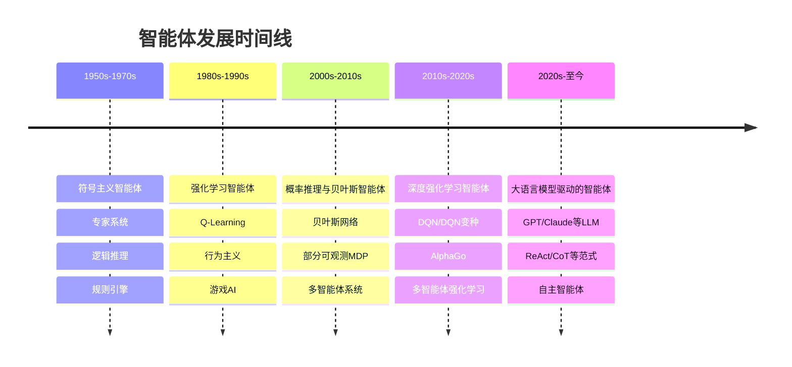

---

## 第一阶段：符号主义智能体（1950s-1970s）

### 核心思想

符号主义（Symbolicism）认为智能可以由**符号操作**实现。智能体通过逻辑推理和规则匹配来做出决策。

### 关键特征

- **显式规则**：行为由人工定义的规则描述
- **逻辑推理**：基于形式逻辑进行决策
- **知识表示**：使用符号系统表示知识
- **确定性输出**：相同输入总是产生相同输出

### 代表性系统

#### 1. 专家系统（Expert Systems）

专家系统是最早的符号主义智能体，它模拟人类专家的决策过程。

**系统架构：**

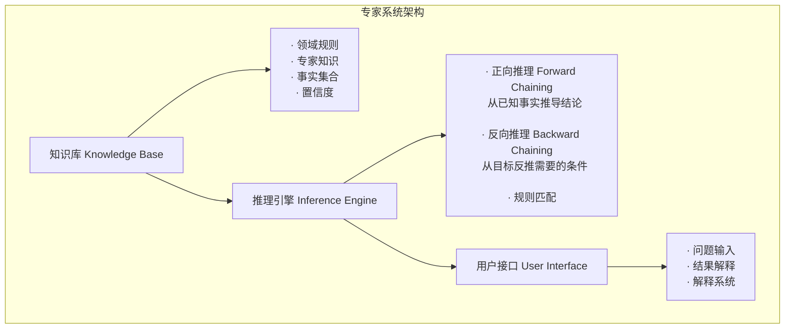

**推理过程示意：**

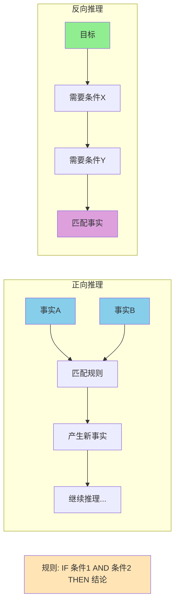

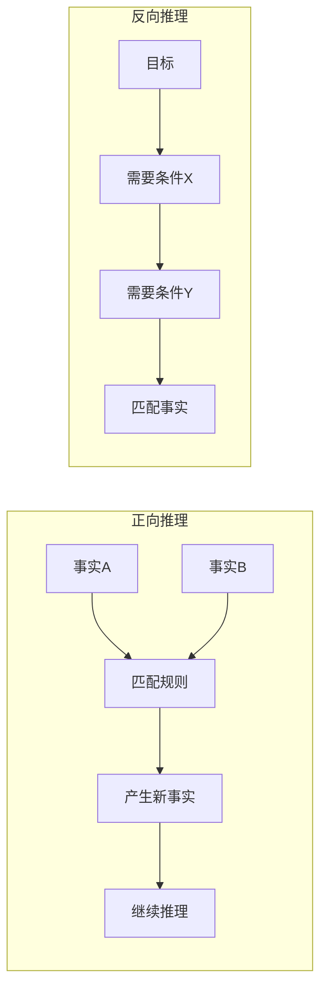

#### 2. STRIPS 规划系统

STRIPS (Stanford Research Institute Problem Solver) 是一个经典的规划系统。

**状态空间搜索：**

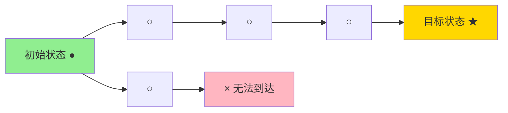

每个动作:
- 前提条件 (Preconditions)
- 添加效果 (Add Effects)
- 删除效果 (Delete Effects)

**规划算法示意：**

```
伪代码: STRIPS 算法

function STRIPS_PLAN(initial_state, goals, actions):
    current_state = initial_state
    plan = []

    while not goals ⊆ current_state:
        找到一个动作 action
        满足:
            1. action 的前提条件在 current_state 中
            2. action 的添加效果有助于达成 goals

        if 找不到这样的动作:
            return 失败

        将 action 加入 plan
        更新 current_state:
            current_state = current_state - action.delete + action.add

    return plan
```

### 局限性

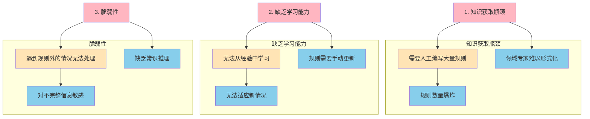

### 符号主义智能体的主要局限

**1. 知识获取瓶颈**
- 需要人工编写大量规则
- 规则数量爆炸，维护成本高
- 领域专家知识难以形式化表达

**2. 缺乏学习能力**
- 无法从经验中自动学习
- 无法适应新的环境和情况
- 规则需要手动更新，灵活性差

**3. 脆弱性**
- 遇到规则覆盖范围外的情况无法处理
- 对不完整信息敏感，容易出错
- 缺乏常识推理能力，处理现实问题能力有限

**总结**：
这些局限性导致了符号主义智能体在实际应用中的局限性，也促使了后续强化学习和深度学习等方法的兴起。

---

## 第二阶段：强化学习智能体（1980s-1990s）

### 核心思想

强化学习（Reinforcement Learning, RL）通过**试错学习**来优化行为策略。智能体通过与环境交互，获得奖励或惩罚，逐步学习最优策略。

### 强化学习循环

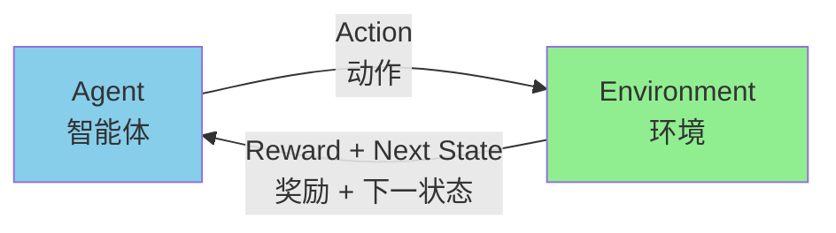

**Agent 的目标**: 最大化累积奖励

**关键要素**:
- 状态: 环境的当前情况
- 动作: Agent 可以执行的操作
- 奖励: 环境给出的反馈信号
- 策略: 状态到动作的映射

### Q-Learning 原理

Q-Learning 是一种经典的强化学习算法，学习状态-动作值函数 Q(s,a)。

**Q值表示意：**

```
Q表: 存储每个状态-动作对的价值

        动作1   动作2   动作3   动作4
状态1   10      5      8      3
状态2   7       20     2      15
状态3   1       3      50     5
...

伪代码: Q-Learning 更新

初始化 Q(s,a) 为任意值
对于每个 episode:
    初始化状态 s
    对于每个步骤:
        根据 Q 选择动作 a (ε-贪心策略)
        执行 a, 观察 r 和 s'

        更新 Q值:
        Q(s,a) ← Q(s,a) + α[r + γ·max Q(s',a') - Q(s,a)]

        s ← s'
    直到 s 是终止状态
```

**ε-贪心策略：**

```mermaid
graph LR
    %% ε-贪心策略逻辑
    subgraph 策略逻辑
        Input[状态 s]
        Decision{随机选择}

        Decision -->|ε| Explore[探索<br/>随机选择动作]
        Decision -->|1-ε| Exploit[利用<br/>选择Q最大的动作]

        Input --> Decision
    end

    %% 示例对比
    subgraph 高ε示例 (0.5)
        HighEps[高 ε = 0.5]
        HighExplore[探索 50%]
        HighExploit[利用 50%]
        HighResult[学习全面<br/>收敛较慢]
    end

    subgraph 低ε示例 (0.1)
        LowEps[低 ε = 0.1]
        LowExplore[探索 10%]
        LowExploit[利用 90%]
        LowResult[收敛较快<br/>可能陷入局部最优]
    end

    %% 样式设置
    style Input fill:#FFE4B5
    style Decision fill:#87CEEB
    style Explore fill:#FFB6C1
    style Exploit fill:#90EE90
    style HighEps fill:#DDA0DD
    style LowEps fill:#90EE90
    style HighResult fill:#87CEEB
    style LowResult fill:#87CEEB
```

### ε-贪心策略详解

**策略逻辑**:
- 对于给定的状态s，智能体选择动作的方式：
  - 以概率ε：随机选择一个动作（**探索**）
  - 以概率(1-ε)：选择Q(s,a)最大的动作（**利用**）

**参数选择策略**:

| ε值 | 探索概率 | 利用概率 | 特点 | 适用场景 |
|-----|---------|---------|------|---------|
| 高ε (如0.5) | 50% | 50% | 更多探索，学习全面，收敛慢 | 探索阶段、未知环境 |
| 低ε (如0.1) | 10% | 90% | 更多利用，收敛快，可能局部最优 | 利用阶段、已知环境 |
| 递减ε | 逐渐降低 | 逐渐升高 | 先探索后利用，平衡最优 | 长期学习任务 |

**平衡策略**:
- **探索**：发现新策略，避免局部最优
- **利用**：使用已知最优策略，快速获得奖励
- **平衡**：根据任务阶段调整ε值，实现最优学习

### 深度Q网络 (DQN)

当状态空间很大时，Q表无法存储，使用神经网络来近似Q函数。

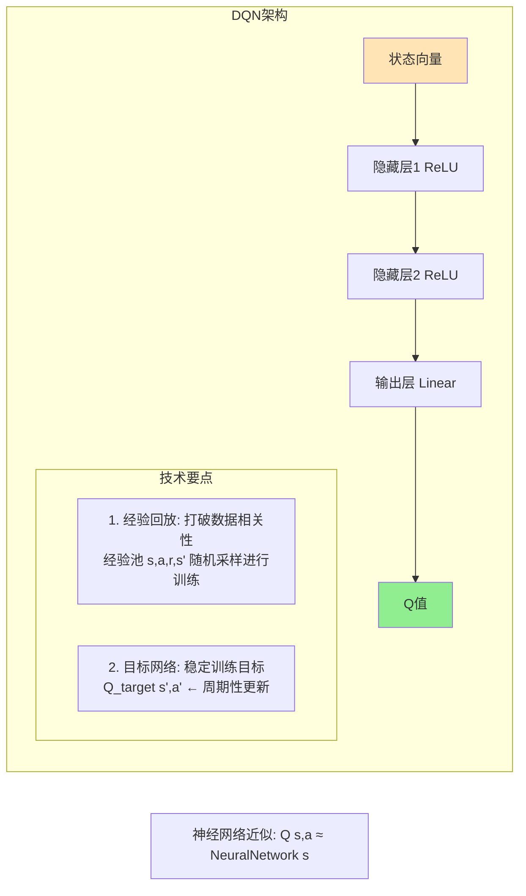

### 里程碑：AlphaGo

2016年，AlphaGo击败围棋世界冠军，是强化学习史上的重要里程碑。

**AlphaGo 核心技术组合：**

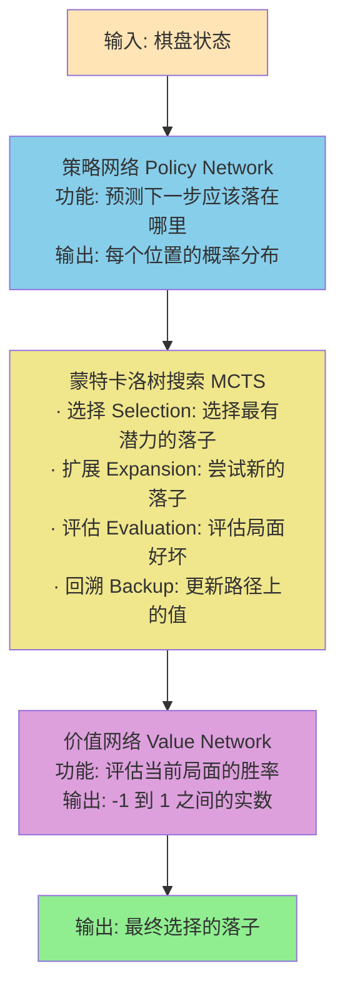

**MCTS 搜索过程示意：**

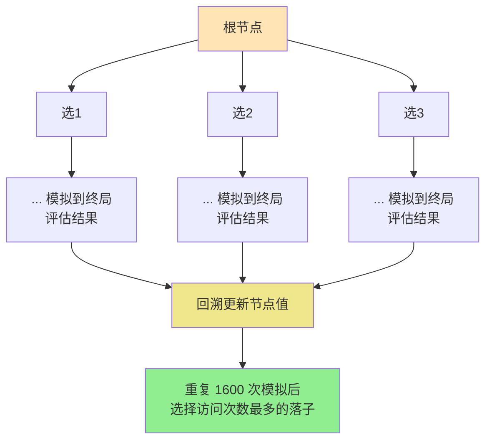

---

## 第三阶段：深度强化学习（2010s）

### 多智能体强化学习（MARL）

多个智能体同时在环境中学习和交互。

**协作 vs 竞争：**

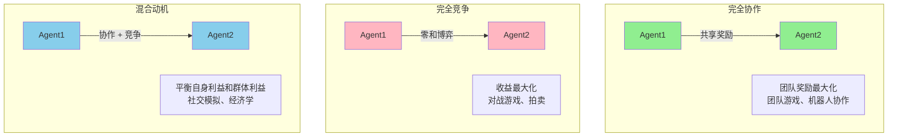

### 系统类型对比

| 类型 | 智能体关系 | 目标 | 应用场景 |
|------|-----------|------|---------|
| 完全协作 | 共享奖励 | 团队奖励最大化 | 团队游戏、机器人协作 |
| 完全竞争 | 零和博弈 | 自己收益最大化 | 对战游戏、拍卖 |
| 混合动机 | 协作+竞争 | 平衡利益 | 社交模拟、经济学 |

---

## 第四阶段：大语言模型驱动的智能体（2020s-至今）

### 革命性变化

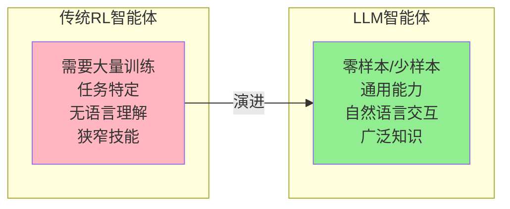

### 核心范式

#### 1. ReAct（推理+行动）

ReAct = Re（推理）+ Act（行动）

```mermaid
flowchart TB
    Question[问题: "巴黎的首都是哪里？"] --> Thought1[Thought: 巴黎本身就是首都<br/>等等，问题可能有错误...]
    Thought1 --> Action1[Action: 搜索 "巴黎 首都"]
    Action1 --> Observation[Observation: 巴黎是法国的首都<br/>问题可能是想问"法国的首都是哪里"]
    Observation --> Thought2[Thought: 法国的首都是巴黎]
    Thought2 --> Action2[Action: Finish[巴黎]]

    style Question fill:#FFE4B5
    style Observation fill:#87CEEB
    style Thought1 fill:#DDA0DD
    style Thought2 fill:#DDA0DD
    style Action1 fill:#90EE90
    style Action2 fill:#90EE90
```

### ReAct 循环特点

1. **Thought（推理）**: 理解问题，思考下一步行动
2. **Action（行动）**: 执行具体操作（搜索、计算等）
3. **Observation（观察）**: 获取行动结果，更新理解
4. **循环迭代**: 直到找到最终答案

#### 2. 思维链

通过逐步推理提升复杂问题的解决能力。

```
问题: "一个游戏有10个任务，每个需要15分钟，总共需要多少小时？"

普通输出:
"需要2.5小时"

思维链输出:
思考1: 首先计算总时间 = 10个任务 × 15分钟 = 150分钟
思考2: 然后转换为小时 = 150分钟 ÷ 60分钟/小时 = 2.5小时
答案: 总共需要2.5小时

思维链的优势:
· 展示推理过程，更可信
· 便于检查错误
· 适用于复杂问题
```

#### 3. 自我一致性

多次采样并投票，提高答案可靠性。

```mermaid
graph TD
    %% 输入问题
    Question[问题: "如果A比B大，B比C大，C比D大，D比E大，哪个最大？"]

    %% 多次采样
    Sample1[采样1<br/>答案: A]
    Sample2[采样2<br/>答案: A]
    Sample3[采样3<br/>答案: B]
    Sample5[采样5<br/>答案: A]

    %% 投票统计
    Vote[投票统计<br/>A: 4票 (80%)<br/>B: 1票 (20%)]

    %% 最终答案
    Final[最终答案: A]

    %% 流程连接
    Question --> Sample1
    Question --> Sample2
    Question --> Sample3
    Question --> Sample5

    Sample1 --> Vote
    Sample2 --> Vote
    Sample3 --> Vote
    Sample5 --> Vote

    Vote --> Final

    %% 样式设置
    style Question fill:#FFE4B5
    style Sample1 fill:#87CEEB
    style Sample2 fill:#87CEEB
    style Sample3 fill:#87CEEB
    style Sample5 fill:#87CEEB
    style Vote fill:#90EE90
    style Final fill:#FFD700
```

### Self-Consistency 流程详解

**步骤1**: 提出问题
- 给定一个需要推理的问题
- 可能涉及逻辑关系、数学计算等

**步骤2**: 多次采样
- 使用不同的随机种子或温度参数
- 每次生成不同的推理路径
- 获得多个可能的答案

**步骤3**: 投票统计
- 统计每个答案的出现次数
- 计算每个答案的比例
- 选择得票最多的答案

**步骤4**: 确定最终答案
- 根据投票结果选择最终答案
- 提高答案的可靠性和准确性

**优势**:
- 通过多样性采样提高答案质量
- 减少模型的随机性影响
- 在复杂推理问题上表现更好

### 游戏开发中的应用

#### 1. 智能NPC对话系统

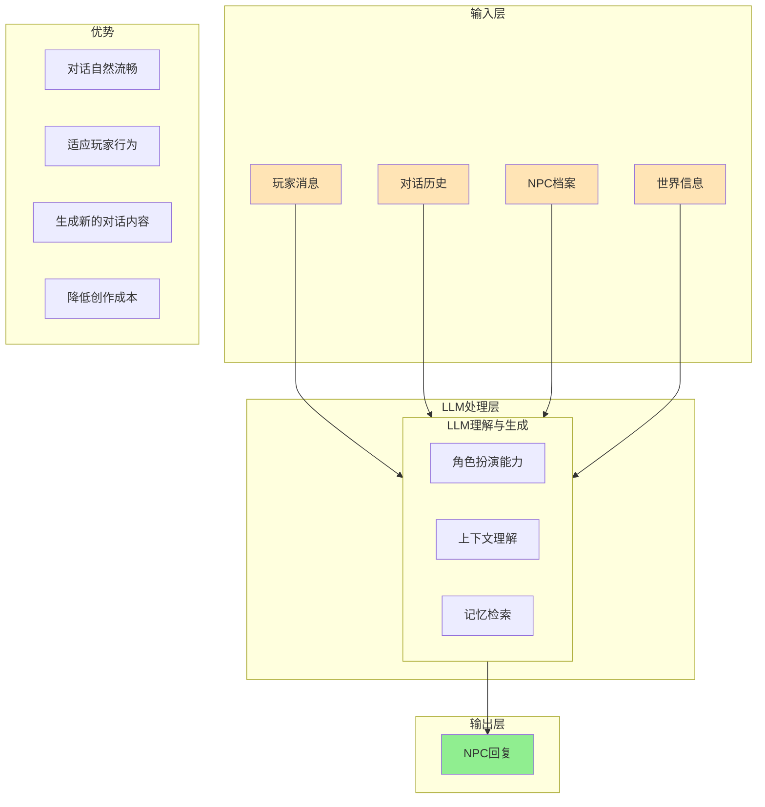

### 系统优势

- **对话自然流畅**: 基于大语言模型的自然语言生成能力
- **适应玩家行为**: 根据对话历史动态调整回复内容
- **生成新的对话内容**: 突破预设对话的限制，创造无限可能
- **降低创作成本**: 自动生成对话，减少人工工作量

#### 2. 动态任务生成

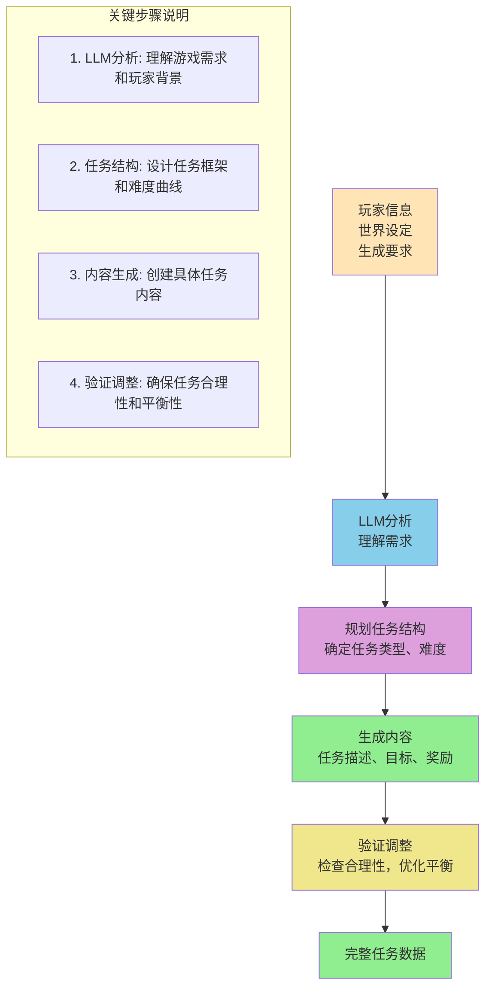

### 动态任务生成流程详解

1. **输入层**: 收集玩家信息、世界设定和具体生成要求
2. **LLM分析**: 利用大语言模型理解需求意图
3. **任务规划**: 设计任务类型、难度和整体结构
4. **内容生成**: 创建具体的任务描述、目标和奖励机制
5. **验证调整**: 检查任务合理性，优化游戏平衡性
6. **输出**: 生成完整的任务数据供游戏使用

#### 3. 游戏世界模拟

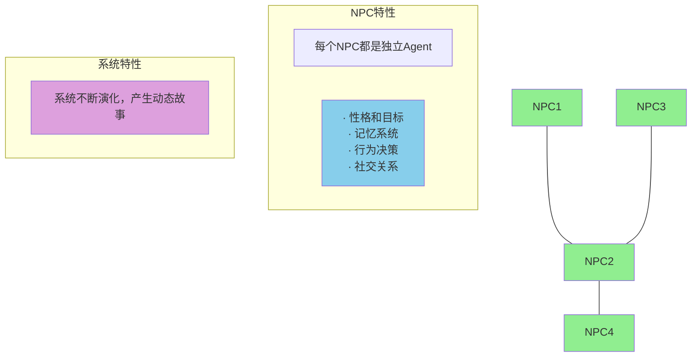

### 多智能体世界模拟特点

每个NPC都是独立的智能体：
- **性格和目标**: 每个NPC有独特的性格特征和目标
- **记忆系统**: 记住过去的交互和事件
- **行为决策**: 基于当前状态做出独立决策
- **社交关系**: 与其他NPC建立复杂的关系网络

系统特点：
- **动态交互**: NPC之间可以自由交互
- **故事生成**: 系统自发产生动态故事线
- **涌现行为**: 简单规则产生复杂群体行为

---

## 技术演进总结

### 各阶段对比

| 维度 | 符号主义 | 强化学习 | 深度RL | LLM Agent |
|------|---------|---------|--------|-----------|
| **知识来源** | 人工规则 | 环境交互 | 环境交互 | 预训练+微调 |
| **学习方式** | 无学习 | 试错学习 | 神经网络 | 提示工程 |
| **推理能力** | 逻辑推理 | 无显式推理 | 部分推理 | 强大推理 |
| **语言能力** | 无 | 无 | 无 | 强大 |
| **通用性** | 任务特定 | 任务特定 | 较通用 | 高度通用 |
| **训练成本** | 低（人工） | 高 | 很高 | 极高 |
| **部署成本** | 低 | 低 | 中 | 中高 |
| **游戏应用** | 早期NPC | 游戏AI | 复杂AI | 智能NPC |

### 游戏开发中的演进

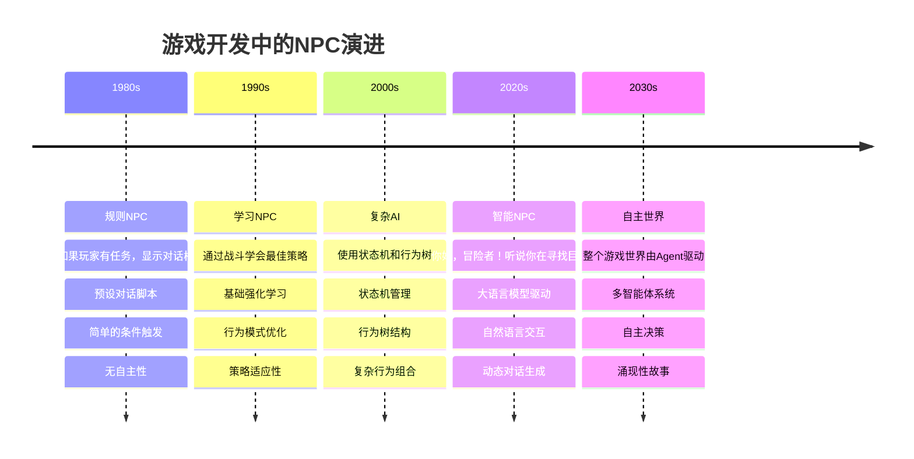

### NPC技术演进特点

**1980s - 规则时代**
- 基于规则的简单对话系统
- 预设的脚本和条件
- 交互有限，缺乏灵活性

**1990s - 学习时代**
- 引入学习能力
- 通过交互优化行为
- 开始适应玩家行为

**2000s - 复杂时代**
- 复杂的行为管理架构
- 状态机和行为树的广泛应用
- 更丰富的行为组合

**2020s - 智能时代**
- 大语言模型带来革命性变化
- 自然语言理解和生成
- 动态、个性化的交互体验

**2030s - 自主时代**
- 完全自主的智能体系统
- 涌现性的故事和事件
- 真正的开放世界体验

---

## 未来趋势

### 1. 具身智能（Embodied AI）

智能体有物理身体，可以感知和操作物理世界。

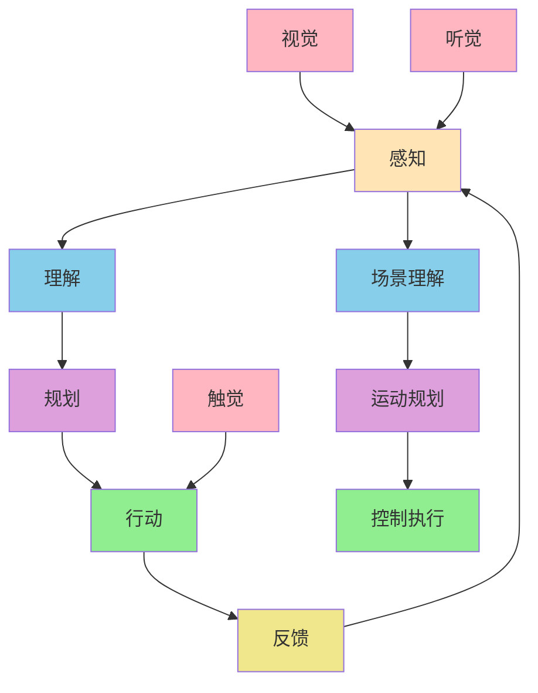

### 具身智能架构详解

**核心流程**:
1. **感知**: 接收来自环境的各种感官信息
2. **理解**: 分析和解释感知到的信息
3. **规划**: 制定行动计划
4. **行动**: 执行物理动作
5. **反馈**: 接收行动结果，形成闭环

**多模态感知**:
- **视觉**: 接收视觉信息，进行场景理解
- **听觉**: 接收声音信息，理解环境声音
- **触觉**: 感受物理接触和力反馈

**执行层级**:
- **场景理解**: 从感知信息中提取有意义的内容
- **运动规划**: 规划具体的运动轨迹
- **控制执行**: 精确控制身体动作

### 2. 多模态智能体

融合视觉、语言、听觉等多种模态。

```mermaid
graph TB
    %% 输入层
    Visual[视觉输入] --> Fusion[融合层]
    Language[语言输入] --> Fusion
    Audio[听觉输入] --> Fusion

    %% 融合处理
    Fusion --> Understand[理解与决策]

    %% 输出层
    Understand --> Text[文本输出]
    Understand --> Image[图像输出]
    Understand --> Speech[语音输出]

    %% 样式设置
    style Visual fill:#FFB6C1
    style Language fill:#87CEEB
    style Audio fill:#90EE90
    style Fusion fill:#DDA0DD
    style Understand fill:#F0E68C
    style Text fill:#FFE4B5
    style Image fill:#FFE4B5
    style Speech fill:#FFE4B5

    %% 说明文字
    subgraph 融合特点
        Feature1[多模态输入整合]
        Feature2[跨模态信息理解]
        Feature3[统一决策框架]
    end
```

### 多模态信息融合架构

**输入层**:
- **视觉输入**: 图像、视频等视觉信息
- **语言输入**: 文本、语音等语言信息
- **听觉输入**: 环境声音、语音指令等

**融合层**:
- **信息整合**: 将不同模态的信息融合统一
- **特征提取**: 提取各模态的关键特征
- **关联分析**: 发现不同模态间的关联性

**决策输出**:
- **文本输出**: 生成文本回复或描述
- **图像输出**: 生成图像或视觉反馈
- **语音输出**: 生成语音回复或指令

### 3. 自主智能体

完全自主运行，设定目标后自主分解和执行。

```mermaid
flowchart TD
    Goal[设定高层目标<br/>"构建一个完整的应用程序"] --> Decompose[目标分解<br/>子任务1, 子任务2, ...]
    Decompose --> Execute[执行子任务<br/>调用工具，生成代码]
    Execute --> Validate[验证与调整<br/>检查结果，修正错误]
    Validate --> Iterate[迭代优化<br/>持续改进]

    %% 循环箭头
    Iterate --> Goal

    %% 子任务详细说明
    subgraph 子任务示例
        Task1[分析需求]
        Task2[设计架构]
        Task3[实现功能]
        Task4[测试优化]
    end

    Decompose --> Task1
    Decompose --> Task2
    Decompose --> Task3
    Decompose --> Task4

    %% 样式设置
    style Goal fill:#FFE4B5
    style Decompose fill:#87CEEB
    style Execute fill:#90EE90
    style Validate fill:#DDA0DD
    style Iterate fill:#F0E68C

    style Task1 fill:#B0E0E6
    style Task2 fill:#B0E0E6
    style Task3 fill:#B0E0E6
    style Task4 fill:#B0E0E6
```

### 自主智能体工作循环详解

**循环流程**:
1. **设定高层目标**: 确定最终要达成的目标
2. **目标分解**: 将大目标分解为可执行的子任务
3. **执行子任务**: 逐个完成子任务，调用必要工具
4. **验证与调整**: 检查执行结果，修正错误
5. **迭代优化**: 持续改进，返回重新设定目标

**关键特点**:
- **循环迭代**: 形成完整的闭环系统
- **自主决策**: 智能体自主规划和执行
- **工具调用**: 能够使用各种外部工具和API
- **错误修正**: 具备自我检查和修正能力

### 4. 群体智能

大量简单智能体协作产生智能行为。

```mermaid
graph TB
    %% Boids位置示例
    B1[●] --> B2[●]
    B3[●] --> B4[●]
    B5[●] --> B6[●]

    %% 方向指示
    B1 --> Dir1[\\]
    B3 --> Dir2[\\]
    B5 --> Dir3[\\]

    %% 规则说明
    subgraph 规则1: 分离
        Rule1[避免与邻近鸟碰撞<br/>保持适当距离]
    end

    subgraph 规则2: 对齐
        Rule2[与邻近鸟方向一致<br/>匹配飞行方向]
    end

    subgraph 规则3: 凝聚
        Rule3[向邻近鸟中心移动<br/>保持群体聚集]
    end

    %% 结果
    Result[产生逼真的群体飞行行为<br/>涌现复杂行为]

    %% 样式设置
    style B1 fill:#FFB6C1
    style B2 fill:#FFB6C1
    style B3 fill:#FFB6C1
    style B4 fill:#FFB6C1
    style B5 fill:#FFB6C1
    style B6 fill:#FFB6C1

    style Rule1 fill:#FFE4B5
    style Rule2 fill:#FFE4B5
    style Rule3 fill:#FFE4B5
    style Result fill:#90EE90
```

### Boids算法 - 群体智能示例

**简单规则，复杂结果**:

每只鸟（Boid）仅遵循三个简单规则：
1. **分离（Separation）**: 避免与邻近鸟碰撞，保持适当距离
2. **对齐（Alignment）**: 与邻近鸟的飞行方向保持一致
3. **凝聚（Cohesion）**: 向邻近鸟群的中心移动，保持群体聚集

**涌现特性**:
- 从简单局部规则产生全局复杂行为
- 自然模拟鸟群、鱼群的群体运动
- 应用于：群体机器人、交通流模拟、计算机动画

**算法优势**:
- 计算效率高，适合实时模拟
- 产生自然逼真的群体行为
- 可扩展性强，适用于不同场景

---

## 练习作业

### 基础练习
1. 总结符号主义智能体的三个特点
2. 画出强化学习的基本循环图
3. 解释 Q-Learning 中 ε-贪心策略的作用

### 进阶练习
4. 对比不同阶段智能体的优缺点
5. 设计一个结合符号主义和强化学习的混合系统
6. 解释 AlphaGo 如何结合策略网络和价值网络

### 挑战练习
7. 设计一个基于LLM的游戏NPC系统架构
8. 思考如何解决LLM Agent的幻觉问题
9. 构想未来的智能体技术发展方向

## 学习资源

### 经典论文
- "Symbolic Logic" - George Boole
- "Reinforcement Learning: An Introduction" - Sutton & Barto
- "Human-level control through deep reinforcement learning" - Nature 2015
- "Mastering the game of Go with deep neural networks" - Nature 2016
- "ReAct: Synergizing Reasoning and Acting in Language Models" - 2022

### 游戏AI资源
- "Programming Game AI by Example" - Mat Buckland
- "Artificial Intelligence for Games" - Ian Millington
- Unity ML-Agents Toolkit
- OpenAI Gym

### 在线资源
- [DeepMind Blog](https://deepmind.com/blog)
- [OpenAI Research](https://openai.com/research)
- [Papers with Code](https://paperswithcode.com)

## 下一步

完成本章学习后，进入：
- [第3章：大语言模型基础](../ch03-llm-basics/) - 了解LLM的核心技术

## 学习检查

- [ ] 理解智能体发展的四个主要阶段
- [ ] 掌握各阶段的核心技术和特点
- [ ] 了解强化学习的基本原理
- [ ] 理解LLM Agent的突破性意义
- [ ] 能够分析不同智能体技术的适用场景
- [ ] 完成章节练习题
