# 第三章 大语言模型基础

## 章节概述

大语言模型（LLM）是现代 AI Agent 的核心驱动力。本章将深入浅出地介绍 LLM 的核心技术，包括 Transformer 架构、提示工程、主流模型及其局限性。

## 学习目标

- 理解 Transformer 架构的核心原理
- 掌握提示工程的基本技巧和模式
- 了解主流 LLM 的特点和差异
- 认识当前大模型的局限性
- 学会如何调用 LLM API

---

## Transformer 架构

### 为什么需要 Transformer？

在 Transformer 出现之前，NLP 模型面临两大问题：

1. **RNN/LSTM 的序列处理问题**
   - 无法并行计算
   - 长距离依赖难以捕捉

2. **CNN 的局限性**
   - 虽然可以并行，但对长序列效果不佳

**Transformer 的突破**：
- 完全基于注意力机制
- 可以并行训练
- 能够捕捉长距离依赖

### 自注意力机制（Self-Attention）

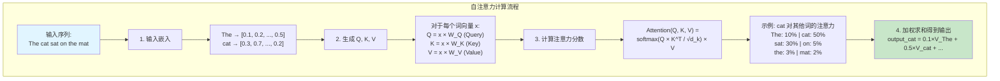

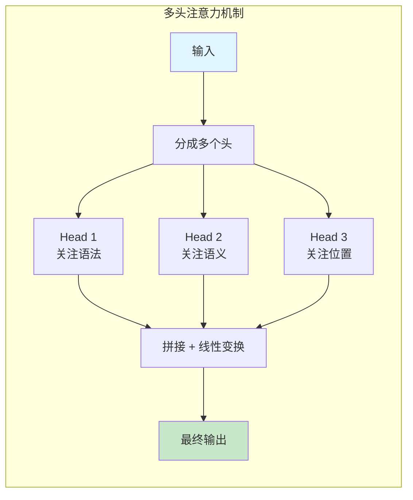

### Transformer 完整架构

```mermaid
graph TB
    subgraph Transformer架构
        A["输入: The cat sat on the mat"] --> B["Input Embedding<br/>+ Positional Encoding<br/>(将词转换为向量 + 添加位置信息)"]
        B --> C["Encoder Block (×N)"]
        C --> C1["Multi-Head Self-Attention<br/>(理解词与词之间的关系)"]
        C1 --> C2["Add & Norm<br/>(残差连接 + 层归一化)"]
        C2 --> C3["Feed-Forward Network<br/>(非线性变换)"]
        C3 --> C4["Add & Norm"]
        C4 --> D["Decoder Block (×N)"]
        D --> D1["Masked Self-Attention<br/>(只能看到之前的词)"]
        D1 --> D2["Add & Norm"]
        D2 --> D3["Cross-Attention<br/>(关注 Encoder 的输出)"]
        D3 --> D4["Add & Norm"]
        D4 --> D5["Feed-Forward Network"]
        D5 --> D6["Add & Norm"]
        D6 --> E["Linear + Softmax<br/>(输出词汇表上的概率分布)"]
        E --> F["输出: probability distribution<br/>over vocabulary"]
    end
    style A fill:#e1f5ff
    style F fill:#c8e6c9
    style C fill:#fff3e0
    style D fill:#fff3e0
```

### 位置编码（Positional Encoding）

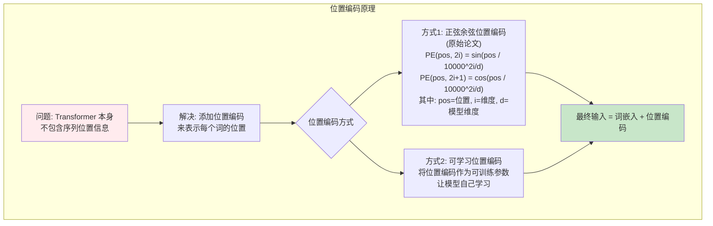

### 前馈网络（Feed-Forward Network）

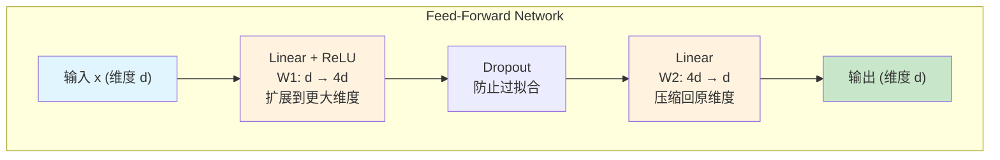

---

## 提示工程（Prompt Engineering）

### 什么是提示工程？

提示工程是**通过设计和优化输入提示来引导 LLM 产生更好输出**的技术。

### 基础提示模式

#### 1. 零样本提示（Zero-Shot）

```
零样本提示:

直接让模型完成任务，不提供示例

prompt = """
请完成以下任务：

任务：将以下文本翻译成英文：你好，世界

答案：
"""

→ LLM 直接生成答案
```

#### 2. 少样本提示（Few-Shot）

```
少样本提示:

提供少量示例帮助模型理解任务

prompt = """
请完成以下任务，参考给出的示例：

示例 1：
输入：苹果 -> 英语
输出：apple

示例 2：
输入：香蕉 -> 英语
输出：banana

输入：橙子 -> 英语
输出：
"""

→ LLM 根据示例规律生成: "orange"
```

#### 3. 思维链提示（Chain-of-Thought）

```
思维链提示:

引导模型逐步推理

prompt = """
请逐步推理解决以下问题，展示你的思考过程：

问题：如果一个游戏有10个任务，每个任务平均需要15分钟，
      完成所有任务需要多少小时？

请按以下格式回答：
思考步骤 1：
思考步骤 2：
...
最终答案：
"""

→ LLM 生成:

思考步骤 1：计算总分钟数
10个任务 × 15分钟/任务 = 150分钟

思考步骤 2：转换为小时
150分钟 ÷ 60分钟/小时 = 2.5小时

最终答案：2.5小时
```

### 高级提示技巧

#### 1. 角色提示

```
角色提示:

让 LLM 扮演特定角色

prompt = """
你是一个经验丰富的奇幻小说作者。

任务：向玩家介绍这个奇幻世界的背景故事

请以奇幻小说作者的身份和视角来完成任务。
"""

→ 输出会有更丰富的描述性和故事性
```

#### 2. 格式约束

```
格式约束提示:

指定输出格式

prompt = """
任务：为一个铁匠NPC生成对话

请严格按照以下格式输出：
{
    "npc_name": "名字",
    "dialogue": "对话内容",
    "emotion": "情感状态",
    "action": "伴随动作"
}

输出：
"""

→ LLM 按指定格式输出
```

#### 3. 思维-行动提示（ReAct）

```
ReAct 提示:

prompt = """
问题：Python 的快速排序算法是什么？

可用工具：
- search: 搜索引擎
- calculator: 计算器

请按以下格式思考和行动：

思考：[分析应该使用什么工具]
行动：[工具名称]
行动输入：[工具参数]

观察到结果后，继续思考或给出最终答案。

思考：
"""

→ LLM 生成:

思考：我需要查找快速排序算法的信息，应该使用搜索工具
行动：search
行动输入：Python 快速排序算法

观察：[搜索结果...]

思考：基于搜索结果，我可以给出答案了
行动：finish
行动输入：[最终答案]
```

#### 4. 自我反思提示

```
自我反思提示:

prompt = """
任务：写一个快速排序函数

初步答案：
[初始代码]

请审查上述答案，找出可能的问题和改进空间：

1. 检查准确性：
2. 检查完整性：
3. 检查清晰度：

基于以上检查，提供改进后的答案：
"""

→ LLM 会先反思，然后给出改进版本
```

### 游戏开发中的提示工程

#### NPC 对话生成

```
NPC 对话生成提示设计:

prompt = """
你是一个游戏NPC。严格按照角色设定回应玩家。

## 角色设定
- 姓名：铁匠老张
- 性别：男
- 年龄：45
- 职业：铁匠
- 性格特征：粗犷、直率、热心、固执
- 背景故事：在这个村庄打铁二十年，见证了无数冒险者的来来去去。
- 说话风格：说话简短有力，带着浓重的乡音，常用铁匠相关的比喻

## 对话历史
玩家: 你好，师傅
铁匠老张: 哎，小伙子，来找老张打铁啊？

## 玩家输入
玩家: 你好，师傅，能帮我修一下这把剑吗？

## 要求
1. 严格保持角色性格
2. 符合说话风格
3. 考虑对话历史
4. 推动剧情发展
5. 一句话回应，不要太长

## 你的回应
"""

→ LLM 生成符合角色设定的对话
```

#### 任务生成

```
任务生成提示设计:

prompt = """
你是一个游戏任务设计师。请根据以下信息生成一个游戏任务。

## 世界设定
- 游戏类型：RPG
- 世界背景：中世纪奇幻世界
- 当前地点：起始村庄

## 玩家信息
- 等级：5
- 职业：战士
- 已完成任务：新手教程

## 任务要求
1. 难度适中（适合5级玩家）
2. 有趣的剧情
3. 清晰的目标
4. 合理的奖励
5. 符合世界观

请以 JSON 格式返回任务：
{
    "title": "任务标题",
    "description": "任务描述（2-3句话）",
    "type": "任务类型（主线/支线/日常）",
    "objectives": ["目标1", "目标2"],
    "rewards": {
        "experience": 数值,
        "gold": 数值,
        "items": ["物品1", "物品2"]
    },
    "npc_name": "发布任务的NPC名字",
    "npc_dialogue": "NPC发布任务时的对话",
    "difficulty": "难度评级（简单/中等/困难）"
}
"""

→ LLM 生成结构化的任务数据
```

---

## 主流大语言模型对比

### GPT 系列（OpenAI）

| 特性 | GPT-3.5 | GPT-4 | GPT-4 Turbo |
|------|---------|-------|-------------|
| 上下文 | 16K | 8K/32K | 128K |
| 速度 | 快 | 中等 | 快 |
| 能力 | 良好 | 优秀 | 优秀 |
| 成本 | 低 | 高 | 中等 |
| 适用 | 日常任务 | 复杂任务 | 长文本处理 |

### Claude 系列（Anthropic）

| 特性 | Claude 2 | Claude 3 Opus | Claude 3.5 Sonnet |
|------|----------|---------------|-------------------|
| 上下文 | 100K | 200K | 200K |
| 速度 | 快 | 慢 | 中等 |
| 能力 | 良好 | 优秀 | 优秀 |
| 安全性 | 高 | 很高 | 很高 |
| 适用 | 长文本 | 高质量输出 | 平衡性能 |

### 开源模型

| 模型 | 组织 | 优势 | 劣势 |
|------|------|------|------|
| Llama 2 | Meta | 开源、可本地部署 | 需要硬件资源 |
| Mistral | Mistral AI | 高效、性能好 | 上下文较短 |
| Qwen | 阿里 | 中文优秀 | 英文稍弱 |
| DeepSeek | DeepSeek | 性价比高 | 生态较新 |

### 如何选择模型？

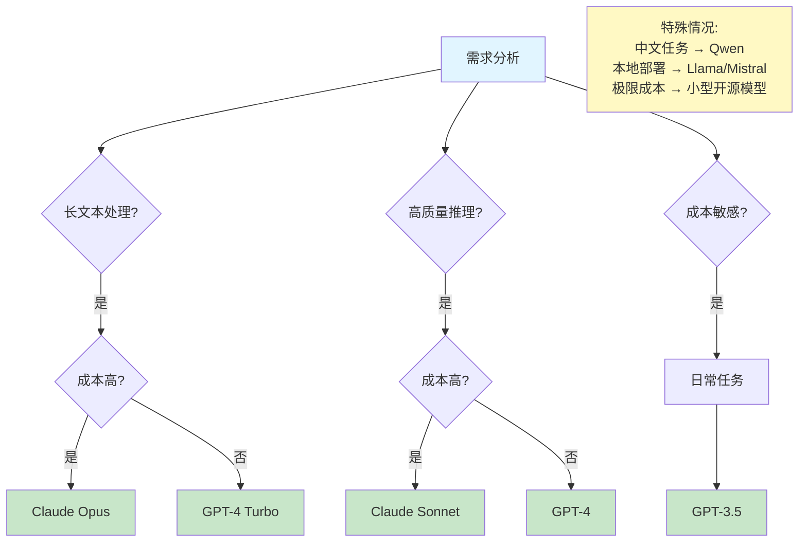

---

## LLM API 调用实践

### API 调用结构

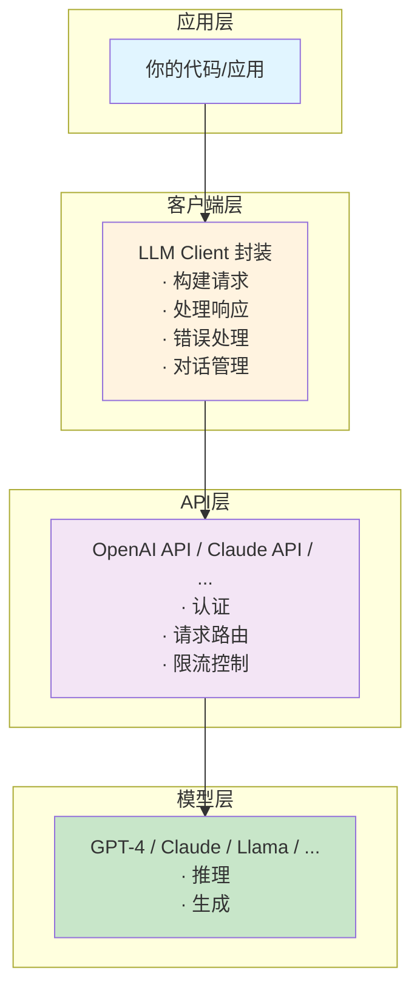

### API 调用伪代码

```
OpenAI Client 伪代码:

class OpenAIClient:
    初始化(api_key, model):
        self.api_key = api_key
        self.model = model
        self.conversation_history = []

    方法 generate(prompt, temperature=0.7, max_tokens=1000):
        构建 API 请求:
            model: self.model
            messages: [{"role": "user", "content": prompt}]
            temperature: temperature
            max_tokens: max_tokens

        发送请求到 OpenAI API

        解析响应:
            return response.choices[0].message.content

        如果出错:
            return "Error: {错误信息}"

    方法 chat(message, system_prompt=None):
        如果 system_prompt 存在且历史为空:
            添加 system_prompt 到历史

        添加用户消息到历史

        调用 API (使用完整历史)

        添加助手回复到历史

        return 助手回复

    方法 clear_history():
        清空对话历史


使用示例:

client = OpenAIClient(api_key="your-api-key")

// 简单生成
response = client.generate("写一首关于冒险的诗")

// 对话模式
client.clear_history()
system_prompt = "你是一个经验丰富的游戏NPC，扮演一个神秘的商人。"

while True:
    user_input = input("玩家: ")
    if user_input in ['exit', 'quit']:
        break

    response = client.chat(user_input, system_prompt)
    print(f"商人: {response}")
```

### Claude API 调用

```
Claude Client 伪代码:

class ClaudeClient:
    初始化(api_key, model):
        self.client = Anthropic(api_key=api_key)
        self.model = model

    方法 generate(prompt, max_tokens=1000):
        创建消息请求:
            model: self.model
            max_tokens: max_tokens
            messages: [{"role": "user", "content": prompt}]

        发送到 Claude API

        return message.content[0].text

    方法 stream_generate(prompt):
        创建流式请求

        for each text_chunk in stream:
            实时打印 text_chunk

        完成
```

### 本地模型（Ollama）

```
Ollama Client 伪代码:

class OllamaClient:
    初始化(base_url, model):
        self.base_url = base_url  // 通常是 http://localhost:11434
        self.model = model        // 例如 llama2, mistral

    方法 generate(prompt):
        url = "{base_url}/api/generate"

        payload = {
            "model": self.model,
            "prompt": prompt,
            "stream": False
        }

        POST 请求到 url，携带 payload

        解析 JSON 响应
        return result['response']

    方法 stream_generate(prompt):
        payload["stream"] = True

        打开流式连接

        for each line in response:
            data = JSON.parse(line)
            if 'response' in data:
                实时打印 data['response']

        完成
```

---

## LLM 的局限性

### 1. 幻觉问题（Hallucination）

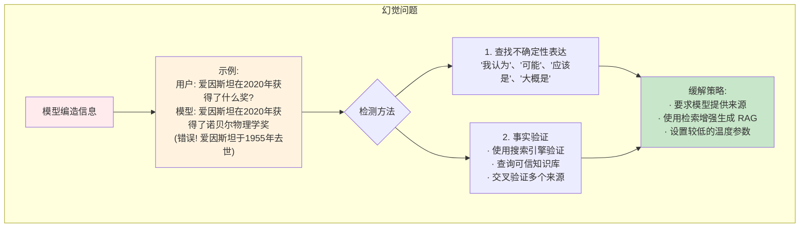

### 2. 上下文窗口限制

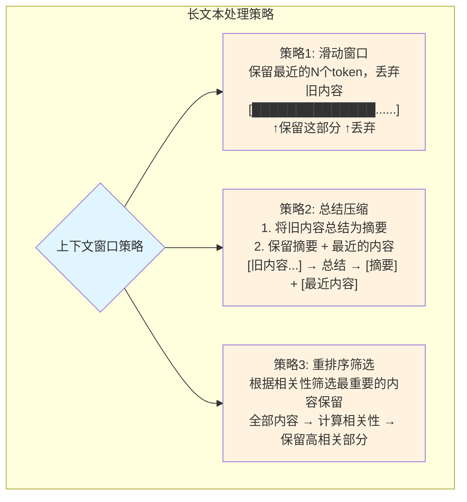

### 3. 数学计算能力

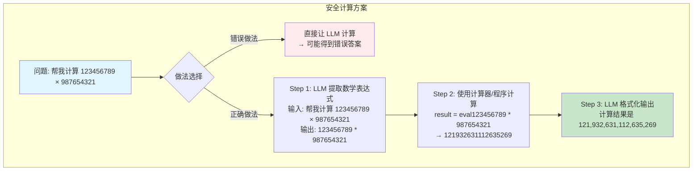

### 4. 实时信息缺失

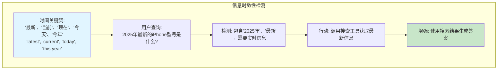

### 5. 上下文理解限制

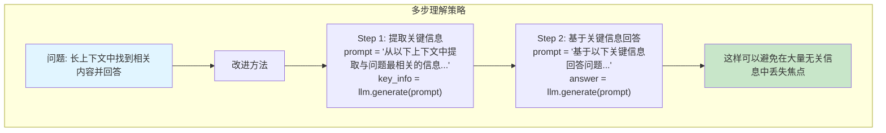

---

## 练习作业

### 基础练习
1. 调用 OpenAI API 生成一段文本
2. 尝试不同的提示词，观察输出变化
3. 实现一个简单的对话机器人

### 进阶练习
4. 为游戏 NPC 实现对话系统
5. 实现思维链提示解决问题
6. 比较不同模型在相同任务上的表现

### 挑战练习
7. 实现一个带记忆的对话系统
8. 构建一个任务生成器
9. 实现上下文压缩机制

## 学习资源

### 官方文档
- [OpenAI API 文档](https://platform.openai.com/docs)
- [Anthropic Claude 文档](https://docs.anthropic.com)
- [Ollama 文档](https://ollama.ai/docs)

### 推荐阅读
- "Attention Is All You Need" - Transformer 原论文
- "Language Models are Few-Shot Learners" - GPT-3 论文
- [Prompt Engineering Guide](https://www.promptingguide.ai)

### 在线课程
- Andrew Ng 的 AI 课程
- LangChain 提示工程教程

## 下一步

完成本章学习后，进入：
- [第4章：智能体经典范式构建](../../part2-building-agents/ch04-patterns/) - 学习 ReAct 等核心范式

## 学习检查

- [ ] 理解 Transformer 的核心原理
- [ ] 掌握自注意力机制
- [ ] 熟练使用提示工程技巧
- [ ] 了解主流 LLM 的特点
- [ ] 能够调用 LLM API
- [ ] 认识 LLM 的局限性
- [ ] 完成章节练习题
