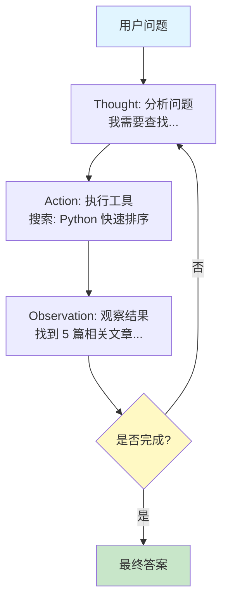
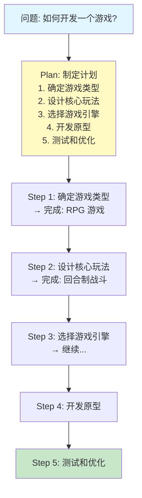
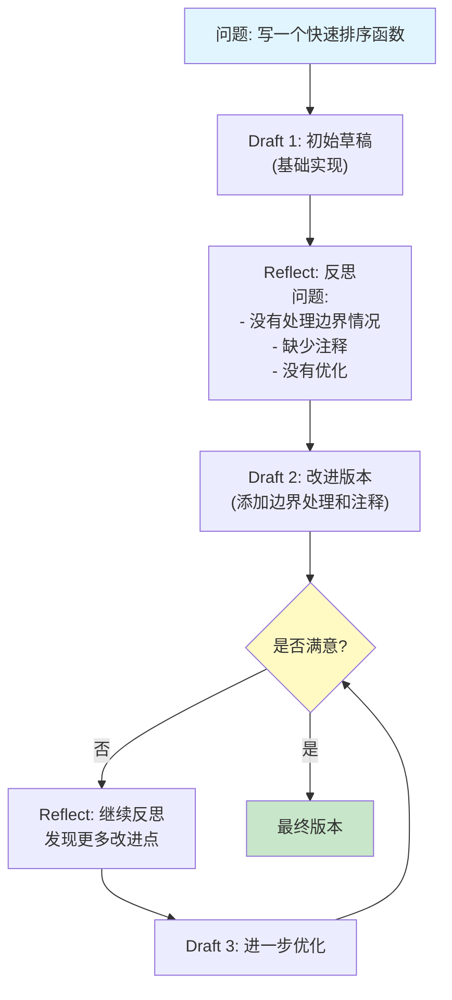

# 第4章：智能体经典范式构建

## 章节概述

本章将学习三种最重要的智能体范式：**ReAct**、**Plan-and-Solve** 和 **Reflection**。这些范式是构建复杂智能体的基础。

## 学习目标

- 理解三种经典范式的原理
- 从零实现每种范式
- 掌握范式的适用场景
- 能够选择合适的范式解决问题

---

## 范式一：ReAct（推理+行动）

### 核心思想

ReAct = **Re**asoning（推理）+ **Act**ing（行动）

智能体通过循环执行以下步骤来解决问题：
1. **Thought**（思考）：分析当前情况
2. **Action**（行动）：执行具体操作
3. **Observation**（观察）：观察行动结果
4. 重复直到达成目标

### 工作流程



### 伪代码实现

```
ReActAgent 结构:

初始化:
    llm_client: LLM客户端
    tools: 工具字典 {工具名: 工具函数}
    max_iterations: 最大迭代次数

主执行流程 run(query):
    prompt = 构建初始提示词(query)

    for iteration in range(max_iterations):
        response = llm.generate(prompt)

        // 解析响应
        thought, action, action_input = 解析响应(response)

        if action == "finish":
            return action_input  // 返回最终答案

        // 执行工具
        if action in tools:
            observation = tools[action](action_input)
        else:
            observation = "错误: 未知工具"

        // 更新提示词
        prompt = 添加新步骤到提示词(
            prompt, thought, action, action_input, observation
        )

    return "错误: 达到最大迭代次数"


提示词模板:

"""
你是 ReAct 智能体。请使用以下工具回答问题：

可用工具：
{工具列表}

使用以下格式：
思考: [你的推理过程]
行动: [工具名称]
行动输入: [工具输入]

观察: [工具返回的结果]
... (可以重复思考-行动-观察)

问题: {query}

思考:"""
```

### 游戏开发应用

**游戏 NPC 行为决策**

```
NPCAgent 继承自 ReActAgent:

工具集设计:
    move_to(location)     → 移动到位置
    talk_to(target)       → 与目标对话
    use_item(item)        → 使用物品
    attack(target)        → 攻击目标
    flee()                → 逃跑

决策流程:
    situation = 获取游戏状态()

    prompt = """
    你是游戏角色 {npc_name}

    当前情况: {situation}
    你的性格: 勇敢但谨慎
    你的目标: 保护村庄

    思考你应该如何行动，然后执行。

    思考:"""

    action = 执行ReAct循环(prompt)
    执行行动(action)


游戏循环:
    while 游戏运行:
        situation = get_game_state()
        action = npc.decide_action(situation)
        execute_action(action)
```

---

## 范式二：Plan-and-Solve（规划与解决）

### 核心思想

将复杂问题分解为：
1. **Plan**（规划）：先制定详细的执行计划
2. **Solve**（解决）：按计划逐步执行

### 工作流程



### 伪代码实现

```
PlanAndSolveAgent 结构:

主执行流程 run(query):
    // 第一步：制定计划
    plan = make_plan(query)
    输出计划(plan)

    // 第二步：执行计划
    result = execute_plan(plan, query)

    return result


制定计划 make_plan(query):
    prompt = """
    对于以下问题，制定一个详细的执行计划。

    问题: {query}

    请将问题分解为 3-7 个具体的步骤。
    每个步骤应该是可执行的、具体的。

    格式：
    1. [步骤1]
    2. [步骤2]
    ...

    计划:"""

    response = llm.generate(prompt)
    steps = 解析计划步骤(response)

    return steps


执行计划 execute_plan(plan, original_query):
    context = {
        'original_query': original_query,
        'completed_steps': [],
        'intermediate_results': []
    }

    for i, step in enumerate(plan):
        输出("步骤 {i}/{len(plan)}: {step}")

        // 执行当前步骤
        step_result = execute_step(step, context)

        // 保存结果
        context['completed_steps'].append(step)
        context['intermediate_results'].append(step_result)

        输出("完成: {step_result}")

    // 汇总结果
    final_answer = synthesize_results(context)
    return final_answer


执行单个步骤 execute_step(step, context):
    prompt = """
    背景:
    原始问题: {context['original_query']}

    已完成步骤:
    {格式化已完成的步骤}

    当前步骤: {step}

    请执行这个步骤，提供具体的结果。
    如果需要使用工具，请说明。

    结果:"""

    response = llm.generate(prompt)

    // 检查是否需要调用工具
    for tool_name in tools.keys():
        if tool_name in response:
            tool_input = 提取工具输入(response, tool_name)
            if tool_input:
                return tools[tool_name](tool_input)

    return response
```

### 游戏开发应用

**游戏任务生成**

```
QuestGeneratorAgent 结构:

工具集:
    generate_objective(description)  → 生成任务目标
    create_dialogue(character)        → 创建对话
    design_reward(difficulty)         → 设计奖励


生成任务流程:
    query = """
    为 {player_level} 级玩家生成一个{quest_type}任务。

    任务要求:
    - 难度适中
    - 有趣的剧情
    - 合理的奖励
    """

    // 使用 Plan-and-Solve 生成任务
    plan = make_plan(query)

    // 执行计划
    result = execute_plan(plan, query)

    quest = 解析任务信息(result)

    return quest


任务结构:
    {
        "title": "任务标题",
        "type": "主线/支线/日常",
        "level": 玩家等级要求,
        "objectives": [目标列表],
        "dialogues": [对话列表],
        "rewards": {
            "experience": 经验值,
            "gold": 金币,
            "items": [物品列表]
        }
    }
```

---

## 范式三：Reflection（反思）

### 核心思想

智能体通过以下步骤提升输出质量：
1. **Act**（行动）：生成初始方案
2. **Observe**（观察）：检查方案质量
3. **Reflect**（反思）：分析问题和改进点
4. **Refine**（改进）：基于反思优化方案
5. 重复直到满意

### 工作流程



### 伪代码实现

```
ReflectionAgent 结构:

主执行流程 run(query, context=""):
    current_version = None
    feedback_history = []

    for iteration in range(max_refinements + 1):
        if iteration == 0:
            // 第一次：生成初始版本
            current_version = generate_draft(query, context)
        else:
            // 后续：基于反馈改进
            current_version = refine(
                query,
                current_version,
                feedback_history[-1],
                context
            )

        输出("当前版本: {current_version}")

        // 获取反馈
        feedback = get_feedback(query, current_version, context)
        输出("反馈: {feedback}")
        feedback_history.append(feedback)

        // 检查是否满意
        if is_satisfactory(feedback):
            输出("达到满意的质量!")
            break

    return current_version


生成草稿 generate_draft(query, context):
    prompt = """
    任务: {query}

    {context}

    请完成这个任务。这是第一版，重点是正确性。
    """

    return llm.generate(prompt)


获取反馈 get_feedback(query, version, context):
    prompt = """
    任务: {query}

    当前版本:
    {version}

    请分析这个版本，提供详细的反馈：

    1. 问题分析:
       - 有哪些错误或不足？
       - 遗漏了什么？

    2. 改进建议:
       - 具体应该如何改进？
       - 优先级排序

    3. 质量评估:
       - 给出 1-10 分的质量评分
       - 是否达到可用标准？

    反馈:"""

    return llm.generate(prompt)


基于反馈改进 refine(query, current_version, feedback, context):
    prompt = """
    任务: {query}

    当前版本:
    {current_version}

    反馈:
    {feedback}

    请根据反馈改进当前版本。只修改需要改进的部分，
    保持其他部分不变。

    改进后的版本:"""

    return llm.generate(prompt)


判断是否满意 is_satisfactory(feedback):
    // 检查反馈中的关键词
    if 包含积极词(feedback):
        return True

    if 不包含消极词(feedback):
        score = 提取评分(feedback)  // 例如 "8/10"
        if score >= 8:
            return True

    return False
```

### 游戏开发应用

**NPC 对话优化**

```
DialogueRefiner 继承自 ReflectionAgent:

生成对话 generate_dialogue(character, situation, personality):
    context = """
    角色: {character}
    情境: {situation}
    性格:
    - 开放性: {personality['openness']}
    - 外向性: {personality['extraversion']}
    - 亲和性: {personality['agreeableness']}
    - 神经质: {personality['neuroticism']}

    要求:
    1. 对话要符合角色性格
    2. 自然、流畅
    3. 推动剧情发展
    4. 有情感表现
    """

    query = "为 {character} 生成一句对话"

    return run(query, context)


获取对话反馈 get_feedback(query, dialogue, context):
    prompt = """
    {context}

    生成的对话:
    "{dialogue}"

    请评估这段对话:

    1. 角色一致性:
       - 是否符合角色性格？
       - 语气是否恰当？

    2. 自然度:
       - 是否自然流畅？
       - 是否像真人说话？

    3. 剧情推动:
       - 是否推动故事发展？
       - 是否有趣？

    4. 情感表达:
       - 情感是否到位？
       - 是否有感染力？

    5. 具体建议:
       - 哪些地方需要修改？
       - 如何改进？

    反馈:"""

    return llm.generate(prompt)
```

---

## 三种范式的对比与选择

| 特性 | ReAct | Plan-and-Solve | Reflection |
|------|-------|----------------|------------|
| **适用场景** | 探索性任务、需要工具调用 | 复杂多步骤任务 | 需要高质量输出 |
| **优点** | 灵活、可适应 | 结构化、可控 | 质量高、可迭代 |
| **缺点** | 可能冗余 | 计划可能不完善 | 需要多轮迭代 |
| **成本** | 中等（多次 LLM 调用） | 中等（计划+执行） | 高（多轮优化） |
| **游戏应用** | NPC 行为决策 | 任务/剧情生成 | 对话/内容优化 |
| **编程应用** | 代码生成、调试 | 系统设计、重构 | 代码审查、优化 |

### 选择建议

**使用 ReAct 当：**
- 需要探索和试错
- 有多个工具可用
- 任务路径不确定

**使用 Plan-and-Solve 当：**
- 任务复杂但可分解
- 需要清晰执行路径
- 希望可追踪进度

**使用 Reflection 当：**
- 质量要求高
- 需要多次迭代优化
- 有明确的评估标准

**组合使用：**
可以组合使用多种范式！例如：
- Plan-and-Solve 制定计划
- ReAct 执行每一步
- Reflection 优化最终结果

---

## 练习作业

### 基础练习
1. **实现 ReAct Agent**
   - 创建工具集（搜索、计算、查询）
   - 实现完整的 ReAct 循环
   - 测试多步问题解决

2. **实现 Plan-and-Solve Agent**
   - 实现计划生成
   - 实现步骤执行
   - 测试复杂任务分解

3. **实现 Reflection Agent**
   - 实现草稿生成
   - 实现反馈机制
   - 实现迭代优化

### 进阶练习
4. **游戏方向**：
   - 用 ReAct 实现 NPC 行为系统
   - 用 Plan-and-Solve 实现任务生成器
   - 用 Reflection 优化对话系统

5. **编程方向**：
   - 用 ReAct 实现代码调试助手
   - 用 Plan-and-Solve 实现代码重构工具
   - 用 Reflection 实现代码审查系统

### 挑战练习
6. **组合范式**
   - 设计一个组合多种范式的系统
   - 实现 Agent 间的协作
   - 测试复杂场景

## 下一步

完成本章后，进入：
- [第5章：低代码平台](../ch05-lowcode/) - 了解 Coze、Dify 等平台
