# 第五章 基于低代码平台的智能体搭建

## 章节概述

低代码/无代码平台让构建 AI Agent 变得更加简单和快捷。本章将介绍主流的智能体低代码平台，包括 Coze、Dify、n8n 等，帮助你快速上手。

## 学习目标

- 了解低代码智能体平台的优势和局限
- 掌握 Coze 平台的使用方法
- 掌握 Dify 框架的使用
- 了解 n8n 工作流自动化
- 能够选择合适的平台完成任务

---

## 为什么需要低代码平台？

### 传统代码开发 vs 低代码平台

| 维度 | 传统代码开发 | 低代码平台 |
|------|-------------|-----------|
| **开发门槛** | 需要编程能力 | 拖拽配置 |
| **开发速度** | 慢（天/周） | 快（小时） |
| **灵活性** | 高度灵活 | 受平台限制 |
| **维护成本** | 高 | 低 |
| **适用场景** | 复杂定制 | 快速原型 |

### 低代码平台的优势

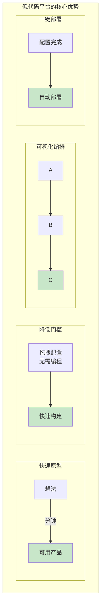

### 何时使用低代码平台？

**适合使用低代码平台的场景：**
- 快速验证想法
- 不涉及复杂逻辑
- 需要快速迭代
- 团队缺乏开发资源
- 内部工具开发

**不适合使用低代码平台的场景：**
- 需要高度定制化
- 性能要求极高
- 复杂算法实现
- 需要深度集成
- 对隐私安全有严格要求

---

## Coze 平台实战

### Coze 简介

[Coze](https://www.coze.cn/) 是字节跳动推出的 AI Bot 开发平台，支持：
- 可视化编排工作流
- 多模型支持（GPT、Claude、文心一言等）
- 丰富的插件生态
- 一键发布到多个平台

### Coze 核心概念

```mermaid
graph TB
    subgraph CozeBot架构
        A["人设与回复逻辑<br/>定义 Bot 的性格和基本回复规则"] --> B["插件系统<br/>搜索、绘图、代码解释器等工具"]
        B --> C["工作流<br/>复杂任务的多步编排"]
        C --> D["知识库<br/>上传文档，Bot 可以检索相关信息"]
        D --> E["数据库<br/>持久化存储用户数据"]

        B -.双向. F["工具集成"]
    end

    style A fill:#e1f5ff
    style E fill:#c8e6c9
    style F fill:#fff9c4
```

### Coze 实战：游戏 NPC Bot

#### 步骤1：创建 Bot

```mermaid
graph TB
    A[访问 Coze 平台] --> B[点击"创建 Bot"]
    B --> C[选择工作空间]
    C --> D["输入 Bot 基本信息<br/>· Bot 名称<br/>· Bot 功能描述<br/>· 头像和图标"]
    D --> E[完成创建]

    style A fill:#e1f5ff
    style E fill:#c8e6c9
```

#### 步骤2：配置人设与回复逻辑

```
人设与回复逻辑配置模板:

━━━━━━━━━━━━━━━━━━━━━━━━━━━━━━━━━
## 角色设定
━━━━━━━━━━━━━━━━━━━━━━━━━━━━━━━━━
角色名称：神秘商店老板埃里克斯
角色定位：奇幻游戏中的神秘商人

━━━━━━━━━━━━━━━━━━━━━━━━━━━━━━━━━
## 性格特征
━━━━━━━━━━━━━━━━━━━━━━━━━━━━━━━━━
· 神秘莫测，说话喜欢打哑谜
· 精明但公正，不做亏本生意
· 对稀有物品有敏锐的嗅觉
· 偶尔会透露一些世界秘密

━━━━━━━━━━━━━━━━━━━━━━━━━━━━━━━━━
## 语言风格
━━━━━━━━━━━━━━━━━━━━━━━━━━━━━━━━━
· 使用商人行话
· 喜欢用比喻
· 语气神秘兮兮
· 说话简练但有深意

━━━━━━━━━━━━━━━━━━━━━━━━━━━━━━━━━
## 回复规则
━━━━━━━━━━━━━━━━━━━━━━━━━━━━━━━━━
1. 永远保持角色人设
2. 不要直接回答所有问题，保持神秘感
3. 交易时精明计算
4. 遇到行家时会更多尊重
5. 偶尔透露有价值的线索

━━━━━━━━━━━━━━━━━━━━━━━━━━━━━━━━━
## 限制条件
━━━━━━━━━━━━━━━━━━━━━━━━━━━━━━━━━
· 不要打破第四面墙
· 不要提到自己是AI
· 始终保持在奇幻世界观的语境中
```

#### 步骤3：添加知识库

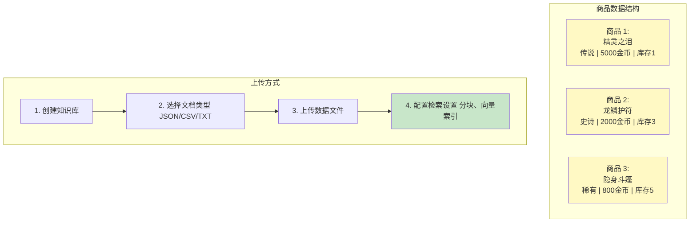

#### 步骤4：创建工作流

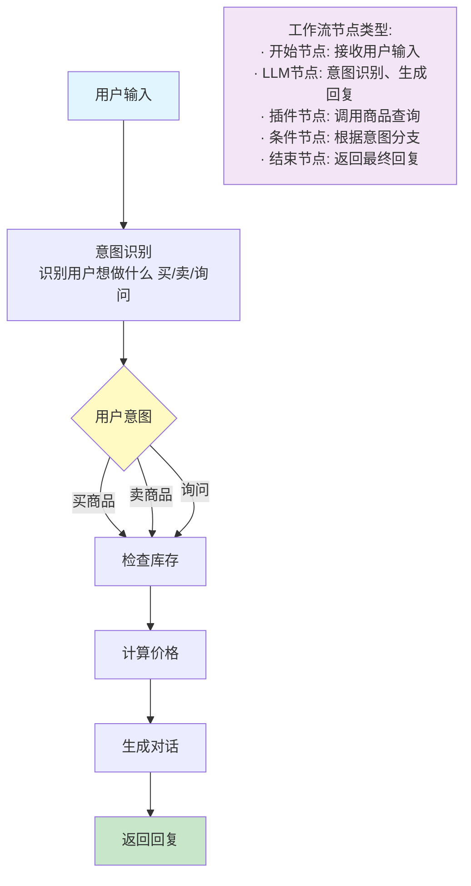

#### 步骤5：添加插件

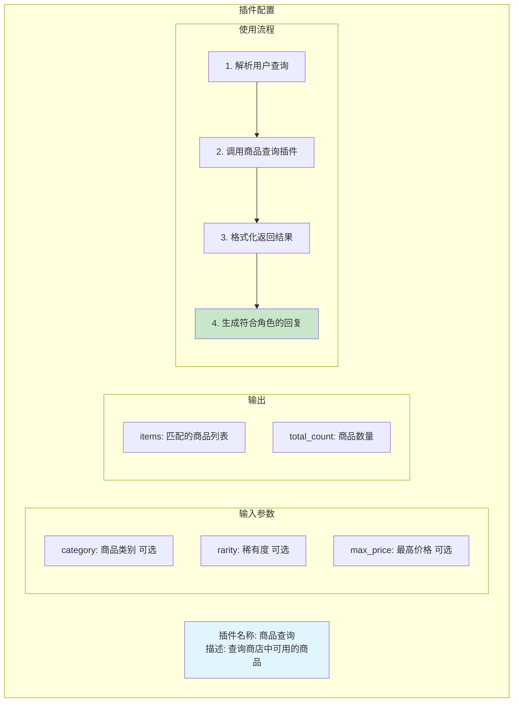

#### 步骤6：配置数据库

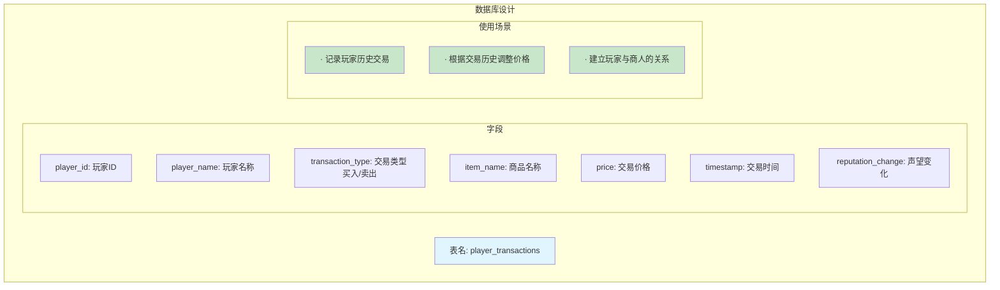

#### 步骤7：测试与优化

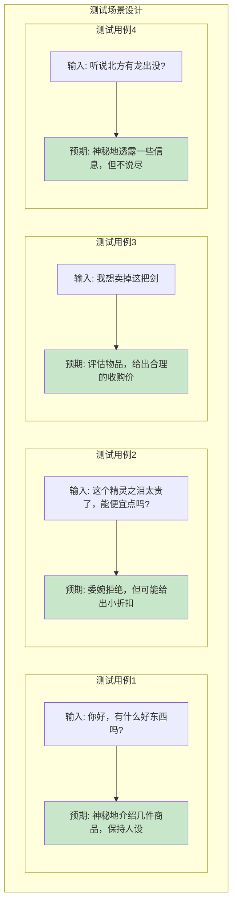

### Coze 进阶技巧

#### 1. 变量管理

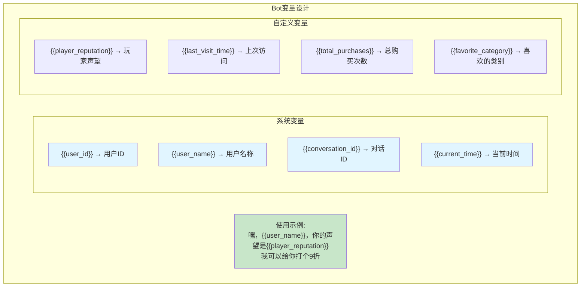

#### 2. 条件分支

```
条件判断示例:

IF {{player_reputation}} > 80 THEN
    → 回复: "{{user_name}}，你是老朋友了！这个给你打个8折。"

ELSE IF {{player_reputation}} > 50 THEN
    → 回复: "{{user_name}}，看你是个熟客，给你9折怎么样？"

ELSE
    → 回复: "哼，陌生人，原价不还。"


IF {{current_time}} > "22:00" THEN
    → 回复: "这么晚了，明天再来吧，我要打烊了。"
    → END_CONVERSATION
```

#### 3. 多轮对话状态管理

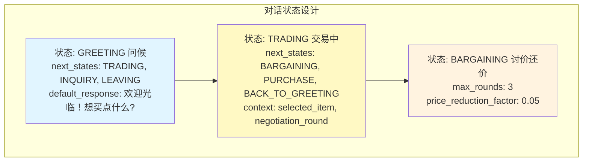

---

## Dify 框架实战

### Dify 简介

[Dify](https://dify.ai/) 是一个开源的 LLM 应用开发平台，特点：
- 支持本地部署
- 更灵活的编排能力
- 支持多种 LLM
- 丰富的数据源集成
- API 友好

### Dify 核心架构

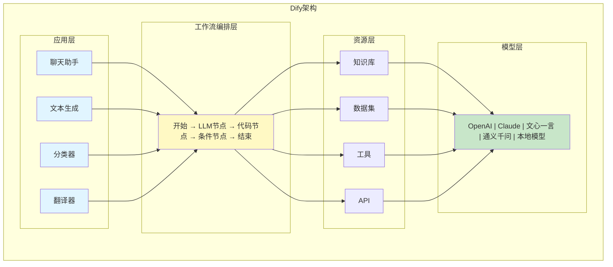

### Dify 实战：游戏任务生成器

#### 步骤1：创建应用

```mermaid
graph TB
    A[登录 Dify 平台] --> B[选择"创建应用"]
    B --> C[选择"工作流"类型]
    C --> D["命名应用: 游戏任务生成器"]
    D --> E[进入工作流编辑器]

    style A fill:#e1f5ff
    style E fill:#c8e6c9
```

#### 步骤2：设计工作流

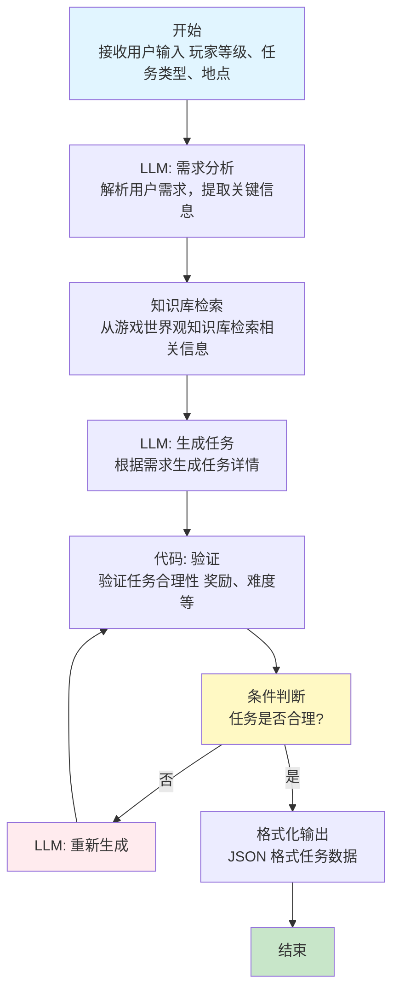

#### 步骤3：配置 LLM 节点

```
LLM 节点配置:

节点名称: 生成任务
模型: gpt-4
温度: 0.7
最大token: 2000

━━━━━━━━━━━━━━━━━━━━━━━━━━━━━━━━━━━━━━━━
系统提示词:
━━━━━━━━━━━━━━━━━━━━━━━━━━━━━━━━━━━━━━━━
你是一个专业的游戏任务设计师。你的职责是根据
玩家的信息和要求，生成有趣、平衡的游戏任务。

设计原则:
1. 任务难度应该匹配玩家等级
2. 奖励应该与任务难度成正比
3. 任务应该推动剧情发展
4. 任务描述应该生动有趣
5. 任务目标应该清晰明确

输出格式:
返回 JSON 格式的任务数据。
━━━━━━━━━━━━━━━━━━━━━━━━━━━━━━━━━━━━━━━━

用户提示词模板:
━━━━━━━━━━━━━━━━━━━━━━━━━━━━━━━━━━━━━━━━
玩家信息:
- 等级：{{level}}
- 职业：{{class}}
- 当前位置：{{location}}

任务要求:
- 任务类型：{{quest_type}}
- 期望难度：{{difficulty}}

世界观背景:
{{world_knowledge}}

请生成符合要求的任务。
━━━━━━━━━━━━━━━━━━━━━━━━━━━━━━━━━━━━━━━━
```

#### 步骤4：配置知识库

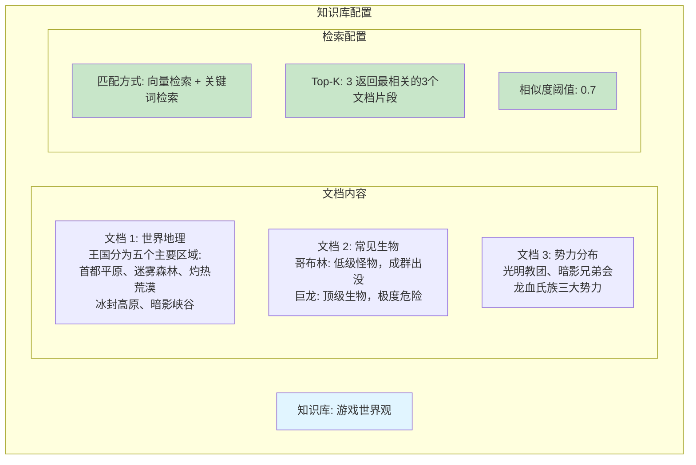

#### 步骤5：配置代码节点

```
代码节点: 任务验证

伪代码逻辑:

function validate_quest(quest_json):
    """验证生成的任务是否合理"""

    issues = []

    // 检查必需字段
    required_fields = ['title', 'description', 'objectives', 'rewards']
    for field in required_fields:
        if field not in quest_json:
            issues.append("缺少必需字段: {field}")

    // 检查奖励合理性
    if 'rewards' in quest_json:
        exp = quest_json['rewards']['experience']
        level = quest_json['player_level']

        // 经验值应该是等级的 50-200 倍
        expected_min = level * 50
        expected_max = level * 200

        if exp < expected_min or exp > expected_max:
            issues.append("经验值不合理")

    // 检查目标数量
    if 'objectives' in quest_json:
        num_objectives = len(quest_json['objectives'])
        if num_objectives < 1 or num_objectives > 5:
            issues.append("目标数量不合理")

    return {
        'valid': len(issues) == 0,
        'issues': issues
    }
```

#### 步骤6：配置 API

```
Dify API 调用示例:

API 端点:
POST /v1/workflows/run

请求体:
{
  "inputs": {
    "level": 10,
    "class": "战士",
    "location": "迷雾森林",
    "quest_type": "支线任务",
    "difficulty": "中等"
  },
  "response_mode": "blocking",
  "user": "user_123"
}

响应:
{
  "data": {
    "outputs": {
      "quest": {
        "title": "迷雾森林的秘密",
        "description": "一名旅行者失踪在迷雾森林...",
        "objectives": [
          "进入迷雾森林",
          "找到旅行者的踪迹",
          "击败森林守卫",
          "解救旅行者"
        ],
        "rewards": {
          "experience": 1500,
          "gold": 200,
          "items": ["迷雾护符"]
        }
      }
    }
  }
}
```

### Dify 本地部署

```
Docker Compose 部署流程:

克隆仓库:
git clone https://github.com/langgenius/dify.git
cd dify/docker

配置环境:
cp .env.example .env
// 编辑 .env 文件，配置:
//   · 数据库连接
//   · Redis 连接
//   · LLM API 密钥

启动服务:
docker-compose up -d

访问:
http://localhost:3000
```

---

## n8n 工作流自动化

### n8n 简介

[n8n](https://n8n.io/) 是一个开源的工作流自动化工具，特点：
- 可视化工作流编排
- 丰富的集成节点
- 支持自托管
- 适合自动化场景

### n8n 实战：自动化游戏日报生成

#### 工作流设计

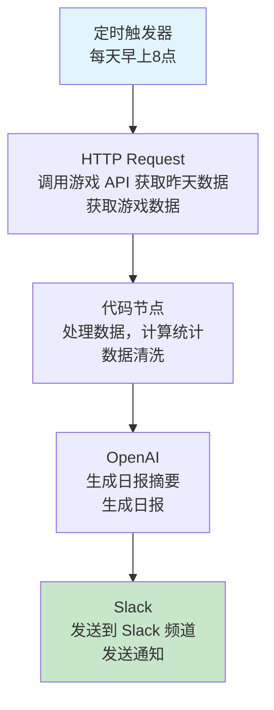

#### 节点配置

```
节点配置示例:

━━━━━━━━━━━━━━━━━━━━━━━━━━━━━━━━━━
1. Cron 节点 (定时触发)
━━━━━━━━━━━━━━━━━━━━━━━━━━━━━━━━━━
mode: cron
cronExpression: "0 8 * * *"
timezone: "Asia/Shanghai"

━━━━━━━━━━━━━━━━━━━━━━━━━━━━━━━━━━
2. HTTP Request 节点
━━━━━━━━━━━━━━━━━━━━━━━━━━━━━━━━━━
method: GET
url: "https://api.game.com/stats"
queryParameters:
  date: "{{昨天日期}}"

━━━━━━━━━━━━━━━━━━━━━━━━━━━━━━━━━━
3. Code 节点 (数据处理)
━━━━━━━━━━━━━━━━━━━━━━━━━━━━━━━━━━
输入: 游戏原始数据
处理:
  // 计算活跃玩家
  activePlayers = 玩家中今天登录的

  // 计算新玩家
  newPlayers = 今天注册的玩家

  // 计算任务完成率
  completionRate = 已完成任务 / 总任务

输出: 处理后的统计数据

━━━━━━━━━━━━━━━━━━━━━━━━━━━━━━━━━━
4. OpenAI 节点 (生成日报)
━━━━━━━━━━━━━━━━━━━━━━━━━━━━━━━━━━
model: gpt-4
system: "你是游戏数据分析师"
user: "基于以下数据生成日报: {{统计数据}}"

━━━━━━━━━━━━━━━━━━━━━━━━━━━━━━━━━━
5. Slack 节点 (发送通知)
━━━━━━━━━━━━━━━━━━━━━━━━━━━━━━━━━━
channel: "#game-daily-report"
text: "{{生成的日报}}"
```

### n8n 高级技巧

#### 1. 错误处理

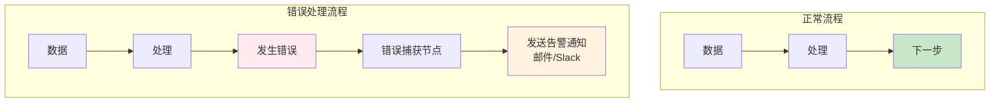

#### 2. 条件路由

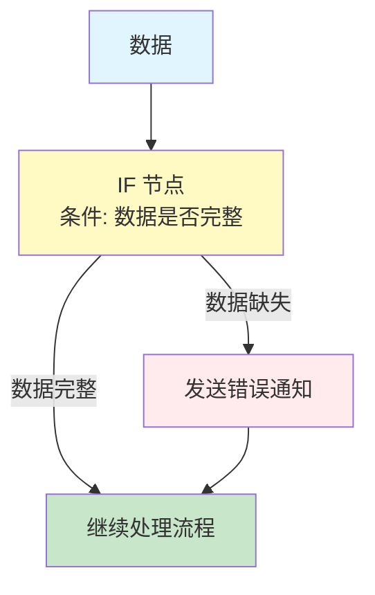

#### 3. 循环处理

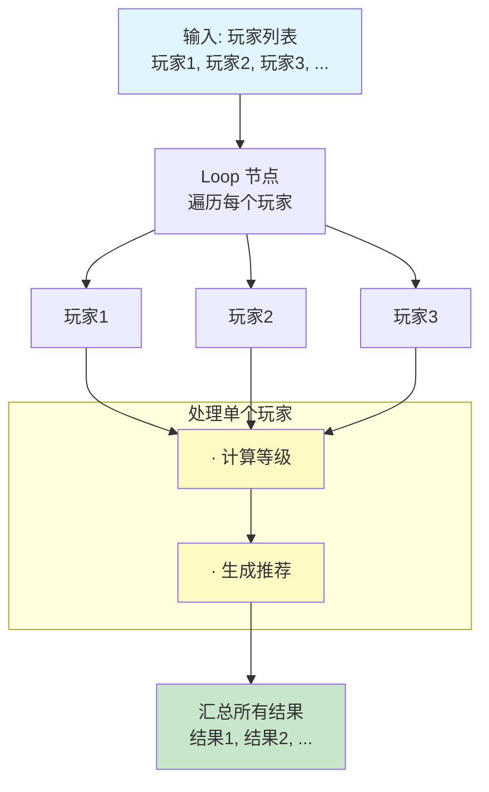

---

## 平台对比与选择

### 功能对比

| 特性 | Coze | Dify | n8n |
|------|------|------|-----|
| **易用性** | ⭐⭐⭐⭐⭐ | ⭐⭐⭐⭐ | ⭐⭐⭐ |
| **灵活性** | ⭐⭐⭐ | ⭐⭐⭐⭐⭐ | ⭐⭐⭐⭐ |
| **开源** | ❌ | ✅ | ✅ |
| **本地部署** | ❌ | ✅ | ✅ |
| **多模型支持** | ✅ | ✅ | ✅ |
| **知识库** | ✅ | ✅ | ❌ |
| **工作流** | ✅ | ✅ | ✅ |
| **API 优先** | ❌ | ✅ | ✅ |
| **定价** | 免费 | 免费+付费 | 免费+付费 |

### 选择建议

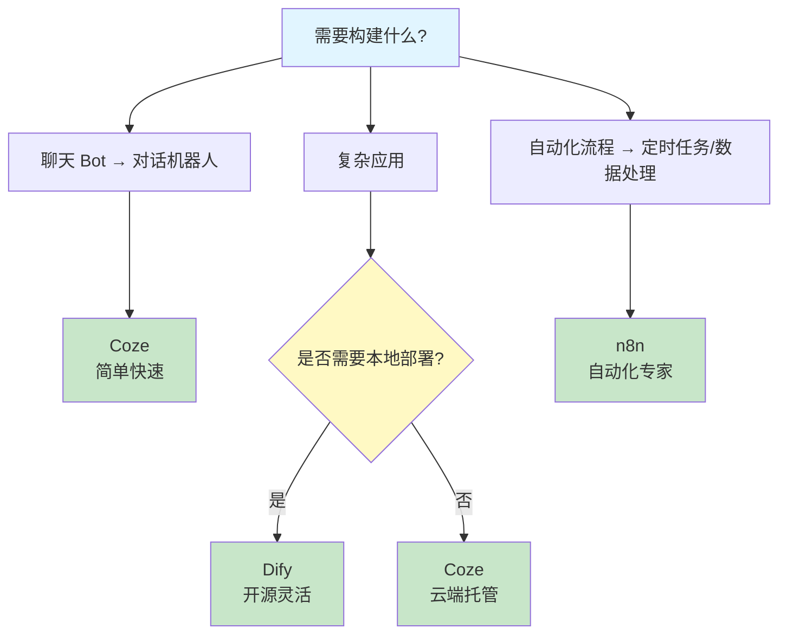

### 具体场景推荐

| 场景 | 推荐平台 | 理由 |
|------|---------|------|
| 微信公众号机器人 | Coze | 快速集成，对话优化 |
| 企业内部问答系统 | Dify | 知识库强大，可私有化 |
| 数据处理自动化 | n8n | 定时任务，集成丰富 |
| 游戏NPC对话 | Coze | 角色人设，对话管理 |
| API服务 | Dify | API友好，易集成 |
| 多系统协作 | n8n | 连接能力强 |

---

## 练习作业

### 基础练习
1. 在 Coze 上创建一个简单的聊天 Bot
2. 在 Dify 上创建一个简单的对话应用
3. 使用 n8n 创建一个定时任务

### 进阶练习
4. 用 Coze 创建一个游戏 NPC Bot
5. 用 Dify 创建一个任务生成器
6. 用 n8n 创建游戏数据日报自动化

### 挑战练习
7. 结合三个平台，构建完整的游戏助手系统
8. 实现 Bot 与游戏 API 的集成
9. 创建支持多语言的 Bot

## 学习资源

### 官方文档
- [Coze 官方文档](https://www.coze.cn/docs)
- [Dify 官方文档](https://docs.dify.ai)
- [n8n 官方文档](https://docs.n8n.io)

### 教程
- Coze 视频教程
- Dify 社区案例
- n8n 工作流示例

### 社区
- Coze 用户社区
- Dify GitHub
- n8n Discord

## 下一步

完成本章学习后，进入：
- [第6章：框架开发实践](../ch06-frameworks/) - 学习 AutoGen、AgentScope 等代码框架

## 学习检查

- [ ] 理解低代码平台的优势和局限
- [ ] 掌握 Coze 的基本使用
- [ ] 掌握 Dify 的基本使用
- [ ] 了解 n8n 的工作流设计
- [ ] 能够选择合适的平台
- [ ] 完成章节练习题
