# 第8章：记忆与检索

## 章节概述

记忆系统是智能体的关键组件，使 Agent 能够记住过去的经验、对话和知识。本章将深入学习如何实现和管理智能体的记忆。

## 学习目标

- 理解记忆的类型和层次
- 实现短期记忆系统
- 实现长期记忆存储
- 掌握 RAG（检索增强生成）技术
- 学习向量数据库的使用

---

## 记忆的类型

### 记忆层次结构

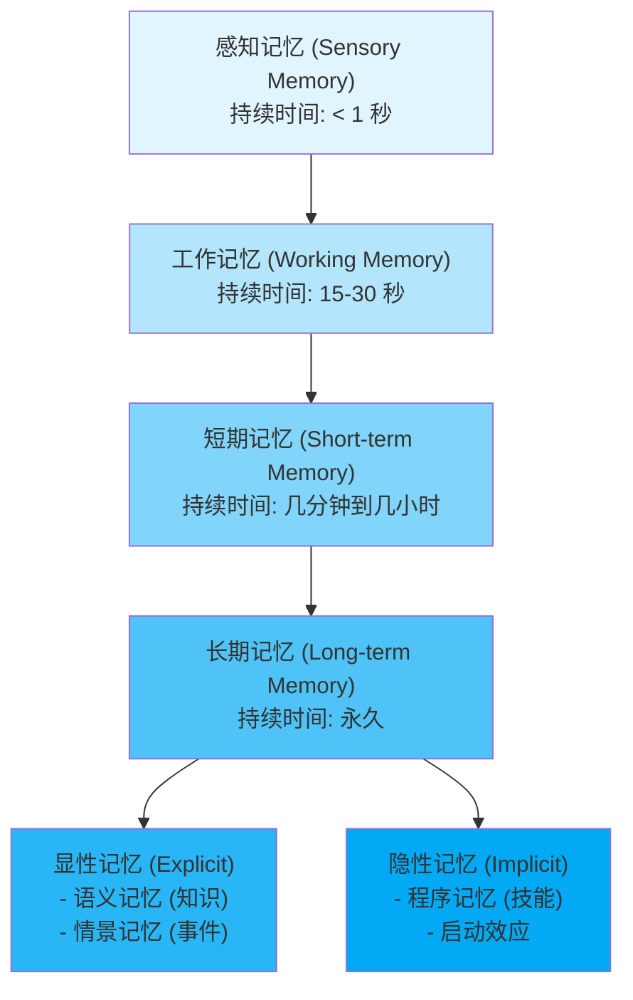
```mermaid
graph TB
    A["感知记忆 (Sensory Memory)<br/>持续时间: < 1 秒"] --> B["工作记忆 (Working Memory)<br/>持续时间: 15-30 秒"]
    B --> C["短期记忆 (Short-term Memory)<br/>持续时间: 几分钟到几小时"]
    C --> D["长期记忆 (Long-term Memory)<br/>持续时间: 永久"]
    D --> E["显性记忆 (Explicit)<br/>- 语义记忆 (知识)<br/>- 情景记忆 (事件)"]
    D --> F["隐性记忆 (Implicit)<br/>- 程序记忆 (技能)<br/>- 启动效应"]
    style A fill:#e1f5fe
    style B fill:#b3e5fc
    style C fill:#81d4fa
    style D fill:#4fc3f7
    style E fill:#29b6f6
    style F fill:#03a9f4
```

### 在智能体中的应用

| 记忆类型 | 智能体对应 | 应用场景 |
|---------|----------|---------|
| 感知记忆 | 输入缓冲 | 实时感知信息 |
| 工作记忆 | 上下文窗口 | 当前对话、任务 |
| 短期记忆 | 会话记忆 | 当前会话内容 |
| 语义记忆 | 知识库 | 通用知识、事实 |
| 情景记忆 | 事件记忆 | 过去的经历、对话 |
| 程序记忆 | 技能记忆 | 如何使用工具 |

---

## 短期记忆实现

### 基础实现

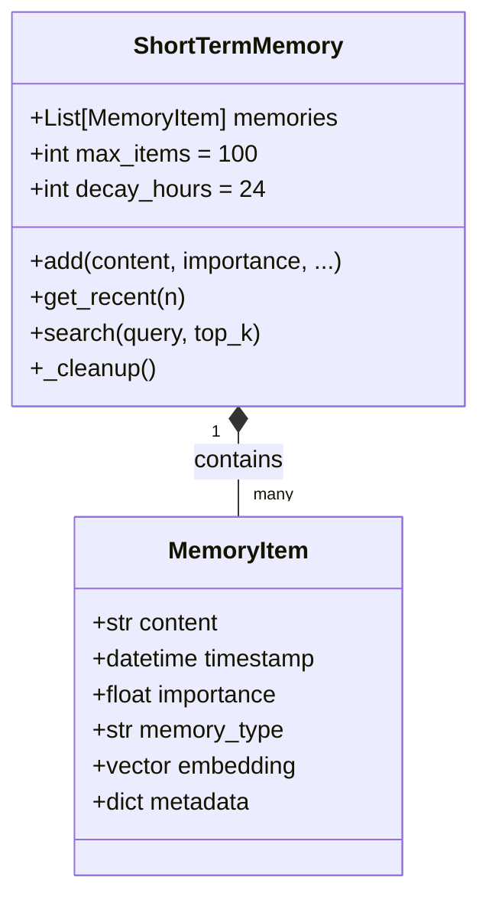
```mermaid
classDiagram
    class MemoryItem {
        +str content
        +datetime timestamp
        +float importance
        +str memory_type
        +vector embedding
        +dict metadata
    }

    class ShortTermMemory {
        +List[MemoryItem] memories
        +int max_items = 100
        +int decay_hours = 24
        +add(content, importance, ...)
        +get_recent(n)
        +search(query, top_k)
        +_cleanup()
    }

    ShortTermMemory "1" *-- "many" MemoryItem : contains
```


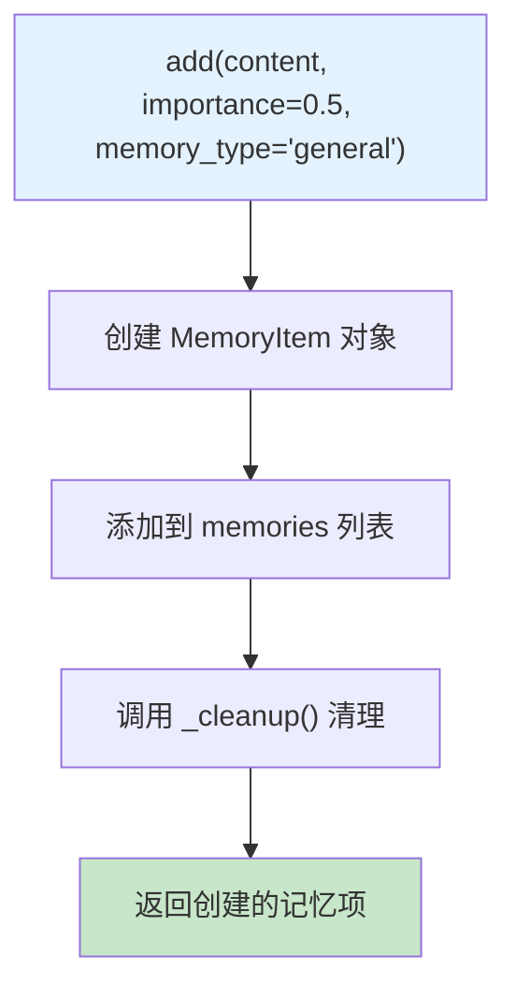
```mermaid
flowchart TD
    A["add(content, importance=0.5, memory_type='general')"] --> B["创建 MemoryItem 对象"]
    B --> C["添加到 memories 列表"]
    C --> D["调用 _cleanup() 清理"]
    D --> E["返回创建的记忆项"]
    style A fill:#e3f2fd
    style E fill:#c8e6c9
```


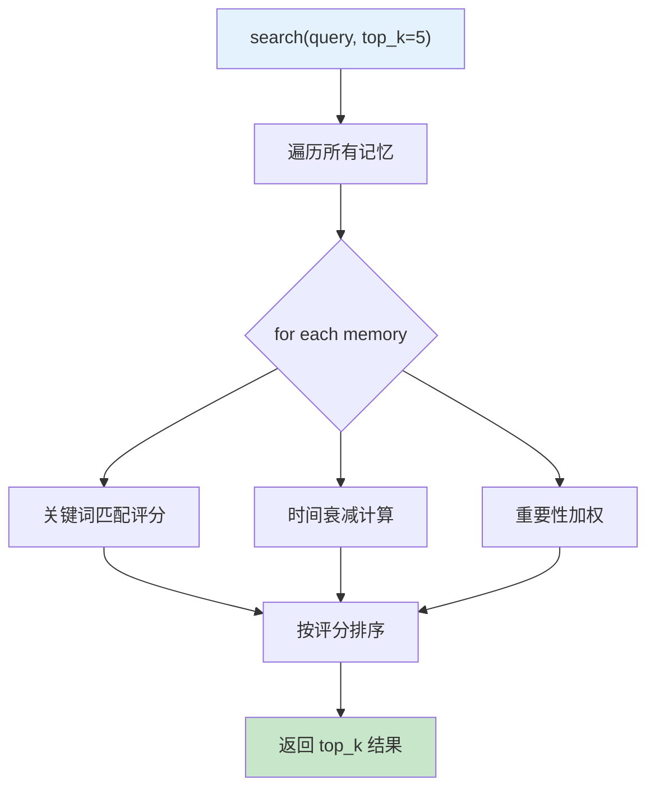
```mermaid
flowchart TD
    A["search(query, top_k=5)"] --> B["遍历所有记忆"]
    B --> C{for each memory}
    C --> D["关键词匹配评分"]
    C --> E["时间衰减计算"]
    C --> F["重要性加权"]
    D --> G["按评分排序"]
    E --> G
    F --> G
    G --> H["返回 top_k 结果"]
    style A fill:#e3f2fd
    style H fill:#c8e6c9
```


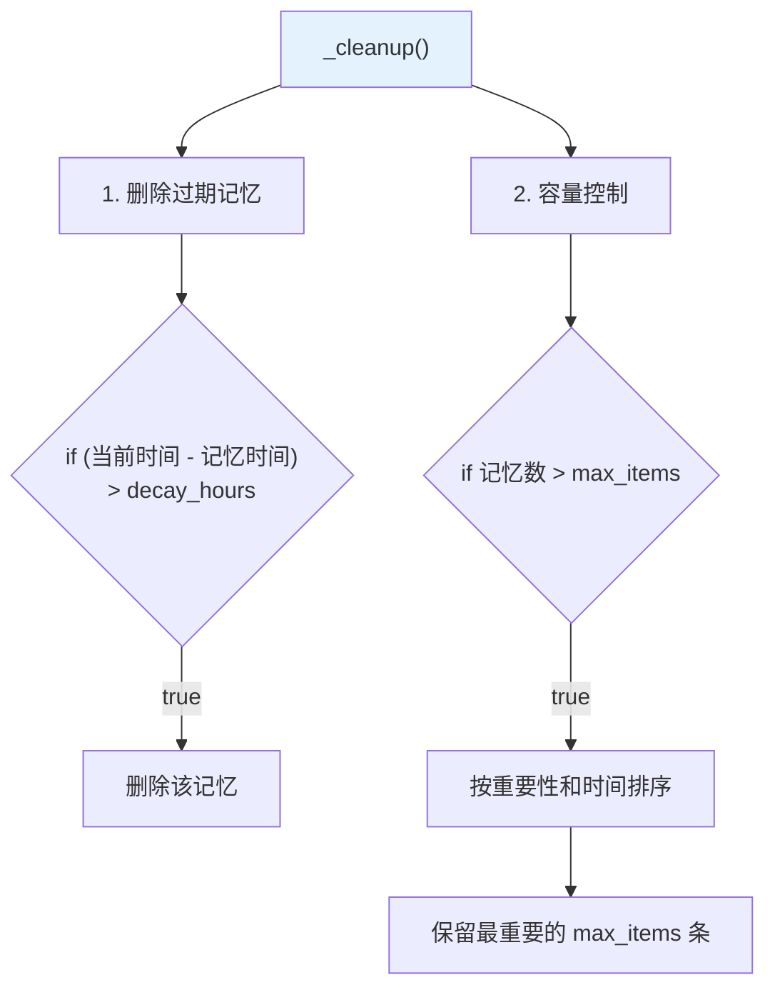
```mermaid
flowchart TD
    A["_cleanup()"] --> B["1. 删除过期记忆"]
    A --> C["2. 容量控制"]
    B --> D{"if (当前时间 - 记忆时间)<br/>> decay_hours"}
    D -->|true| E["删除该记忆"]
    C --> F{"if 记忆数 > max_items"}
    F -->|true| G["按重要性和时间排序"]
    G --> H["保留最重要的 max_items 条"]
    style A fill:#e3f2fd
```

### 游戏开发应用：NPC 会话记忆

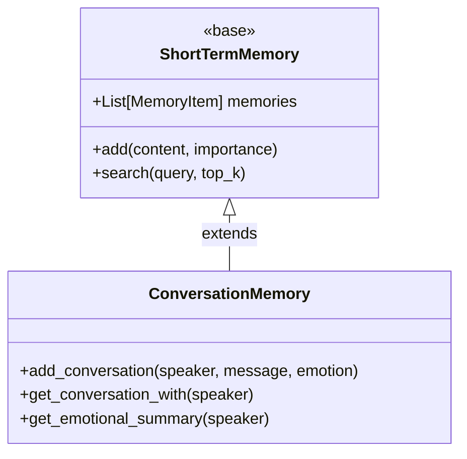
```mermaid
classDiagram
    class ShortTermMemory {
        <<base>>
        +List[MemoryItem] memories
        +add(content, importance)
        +search(query, top_k)
    }

    class ConversationMemory {
        +add_conversation(speaker, message, emotion)
        +get_conversation_with(speaker)
        +get_emotional_summary(speaker)
    }

    ShortTermMemory <|-- ConversationMemory : extends
```

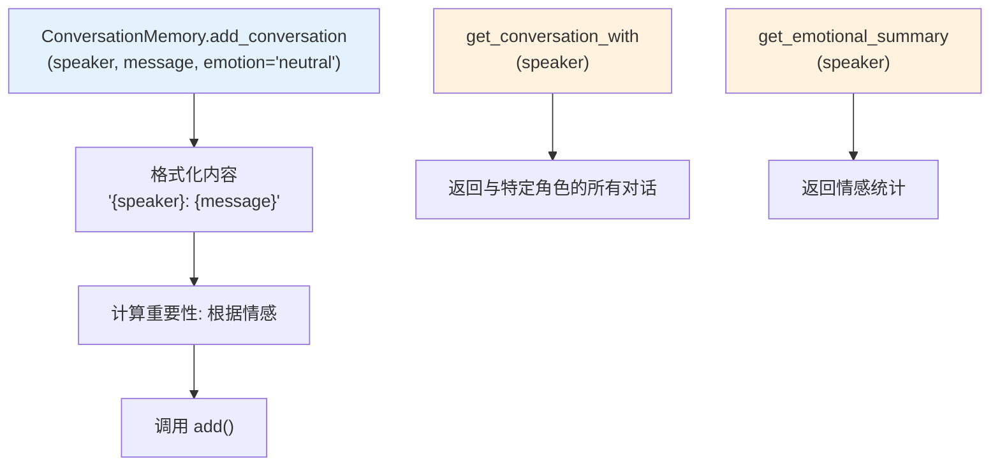
```mermaid
flowchart TD
    A["ConversationMemory.add_conversation<br/>(speaker, message, emotion='neutral')"] --> B["格式化内容<br/>'{speaker}: {message}'"]
    B --> C["计算重要性: 根据情感"]
    C --> D["调用 add()"]
    E["get_conversation_with<br/>(speaker)"] --> F["返回与特定角色的所有对话"]
    G["get_emotional_summary<br/>(speaker)"] --> H["返回情感统计"]
    style A fill:#e3f2fd
    style E fill:#fff3e0
    style G fill:#fff3e0
```


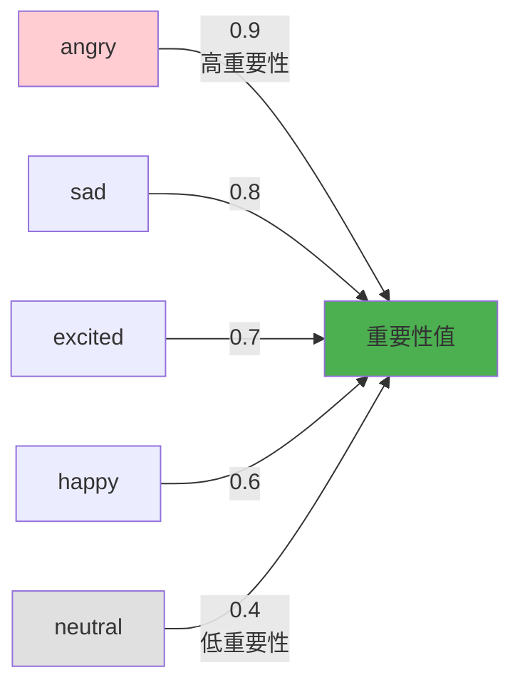
```mermaid
graph LR
    A["angry"] -->|"0.9<br/>高重要性"| B["重要性值"]
    C["sad"] -->|"0.8"| B
    D["excited"] -->|"0.7"| B
    E["happy"] -->|"0.6"| B
    F["neutral"] -->|"0.4<br/>低重要性"| B
    style B fill:#4caf50
    style A fill:#ffcdd2
    style F fill:#e0e0e0
```


使用示例:

```python
npc_memory = ConversationMemory(max_items=50)

# 添加对话
npc_memory.add_conversation(
    speaker="玩家",
    message="你好，我想买把剑",
    emotion="neutral"
)

npc_memory.add_conversation(
    speaker="玩家",
    message="这太贵了！",
    emotion="angry"
)

# 获取与玩家的对话历史
conversations = npc_memory.get_conversation_with("玩家")

# 分析玩家情感状态
emotions = npc_memory.get_emotional_summary("玩家")
# {"angry": 1, "neutral": 1}
```

---

## 长期记忆实现

### 向量存储与检索

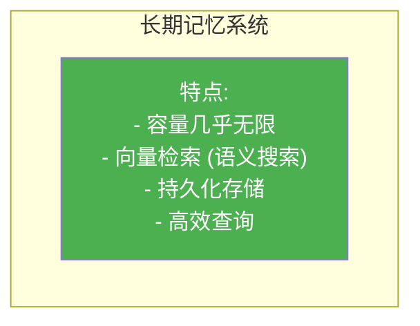
```mermaid
graph TB
    subgraph 长期记忆系统
        A["特点:<br/>- 容量几乎无限<br/>- 向量检索 (语义搜索)<br/>- 持久化存储<br/>- 高效查询"]
    end
    style A fill:#4caf50,color:#fff
```


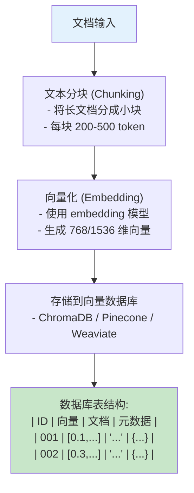
```mermaid
flowchart TD
    A["文档输入"] --> B["文本分块 (Chunking)<br/>- 将长文档分成小块<br/>- 每块 200-500 token"]
    B --> C["向量化 (Embedding)<br/>- 使用 embedding 模型<br/>- 生成 768/1536 维向量"]
    C --> D["存储到向量数据库<br/>- ChromaDB / Pinecone / Weaviate"]
    D --> E["数据库表结构:<br/>| ID | 向量 | 文档 | 元数据 |<br/>| 001 | [0.1,...] | '...' | {...} |<br/>| 002 | [0.3,...] | '...' | {...} |"]
    style A fill:#e3f2fd
    style E fill:#c8e6c9
```


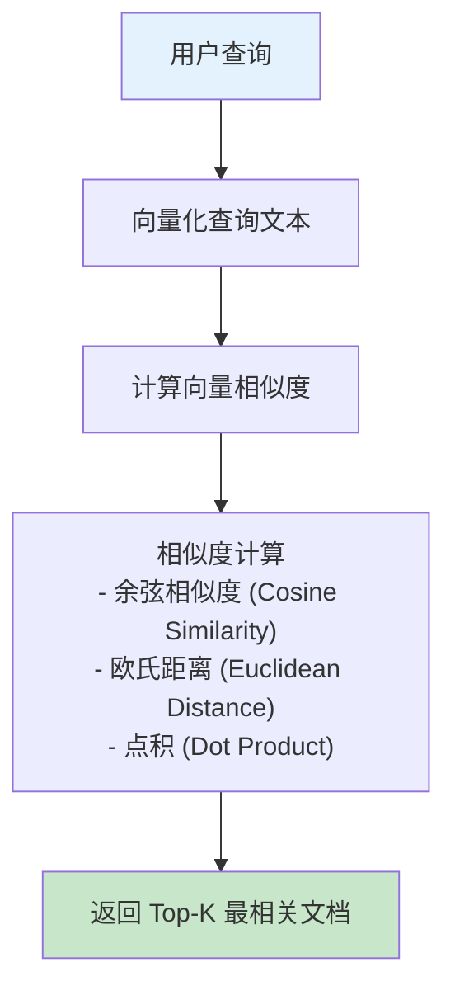
```mermaid
flowchart TD
    A["用户查询"] --> B["向量化查询文本"]
    B --> C["计算向量相似度"]
    C --> D["相似度计算<br/>- 余弦相似度 (Cosine Similarity)<br/>- 欧氏距离 (Euclidean Distance)<br/>- 点积 (Dot Product)"]
    D --> E["返回 Top-K 最相关文档"]
    style A fill:#e3f2fd
    style E fill:#c8e6c9
```

### 完整的记忆系统

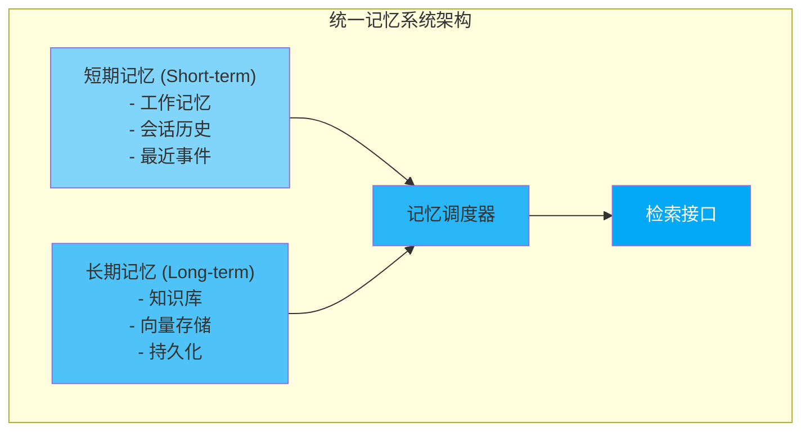
```mermaid
graph TB
    subgraph UnifiedMemorySystem["统一记忆系统架构"]
        STM["短期记忆 (Short-term)<br/>- 工作记忆<br/>- 会话历史<br/>- 最近事件"]
        LTM["长期记忆 (Long-term)<br/>- 知识库<br/>- 向量存储<br/>- 持久化"]
        Scheduler["记忆调度器"]
        Interface["检索接口"]

        STM --> Scheduler
        LTM --> Scheduler
        Scheduler --> Interface
    end
    style STM fill:#81d4fa
    style LTM fill:#4fc3f7
    style Scheduler fill:#29b6f6
    style Interface fill:#03a9f4,color:#fff
```


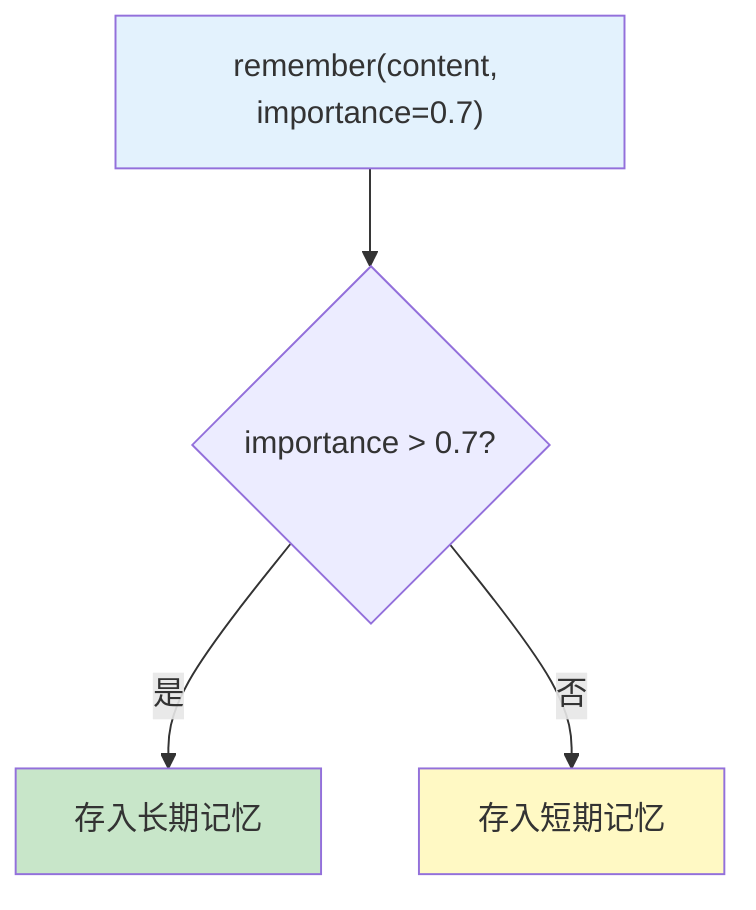
```mermaid
flowchart TD
    A["remember(content, importance=0.7)"] --> B{"importance > 0.7?"}
    B -->|是| C["存入长期记忆"]
    B -->|否| D["存入短期记忆"]
    style A fill:#e3f2fd
    style C fill:#c8e6c9
    style D fill:#fff9c4
```


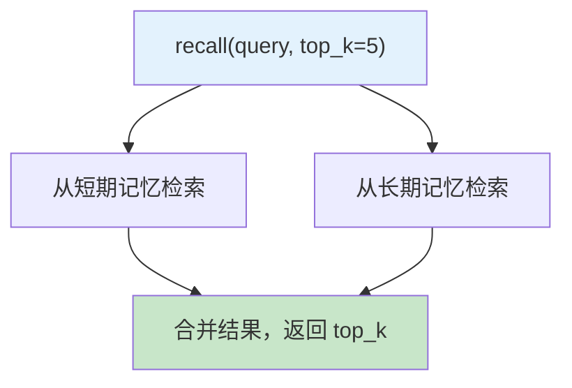
```mermaid
flowchart TD
    A["recall(query, top_k=5)"] --> B["从短期记忆检索"]
    A --> C["从长期记忆检索"]
    B --> D["合并结果，返回 top_k"]
    C --> D
    style A fill:#e3f2fd
    style D fill:#c8e6c9
```

---

## RAG（检索增强生成）

### 什么是 RAG？

RAG = **R**etrieval-**A**ugmented **G**eneration

将外部知识检索与 LLM 生成结合，使模型能够访问和利用私有知识。

### RAG 工作流程

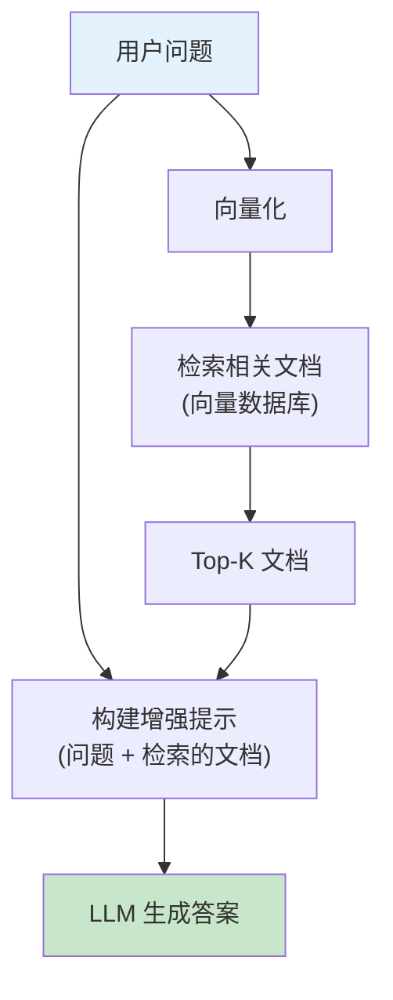
```mermaid
flowchart TD
    A["用户问题"] --> B["向量化"]
    B --> C["检索相关文档<br/>(向量数据库)"]
    C --> D["Top-K 文档"]
    A --> E["构建增强提示<br/>(问题 + 检索的文档)"]
    D --> E
    E --> F["LLM 生成答案"]
    style A fill:#e3f2fd
    style F fill:#c8e6c9
```


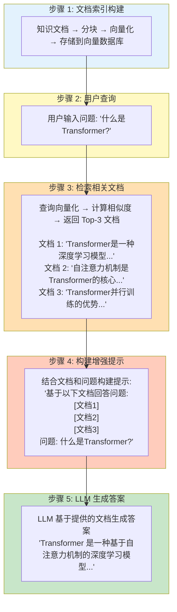
```mermaid
flowchart TB
    subgraph S1["步骤 1: 文档索引构建"]
        A1["知识文档 → 分块 → 向量化 → 存储到向量数据库"]
    end

    subgraph S2["步骤 2: 用户查询"]
        A2["用户输入问题: '什么是Transformer?'"]
    end

    subgraph S3["步骤 3: 检索相关文档"]
        A3["查询向量化 → 计算相似度 → 返回 Top-3 文档<br/><br/>文档 1: 'Transformer是一种深度学习模型...'<br/>文档 2: '自注意力机制是Transformer的核心...'<br/>文档 3: 'Transformer并行训练的优势...'"]
    end

    subgraph S4["步骤 4: 构建增强提示"]
        A4["结合文档和问题构建提示:<br/>'基于以下文档回答问题:<br/>[文档1]<br/>[文档2]<br/>[文档3]<br/>问题: 什么是Transformer?'"]
    end

    subgraph S5["步骤 5: LLM 生成答案"]
        A5["LLM 基于提供的文档生成答案<br/>'Transformer 是一种基于自注意力机制的深度学习模型...'"]
    end

    A1 --> A2 --> A3 --> A4 --> A5
    style S1 fill:#e3f2fd
    style S2 fill:#fff9c4
    style S3 fill:#ffe0b2
    style S4 fill:#ffccbc
    style S5 fill:#c8e6c9
```

### RAG 实现

```
RAG 系统结构:

class RAGSystem:
    初始化(llm_client, knowledge_base_path):
        self.llm = llm_client
        self.knowledge_base = LongTermMemory()
        加载知识库

    方法:

    query(question, top_k=3):
        """
        使用 RAG 回答问题
        """
        // 1. 检索相关文档
        relevant_docs = knowledge_base.search(question, top_k)

        // 2. 构建增强提示
        prompt = build_rag_prompt(question, relevant_docs)

        // 3. LLM 生成答案
        answer = llm.generate(prompt)

        return answer


    build_rag_prompt(question, docs):
        """
        构建 RAG 提示
        """
        context = 拼接所有文档内容

        prompt = """
        基于以下文档回答问题。

        文档:
        {context}

        问题: {question}

        请仅使用文档中的信息回答问题。
        如果文档中没有相关信息，请说明。
        """

        return prompt


    add_document(content, metadata):
        """添加文档到知识库"""
        knowledge_base.add(content, metadata)
```

### 游戏开发应用：世界知识库

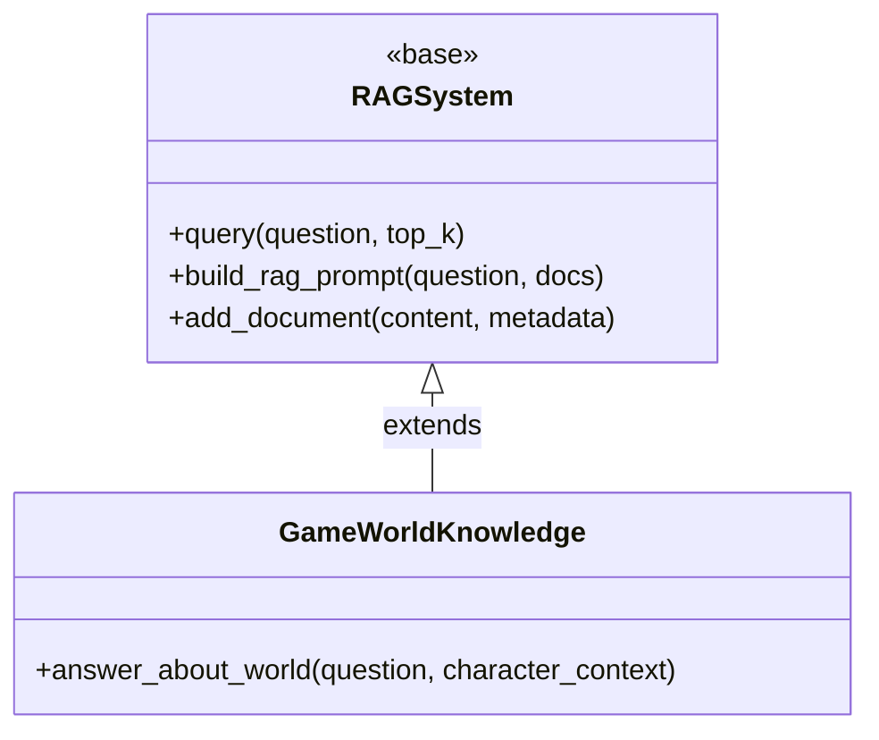
```mermaid
classDiagram
    class RAGSystem {
        <<base>>
        +query(question, top_k)
        +build_rag_prompt(question, docs)
        +add_document(content, metadata)
    }

    class GameWorldKnowledge {
        +answer_about_world(question, character_context)
    }

    RAGSystem <|-- GameWorldKnowledge : extends
```

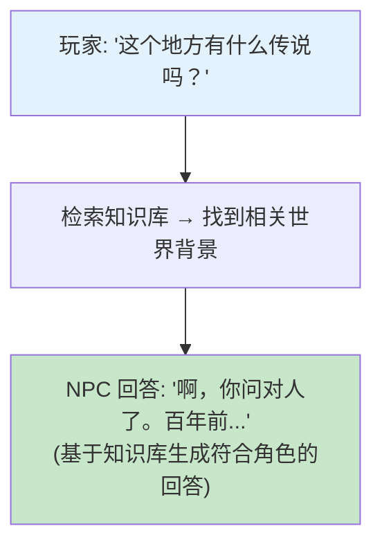
```mermaid
flowchart TD
    A["玩家: '这个地方有什么传说吗？'"] --> B["检索知识库 → 找到相关世界背景"]
    B --> C["NPC 回答: '啊，你问对人了。百年前...'<br/>(基于知识库生成符合角色的回答)"]
    style A fill:#e3f2fd
    style C fill:#c8e6c9
```


answer_about_world(question, character_context):

```python
# 1. 检索世界知识
world_knowledge = knowledge_base.search(question, top_k=2)

# 2. 构建提示
prompt = """
你是一个游戏角色。

角色背景: {character_context}

世界知识:
{format_knowledge(world_knowledge)}

问题: {question}

请基于世界知识，以角色的口吻回答问题。
"""

# 3. 生成回答
return llm.generate(prompt)
```

---

## 记忆的管理策略

### 1. 记忆重要性评分

```
记忆重要性评分算法:

calculate_importance(memory):

    score = 0.5  // 基础分数

    // 情感加权
    emotion_weights = {
        'surprised': +0.3,
        'fearful':   +0.3,
        'angry':     +0.25,
        'sad':      +0.2,
        'happy':    +0.15
    }
    score += emotion_weights[emotion]

    // 新奇性惩罚
    // 重复的内容重要性降低
    repetition_count = metadata.get('repetition', 0)
    score -= repetition_count * 0.1

    // 最近访问加权
    // 经常访问的更重要
    access_count = metadata.get('access_count', 0)
    score += min(access_count * 0.05, 0.3)

    return max(0, min(1, score))


示例:

记忆 1: "玩家第一次击败巨龙"
├── 情感: "excited" (+0.7)
├── 新奇性: 0 (首次)
├── 访问次数: 1 (+0.05)
└── 重要性: 0.5 + 0.7 + 0.05 = 0.85

记忆 2: "玩家第10次购买药水"
├── 情感: "neutral" (0)
├── 新奇性: 9 (-0.9)
├── 访问次数: 10 (+0.3)
└── 重要性: 0.5 + 0 - 0.9 + 0.3 = -0.1 → 0
```

### 2. 记忆衰减

```
记忆衰减模型:

apply_decay(memory, decay_rate=0.1):

    计算记忆年龄:
        age_hours = (当前时间 - memory.timestamp) / 3600

    指数衰减公式:
        decay_factor = e^(-decay_rate * age_hours / 24)
        // 每天衰减

    更新重要性:
        memory.importance *= decay_factor


衰减效果示例:

初始重要性: 1.0
decay_rate = 0.1

时间      衰减因子      重要性
─────────────────────────────────
0天       1.000        1.000
1天       0.905        0.905
7天       0.698        0.698
30天      0.286        0.286
90天      0.023        0.023
```

### 3. 记忆巩固

记忆巩固机制:

```python
consolidate_memories(short_term, long_term, threshold=0.7):

    for each memory in short_term:
        if memory.importance >= threshold:
            # 转移到长期记忆
            long_term.add(
                content: memory.content,
                metadata: {
                    ...memory.metadata,
                    original_timestamp: memory.timestamp,
                    consolidated_at: 当前时间
                }
            )
```


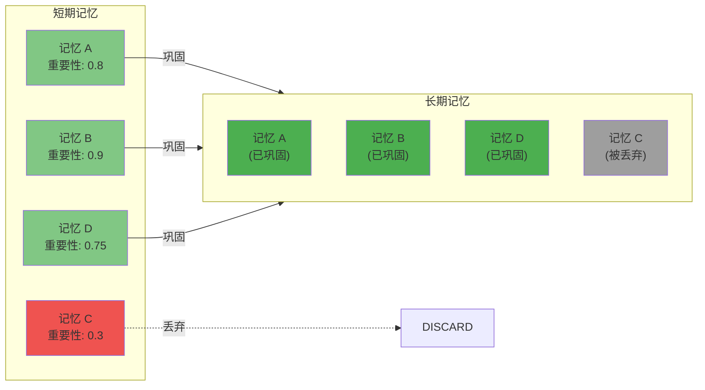
```mermaid
flowchart LR
    subgraph STM["短期记忆"]
        MA["记忆 A<br/>重要性: 0.8"]
        MB["记忆 B<br/>重要性: 0.9"]
        MC["记忆 C<br/>重要性: 0.3"]
        MD["记忆 D<br/>重要性: 0.75"]
    end

    MA -->|巩固| LTM
    MB -->|巩固| LTM
    MD -->|巩固| LTM
    MC -.->|丢弃| DISCARD

    subgraph LTM["长期记忆"]
        LMA["记忆 A<br/>(已巩固)"]
        LMB["记忆 B<br/>(已巩固)"]
        LMD["记忆 D<br/>(已巩固)"]
        LMC["记忆 C<br/>(被丢弃)"]
    end

    style MA fill:#81c784
    style MB fill:#81c784
    style MD fill:#81c784
    style MC fill:#ef5350
    style LMA fill:#4caf50
    style LMB fill:#4caf50
    style LMD fill:#4caf50
    style LMC fill:#9e9e9e
```

---

## 练习作业

### 基础练习
1. 实现一个简单的短期记忆系统
2. 实现关键词搜索功能
3. 实现记忆重要性评分

### 进阶练习
4. 集成向量数据库（ChromaDB/Pinecone）
5. 实现 RAG 系统
6. 为 NPC 实现对话记忆

### 挑战练习
7. 实现完整的记忆系统（短期+长期）
8. 实现记忆衰减和巩固机制
9. 构建游戏世界知识库

## 下一步

完成本章后，进入：
- [第9章：上下文工程](../ch09-context/) - 学习如何管理对话上下文
