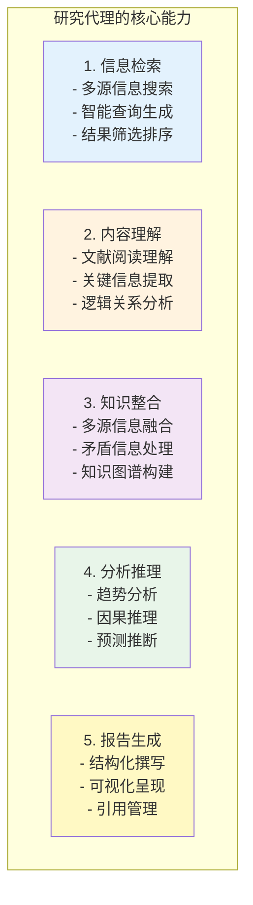
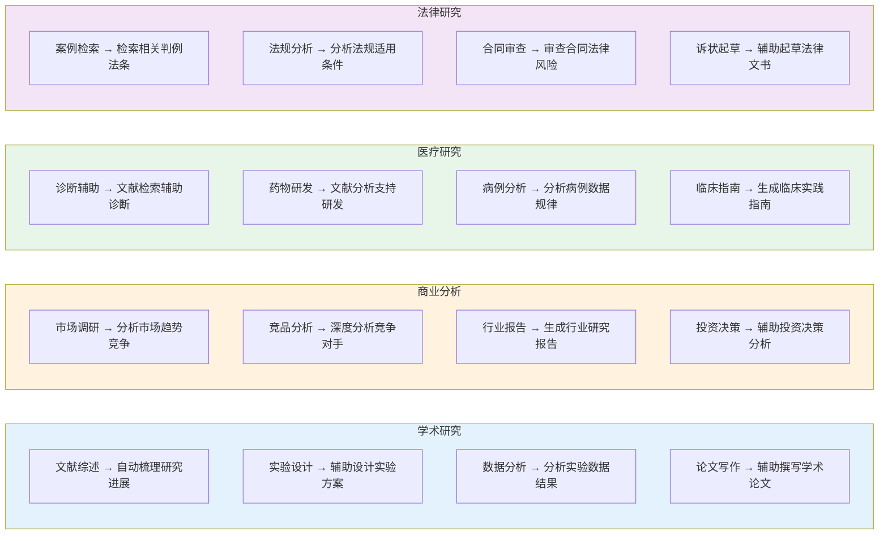
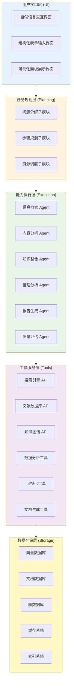
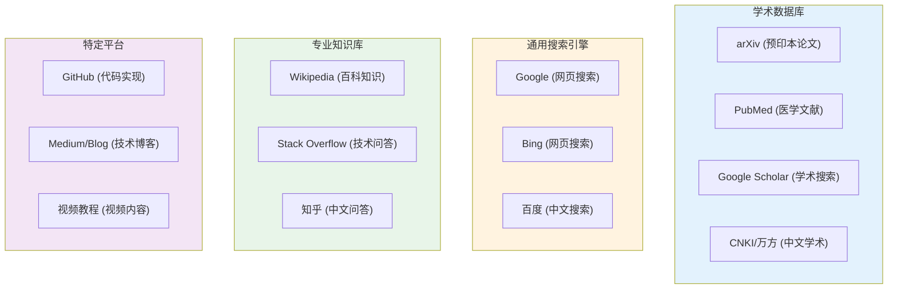
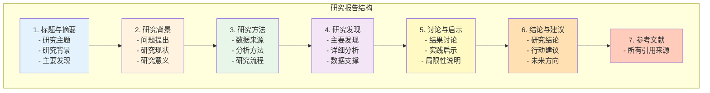
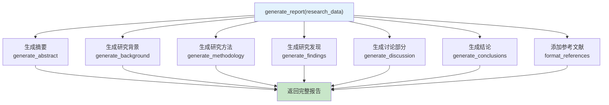
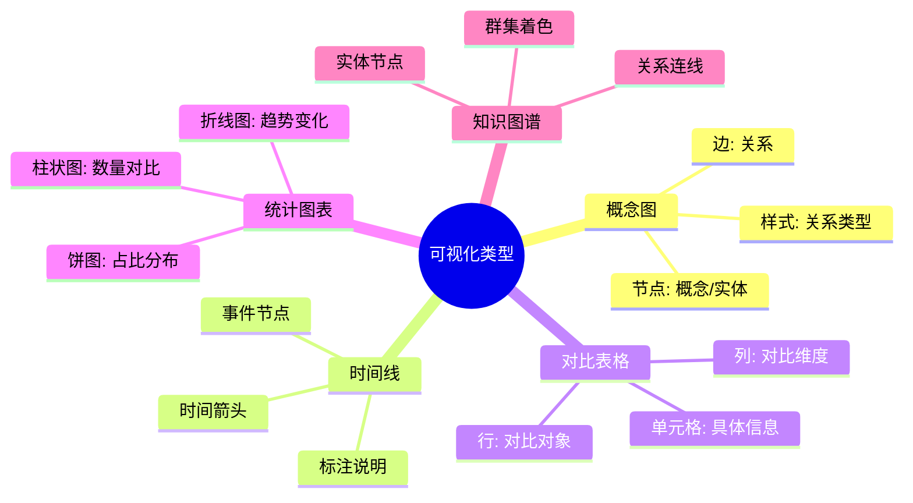
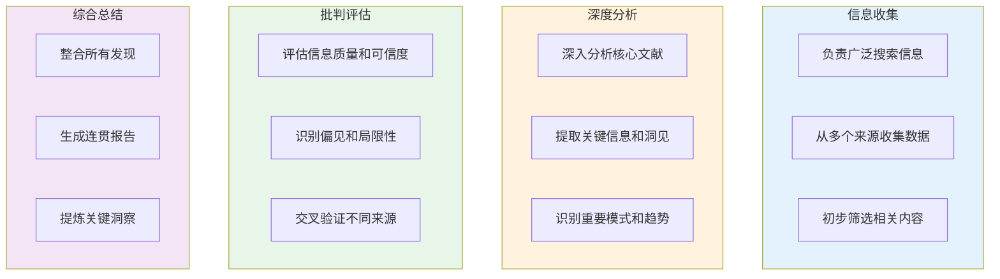
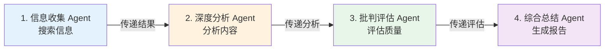
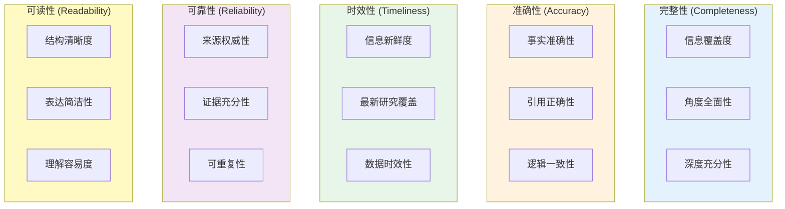

# 第14章：研究代理

## 章节概述

本章将深入探讨研究代理（Research Agent）的设计与实现。研究代理是 Agent 技术在知识密集型场景的重要应用，能够自主进行信息检索、文献分析、知识整合等研究工作。

## 学习目标

- 理解研究代理的核心能力
- 掌握信息检索与整合技术
- 学习多源数据分析方法
- 实现自动研究工作流
- 构建领域研究助手

---

## 什么是研究代理？

### 定义

研究代理是指能够自主或半自主地执行研究任务的智能体系统，包括：



### 应用场景



---

## 系统架构

### 整体架构



---

## 核心模块设计

### 1. 信息检索模块

#### 智能查询生成

```
QueryGenerator 查询生成器:

generate_research_queries(research_topic):

    输入: research_topic (研究主题)

    1. 分析研究主题
       ├── 提取核心概念
       ├── 识别关键术语
       └── 确定研究领域

    2. 生成查询变体
       ├── 同义词扩展
       │   例如: "machine learning" → "ML", "机器学习"
       ├── 相关概念扩展
       │   例如: "深度学习" → "神经网络", "DL"
       └── 不同粒度查询
           ├── 宽泛查询: 获取背景信息
           └── 精确查询: 获取具体细节

    3. 构建查询策略
       ├── 初始探索查询
       │   · 广泛覆盖主题
       │   · 识别关键子主题
       ├── 深度挖掘查询
       │   · 针对子主题深入
       │   · 查找最新研究
       └── 验证查询
           · 查找支持证据
           · 交叉验证信息

    4. 输出查询列表
       return queries


伪代码示例:

function generate_queries(topic):
    # 提取关键概念
    keywords = extract_keywords(topic)
    entities = extract_entities(topic)

    # 扩展查询词
    expanded_terms = []
    for keyword in keywords:
        expanded_terms.extend([
            keyword,
            get_synonyms(keyword),
            get_related_terms(keyword)
        ])

    # 生成查询组合
    queries = []
    for combination in combine_terms(expanded_terms, size=2..4):
        queries.append(build_search_query(combination))

    # 添加领域特定查询
    domain_queries = generate_domain_queries(topic, entities)
    queries.extend(domain_queries)

    return rank_queries(queries)
```

#### 多源检索策略




retrieve_from_multiple_sources(query):

```python
# 检索流程:

# 1. 并行检索
for source in sources:
    async_call(source.search, query)

# 2. 结果合并
results = merge_results(all_source_results)

# 3. 去重
results = deduplicate_by_url(results)

# 4. 质量评分
for result in results:
    score = calculate_quality_score(result)
    # - 来源权威性
    # - 内容相关性
    # - 发布时间
    # - 引用数量

# 5. 排序返回
return sort_by_score(results)
```

### 2. 内容分析模块

#### 文献理解

```
DocumentAnalyzer 文档分析器:

analyze_document(document):

    1. 文档解析
       ├── 提取文本内容
       ├── 识别文档结构
       │   ├── 标题层级
       │   ├── 段落划分
       │   └── 图表标注
       └── 提取元数据
           ├── 作者信息
           ├── 发布时间
           └── 引用文献

    2. 内容理解
       ├── 关键信息提取
       │   ├── 研究问题
       │   ├── 研究方法
       │   ├── 主要发现
       │   └── 结论观点
       ├── 逻辑结构分析
       │   ├── 论证链条
       │   ├── 因果关系
       │   └── 证据支持
       └── 知识点识别
           ├── 概念定义
           ├── 原理说明
           └── 技术细节

    3. 信息抽取
       structured_info = {
           title: extract_title(document),
           authors: extract_authors(document),
           abstract: summarize_abstract(document),
           key_points: extract_key_points(document),
           methodology: extract_methodology(document),
           results: extract_results(document),
           conclusions: extract_conclusions(document)
       }

    4. 生成摘要
       summary = generate_summary(structured_info)

    return structured_info, summary


信息抽取伪代码:

function extract_research_info(document):
    # 分段处理
    sections = split_into_sections(document)

    info = {}

    # 提取各部分信息
    info['background'] = extract_section(sections, 'Introduction')
    info['methodology'] = extract_method(sections, 'Methods')
    info['results'] = extract_results(sections, 'Results')

    # 提取关键声明
    info['claims'] = extract_claims(document)

    # 提取数据支撑
    info['evidence'] = extract_evidence(document)

    return info
```

#### 多文档对比

```
MultiDocComparator 多文档对比器:

compare_documents(documents):

    1. 提取关键信息
       for doc in documents:
           key_info.append(extract_key_info(doc))

    2. 识别共同主题
       common_themes = find_common_themes(key_info)

    3. 对比分析
       for theme in common_themes:
           comparison[theme] = {
               'agreements': find_agreements(documents, theme),
               'differences': find_differences(documents, theme),
               'gaps': find_knowledge_gaps(documents, theme)
           }

    4. 生成对比报告
       return generate_comparison_report(comparison)


对比分析伪代码:

function compare_documents(docs):
    # 提取所有文档的观点
    all_claims = []
    for doc in docs:
        claims = extract_claims(doc)
        all_claims.extend(claims)

    # 按主题分组
    themed_claims = group_by_topic(all_claims)

    # 对比分析
    comparison = {}
    for topic, claims in themed_claims:
        comparison[topic] = {
            'supporting': count_supporting(claims),
            'opposing': count_opposing(claims),
            'neutral': count_neutral(claims),
            'consensus': check_consensus(claims)
        }

    return comparison
```

### 3. 知识整合模块

#### 信息融合

```
KnowledgeIntegrator 知识整合器:

integrate_knowledge(sources):

    1. 实体识别与对齐
       entities = []
       for source in sources:
           entities.extend(extract_entities(source))

       # 实体对齐 - 识别同一实体的不同表述
       aligned_entities = align_entities(entities)
       ├── 同义词合并
       ├── 别名识别
       └── 翻译对齐

    2. 关系提取
       relations = []
       for source in sources:
           relations.extend(extract_relations(source))

       # 关系分类
       classified_relations = classify_relations(relations)
       ├── 因果关系
       ├── 相关关系
       ├── 包含关系
       └── 对比关系

    3. 矛盾检测
       contradictions = detect_contradictions(sources)
       ├── 直接矛盾 (相反的陈述)
       ├── 间接矛盾 (不一致的数据)
       └── 时序矛盾 (时间上的冲突)

       if contradictions found:
           # 尝试解决矛盾
           resolution = resolve_contradictions(contradictions)
           ├── 权威性判断
           ├── 时效性判断
           └── 证据强度比较

    4. 知识图谱构建
       knowledge_graph = build_graph(
           entities=aligned_entities,
           relations=classified_relations
       )

    5. 生成整合报告
       return generate_integrated_report(knowledge_graph)


知识整合伪代码:

function integrate_knowledge(sources):
    # 创建统一的知识表示
    unified_kb = KnowledgeBase()

    # 添加实体
    for source in sources:
        entities = extract_entities(source)
        for entity in entities:
            unified_kb.add_entity(entity)

    # 添加关系
    for source in sources:
        relations = extract_relations(source)
        for relation in relations:
            unified_kb.add_relation(relation)

    # 处理冲突
    conflicts = detect_conflicts(unified_kb)
    for conflict in conflicts:
        resolution = resolve_conflict(conflict, sources)
        unified_kb.apply_resolution(resolution)

    return unified_kb
```

#### 知识推理

```
KnowledgeReasoner 知识推理器:

reason(knowledge_graph, query):

    1. 查询解析
       parsed_query = parse_query(query)
       ├── 识别问题类型
       │   ├── 事实查询 (What/Who/Where)
       │   ├── 因果查询 (Why/How)
       │   └── 预测查询 (What if)
       └── 提取关键实体

    2. 路径查找
       paths = find_paths_in_graph(
           knowledge_graph,
           start=parsed_query.entities[0],
           end=parsed_query.target
       )

    3. 推理链构建
       for path in paths:
           reasoning_chains.append(build_reasoning_chain(path))

    4. 证据收集
       for chain in reasoning_chains:
           evidence = collect_evidence(
               knowledge_graph,
               chain
           )

    5. 结论生成
       conclusions = []
       for chain in reasoning_chains:
           conclusion = generate_conclusion(
               chain=chain,
               evidence=evidence,
               confidence=calculate_confidence(evidence)
           )
           conclusions.append(conclusion)

    6. 返回结果
       return rank_by_confidence(conclusions)
```

### 4. 报告生成模块

#### 结构化撰写




generate_report(research_data):

```python
# 生成流程:

# 1. 组织内容
sections = organize_content(research_data)

# 2. 生成各章节
for section in sections:
    content = generate_section(section, research_data)

# 3. 添加引用
report = add_citations(content, research_data.sources)

# 4. 格式化
formatted_report = format_report(report)

return formatted_report
```




#### 可视化




可视化伪代码:

```python
function create_knowledge_graph(kg):
    # 创建图形
    graph = Graph()

    # 添加节点
    for entity in kg.entities:
        node = create_node(entity)
        style_node_by_type(node, entity.type)
        graph.add_node(node)

    # 添加边
    for relation in kg.relations:
        edge = create_edge(relation)
        style_edge_by_type(edge, relation.type)
        graph.add_edge(edge)

    # 应用布局算法
    layout = apply_force_directed_layout(graph)

    # 渲染
    return render_graph(graph, layout)
```

---

## 实现步骤

### 第一步：基础框架（1-2天）

```
基础框架任务:

□ 搭建项目结构
  ├── 创建模块目录
  ├── 配置开发环境
  └── 设置依赖管理

□ 实现工具接口
  ├── 搜索引擎API封装
  ├── 文献数据库接口
  └── 基础工具函数

□ 实现数据模型
  ├── 查询模型
  ├── 文档模型
  └── 结果模型
```

### 第二步：信息检索（2-3天）

```
信息检索任务:

□ 实现查询生成
  ├── 关键词提取
  ├── 查询扩展
  └── 查询优化

□ 实现多源检索
  ├── API集成
  ├── 结果合并
  └── 去重排序

□ 实现智能筛选
  ├── 相关性评分
  ├── 质量评估
  └── 结果过滤
```

### 第三步：内容分析（3-4天）

```
内容分析任务:

□ 实现文档解析
  ├── PDF解析
  ├── 网页解析
  └── 结构提取

□ 实现信息提取
  ├── 关键信息抽取
  ├── 实体关系识别
  └── 观点提取

□ 实现深度分析
  ├── 主题分析
  ├── 情感分析
  └── 对比分析
```

### 第四步：知识整合（2-3天）

```
知识整合任务:

□ 实现实体对齐
  ├── 实体识别
  ├── 实体链接
  └── 知识融合

□ 实现关系提取
  ├── 关系识别
  ├── 关系分类
  └── 关系验证

□ 构建知识图谱
  ├── 图谱存储
  ├── 图谱查询
  └── 图谱推理
```

### 第五步：报告生成（2-3天）

```
报告生成任务:

□ 实现内容生成
  ├── 章节生成
  ├── 段落生成
  └── 引用管理

□ 实现可视化
  ├── 图表生成
  ├── 知识图谱渲染
  └── 交互界面

□ 实现质量控制
  ├── 内容校验
  ├── 一致性检查
  └── 格式规范
```

### 第六步：优化完善（2-3天）

```
优化任务:

□ 性能优化
  ├── 缓存机制
  ├── 并发处理
  └── 批量操作

□ 质量优化
  ├── 准确性提升
  ├── 完整性改进
  └── 可读性优化

□ 用户体验
  ├── 交互优化
  ├── 反馈机制
  └── 帮助文档
```

---

## 高级功能

### 1. 自适应研究策略

```
AdaptiveResearcher 自适应研究器:

adapt_strategy(research_progress):

    1. 监控研究进度
       progress_metrics = {
           'coverage': calculate_coverage(),
           'depth': calculate_depth(),
           'quality': calculate_quality()
       }

    2. 识别问题
       if progress_metrics['coverage'] < threshold:
           # 覆盖不足，需要扩大搜索范围
           strategy.expand_search_scope()

       if progress_metrics['depth'] < threshold:
           # 深度不够，需要深入挖掘
           strategy.deepen_analysis()

       if progress_metrics['quality'] < threshold:
           # 质量不佳，需要优化筛选
           strategy.improve_filtering()

    3. 调整策略
       updated_strategy = adjust_based_on_feedback(
           current_strategy,
           research_progress.feedback
       )

    return updated_strategy
```

### 2. 迭代深化研究

```
IterativeResearcher 迭代研究器:

iterative_research(initial_query):

    results = []
    current_query = initial_query
    depth = 0
    max_depth = 3

    while depth < max_depth:
        # 执行研究
        research_result = conduct_research(current_query)

        # 识别知识缺口
        gaps = identify_knowledge_gaps(research_result)

        # 如果没有缺口，结束
        if not gaps:
            break

        # 生成深化查询
        current_query = generate_deepening_query(gaps)

        # 继续研究
        results.append(research_result)
        depth += 1

    # 整合所有迭代结果
    return integrate_results(results)
```

### 3. 多智能体协作






---

## 技术栈建议

### 核心技术

```
技术栈选择:

LLM:
    · GPT-4 (复杂分析任务)
    · Claude (长文本处理)
    · 开源模型 (降低成本)

框架:
    · LangChain (Agent框架)
    · LlamaIndex (数据框架)
    · Haystack (搜索框架)

数据库:
    · ChromaDB (向量存储)
    · Elasticsearch (全文搜索)
    · Neo4j (知识图谱)
    · MongoDB (文档存储)

工具:
    · BeautifulSoup (网页解析)
    · PyPDF2 (PDF解析)
    · spaCy (NLP处理)
    · NetworkX (图分析)
```

### API 服务

```
外部API:

学术搜索:
    · Semantic Scholar API
    · arXiv API
    · PubMed API
    · Google Scholar (需爬虫)

通用搜索:
    · Google Custom Search API
    · Bing Search API
    · SerpAPI

知识库:
    · Wikipedia API
    · DBpedia API
    · Wikidata API

文档处理:
    · CloudConvert API
    · Adobe PDF Services API
```

---

## 案例演示

### 案例：学术文献综述助手

```
研究主题: "大语言模型在医疗诊断中的应用"

研究流程:

第1步: 问题定义
┌────────────────────────────────────────────────────┐
│  研究问题:                                         │
│  1. LLM在医疗诊断中有哪些应用场景?                  │
│  2. 这些应用的准确性和可靠性如何?                  │
│  3. 目前面临的主要挑战是什么?                      │
│  4. 未来的发展方向是什么?                          │
└────────────────────────────────────────────────────┘

第2步: 信息收集
┌────────────────────────────────────────────────────┐
│  查询生成:                                         │
│  · "large language model medical diagnosis"        │
│  · "LLM clinical decision support"                │
│  · "ChatGPT healthcare applications"              │
│  · "大语言模型 医疗诊断"                           │
│                                                     │
│  数据源:                                           │
│  · PubMed (医学文献)                              │
│  · arXiv (预印本)                                 │
│  · Google Scholar (学术搜索)                      │
│  · 医学期刊网站                                   │
└────────────────────────────────────────────────────┘

第3步: 内容分析
┌────────────────────────────────────────────────────┐
│  分析维度:                                         │
│  ├── 应用场景分类                                  │
│  │   ├── 症状分析                                  │
│  │   ├── 影像诊断                                  │
│  │   ├── 病理分析                                  │
│  │   └── 临床决策支持                              │
│  ├── 性能评估                                      │
│  │   ├── 准确性指标                                │
│  │   ├── 与专家对比                                │
│  │   └── 局限性分析                                │
│  └── 挑战与问题                                    │
│      ├── 幻觉问题                                  │
│      ├── 数据隐私                                  │
│      └── 监管合规                                  │
└────────────────────────────────────────────────────┘

第4步: 知识整合
┌────────────────────────────────────────────────────┐
│  整合内容:                                         │
│  1. 应用现状                                       │
│     · 已成功应用的领域                             │
│     · 正在研究的方向                               │
│  2. 性能分析                                       │
│     · 准确性范围                                   │
│     · 与人类专家对比                               │
│  3. 关键挑战                                       │
│     · 技术挑战                                     │
│     · 伦理挑战                                     │
│     · 实践挑战                                     │
│  4. 发展趋势                                       │
│     · 技术改进方向                                 │
│     · 应用拓展方向                                 │
└────────────────────────────────────────────────────┘

第5步: 报告生成
┌────────────────────────────────────────────────────┐
│  报告结构:                                         │
│  1. 执行摘要                                       │
│  2. 引言 (研究背景与目的)                          │
│  3. 研究方法                                       │
│  4. 主要发现                                       │
│  5. 应用场景分析                                   │
│  6. 性能评估                                       │
│  7. 挑战与局限                                     │
│  8. 未来展望                                       │
│  9. 结论与建议                                     │
│  10. 参考文献                                      │
└────────────────────────────────────────────────────┘
```

---

## 质量控制

### 评估指标



### 验证方法

```
质量验证流程:

1. 自动验证
   ├── 事实核查
   │   └── 对比多个来源
   ├── 引用验证
   │   └── 检查引用准确性
   ├── 一致性检查
   │   └── 检测矛盾信息
   └── 格式检查
       └── 验证格式规范

2. 人工审核
   ├── 专家审核
   │   └── 领域专家评估
   ├── 同行评审
   │   └── 交叉验证结果
   └── 用户反馈
       └── 收集改进意见

3. 迭代改进
   ├── 分析质量问题
   ├── 优化流程
   └── 更新模型
```

---

## 最佳实践

### 1. 提示词设计

```
研究提示词模板:

角色设定:
"""
你是一位专业的研究助理，擅长信息检索、文献分析和知识整合。
你的任务是帮助用户完成深入的研究工作。
"""

任务描述:
"""
根据用户提出的研究主题，你需要:
1. 生成多个相关的研究查询
2. 从多个来源收集信息
3. 分析和整合信息
4. 生成结构化的研究报告
"""

输出要求:
"""
研究报告应该:
- 结构清晰，逻辑连贯
- 引用准确，标注明确
- 分析深入，见解独到
- 语言简洁，易于理解
"""

质量控制:
"""
确保:
- 信息来自可靠来源
- 引用准确无误
- 结论有据可依
- 观点客观中立
"""
```

### 2. 来源选择

```
来源优先级:

学术来源 (最高优先级):
├── 同行评审期刊
├── 会议论文
└── 学术机构报告

专业来源 (高优先级):
├── 行业权威网站
├── 专业协会发布
└── 专家观点

新闻来源 (中优先级):
├── 主流新闻媒体
├── 专业新闻网站
└── 通讯社报道

其他来源 (低优先级):
├── 博客文章
├── 社交媒体
└── 用户评论
```

### 3. 引用规范

```
引用格式要求:

学术论文:
"""
作者. (年份). 标题. 期刊名称, 卷号(期号), 页码.
例如: Smith, J. (2023). Large Language Models in Healthcare.
       New England Journal of Medicine, 389(12), 1123-1135.
"""

网页内容:
"""
作者. (发布日期). 标题. 网站名称. URL
例如: Johnson, M. (2024, Jan 15). AI in Medicine.
       TechHealth Daily. https://example.com/article
"""

工具提示:
"""
确保每个重要声明都有引用支持
同一个来源不要过度引用
优先引用权威和最新的来源
"""
```

---

## 常见问题

### 技术问题

```
Q1: 如何提高信息检索的准确性?

优化方法:
· 使用更精确的查询词
· 添加布尔运算符 (AND, OR, NOT)
· 使用特定领域的数据库
· 调整时间范围筛选
· 手动评估和调整结果


Q2: 如何处理矛盾的信息?

处理策略:
· 检查来源的权威性和时效性
· 查看更多来源进行验证
· 分析矛盾产生的原因
· 在报告中标注存在争议
· 给出综合性的判断


Q3: 如何避免信息遗漏?

预防措施:
· 使用多个数据源
· 生成多样化的查询
· 进行多轮迭代搜索
· 检查相关文献的引用
· 请求领域专家验证
```

---

## 扩展方向

### 1. 领域专业化

```
垂直领域研究助手:

医学研究助手:
├── 医学文献数据库集成
├── 临床指南分析
├── 药物信息检索
└── 病例数据分析

法律研究助手:
├── 法规数据库集成
├── 判例检索分析
├── 合同条款审查
└── 法律文书生成

金融研究助手:
├── 财报数据分析
├── 市场趋势研究
├── 行业报告生成
└── 投资决策支持
```

### 2. 实时研究

```
实时监控研究系统:

功能:
├── 实时信息抓取
├── 动态知识更新
├── 自动趋势识别
└── 预警通知

应用场景:
├── 竞品动态监控
├── 行业趋势追踪
├── 新闻事件分析
└── 社交媒体监测
```

### 3. 协作研究

```
团队研究平台:

协作功能:
├── 多用户共享研究
├── 实时协作编辑
├── 知识库共建
└── 评论反馈系统

版本管理:
├── 研究历史记录
├── 版本对比
├── 回滚恢复
└── 权限管理
```

---

## 学习资源

### 经典论文

- "Retrieval-Augmented Generation for Knowledge-Intensive NLP Tasks"
- "Chain-of-Thought Prompting Elicits Reasoning in Large Language Models"
- "ReAct: Synergizing Reasoning and Acting in Language Models"

### 推荐工具

- **Perplexity AI**: 智能搜索引擎
- **Elicit**: 学术研究助手
- **Consensus**: 科学论文搜索引擎
- **Semantic Scholar**: 学术文献分析
- **Connected Papers**: 文献关联分析

### 开源项目

- LangChain Research Agent
- GPT Researcher
- AutoGPT (研究模式)
- BabyAGI (任务驱动)

---

## 练习作业

### 基础作业

1. 实现一个简单的文献检索系统
2. 实现文档内容摘要功能
3. 构建基础的知识图谱

### 进阶作业

4. 实现多源信息整合
5. 构建自动报告生成系统
6. 添加可视化功能

### 挑战作业

7. 实现领域专业化研究助手
8. 构建实时研究监控系统
9. 开发协作研究平台

---

## 学习检查

完成本章后，你应该能够：

- [ ] 理解研究代理的核心架构
- [ ] 实现信息检索与筛选
- [ ] 进行文档内容分析
- [ ] 构建知识整合系统
- [ ] 生成结构化研究报告
- [ ] 评估研究质量

进入：[第15章：赛博小镇游戏](../ch15-cyber-town-game/) - 构建多智能体社会模拟系统！
