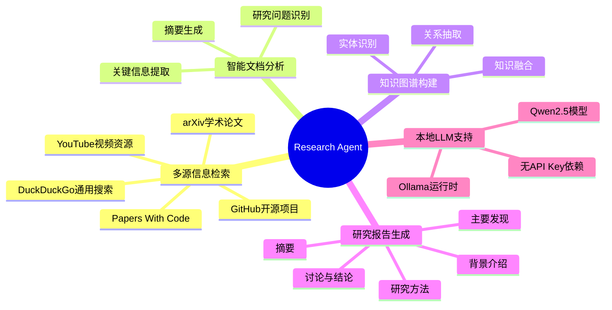
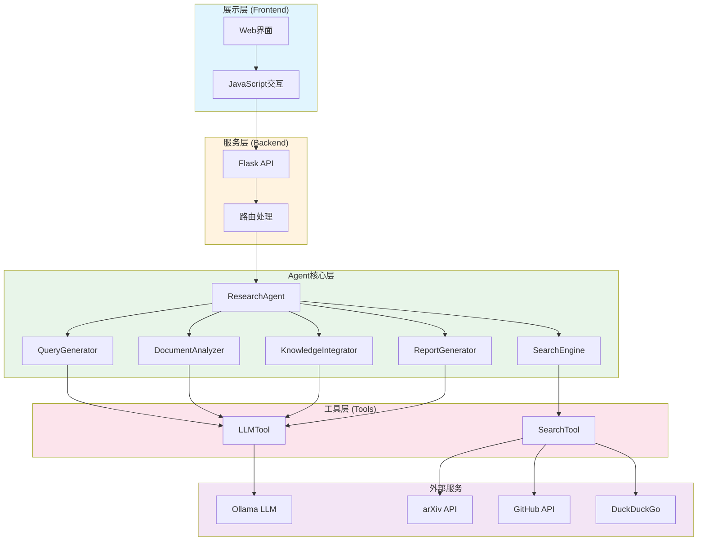
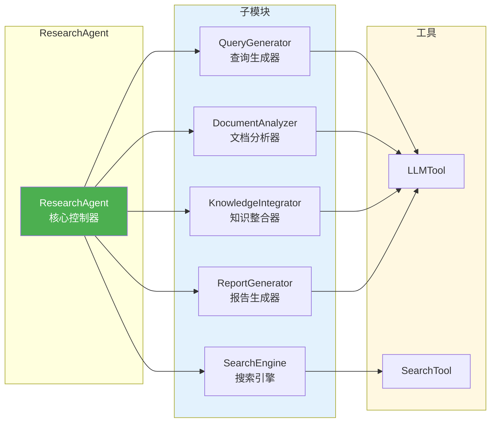
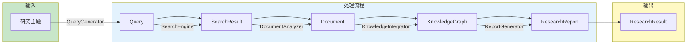
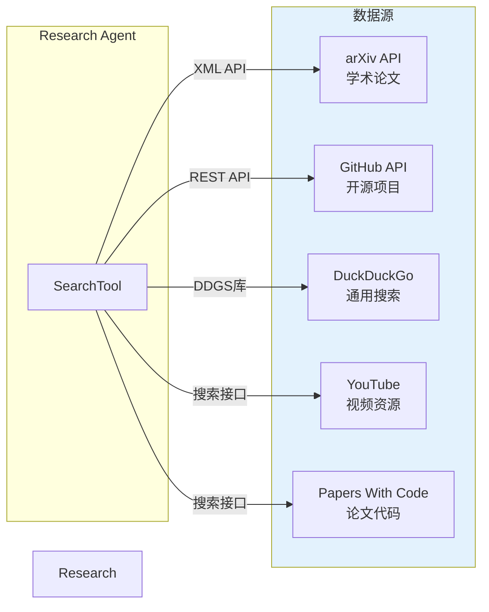
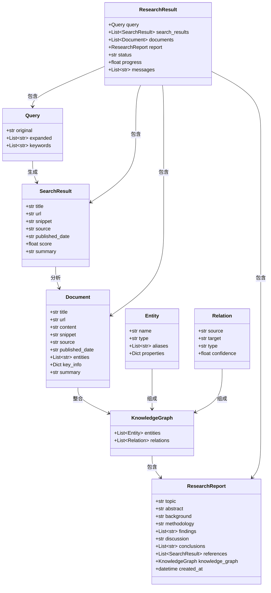
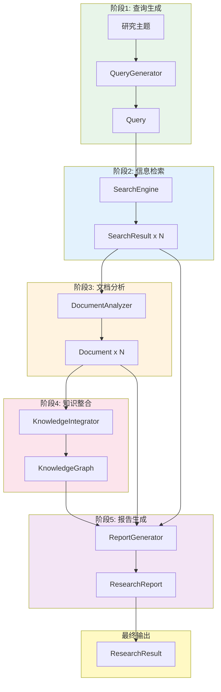
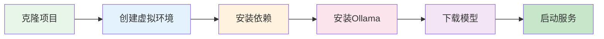
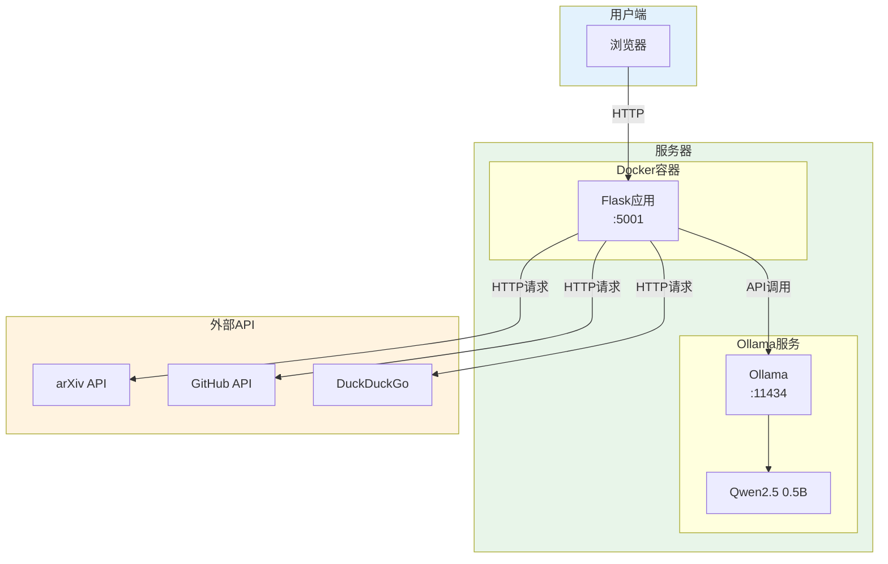
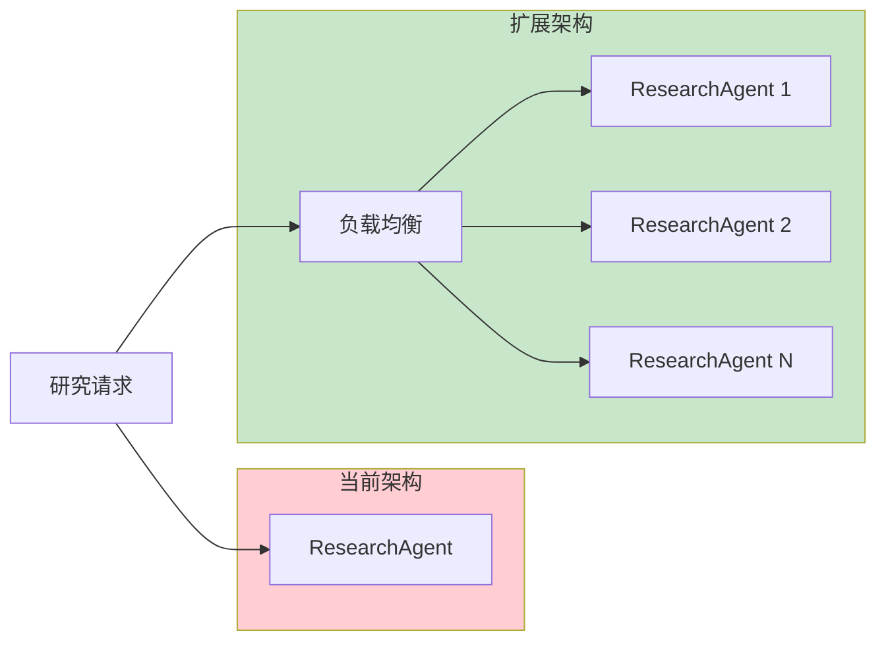

# Research Agent 方案架构文档

> **文档版本**: v1.0
> **最后更新**: 2024年
> **目标读者**: 架构师、项目经理、技术决策者
> **相关文档**: [实现说明文档](./02-implementation.md) | [技术原理文档](./03-technical-principles.md)

---

## 目录

- [第1章：项目概述](#第1章项目概述)
- [第2章：系统架构设计](#第2章系统架构设计)
- [第3章：技术选型](#第3章技术选型)
- [第4章：数据模型设计](#第4章数据模型设计)
- [第5章：部署架构](#第5章部署架构)
- [第6章：扩展性设计](#第6章扩展性设计)

---

## 第1章：项目概述

### 1.1 项目背景与目标

#### 研究自动化的需求背景

在当今信息爆炸的时代，研究人员面临着严峻的挑战：
- **信息过载**：arXiv每天发布数百篇新论文，GitHub上有数百万开源项目
- **知识碎片化**：研究资料分散在不同平台，整合成本高
- **时间紧迫**：传统文献调研可能需要数周甚至数月

#### Agent技术在研究领域的应用价值

AI Agent技术为解决上述问题提供了新思路：
- **自主性**：Agent能够自主规划、执行和反思研究任务
- **多源整合**：自动聚合arXiv、GitHub、DuckDuckGo、YouTube、Papers With Code等多源数据
- **智能分析**：利用LLM进行深度信息提取和知识推理

#### 项目目标

构建一个**端到端智能研究助手**，实现：
1. 输入一个研究主题
2. 自动进行多源信息检索
3. 智能分析文档并提取关键信息
4. 构建知识图谱
5. 生成结构化研究报告

### 1.2 核心功能特性



#### 功能特性矩阵

| 功能模块 | 输入 | 输出 | 技术手段 |
|---------|------|------|---------|
| 查询生成 | 研究主题 | 优化查询列表 | 关键词提取+查询扩展 |
| 多源搜索 | 查询列表 | 搜索结果列表 | arXiv/GitHub/DuckDuckGo API |
| 文档分析 | 搜索结果 | 结构化文档 | LLM信息提取 |
| 知识整合 | 文档列表 | 知识图谱 | 实体识别+关系抽取 |
| 报告生成 | 文档+知识图谱 | 研究报告 | LLM内容生成 |

### 1.3 技术亮点

1. **完整的Agent模式**
   - 规划（Planning）：查询生成、搜索策略设计
   - 执行（Execution）：信息检索、文档分析、知识整合
   - 反思（Reflection）：报告生成、质量评估

2. **本地LLM支持**
   - 基于Ollama运行时
   - 默认使用Qwen2.5 0.5B模型
   - 完全本地化，无需API Key

3. **智能降级策略**
   - LLM不可用时自动切换到模板生成
   - 保证系统在资源受限环境下的可用性

4. **前后端分离架构**
   - 后端：Flask + Python
   - 前端：原生HTML/CSS/JavaScript
   - RESTful API通信

---

## 第2章：系统架构设计

### 2.1 整体架构

Research Agent采用分层架构设计，从上到下分为五层：



#### 各层职责说明

| 层次 | 组件 | 职责 |
|-----|------|-----|
| 展示层 | Frontend | 用户交互、进度展示、结果渲染 |
| 服务层 | Flask API | 路由分发、请求处理、响应封装 |
| Agent层 | 各Agent模块 | 核心业务逻辑、工作流编排 |
| 工具层 | LLMTool, SearchTool | 底层能力封装、API调用 |
| 外部服务 | Ollama, arXiv等 | 第三方服务、数据源 |

### 2.2 核心模块划分



#### 模块职责详解

| 模块 | 文件位置 | 核心职责 |
|-----|---------|---------|
| **ResearchAgent** | `backend/agents/research_agent.py` | 协调各子模块，实现完整研究流程 |
| **QueryGenerator** | `backend/agents/query_generator.py` | 将研究主题转换为优化的搜索查询 |
| **SearchEngine** | `backend/agents/search_engine.py` | 管理多源搜索策略和结果排序 |
| **DocumentAnalyzer** | `backend/agents/document_analyzer.py` | 分析文档，提取关键信息 |
| **KnowledgeIntegrator** | `backend/agents/knowledge_integrator.py` | 构建知识图谱 |
| **ReportGenerator** | `backend/agents/report_generator.py` | 生成结构化研究报告 |

### 2.3 数据流设计

Research Agent的核心数据流遵循"查询→搜索→分析→整合→报告"五步流程：



#### 核心工作流代码

```python
# backend/agents/research_agent.py:22-61
def research(self, topic: str, progress_callback: Callable[[str, float], None] = None) -> ResearchResult:
    result = ResearchResult(
        query=self.query_generator.generate(topic),
        status="running"
    )

    try:
        # 步骤1: 生成查询
        progress_callback("正在生成查询...", 10)
        result.messages.append(f"生成查询: {result.query.original}")

        # 步骤2: 搜索信息
        progress_callback("正在搜索信息...", 30)
        result.search_results = self.search_engine.search(result.query)
        result.messages.append(f"找到 {len(result.search_results)} 条搜索结果")

        # 步骤3: 分析文档
        progress_callback("正在分析文档...", 50)
        result.documents = self.document_analyzer.analyze(result.search_results)
        result.messages.append(f"分析了 {len(result.documents)} 篇文档")

        # 步骤4: 整合知识
        progress_callback("正在整合知识...", 70)
        kg = self.knowledge_integrator.integrate(result.documents)
        result.messages.append(f"提取了 {len(kg.entities)} 个实体, {len(kg.relations)} 个关系")

        # 步骤5: 生成报告
        progress_callback("正在生成报告...", 90)
        result.report = self.report_generator.generate(
            topic=topic,
            documents=result.documents,
            search_results=result.search_results,
            knowledge_graph=kg
        )
        result.messages.append("研究报告生成完成")

        result.status = "completed"
        progress_callback("研究完成!", 100)

    except Exception as e:
        result.status = "failed"
        result.messages.append(f"错误: {str(e)}")

    return result
```

---

## 第3章：技术选型

### 3.1 后端技术栈

| 技术 | 版本 | 用途 | 选择理由 |
|-----|------|-----|---------|
| **Python** | 3.8+ | 开发语言 | 丰富的AI/ML生态、开发效率高 |
| **Flask** | 2.x | Web框架 | 轻量级、灵活、易于扩展 |
| **Ollama** | Latest | LLM运行时 | 本地化部署、无需API Key |
| **Qwen2.5** | 0.5B | 默认模型 | 体积小、速度快、中文能力强 |

### 3.2 前端技术栈

| 技术 | 用途 | 选择理由 |
|-----|------|---------|
| **HTML5** | 页面结构 | 语义化、可访问性好 |
| **CSS3** | 样式设计 | 无需构建、直接运行 |
| **JavaScript** | 交互逻辑 | 原生实现、无框架依赖 |

> **为什么选择无框架设计？**
> 1. 降低学习门槛，适合教学场景
> 2. 减少依赖，便于快速部署
> 3. 代码直观，易于理解和修改

### 3.3 外部服务集成



### 3.4 技术决策分析

#### 为什么选择Ollama而非OpenAI？

| 维度 | Ollama | OpenAI |
|-----|--------|--------|
| **成本** | 完全免费 | 按Token计费 |
| **隐私** | 数据不离开本地 | 数据上传云端 |
| **可控性** | 完全控制模型和参数 | 受限于API限制 |
| **适用场景** | 开发测试、隐私敏感 | 生产环境、高精度需求 |

#### 为什么选择Flask而非Django？

| 维度 | Flask | Django |
|-----|-------|--------|
| **学习曲线** | 平缓，快速上手 | 陡峭，需要理解MTV模式 |
| **灵活性** | 高度灵活，按需添加 | 约定优于配置 |
| **项目规模** | 适合中小型项目 | 适合大型项目 |
| **本项目的选择** | ✅ 选择 | - |

**选择Flask的理由**：
1. 本项目API简单，不需要Django的重量级功能
2. 更容易展示核心Agent逻辑，不被框架细节干扰
3. 便于学习者快速理解和修改

---

## 第4章：数据模型设计

### 4.1 核心数据结构

Research Agent定义了7个核心数据结构，使用Python的`@dataclass`装饰器：



#### 数据结构定义

```python
# backend/models/data_models.py

@dataclass
class Query:
    """查询对象"""
    original: str                    # 原始查询
    expanded: List[str] = field(default_factory=list)  # 扩展查询
    keywords: List[str] = field(default_factory=list)  # 关键词列表

@dataclass
class SearchResult:
    """搜索结果"""
    title: str                       # 标题
    url: str                         # 链接
    snippet: str                     # 摘要片段
    source: str                      # 来源(arXiv/GitHub/Web)
    published_date: Optional[str] = None  # 发布日期
    score: float = 0.0               # 相关性分数
    summary: str = ""                # LLM生成的摘要

@dataclass
class Document:
    """分析后的文档"""
    title: str
    url: str
    content: str
    snippet: str
    source: str
    published_date: Optional[str] = None
    entities: List[str] = field(default_factory=list)  # 提取的实体
    key_info: Dict[str, str] = field(default_factory=dict)  # 关键信息
    summary: str = ""

@dataclass
class Entity:
    """知识图谱实体"""
    name: str
    type: str                        # 实体类型
    aliases: List[str] = field(default_factory=list)  # 别名
    properties: Dict[str, Any] = field(default_factory=dict)

@dataclass
class Relation:
    """知识图谱关系"""
    source: str                      # 源实体
    target: str                      # 目标实体
    type: str                        # 关系类型
    confidence: float = 1.0          # 置信度

@dataclass
class KnowledgeGraph:
    """知识图谱"""
    entities: List[Entity] = field(default_factory=list)
    relations: List[Relation] = field(default_factory=list)

@dataclass
class ResearchReport:
    """研究报告"""
    topic: str
    abstract: str                    # 摘要
    background: str                  # 背景
    methodology: str                 # 方法
    findings: List[str]              # 发现
    discussion: str                  # 讨论
    conclusions: List[str]           # 结论
    references: List[SearchResult]   # 参考文献
    knowledge_graph: Optional[KnowledgeGraph] = None
    created_at: datetime = field(default_factory=datetime.now)

@dataclass
class ResearchResult:
    """完整研究结果"""
    query: Query
    search_results: List[SearchResult] = field(default_factory=list)
    documents: List[Document] = field(default_factory=list)
    report: Optional[ResearchReport] = None
    status: str = "pending"          # pending/running/completed/failed
    progress: float = 0.0
    messages: List[str] = field(default_factory=list)
```

### 4.2 数据流转关系



---

## 第5章：部署架构

### 5.1 开发环境

#### 系统要求

| 组件 | 最低要求 | 推荐配置 |
|-----|---------|---------|
| **操作系统** | Windows 10 / macOS 10.15 / Ubuntu 18.04 | 同左 |
| **Python** | 3.8+ | 3.10+ |
| **内存** | 4GB | 8GB+ |
| **磁盘** | 5GB | 10GB+ |
| **GPU** | 无（CPU可运行） | NVIDIA GPU（加速LLM） |

#### 环境搭建流程



#### 安装步骤

```bash
# 1. 克隆项目
git clone <repo-url>
cd opencodeImplement

# 2. 创建虚拟环境
python -m venv venv
source venv/bin/activate  # Linux/macOS
# 或 venv\Scripts\activate  # Windows

# 3. 安装依赖
pip install -r requirements.txt

# 4. 安装Ollama
curl -fsSL https://ollama.ai/install.sh | sh  # Linux/macOS
# 或访问 https://ollama.ai/download 下载Windows版本

# 5. 下载模型
ollama pull qwen2.5:0.5b

# 6. 启动服务
python backend/app.py
```

### 5.2 生产部署

#### Docker容器化方案（推荐）

```dockerfile
# Dockerfile示例
FROM python:3.10-slim

WORKDIR /app

COPY requirements.txt .
RUN pip install --no-cache-dir -r requirements.txt

COPY . .

EXPOSE 5001

CMD ["python", "backend/app.py"]
```

#### 部署架构图



#### 反向代理配置（Nginx）

```nginx
server {
    listen 80;
    server_name research-agent.example.com;

    location / {
        proxy_pass http://127.0.0.1:5001;
        proxy_set_header Host $host;
        proxy_set_header X-Real-IP $remote_addr;
    }
}
```

---

## 第6章：扩展性设计

### 6.1 水平扩展能力

#### 多Agent并行处理



**扩展要点**：
- 将ResearchAgent设计为无状态服务
- 使用消息队列（如Redis/Celery）分发任务
- 共享Ollama服务或使用多实例

#### 分布式搜索

当前搜索是串行的，可以改为并行：

```python
# 当前实现（串行）
results.extend(self._search_arxiv(query, limit))
results.extend(self._search_github(query, limit))
results.extend(self._search_duckduckgo(query, limit))

# 扩展实现（并行）
import asyncio
async def parallel_search(query, limit):
    results = await asyncio.gather(
        self._search_arxiv_async(query, limit),
        self._search_github_async(query, limit),
        self._search_duckduckgo_async(query, limit)
    )
    return sum(results, [])
```

### 6.2 功能扩展点

#### 新增搜索源

在`backend/tools/search_tool.py`中添加新的搜索方法：

```python
def _search_pubmed(self, query: str, max_results: int) -> List[SearchResult]:
    """新增PubMed搜索"""
    # 使用Entrez API
    pass

def _search_semantic_scholar(self, query: str, max_results: int) -> List[SearchResult]:
    """新增Semantic Scholar搜索"""
    # 使用Semantic Scholar API
    pass
```

#### 新增LLM后端

在`backend/tools/llm_tool.py`中添加新的LLM支持：

```python
def _openai_generate(self, prompt: str) -> str:
    """OpenAI API调用"""
    pass

def _claude_generate(self, prompt: str) -> str:
    """Claude API调用"""
    pass
```

#### 新增报告格式

在`backend/agents/report_generator.py`中添加导出功能：

```python
def export_pdf(self, report: ResearchReport) -> bytes:
    """导出PDF格式"""
    pass

def export_latex(self, report: ResearchReport) -> str:
    """导出LaTeX格式"""
    pass
```

### 6.3 扩展性总结

| 扩展方向 | 难度 | 涉及文件 | 预期收益 |
|---------|-----|---------|---------|
| 新增搜索源 | 低 | `search_tool.py` | 更全面的信息覆盖 |
| 新增LLM后端 | 中 | `llm_tool.py` | 更强的生成能力 |
| 并行搜索 | 中 | `search_tool.py` | 显著提升搜索速度 |
| 多Agent并行 | 高 | 整体架构 | 支持高并发请求 |
| 新增报告格式 | 低 | `report_generator.py` | 满足不同输出需求 |

---

## 附录

### 相关文档

- **实现说明文档** ([02-implementation.md](./02-implementation.md)) - 详细的代码实现和部署指南
- **技术原理文档** ([03-technical-principles.md](./03-technical-principles.md)) - 深入的技术原理和理论基础

### 术语表

| 术语 | 英文 | 定义 |
|-----|------|------|
| Agent | Agent | 具有自主性、反应性、主动性和社交性的智能实体 |
| LLM | Large Language Model | 大语言模型，如GPT、Qwen等 |
| Ollama | Ollama | 本地LLM运行时环境 |
| Flask | Flask | Python轻量级Web框架 |
| arXiv | arXiv | 学术论文预印本平台 |
| 知识图谱 | Knowledge Graph | 结构化的知识表示形式 |

---

*文档结束*
