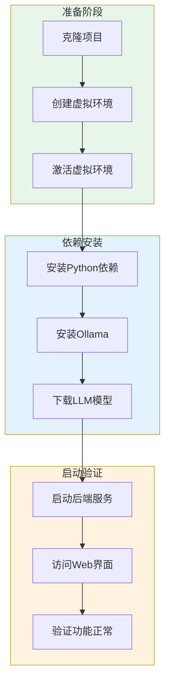
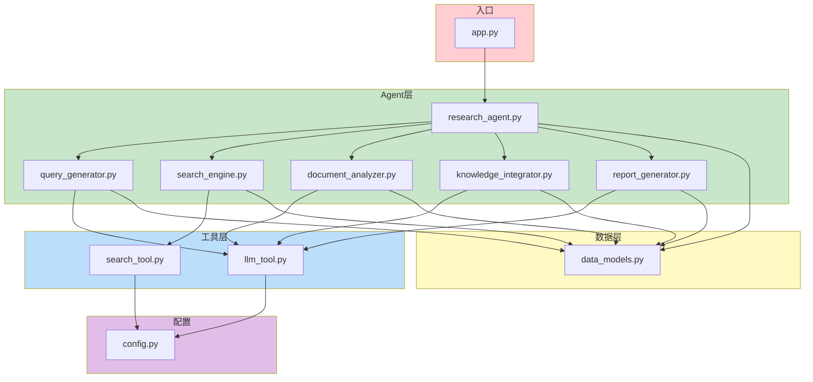
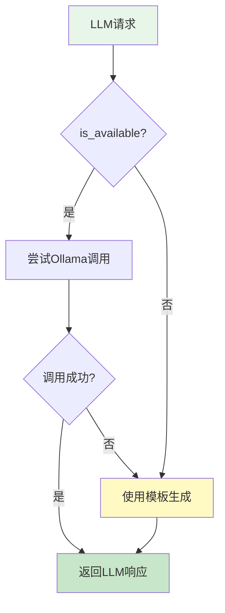
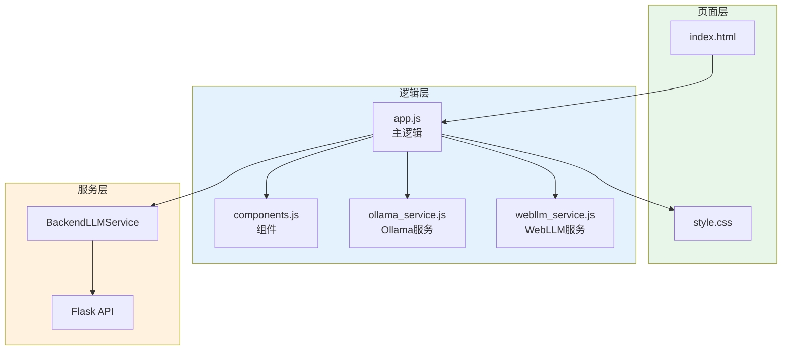

# Research Agent 实现说明文档

> **文档版本**: v1.0
> **最后更新**: 2024年
> **目标读者**: 开发工程师、DevOps
> **前置文档**: [方案架构文档](./01-architecture.md)

---

## 目录

- [第1章：环境搭建](#第1章环境搭建)
- [第2章：项目结构详解](#第2章项目结构详解)
- [第3章：核心模块实现详解](#第3章核心模块实现详解)
- [第4章：工具层实现](#第4章工具层实现)
- [第5章：前端实现详解](#第5章前端实现详解)
- [第6章：API接口文档](#第6章api接口文档)
- [第7章：常见问题与调试](#第7章常见问题与调试)

---

## 第1章：环境搭建

### 1.1 系统要求

#### 操作系统支持

| 操作系统 | 版本要求 | 备注 |
|---------|---------|-----|
| Windows | 10/11 | 使用WSL2获得更好体验 |
| macOS | 10.15+ | 原生支持 |
| Linux | Ubuntu 18.04+ / CentOS 7+ | 推荐用于生产部署 |

#### 软件依赖

| 软件 | 版本 | 必需 | 用途 |
|-----|------|-----|-----|
| Python | 3.8+ | ✅ | 运行后端服务 |
| pip | 21.0+ | ✅ | 包管理器 |
| Ollama | Latest | ✅ | LLM运行时 |
| Git | 2.x | 推荐 | 版本控制 |
| Docker | 20.x | 可选 | 容器化部署 |

#### 硬件要求

| 资源 | 最低配置 | 推荐配置 | 说明 |
|-----|---------|---------|-----|
| CPU | 2核 | 4核+ | 影响并发处理能力 |
| 内存 | 4GB | 8GB+ | LLM加载需要足够内存 |
| 磁盘 | 5GB | 20GB+ | 模型文件占用空间 |
| GPU | 无 | NVIDIA 4GB+ | 显著加速LLM推理 |

### 1.2 安装步骤

#### 环境搭建流程图



#### 详细安装命令

```bash
# ==========================================
# 步骤1: 克隆项目
# ==========================================
git clone https://github.com/your-repo/research-agent.git
cd research-agent/opencodeImplement

# ==========================================
# 步骤2: 创建并激活虚拟环境
# ==========================================
# Linux/macOS
python3 -m venv venv
source venv/bin/activate

# Windows
python -m venv venv
venv\Scripts\activate

# ==========================================
# 步骤3: 安装Python依赖
# ==========================================
pip install --upgrade pip
pip install -r requirements.txt

# ==========================================
# 步骤4: 安装Ollama
# ==========================================
# Linux/macOS
curl -fsSL https://ollama.ai/install.sh | sh

# Windows: 访问 https://ollama.ai/download 下载安装包

# ==========================================
# 步骤5: 下载LLM模型
# ==========================================
# 下载Qwen2.5 0.5B模型（推荐，体积小速度快）
ollama pull qwen2.5:0.5b

# 可选：下载更大的模型获得更好效果
# ollama pull qwen2.5:1.5b
# ollama pull llama2

# ==========================================
# 步骤6: 启动服务
# ==========================================
python backend/app.py

# 服务将在 http://localhost:5001 启动
```

### 1.3 配置说明

#### 配置文件结构

配置文件位于 `backend/config.py`：

```python
# backend/config.py
import os

class Config:
    # Ollama配置
    OLLAMA_BASE_URL = os.environ.get('OLLAMA_BASE_URL', 'http://localhost:11434')
    OLLAMA_MODEL = os.environ.get('OLLAMA_MODEL', 'llama2')

    # 搜索配置
    SEARCH_MAX_RESULTS = int(os.environ.get('SEARCH_MAX_RESULTS', '50'))

    # Flask配置
    FLASK_HOST = os.environ.get('FLASK_HOST', '0.0.0.0')
    FLASK_PORT = int(os.environ.get('FLASK_PORT', '5000'))
    DEBUG = os.environ.get('DEBUG', 'True').lower() == 'true'
```

#### 配置项详解

| 配置项 | 默认值 | 说明 | 修改方式 |
|-------|-------|------|---------|
| `OLLAMA_BASE_URL` | `http://localhost:11434` | Ollama服务地址 | 环境变量 |
| `OLLAMA_MODEL` | `llama2` | 默认LLM模型 | 环境变量 |
| `SEARCH_MAX_RESULTS` | `50` | 最大搜索结果数 | 环境变量 |
| `FLASK_HOST` | `0.0.0.0` | 服务监听地址 | 环境变量 |
| `FLASK_PORT` | `5000` | 服务监听端口 | 环境变量 |
| `DEBUG` | `True` | 调试模式 | 环境变量 |

#### 使用环境变量配置

```bash
# Linux/macOS
export OLLAMA_BASE_URL="http://localhost:11434"
export OLLAMA_MODEL="qwen2.5:0.5b"
export SEARCH_MAX_RESULTS="100"
export FLASK_PORT="5001"

python backend/app.py
```

```powershell
# Windows PowerShell
$env:OLLAMA_MODEL="qwen2.5:0.5b"
$env:FLASK_PORT="5001"

python backend/app.py
```

---

## 第2章：项目结构详解

### 2.1 目录结构说明

```
opencodeImplement/
├── backend/                      # 后端代码目录
│   ├── agents/                   # Agent模块目录
│   │   ├── __init__.py
│   │   ├── research_agent.py     # 核心控制器
│   │   ├── query_generator.py    # 查询生成器
│   │   ├── search_engine.py      # 搜索引擎
│   │   ├── document_analyzer.py  # 文档分析器
│   │   ├── knowledge_integrator.py # 知识整合器
│   │   └── report_generator.py   # 报告生成器
│   │
│   ├── models/                   # 数据模型目录
│   │   ├── __init__.py
│   │   └── data_models.py        # 数据结构定义
│   │
│   ├── tools/                    # 工具层目录
│   │   ├── __init__.py
│   │   ├── llm_tool.py           # LLM工具
│   │   └── search_tool.py        # 搜索工具
│   │
│   ├── app.py                    # Flask应用入口
│   └── config.py                 # 配置文件
│
├── frontend/                     # 前端代码目录
│   ├── index.html                # 主页面
│   ├── css/
│   │   └── style.css             # 样式文件
│   └── js/
│       ├── app.js                # 主逻辑
│       ├── components.js         # 组件
│       ├── ollama_service.js     # Ollama服务
│       └── webllm_service.js     # WebLLM服务
│
├── docs/                         # 文档目录
│   ├── 01-architecture.md        # 方案架构文档
│   ├── 02-implementation.md      # 本文档
│   └── 03-technical-principles.md # 技术原理文档
│
├── requirements.txt              # Python依赖
├── README.md                     # 项目说明
└── IMPLEMENTATION_PLAN.md        # 实现计划
```

### 2.2 模块依赖关系



#### 模块初始化顺序

1. **配置加载**: `config.py` 被导入时加载环境变量
2. **数据模型定义**: `data_models.py` 定义所有数据结构
3. **工具层初始化**: `llm_tool.py` 和 `search_tool.py` 封装底层能力
4. **Agent层初始化**: 各Agent模块依赖工具层
5. **Flask应用启动**: `app.py` 初始化路由和服务

---

## 第3章：核心模块实现详解

### 3.1 ResearchAgent - 核心控制器

**文件位置**: `backend/agents/research_agent.py`

#### 核心职责

ResearchAgent是整个系统的核心控制器，负责：
1. 协调各子模块的工作
2. 实现完整的研究流程
3. 管理进度和状态
4. 处理异常情况

#### 依赖注入设计

```python
# backend/agents/research_agent.py:11-20
class ResearchAgent:
    def __init__(self, llm: LLMTool = None, search_tool: SearchTool = None):
        # 支持依赖注入，便于测试和扩展
        self.llm = llm or LLMTool()
        self.search_tool = search_tool or SearchTool()

        # 初始化各子模块
        self.query_generator = QueryGenerator(self.llm)
        self.search_engine = SearchEngine(self.search_tool)
        self.document_analyzer = DocumentAnalyzer(self.llm)
        self.knowledge_integrator = KnowledgeIntegrator(self.llm)
        self.report_generator = ReportGenerator(self.llm)
```

**设计要点**：
- 使用依赖注入模式，允许传入自定义的LLM和搜索工具
- 默认使用`LLMTool()`和`SearchTool()`作为后备
- 子模块共享同一个LLM实例，提高效率

#### 五步研究工作流

```python
# backend/agents/research_agent.py:22-61
def research(self, topic: str, progress_callback: Callable[[str, float], None] = None) -> ResearchResult:
    result = ResearchResult(
        query=self.query_generator.generate(topic),
        status="running"
    )

    try:
        # 步骤1: 生成查询 (10%)
        progress_callback("正在生成查询...", 10)
        result.messages.append(f"生成查询: {result.query.original}")

        # 步骤2: 搜索信息 (30%)
        progress_callback("正在搜索信息...", 30)
        result.search_results = self.search_engine.search(result.query)
        result.messages.append(f"找到 {len(result.search_results)} 条搜索结果")

        # 步骤3: 分析文档 (50%)
        progress_callback("正在分析文档...", 50)
        result.documents = self.document_analyzer.analyze(result.search_results)
        result.messages.append(f"分析了 {len(result.documents)} 篇文档")

        # 步骤4: 整合知识 (70%)
        progress_callback("正在整合知识...", 70)
        kg = self.knowledge_integrator.integrate(result.documents)
        result.messages.append(f"提取了 {len(kg.entities)} 个实体, {len(kg.relations)} 个关系")

        # 步骤5: 生成报告 (90%)
        progress_callback("正在生成报告...", 90)
        result.report = self.report_generator.generate(
            topic=topic,
            documents=result.documents,
            search_results=result.search_results,
            knowledge_graph=kg
        )
        result.messages.append("研究报告生成完成")

        result.status = "completed"
        progress_callback("研究完成!", 100)

    except Exception as e:
        result.status = "failed"
        result.messages.append(f"错误: {str(e)}")
        progress_callback(f"错误: {str(e)}", 0)

    return result
```

**工作流特点**：
- 清晰的进度指示（10% → 30% → 50% → 70% → 90% → 100%）
- 完善的异常处理，失败时设置状态为"failed"
- 每步都有日志记录，便于调试

#### 进度回调机制

```python
# 使用示例
def my_progress_callback(message: str, progress: float):
    print(f"[{progress}%] {message}")

agent = ResearchAgent()
result = agent.research("人工智能", progress_callback=my_progress_callback)
```

### 3.2 QueryGenerator - 查询生成器

**文件位置**: `backend/agents/query_generator.py`

#### 核心职责

将用户输入的研究主题转换为优化的搜索查询列表。

#### 实现代码

```python
# backend/agents/query_generator.py
class QueryGenerator:
    def __init__(self):
        pass

    def generate(self, topic: str) -> Query:
        keywords = self._extract_keywords(topic)
        expanded = self._expand_queries(topic, keywords)

        return Query(
            original=topic,
            keywords=keywords,
            expanded=expanded
        )

    def _extract_keywords(self, topic: str) -> List[str]:
        # 简单的关键词提取：移除中文停用词
        words = topic.replace('的', ' ').replace('在', ' ').replace('与', ' ').replace('和', ' ').split()
        keywords = [w.strip() for w in words if len(w.strip()) > 1]
        return keywords[:10] if keywords else [topic]

    def _expand_queries(self, topic: str, keywords: List[str]) -> List[str]:
        queries = [topic]

        # 为每个关键词生成组合查询
        for kw in keywords[:5]:
            queries.append(kw)
            queries.append(f"{topic} {kw}")

        # 添加多维度查询
        queries.extend([
            f"{topic} overview",
            f"{topic} latest research",
            f"{topic} applications",
            f"{topic} challenges"
        ])

        return list(set(queries))[:15]
```

**设计要点**：
- **关键词提取**: 移除常见中文停用词（的、在、与、和）
- **查询扩展策略**:
  - 原始查询
  - 关键词单独查询
  - 主题+关键词组合
  - 多维度查询（概述、最新研究、应用、挑战）

### 3.3 SearchEngine - 搜索引擎

**文件位置**: `backend/agents/search_engine.py`

#### 核心职责

1. 管理多源搜索策略
2. 结果排序和去重
3. 聚合多源结果

#### 搜索与排序实现

```python
# backend/agents/search_engine.py
class SearchEngine:
    def __init__(self, search_tool: SearchTool = None):
        self.search_tool = search_tool or SearchTool()

    def search(self, query: Query, max_results: int = None) -> List[SearchResult]:
        results = []
        # 使用原始查询和前5个扩展查询
        all_queries = [query.original] + query.expanded[:5]

        for q in all_queries:
            if len(results) >= 50:
                break
            results.extend(self.search_tool.search(q, 20))

        return self._rank_results(results)

    def _rank_results(self, results: List[SearchResult]) -> List[SearchResult]:
        # 计算相关性分数
        for r in results:
            score = 1.0
            # 权威来源加权
            if r.source in ["arXiv", "PubMed", "Wikipedia"]:
                score *= 1.5
            if r.source == "GitHub":
                score *= 1.3
            # 时效性加权
            if r.published_date:
                score *= 1.2
            r.score = score

        # 去重：基于标题
        seen = set()
        unique_results = []
        for r in results:
            if r.title not in seen:
                seen.add(r.title)
                unique_results.append(r)

        # 按分数降序排列
        return sorted(unique_results, key=lambda x: x.score, reverse=True)[:60]
```

**排序策略**：
| 来源 | 权重 | 理由 |
|-----|------|-----|
| arXiv/PubMed/Wikipedia | 1.5x | 学术权威性高 |
| GitHub | 1.3x | 代码实践价值 |
| 其他Web | 1.0x | 补充信息 |
| 有发布日期 | 1.2x | 时效性 |

### 3.4 DocumentAnalyzer - 文档分析器

**文件位置**: `backend/agents/document_analyzer.py`

#### 核心职责

1. 分析搜索结果文档
2. 提取关键信息（研究问题、方法、发现）
3. 生成文档摘要

#### Prompt工程设计

```python
# backend/agents/document_analyzer.py:28-61
def _extract_info(self, doc: Document) -> Document:
    prompt = f"""分析以下文档，提取关键信息：
文档标题: {doc.title}
文档来源: {doc.source}
文档内容: {doc.content}

请提取：
1. 研究问题 - 这篇文档研究什么问题？
2. 研究方法 - 使用了什么方法？
3. 主要发现/结论 - 有什么发现？

回答格式：
研究问题：xxx
研究方法：xxx
主要发现：xxx
"""

    response = self.llm.generate(prompt)

    try:
        info = {}
        for line in response.split('\n'):
            if '研究问题' in line:
                info['research_question'] = line.split('：', 1)[-1].strip()
            elif '研究方法' in line:
                info['methodology'] = line.split('：', 1)[-1].strip()
            elif '主要发现' in line or '发现' in line:
                info['key_findings'] = line.split('：', 1)[-1].strip()
        if info:
            doc.key_info = info
    except:
        pass

    return doc
```

**Prompt设计要点**：
- 提供明确的上下文（标题、来源、内容）
- 指定输出格式（结构化列表）
- 问题导向（研究问题、方法、发现）

### 3.5 KnowledgeIntegrator - 知识整合器

**文件位置**: `backend/agents/knowledge_integrator.py`

#### 核心职责

1. 从文档中识别实体
2. 抽取实体间关系
3. 构建知识图谱

#### 实体识别规则

```python
# backend/agents/knowledge_integrator.py:22-65
def _extract_entities(self, documents: List[Document]) -> List[Entity]:
    entities = []
    entity_names = set()

    for doc in documents:
        title = doc.title.lower()
        content = doc.content.lower()

        # 基于规则的实体识别
        if "machine learning" in content or "ml" in title:
            if "机器学习" not in entity_names:
                entities.append(Entity(name="机器学习", type="核心技术", aliases=["ML", "Machine Learning"]))
                entity_names.add("机器学习")

        if "deep learning" in content or "neural" in title:
            if "深度学习" not in entity_names:
                entities.append(Entity(name="深度学习", type="核心技术", aliases=["DL", "Deep Learning"]))
                entity_names.add("深度学习")

        if "nlp" in title or "natural language" in content:
            if "自然语言处理" not in entity_names:
                entities.append(Entity(name="自然语言处理", type="应用领域", aliases=["NLP"]))
                entity_names.add("自然语言处理")

        # ... 更多实体识别规则

    return entities[:15]
```

#### 关系抽取模式

```python
# backend/agents/knowledge_integrator.py:82-111
def _extract_relations_from_docs(self, documents: List[Document]) -> List[Relation]:
    relations = []

    content_all = " ".join([d.content.lower() for d in documents])

    # 基于模式的关系抽取
    if "machine learning" in content_all or "deep learning" in content_all:
        relations.append(Relation("深度学习", "属于", "机器学习", 0.9))

    if "neural network" in content_all or "deep learning" in content_all:
        relations.append(Relation("神经网络", "属于", "深度学习", 0.8))

    if "transformer" in content_all:
        relations.append(Relation("Transformer", "推动", "大语言模型", 0.9))

    # ... 更多关系规则

    return relations[:15]
```

**当前实现特点**：
- 基于关键词匹配的规则方法
- 置信度由规则硬编码
- 简单但有效，易于理解和扩展

### 3.6 ReportGenerator - 报告生成器

**文件位置**: `backend/agents/report_generator.py`

#### 核心职责

1. 生成结构化研究报告
2. 整合多源信息
3. 管理引用和摘要

#### 报告生成主流程

```python
# backend/agents/report_generator.py:9-46
def generate(self, topic: str, documents: List[Document],
             search_results: List[SearchResult],
             knowledge_graph: KnowledgeGraph | None = None) -> ResearchReport:

    # 按来源分类文档
    arxiv_docs = [d for d in documents if d.source == "arXiv"]
    github_docs = [d for d in documents if d.source == "GitHub"]
    web_docs = [d for d in documents if d.source == "Web"]
    youtube_docs = [d for d in documents if d.source == "YouTube"]
    paperwithcode_docs = [d for d in documents if d.source == "Papers With Code"]

    all_sources = {
        "学术论文(arXiv)": arxiv_docs,
        "开源项目(GitHub)": github_docs,
        "网络资料": web_docs,
        "视频资源(YouTube)": youtube_docs,
        "论文代码(Papers With Code)": paperwithcode_docs
    }

    # 分章节生成
    summary = self._generate_comprehensive_summary(topic, all_sources)
    background = self._generate_detailed_background(topic, all_sources)
    methodology = self._generate_detailed_methodology(topic, all_sources)
    findings = self._generate_detailed_findings(topic, all_sources)
    discussion = self._generate_detailed_discussion(topic, all_sources)
    conclusions = self._generate_conclusions(topic, all_sources)

    references = self._generate_references_with_summaries(topic, search_results)

    return ResearchReport(
        topic=topic,
        abstract=summary,
        background=background,
        methodology=methodology,
        findings=findings,
        discussion=discussion,
        conclusions=conclusions,
        references=references,
        knowledge_graph=None
    )
```

#### 摘要生成的Prompt设计

```python
# backend/agents/report_generator.py:53-60
prompt = f"""请为"{topic}"生成一份详尽的中文研究综述摘要（800字以上），要求：
1. 详细阐述该领域的研究意义和重要性，包括学术价值和实际应用价值
2. 全面总结当前主要研究方向和技术进展，涵盖各个分支领域
3. 深入分析该领域面临的主要挑战和存在的问题
4. 展望未来5-10年的发展趋势和潜在突破
5. 介绍相关的代表性研究成果和关键里程碑

请用流畅的中文撰写，分为5-6个段落，每段至少4句话，不要使用列表格式。
"""
```

#### 降级模板设计

```python
# backend/agents/report_generator.py:210-222
if not findings or len(findings) < 5:
    findings = [
        f"1. **{topic}技术框架**：构建了完整的理论体系和技术路线，为后续研究提供了坚实的基础架构",
        f"2. **核心算法优化**：提出了多项创新性算法，在效率和准确性方面取得了显著提升",
        f"3. **应用场景拓展**：在多个实际应用场景中验证了技术的可行性并取得了良好效果",
        f"4. **性能提升**：通过技术改进实现了显著的性能提升，包括计算效率和资源利用率",
        f"5. **实践经验总结**：积累了丰富的工程实践经验和最佳实践，为产业发展提供了重要参考",
        # ... 更多降级模板
    ]
```

---

## 第4章：工具层实现

### 4.1 LLMTool - LLM工具

**文件位置**: `backend/tools/llm_tool.py`

#### 核心功能

提供统一的LLM调用接口，支持Ollama和模板降级。

#### Ollama API集成

```python
# backend/tools/llm_tool.py:22-35
def _ollama_generate(self, prompt: str, system: str = None) -> str:
    url = f"{self.base_url}/api/generate"
    payload = {"model": self.model, "prompt": prompt, "stream": False}
    if system:
        payload["system"] = system
    try:
        response = requests.post(url, json=payload, timeout=15)
        if response.status_code == 200:
            return response.json().get("response", "")
    except requests.exceptions.Timeout:
        raise TimeoutError("Ollama request timed out")
    except Exception as e:
        raise Exception(f"Ollama error: {e}")
    return ""
```

#### 智能降级策略



#### 主入口与降级逻辑

```python
# backend/tools/llm_tool.py:13-20
def generate(self, prompt: str, system: str = None, **kwargs) -> str:
    if self.is_available():
        try:
            return self._ollama_generate(prompt, system)
        except Exception as e:
            print(f"Ollama error: {e}, using fallback")
            pass
    return self._template_generate(prompt)
```

#### 模板生成实现

```python
# backend/tools/llm_tool.py:51-113
def _template_generate(self, prompt: str) -> str:
    prompt_lower = prompt.lower()

    if "关键词" in prompt:
        topic = self._extract_topic(prompt)
        return f"{topic}, 深度学习, 机器学习, 神经网络, 算法, 应用"

    elif "概括" in prompt_lower or ("摘要" in prompt and "生成" in prompt_lower):
        return self._generate_abstract(prompt)

    elif "分析以下文档" in prompt:
        topic = self._extract_topic(prompt)
        return f"研究问题：探索{topic}的核心问题\n研究方法：文献分析\n主要发现：{topic}是重要研究方向"

    elif "实体" in prompt_lower:
        return self._extract_entities(prompt)

    elif "关系" in prompt_lower:
        return self._extract_relations(prompt)

    # ... 更多模板分支

    return self._generate_abstract(prompt)
```

**降级策略设计要点**：
1. 根据Prompt关键词匹配模板类型
2. 从Prompt中提取主题词
3. 生成结构化的模板响应

#### 可用性检查

```python
# backend/tools/llm_tool.py:41-49
def is_available(self) -> bool:
    if self._is_available is not None:
        return self._is_available
    try:
        response = requests.get(f"{self.base_url}/api/tags", timeout=3)
        self._is_available = response.status_code == 200
    except:
        self._is_available = False
    return self._is_available
```

### 4.2 SearchTool - 搜索工具

**文件位置**: `backend/tools/search_tool.py`

#### 核心功能

封装多源搜索API，提供统一的搜索接口。

#### 多源搜索策略

```python
# backend/tools/search_tool.py:18-30
def search(self, query: str, max_results: int = None) -> List[SearchResult]:
    limit = max_results or self.max_results
    results = []

    # 优先级1: arXiv（学术论文）
    results.extend(self._search_arxiv(query, limit))

    # 优先级2: GitHub（开源项目）
    if len(results) < limit:
        results.extend(self._search_github(query, limit - len(results)))

    # 优先级3: DuckDuckGo（通用搜索）
    if len(results) < limit and DDGS_AVAILABLE:
        results.extend(self._search_duckduckgo(query, limit - len(results)))

    return results[:limit]
```

#### arXiv XML API解析

```python
# backend/tools/search_tool.py:50-84
def _search_arxiv(self, query: str, max_results: int) -> List[SearchResult]:
    results = []
    try:
        url = "http://export.arxiv.org/api/query"
        params = {
            "search_query": f"all:{query}",
            "max_results": min(max_results, 20),
            "sortBy": "relevance"
        }
        response = requests.get(url, params=params, timeout=20)

        # 解析XML响应
        root = ET.fromstring(response.content)

        for entry in root.findall('.//{http://www.w3.org/2005/Atom}entry'):
            try:
                title_el = entry.find('{http://www.w3.org/2005/Atom}title')
                summary_el = entry.find('{http://www.w3.org/2005/Atom}summary')
                link_el = entry.find('{http://www.w3.org/2005/Atom}id')

                title = title_el.text.replace('\n', ' ').strip() if title_el is not None else "No title"
                summary = summary_el.text[:500].strip() if summary_el is not None else "No summary"
                link = link_el.text if link_el is not None else ""

                results.append(SearchResult(
                    title=title[:150],
                    url=link,
                    snippet=summary,
                    source="arXiv",
                    published_date=None
                ))
            except:
                continue
    except Exception as e:
        print(f"arXiv搜索错误: {e}")
    return results
```

#### GitHub REST API调用

```python
# backend/tools/search_tool.py:86-121
def _search_github(self, query: str, max_results: int) -> List[SearchResult]:
    results = []
    if max_results <= 0:
        return results
    try:
        url = "https://api.github.com/search/repositories"
        params = {
            "q": query,
            "per_page": min(max_results, 20),
            "sort": "stars"
        }
        response = requests.get(url, params=params, timeout=15,
                                headers={"Accept": "application/vnd.github.v3+json"})

        if response.status_code == 200:
            data = response.json()
            for item in data.get("items", [])[:max_results]:
                title = item.get("full_name", "")
                desc = item.get("description", "") or "No description"
                url_link = item.get("html_url", "")
                date = item.get("created_at", "").split("T")[0] if item.get("created_at") else None
                stars = item.get("stargazers_count", 0)
                lang = item.get("language", "")

                snippet = f"⭐ {stars} stars | {lang} | {desc[:100]}"

                results.append(SearchResult(
                    title=title,
                    url=url_link,
                    snippet=snippet,
                    source="GitHub",
                    published_date=date
                ))
    except Exception as e:
        print(f"GitHub搜索错误: {e}")
    return results
```

---

## 第5章：前端实现详解

### 5.1 整体架构

前端采用原生JavaScript实现，无框架依赖，主要包含以下模块：



### 5.2 核心工作流实现

#### 研究主流程

```javascript
// frontend/js/app.js:142-187
async function startResearch() {
    const topic = topicInput.value.trim();
    if (!topic) {
        alert('请输入研究主题');
        return;
    }

    if (!isModelLoaded) {
        alert('模型未连接，请稍等...');
        return;
    }

    researchBtn.disabled = true;
    progressSection.style.display = 'block';
    resultSection.style.display = 'none';
    progressMessages.innerHTML = '';
    iterationCount = 0;

    try {
        updateProgress(3, '🚀 开始研究: ' + topic);

        // 步骤1: 多源检索
        updateProgress(5, '📚 正在多维度检索信息...');
        const searchResults = await performSearch(topic);
        updateProgress(25, `✅ 检索完成，发现 ${searchResults.length} 个参考资料`);

        // 步骤2: 生成初始报告
        let report = await generateInitialReport(topic, searchResults);

        // 步骤3: 迭代优化
        for (let i = 0; i < MAX_ITERATIONS; i++) {
            iterationCount = i + 1;
            updateProgress(30 + i * 25, `🔄 迭代优化中 (${iterationCount}/${MAX_ITERATIONS})...`);
            report = await optimizeReport(topic, searchResults, report);
        }

        updateProgress(95, '📝 正在整理最终报告...');
        updateProgress(100, '✨ 研究完成!');

        displayResults(topic, report, searchResults);

    } catch (error) {
        updateProgress(0, '错误: ' + error.message);
        console.error(error);
    } finally {
        researchBtn.disabled = false;
    }
}
```

### 5.3 进度管理实现

```javascript
// frontend/js/app.js:394-402
function updateProgress(percent, message) {
    progressPercent.textContent = percent + '%';
    progressFill.style.width = percent + '%';

    const msgDiv = document.createElement('div');
    msgDiv.textContent = `[${percent}%] ${message}`;
    progressMessages.appendChild(msgDiv);
    progressMessages.scrollTop = progressMessages.scrollHeight;
}
```

### 5.4 错误处理

```javascript
// frontend/js/app.js:46-75 (BackendLLMService)
async generate(prompt, systemPrompt = null) {
    if (!this.isInitialized) {
        await this.init();
    }

    try {
        const response = await fetch('/api/llm/chat', {
            method: 'POST',
            headers: { 'Content-Type': 'application/json' },
            body: JSON.stringify({
                model: this.model,
                messages: [
                    { role: "system", content: systemPrompt || "你是一个专业的研究助手..." },
                    { role: "user", content: prompt }
                ]
            })
        });

        if (!response.ok) {
            const errData = await response.json().catch(() => ({}));
            throw new Error(errData.error || `Backend API error: ${response.status}`);
        }

        const data = await response.json();
        return data.response || data.message?.content || '';
    } catch (error) {
        console.error('LLM generation error:', error);
        throw error;
    }
}
```

---

## 第6章：API接口文档

### 6.1 搜索接口

```
POST /api/search
```

**请求体**:
```json
{
    "topic": "人工智能"
}
```

**响应**:
```json
{
    "results": [
        {
            "title": "论文标题",
            "url": "https://arxiv.org/abs/xxx",
            "snippet": "摘要内容...",
            "source": "arXiv",
            "published_date": null,
            "score": 1.5
        }
    ]
}
```

**错误响应**:
```json
{
    "error": "错误信息"
}
```

### 6.2 LLM生成接口

```
POST /api/llm/generate
```

**请求体**:
```json
{
    "prompt": "请生成摘要...",
    "system": "你是一个专业的研究助手。",
    "model": "qwen2.5:0.5b"
}
```

**响应**:
```json
{
    "response": "生成的文本内容..."
}
```

### 6.3 状态检查接口

```
GET /api/llm/status
```

**响应**:
```json
{
    "available": true,
    "model": "qwen2.5:0.5b"
}
```

或

```json
{
    "available": false,
    "error": "连接失败原因"
}
```

---

## 第7章：常见问题与调试

### 7.1 常见错误排查

#### 问题1: Ollama连接失败

**症状**:
```
Ollama error: Connection refused
```

**解决方案**:
```bash
# 检查Ollama服务是否启动
curl http://localhost:11434/api/tags

# 如果未启动，启动Ollama服务
ollama serve

# 检查模型是否已下载
ollama list
```

#### 问题2: LLM响应超时

**症状**:
```
TimeoutError: Ollama request timed out
```

**解决方案**:
1. 使用更小的模型（如qwen2.5:0.5b）
2. 增加timeout值（在`llm_tool.py`中修改）
3. 检查系统资源使用情况

#### 问题3: 搜索结果为空

**症状**: 所有搜索返回空列表

**解决方案**:
```bash
# 检查网络连接
ping export.arxiv.org
ping api.github.com

# 检查DNS解析
nslookup export.arxiv.org
```

#### 问题4: 编码问题

**症状**: 中文显示乱码

**解决方案**:
```python
# 在app.py中确保UTF-8编码
import io
import sys
sys.stdout = io.TextIOWrapper(sys.stdout.buffer, encoding='utf-8')
```

### 7.2 性能优化建议

#### LLM调用批量化

```python
# 当前：逐个调用
for doc in documents:
    summary = self.llm.generate(prompt)

# 优化：批量调用
prompts = [build_prompt(doc) for doc in documents]
summaries = self.llm.batch_generate(prompts)
```

#### 并发请求处理

```python
# 使用asyncio进行并发搜索
import asyncio

async def parallel_search(queries):
    tasks = [search_single(q) for q in queries]
    return await asyncio.gather(*tasks)
```

#### 缓存策略

```python
from functools import lru_cache

@lru_cache(maxsize=100)
def cached_search(query: str) -> List[SearchResult]:
    return self._search_arxiv(query, 20)
```

### 7.3 日志与监控

#### 关键日志点

```python
import logging

# 配置日志
logging.basicConfig(
    level=logging.INFO,
    format='%(asctime)s - %(name)s - %(levelname)s - %(message)s'
)

logger = logging.getLogger(__name__)

# 关键操作日志
logger.info(f"开始研究: {topic}")
logger.info(f"搜索完成: {len(results)} 条结果")
logger.error(f"LLM调用失败: {e}")
```

#### 性能指标监控

```python
import time

def measure_time(func):
    def wrapper(*args, **kwargs):
        start = time.time()
        result = func(*args, **kwargs)
        end = time.time()
        logger.info(f"{func.__name__} 耗时: {end - start:.2f}秒")
        return result
    return wrapper
```

---

## 附录

### 相关文档

- **方案架构文档** ([01-architecture.md](./01-architecture.md)) - 系统设计和架构
- **技术原理文档** ([03-technical-principles.md](./03-technical-principles.md)) - 深入技术原理

### 快速参考

| 常用命令 | 说明 |
|---------|-----|
| `python backend/app.py` | 启动后端服务 |
| `ollama serve` | 启动Ollama服务 |
| `ollama pull qwen2.5:0.5b` | 下载模型 |
| `curl localhost:5001/api/status` | 检查服务状态 |

---

*文档结束*
