# 第15章：构建赛博小镇（游戏开发重点章节）

## 章节概述

这是课程中**最重要和最有趣的游戏开发相关章节**！我们将构建一个由多个智能体组成的虚拟社会，模拟真实的社会动态和角色交互。这是 Agent 与游戏结合的经典案例。

## 学习目标

- 理解多智能体系统的架构设计
- 掌握角色行为系统的实现
- 学习动态事件生成机制
- 实现社交网络和关系系统
- 掌握世界状态管理

## 项目介绍

### 什么是赛博小镇？

赛博小镇是一个由 AI Agent 驱动的虚拟社会模拟系统，其中：
- 每个角色都是一个独立的智能体
- 角色有自己的性格、记忆、目标和关系
- 角色之间会自主交互，形成动态故事
- 整个小镇会自动演化，产生意想不到的情节

### 核心特点

1. **自主性**：角色自主决定行为
2. **社交性**：角色之间形成社交网络
3. **记忆性**：角色记得过去发生的事情
4. **目标性**：角色有自己的目标和动机
5. **动态性**：故事线实时生成

## 技术架构

### 系统分层

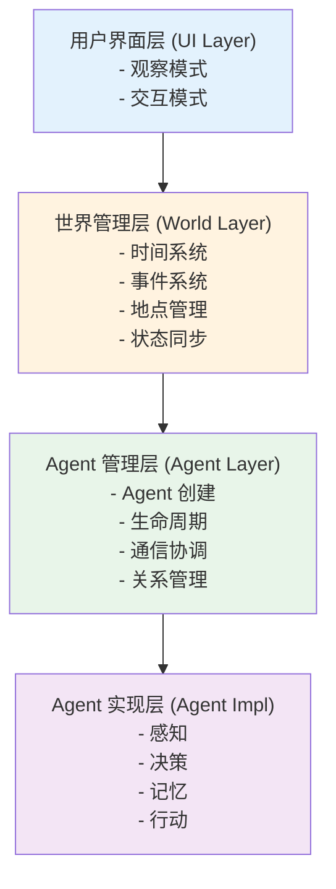

### 核心模块

#### 1. Agent 系统
- **角色创建**：定义角色属性
- **行为系统**：实现角色行为
- **记忆系统**：存储和检索记忆
- **目标系统**：管理角色目标

#### 2. 世界系统
- **时间系统**：模拟时间流逝
- **地点系统**：管理小镇地点
- **事件系统**：触发和管理事件
- **状态管理**：同步世界状态

#### 3. 社交系统
- **关系网络**：角色间关系
- **通信系统**：角色间对话
- **影响力系统**：角色影响力
- **群体行为**：群体动态

## 详细设计

### Agent 设计

#### 角色属性

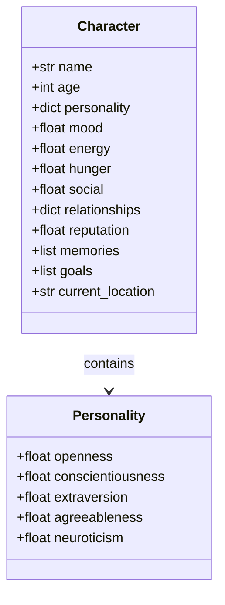


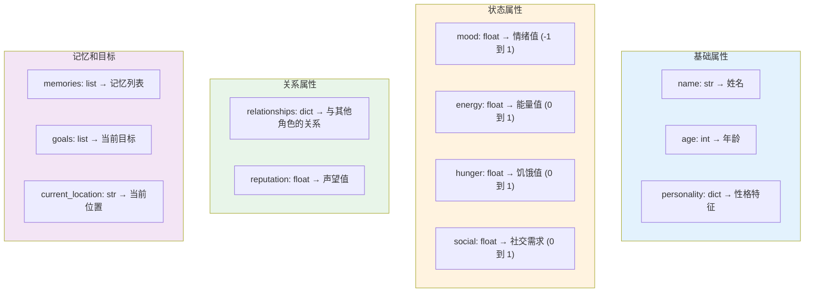

#### 行为系统

```
BehaviorSystem 行为系统:

decide_action(character, context):
    """
    决策下一个行动
    """

    1. 评估当前状态
       检查 character 的各项状态值

    2. 检索相关记忆
       从记忆库中找出相关经验

    3. 考虑当前目标
       查看当前 goals 的优先级

    4. 权衡各种因素
       ├── 需求满足度 (饥饿、能量等)
       ├── 目标相关性
       ├── 性格匹配度
       ├── 社会关系影响
       └── 过去经验 (记忆)

    5. 选择最优行动
       返回评分最高的行动


evaluate_action(character, action, context):
    """
    评估行动的得分

    计算因素:
    ├── 需求满足度
    │   if action.satisfies_need(hunger, 'food'):
    │       score += character.hunger * 10
    │
    ├── 目标相关
    │   if action.advances_goal(goal):
    │       score += goal.importance * 5
    │
    ├── 性格匹配
    │   if matches_personality(action, personality):
    │       score += 3
    │
    ├── 社交影响
    │   score += evaluate_social_impact(character, action)
    │
    └── 记忆影响
        score += get_memory_bias(character, action)

    return score
```

#### 记忆系统

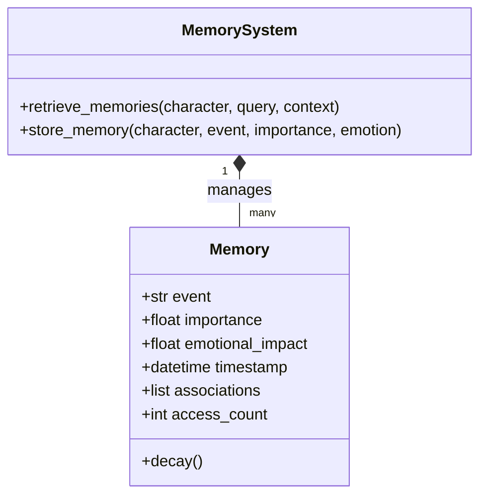


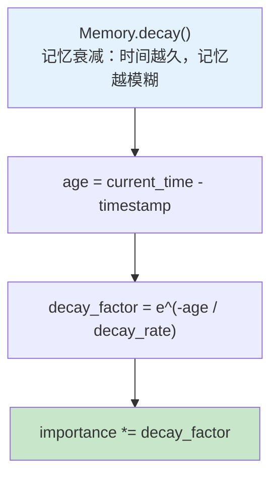


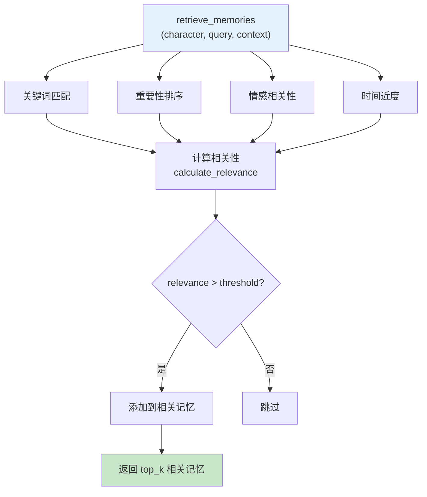


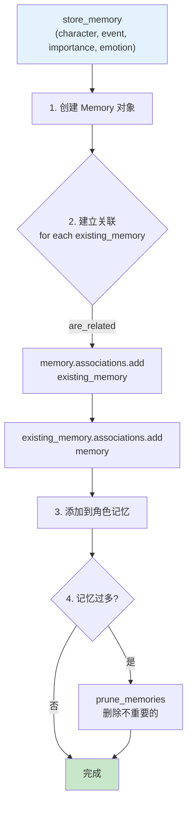

### 世界系统设计

#### 时间系统

```
TimeSystem 时间系统:

属性:
┌─────────────────────────────────────────────────────────────┐
│  current_time: datetime    → 当前游戏时间                  │
│  time_scale: int           → 时间流逝速度                  │
│                             1秒现实 = 1分钟游戏      │
└─────────────────────────────────────────────────────────────┘

方法:
┌─────────────────────────────────────────────────────────────┐
│  update(delta_time):                                         │
│  game_delta = delta_time * time_scale                           │
│  current_time += game_delta                                    │
└─────────────────────────────────────────────────────────────┘

┌─────────────────────────────────────────────────────────────┐
│  get_time_of_day():                                          │
│  ├── 6-12点  → "morning"                                    │
│  ├── 12-18点 → "afternoon"                                   │
│  ├── 18-22点 → "evening"                                    │
│  └── 22-6点  → "night"                                      │
└─────────────────────────────────────────────────────────────┘

┌─────────────────────────────────────────────────────────────┐
│  is_business_hour():                                         │
│  return 9 <= hour < 18                                       │
└─────────────────────────────────────────────────────────────┘
```

#### 地点系统

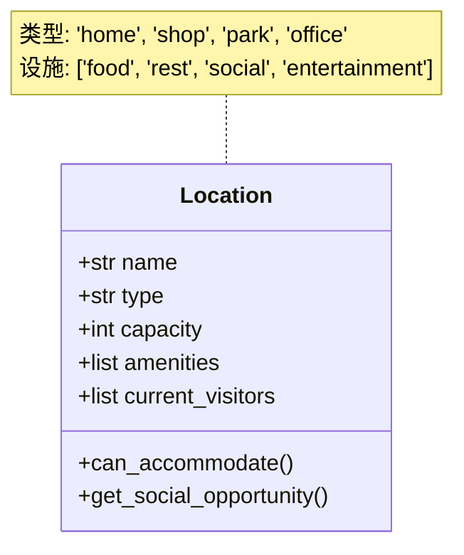


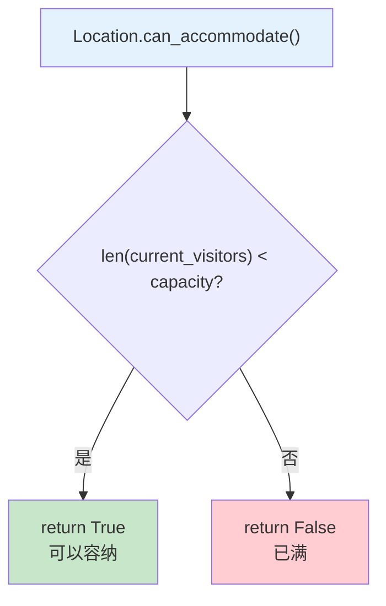


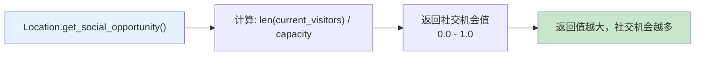

#### 事件系统

```
Event 事件类:

属性:
┌─────────────────────────────────────────────────────────────┐
│  type: str              → 事件类型                        │
│  │  'conversation' → 对话                                 │
│  │  'transaction' → 交易                                 │
│  │  'conflict'    → 冲突                                 │
├─────────────────────────────────────────────────────────────┤
│  participants: list       → 参与的角色列表                  │
│  location: Location       → 地点                            │
│  timestamp: datetime     → 时间戳                          │
│  description: str         → 事件描述                        │
│  impact: dict            → 对各角色的影响                   │
└─────────────────────────────────────────────────────────────┘
```

### 社交系统设计

#### 关系网络

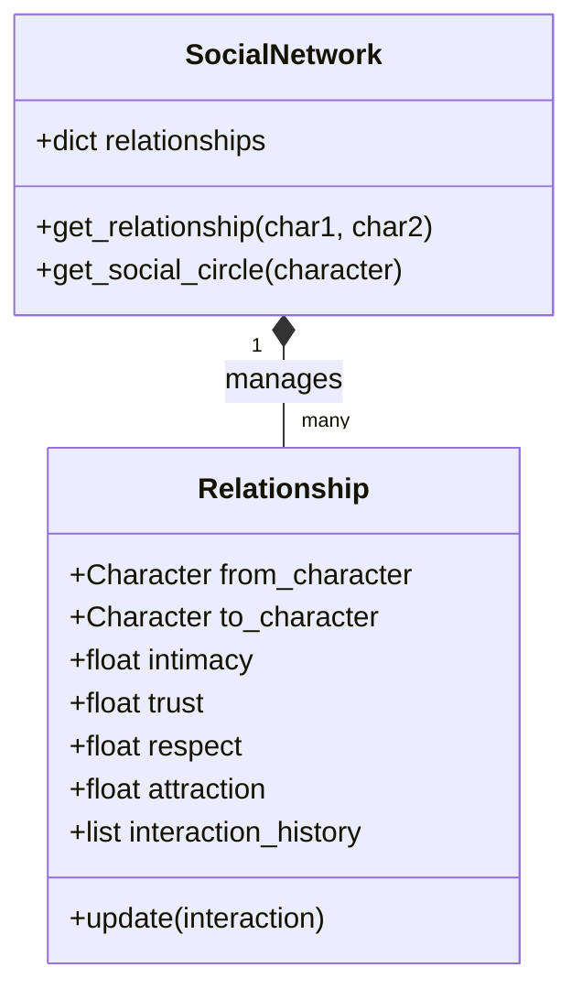


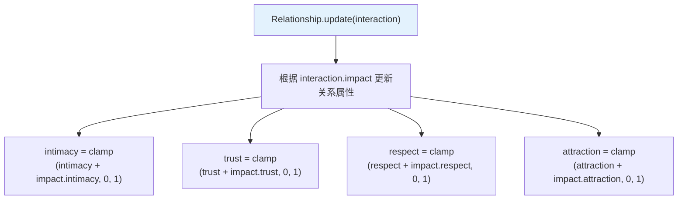


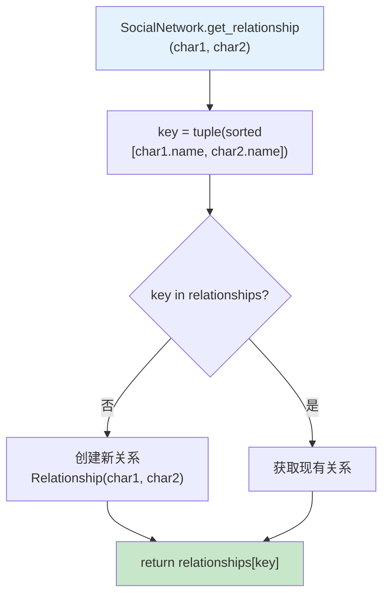


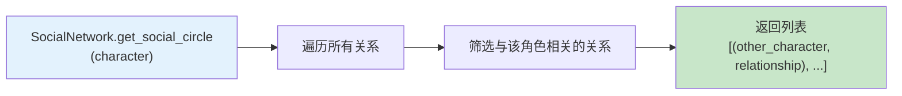


## 实现步骤

### 第一步：基础框架（1-2天）

```
基础任务清单:

□ 创建角色类
  ├── 定义角色属性
  └── 实现基本状态管理

□ 创建世界系统
  ├── 实现时间系统
  └── 创建基础地点

□ 实现主循环
  ├── 时间推进
  └── Agent 行动触发
```

### 第二步：行为系统（2-3天）

```
行为系统任务:

□ 实现决策系统
  ├── 行动评估
  └── 决策逻辑

□ 实现基础行为
  ├── 移动
  ├── 进食
  ├── 休息
  └── 社交

□ 实现需求系统
  ├── 饥饿、能量、社交需求
  └── 需求影响行为
```

### 第三步：记忆系统（2-3天）

```
记忆系统任务:

□ 实现记忆存储
  ├── 记忆结构
  └── 记忆创建

□ 实现记忆检索
  ├── 相关性计算
  └── 记忆排序

□ 实现记忆衰减
  ├── 时间衰减
  └── 遗忘机制
```

### 第四步：社交系统（3-4天）

```
社交系统任务:

□ 实现关系系统
  ├── 关系属性
  └── 关系更新

□ 实现对话系统
  ├── 对话触发
  └── 对话生成

□ 实现社交网络
  ├── 关系图谱
  └── 社交圈
```

### 第五步：事件系统（2-3天）

```
事件系统任务:

□ 实现事件触发
  ├── 随机事件
  └── 条件事件

□ 实现事件处理
  ├── 事件影响
  └── 记忆存储

□ 实现事件传播
  ├── 传闻系统
  └── 信息传播
```

### 第六步：高级功能（可选）

```
扩展功能:

□ 经济系统
  ├── 货物交易
  └── 价格变化

□ 政治系统
  ├── 权力结构
  └── 决策机制

□ 文化系统
  ├── 习俗传统
  └── 文化传播
```

## 扩展方向

### 🎮 游戏化扩展

```
游戏功能扩展:

1. 可视化界面
   ├── 2D/3D 渲染
   ├── 角色动画
   └── 环境表现

2. 玩家交互
   ├── 玩家角色
   ├── 交互选项
   └── 影响世界

3. 任务系统
   ├── 动态任务
   ├── 任务链
   └── 奖励机制

4. 存档系统
   ├── 世界保存
   ├── 世界读取
   └── 回放功能
```

### 🔬 研究方向

```
研究方向:

1. 涌现行为研究
   ├── 观察群体行为
   ├── 分析社会现象
   └── 研究传播模式

2. 心理学模拟
   ├── 更复杂的性格模型
   ├── 情感模拟
   └── 认知偏差

3. 社会学模拟
   ├── 社会分层
   ├── 群体动力学
   └── 文化演化
```

## 技术栈建议

### 后端

```
技术栈选择:

Python:
    · 核心逻辑实现
    · LangChain/LangGraph (Agent 框架)
    · OpenAI API (LLM 调用)
    · ChromaDB/Pinecone (向量数据库)

存储:
    · SQLite (本地存储)
    · PostgreSQL (生产环境)
    · Redis (缓存)
```

### 前端（可选）

```
前端技术:

游戏引擎:
    ├── Unity (游戏引擎)
    ├── Unreal (3D 引擎)
    ├── Pygame (简单 2D)
    └── Web: React + Three.js

可视化:
    ├── 角色动画
    ├── 环境渲染
    └── UI 界面
```

## 学习资源

### 经典项目
- **Stanford's Smallville**：论文和代码
- **Generative Agents**：原始研究

### 推荐阅读
- 《The Society of Mind》- Marvin Minsky
- 《Growing Artificial Societies》- Epstein & Axtell

### 相关技术
- Unity ML-Agents
- Unity DOTS
- Entity Component System

## 练习作业

### 基础作业
1. 创建一个包含 5 个角色的简单小镇
2. 实现基础的移动和交互
3. 让角色能够进行简单对话

### 进阶作业
4. 实现完整的记忆系统
5. 实现关系网络和社交系统
6. 添加事件系统和动态情节

### 挑战作业
7. 创建可视化界面
8. 添加玩家参与
9. 实现复杂的社会模拟（经济、政治）

## 项目展示

完成项目后，你应该能够展示：
1. 角色的自主行为
2. 角色间的社交互动
3. 动态生成的故事情节
4. 角色的记忆和关系网络
5. 有趣的涌现行为

## 下一步

完成本章后，你将掌握：
- ✅ 多智能体系统设计
- ✅ 游戏中的 AI 实现
- ✅ 社交模拟技术
- ✅ 动态内容生成

这些技能可以应用于：
- 游戏开发（NPC、对话系统）
- 虚拟社交平台
- 教育模拟
- 社会科学研究

进入：[第16章：毕业设计](../../part5-graduation/ch16-project/) - 构建你自己的完整项目！
