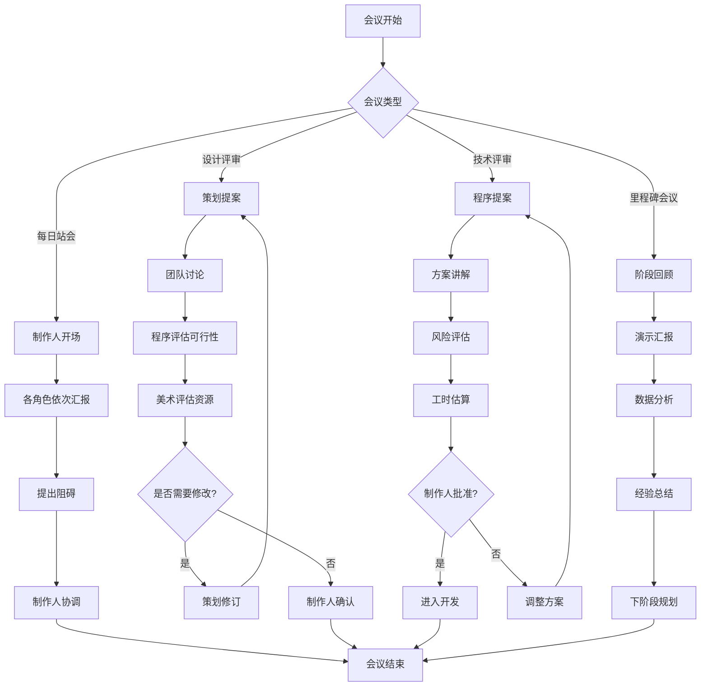
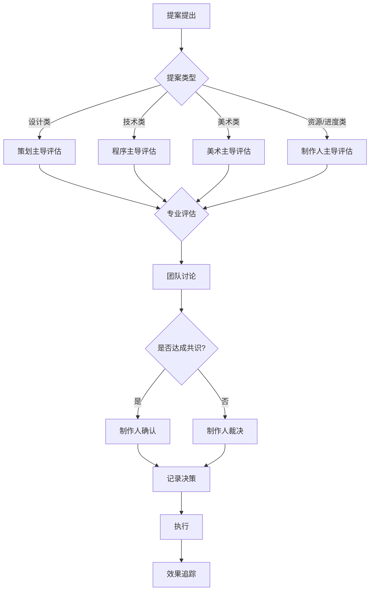

# 游戏小镇 (Game Dev Town)

> 一个由4个AI Agent智能体组成的游戏开发团队模拟系统，展示自主协作开发第一人称RPG游戏的完整过程。

[](LICENSE)
[](https://nodejs.org/)

## 目录

- [项目介绍](#项目介绍)
- [正在开发的游戏项目](#正在开发的游戏项目)
- [角色介绍](#角色介绍)
- [技术架构](#技术架构)
- [交互机制](#交互机制)
- [决策系统](#决策系统)
- [快速开始](#快速开始)
- [项目结构](#项目结构)
- [扩展方向](#扩展方向)

---

## 项目介绍

### 背景

游戏小镇是一个**游戏开发团队模拟系统**，展示了如何让多个AI Agent扮演不同的游戏开发角色，通过**会议讨论**的方式进行自主交互，协作完成游戏开发任务。

### 核心特色

- **🤖 四个专业角色**：制作人、程序员、策划、美术，各司其职
- **💬 会议驱动协作**：通过每日站会、设计评审、技术评审等会议进行沟通
- **🧠 角色记忆系统**：每个角色都能记住项目讨论历史和决策
- **⚖️ 决策机制**：基于角色职责和性格的智能决策流程
- **📊 实时看板**：可视化展示任务状态和项目进度

### 系统目标

演示多Agent系统在复杂项目协作场景中的应用，展示：

1. 角色扮演与专业领域知识
2. 团队协作与任务分工
3. 会议讨论与决策流程
4. 项目管理与进度追踪

---

## 正在开发的游戏项目

团队正在开发一款第一人称RPG游戏：

### 《幻境传说》(Realm of Illusion)

| 属性 | 描述 |
|------|------|
| **类型** | 第一人称RPG |
| **视角** | 第一人称沉浸式 |
| **世界** | 开放世界探索 |
| **核心玩法** | 元素魔法战斗系统 |

### 核心特色

- **⚔️ 第一人称战斗**：沉浸式的近战与魔法战斗体验
- **🌍 开放世界**：自由探索的奇幻大陆
- **📖 多分支剧情**：玩家选择影响世界走向
- **🔥 元素魔法系统**：火、冰、雷、风四大元素组合技
- **🏰 动态世界**：NPC有自己的日程和故事

### 开发阶段

```
┌─────────────────────────────────────────────────────────────┐
│  Phase 1     │  Phase 2     │  Phase 3     │  Phase 4     │
│  概念设计    │  核心开发    │  内容制作    │  打磨发布    │
│  ✓ 完成      │  ● 进行中    │  ○ 待开始    │  ○ 待开始    │
└─────────────────────────────────────────────────────────────┘
```

---

## 角色介绍

### 制作人 - Alex

```
┌──────────────────────────────────────────────────────────────┐
│  🎬 Alex - Producer                                          │
├──────────────────────────────────────────────────────────────┤
│  "项目成功的关键是平衡——平衡时间、资源和质量。"            │
├──────────────────────────────────────────────────────────────┤
│  职责：                                                      │
│  • 项目把控与里程碑规划                                      │
│  • 预算管理与资源分配                                        │
│  • 团队协调与冲突解决                                        │
│  • 对外沟通与最终决策                                        │
├──────────────────────────────────────────────────────────────┤
│  关键属性            │  决策倾向                             │
│  ─────────────────────────────────────────────────────────── │
│  决策力：★★★★★      │  优先考虑项目进度和资源平衡           │
│  沟通力：★★★★☆      │  在冲突时寻求最优解                   │
│  风险管理：★★★★☆    │  关注项目可行性评估                   │
├──────────────────────────────────────────────────────────────┤
│  性格特征 (OCEAN)：                                          │
│  开放性：70% │ 尽责性：90% │ 外向性：80%                     │
│  宜人性：65% │ 神经质：30%                                    │
└──────────────────────────────────────────────────────────────┘
```

**典型发言**：
> "各位，我们这周的目标是完成战斗系统的原型。Cody，技术评估怎么样？Diana，设计文档准备好了吗？"

### 程序员 - Cody

```
┌──────────────────────────────────────────────────────────────┐
│  💻 Cody - Developer                                         │
├──────────────────────────────────────────────────────────────┤
│  "代码是艺术，但首先要能运行。让我评估一下可行性。"        │
├──────────────────────────────────────────────────────────────┤
│  职责：                                                      │
│  • 技术架构设计与实现                                        │
│  • 核心代码编写与优化                                        │
│  • 引擎优化与性能调优                                        │
│  • Bug修复与技术支持                                         │
├──────────────────────────────────────────────────────────────┤
│  关键属性            │  决策倾向                             │
│  ─────────────────────────────────────────────────────────── │
│  技术能力：★★★★★    │  优先考虑技术可行性                   │
│  问题解决：★★★★☆    │  关注系统稳定性与性能                 │
│  效率意识：★★★★☆    │  倾向于选择成熟的解决方案             │
├──────────────────────────────────────────────────────────────┤
│  性格特征 (OCEAN)：                                          │
│  开放性：60% │ 尽责性：85% │ 外向性：40%                     │
│  宜人性：70% │ 神经质：35%                                    │
└──────────────────────────────────────────────────────────────┘
```

**典型发言**：
> "从技术角度来看，这个战斗系统的实现需要大约两周。不过元素组合技的物理计算可能会影响性能，我建议先做一个简化版原型。"

### 策划 - Diana

```
┌──────────────────────────────────────────────────────────────┐
│  📝 Diana - Designer                                         │
├──────────────────────────────────────────────────────────────┤
│  "好的游戏体验来自于对细节的极致追求。"                    │
├──────────────────────────────────────────────────────────────┤
│  职责：                                                      │
│  • 玩法设计与创意提案                                        │
│  • 数值平衡与系统规则                                        │
│  • 关卡设计与世界构建                                        │
│  • 世界观与剧情撰写                                          │
├──────────────────────────────────────────────────────────────┤
│  关键属性            │  决策倾向                             │
│  ─────────────────────────────────────────────────────────── │
│  创意力：★★★★★      │  优先考虑游戏体验                     │
│  逻辑性：★★★★☆      │  追求玩法创新与独特性                 │
│  用户思维：★★★★★    │  从玩家角度思考问题                   │
├──────────────────────────────────────────────────────────────┤
│  性格特征 (OCEAN)：                                          │
│  开放性：95% │ 尽责性：75% │ 外向性：60%                     │
│  宜人性：70% │ 神经质：40%                                    │
└──────────────────────────────────────────────────────────────┘
```

**典型发言**：
> "我设计了一个新的元素共鸣系统——当玩家连续使用不同元素时，会触发组合效果。比如冰+火会产生蒸汽爆炸。这样的设计既增加了策略深度，又让战斗更有趣！"

### 美术 - Arty

```
┌──────────────────────────────────────────────────────────────┐
│  🎨 Arty - Artist                                            │
├──────────────────────────────────────────────────────────────┤
│  "视觉是玩家感受世界的第一扇窗。"                          │
├──────────────────────────────────────────────────────────────┤
│  职责：                                                      │
│  • 视觉风格确定与把控                                        │
│  • 角色与场景原画设计                                        │
│  • UI/UX设计与交互视觉                                       │
│  • 特效动画与视觉反馈                                        │
├──────────────────────────────────────────────────────────────┤
│  关键属性            │  决策倾向                             │
│  ─────────────────────────────────────────────────────────── │
│  审美力：★★★★★      │  优先考虑视觉品质                     │
│  表现力：★★★★★      │  追求风格统一与艺术感                 │
│  创造力：★★★★☆      │  注重玩家的视觉体验                   │
├──────────────────────────────────────────────────────────────┤
│  性格特征 (OCEAN)：                                          │
│  开放性：90% │ 尽责性：70% │ 外向性：55%                     │
│  宜人性：80% │ 神经质：45%                                    │
└──────────────────────────────────────────────────────────────┘
```

**典型发言**：
> "对于《幻境传说》的美术风格，我建议采用'低多边形+手绘贴图'的混合风格。这样既能保证性能，又能呈现独特的奇幻氛围。我已经做了一些概念图，大家可以看看。"

---

## 技术架构

### 系统分层图

```
┌─────────────────────────────────────────────────────────────────────────┐
│                        UI Layer (用户界面层)                             │
├─────────────────────────────────────────────────────────────────────────┤
│  ┌──────────┐  ┌──────────┐  ┌──────────┐  ┌──────────┐  ┌──────────┐  │
│  │ 会议视图 │  │ 角色面板 │  │ 项目看板 │  │ 决策日志 │  │ 聊天记录 │  │
│  └──────────┘  └──────────┘  └──────────┘  └──────────┘  └──────────┘  │
└─────────────────────────────────────────────────────────────────────────┘
                                    │
                                    ▼
┌─────────────────────────────────────────────────────────────────────────┐
│                 Meeting Orchestrator (会议编排层)                        │
├─────────────────────────────────────────────────────────────────────────┤
│  ┌──────────────┐  ┌──────────────┐  ┌──────────────┐  ┌────────────┐  │
│  │  会议调度器  │  │  话题管理器  │  │  决策流程器  │  │  任务分配  │  │
│  │  Scheduler   │  │ TopicManager │  │DecisionFlow  │  │TaskAssign  │  │
│  └──────────────┘  └──────────────┘  └──────────────┘  └────────────┘  │
└─────────────────────────────────────────────────────────────────────────┘
                                    │
                                    ▼
┌─────────────────────────────────────────────────────────────────────────┐
│                        Agent Layer (智能体层)                            │
├─────────────────────────────────────────────────────────────────────────┤
│  ┌─────────────┐  ┌─────────────┐  ┌─────────────┐  ┌─────────────┐    │
│  │ ProducerAgent│  │DeveloperAgent│  │DesignerAgent│  │ ArtistAgent │    │
│  │             │  │             │  │             │  │             │    │
│  │ - 决策逻辑  │  │ - 技术评估  │  │ - 创意生成  │  │ - 视觉把控  │    │
│  │ - 资源管理  │  │ - 实现方案  │  │ - 数值设计  │  │ - 风格统一  │    │
│  └─────────────┘  └─────────────┘  └─────────────┘  └─────────────┘    │
└─────────────────────────────────────────────────────────────────────────┘
                                    │
                                    ▼
┌─────────────────────────────────────────────────────────────────────────┐
│                        Core Layer (核心层)                               │
├─────────────────────────────────────────────────────────────────────────┤
│  ┌────────────┐  ┌────────────┐  ┌────────────┐  ┌────────────────┐    │
│  │MemorySystem│  │DecisionSys │  │ TaskSystem │  │  ChatDisplay   │    │
│  │            │  │            │  │            │  │                │    │
│  │ - 短期记忆 │  │ - 投票机制 │  │ - 任务创建 │  │ - 实时渲染    │    │
│  │ - 长期记忆 │  │ - 权重计算 │  │ - 状态追踪 │  │ - 消息格式化  │    │
│  │ - 记忆检索 │  │ - 结果执行 │  │ - 依赖管理 │  │ - 历史记录    │    │
│  └────────────┘  └────────────┘  └────────────┘  └────────────────┘    │
└─────────────────────────────────────────────────────────────────────────┘
                                    │
                                    ▼
┌─────────────────────────────────────────────────────────────────────────┐
│                     Infrastructure (基础设施层)                          │
├─────────────────────────────────────────────────────────────────────────┤
│  ┌────────────┐  ┌────────────┐  ┌────────────┐  ┌────────────────┐    │
│  │   LLM API  │  │   Storage  │  │   Config   │  │    Logger      │    │
│  │  (Claude)  │  │  (JSON)    │  │ (YAML/ENV) │  │  (Winston)     │    │
│  └────────────┘  └────────────┘  └────────────┘  └────────────────┘    │
└─────────────────────────────────────────────────────────────────────────┘
```

### 核心模块说明

#### 1. Agent System (智能体系统)

```javascript
// 基础Agent类
class BaseAgent {
  constructor(config) {
    this.id = config.id;           // 唯一标识
    this.name = config.name;       // 角色名称
    this.role = config.role;       // 角色类型
    this.personality = config.personality; // OCEAN性格
    this.expertise = config.expertise;     // 专业领域
    this.memory = new MemorySystem();      // 记忆系统
  }

  // 处理输入并生成响应
  async processInput(context) {
    const relevantMemories = this.memory.retrieve(context);
    const prompt = this.buildPrompt(context, relevantMemories);
    return await this.llm.generate(prompt);
  }

  // 根据职责做决策
  async makeDecision(proposal) {
    const factors = this.evaluateFactors(proposal);
    return this.weightedChoice(factors);
  }
}
```

#### 2. Memory System (记忆系统)

```javascript
class MemorySystem {
  constructor() {
    this.shortTerm = [];  // 近期对话 (最近10轮)
    this.longTerm = [];   // 重要决策和事件
    this.project = {};    // 项目相关记忆
  }

  // 存储记忆
  store(memory, type = 'short') {
    const entry = {
      content: memory,
      timestamp: Date.now(),
      importance: this.calculateImportance(memory)
    };

    if (type === 'long' || entry.importance > THRESHOLD) {
      this.longTerm.push(entry);
    } else {
      this.shortTerm.push(entry);
      if (this.shortTerm.length > 10) {
        this.shortTerm.shift();
      }
    }
  }

  // 检索相关记忆
  retrieve(context) {
    return [
      ...this.shortTerm,
      ...this.longTerm.filter(m => this.isRelevant(m, context))
    ];
  }
}
```

#### 3. Task System (任务系统)

```javascript
class TaskSystem {
  constructor() {
    this.tasks = new Map();
    this.dependencies = new Graph();
  }

  createTask(task) {
    const t = {
      id: generateId(),
      title: task.title,
      description: task.description,
      assignee: task.assignee,
      status: 'pending',
      priority: task.priority,
      dueDate: task.dueDate,
      dependencies: task.dependencies || []
    };
    this.tasks.set(t.id, t);
    return t;
  }

  updateStatus(taskId, status) {
    const task = this.tasks.get(taskId);
    if (task) {
      task.status = status;
      this.notifyStakeholders(task);
    }
  }
}
```

---

## 交互机制

### 会议系统

会议是角色协作的核心方式，不同类型的会议有不同的目的和流程：

```
┌─────────────────────────────────────────────────────────────────┐
│                       Meeting Room (会议室)                      │
├─────────────────────────────────────────────────────────────────┤
│                                                                 │
│  ┌─────────────┐   ┌─────────────┐   ┌─────────────┐           │
│  │  每日站会   │   │  设计评审   │   │  技术评审   │           │
│  │  Daily      │   │  Design     │   │  Technical  │           │
│  │  Standup    │   │  Review     │   │  Review     │           │
│  │             │   │             │   │             │           │
│  │  15分钟    │   │  60分钟    │   │  45分钟    │           │
│  │  快速同步   │   │  深度讨论   │   │  方案评估   │           │
│  └─────────────┘   └─────────────┘   └─────────────┘           │
│                                                                 │
│  ┌─────────────┐   ┌─────────────┐                             │
│  │  美术评审   │   │  里程碑会议 │                             │
│  │  Art        │   │  Milestone  │                             │
│  │  Review     │   │  Meeting    │                             │
│  │             │   │             │                             │
│  │  30分钟    │   │  90分钟    │                             │
│  │  风格确认   │   │  阶段总结   │           │
│  └─────────────┘   └─────────────┘                             │
│                                                                 │
└─────────────────────────────────────────────────────────────────┘
```

### 会议类型详解

| 会议类型 | 发起者 | 参与者 | 时长 | 主要内容 |
|----------|--------|--------|------|----------|
| **每日站会** | 制作人 | 全员 | 15分钟 | 同步进度、提出问题、协调资源 |
| **设计评审** | 策划 | 全员 | 60分钟 | 玩法提案、系统设计、体验讨论 |
| **技术评审** | 程序 | 制作人+策划 | 45分钟 | 技术方案、风险分析、工时评估 |
| **美术评审** | 美术 | 制作人+策划 | 30分钟 | 风格确定、资源规划、质量把控 |
| **里程碑会议** | 制作人 | 全员 | 90分钟 | 阶段总结、演示汇报、下阶段计划 |

### 会议流程图



### 对话系统

#### 对话模板结构

```javascript
const MEETING_TEMPLATES = {
  daily_standup: {
    producer: [
      "好的，我们开始今天的站会。{name}，你先说说进度？",
      "今天的会议重点是{topic}，大家有什么想法？",
      "感谢{speaker}的汇报。{next}，到你了吗？"
    ],
    designer: [
      "关于{feature}的设计，我有一个新的想法...",
      "根据上次讨论，我更新了{system}的设计文档。",
      "我这边需要{resource}支持，预计{time}能完成。"
    ],
    developer: [
      "从技术角度来说，{feature}的实现难度是{level}...",
      "我发现了一个潜在的问题：{issue}",
      "代码方面，我建议采用{approach}方案。",
      "性能测试结果显示{result}。"
    ],
    artist: [
      "美术风格上，我建议采用{style}方向...",
      "{resource}的资源我已经完成了{percent}%。",
      "视觉上有个想法：{idea}",
      "需要确认一下{detail}的具体需求。"
    ]
  },

  design_review: {
    producer: [
      "好的Diana，请介绍一下你的设计方案。",
      "Cody，从技术角度来看这个方案可行性如何？",
      "我们把这个方案记录下来，下一步是..."
    ],
    designer: [
      "今天要讨论的是{system}系统，我的设计思路是...",
      "这个设计的核心目标是{goal}，通过{approach}来实现。",
      "关于玩家反馈，我考虑加入{feature}..."
    ],
    developer: [
      "方案整体不错，但{aspect}可能需要调整。",
      "技术实现上，我有几个建议...",
      "这个功能的开发周期大约需要{time}。"
    ],
    artist: [
      "从视觉表现角度，我觉得{aspect}需要加强。",
      "这个设计给我的美术发挥空间很大。",
      "UI部分我可以配合{style}风格来设计。"
    ]
  }
};
```

#### 对话上下文管理

```javascript
class ConversationManager {
  constructor() {
    this.history = [];
    this.currentTopic = null;
    this.activeMeeting = null;
  }

  // 添加消息到历史
  addMessage(speaker, content, type = 'normal') {
    const message = {
      id: generateId(),
      speaker,
      content,
      type,        // 'normal', 'decision', 'action_item'
      timestamp: Date.now(),
      meeting: this.activeMeeting
    };
    this.history.push(message);
    return message;
  }

  // 获取上下文
  getContext(windowSize = 10) {
    return this.history.slice(-windowSize);
  }

  // 提取行动项
  extractActionItems(message) {
    const items = [];
    const patterns = [
      /(\w+)需要(.+)/,
      /(\w+)负责(.+)/,
      /下一步(.+)/
    ];

    for (const pattern of patterns) {
      const matches = message.content.match(pattern);
      if (matches) {
        items.push({
          assignee: matches[1],
          task: matches[2]
        });
      }
    }
    return items;
  }
}
```

---

## 决策系统

### 决策流程

角色根据职责和专业领域参与决策，最终由制作人确认或裁决：



### 决策权重系统

```javascript
const DECISION_WEIGHTS = {
  // 设计相关决策
  design: {
    designer: 0.4,    // 策划权重最高
    producer: 0.25,
    developer: 0.2,
    artist: 0.15
  },

  // 技术相关决策
  technical: {
    developer: 0.5,   // 程序权重最高
    producer: 0.25,
    designer: 0.15,
    artist: 0.1
  },

  // 美术相关决策
  art: {
    artist: 0.45,     // 美术权重最高
    producer: 0.25,
    designer: 0.2,
    developer: 0.1
  },

  // 资源/进度相关决策
  resource: {
    producer: 0.5,    // 制作人权重最高
    developer: 0.2,
    designer: 0.15,
    artist: 0.15
  }
};
```

### 决策示例

```javascript
// 场景：决定战斗系统的技术方案
const decision = {
  topic: "战斗系统技术方案选择",
  type: "technical",
  options: [
    {
      id: "A",
      name: "物理引擎方案",
      description: "使用真实物理模拟",
      votes: {
        developer: { choice: "A", confidence: 0.9, reason: "效果真实但性能开销大" },
        producer: { choice: "A", confidence: 0.6, reason: "效果更好，但担心进度" },
        designer: { choice: "B", confidence: 0.7, reason: "B方案更容易调整数值" },
        artist: { choice: "abstain", confidence: 0, reason: "无专业意见" }
      }
    },
    {
      id: "B",
      name: "动画驱动方案",
      description: "使用预设动画+命中检测",
      votes: {
        developer: { choice: "A", confidence: 0.9, reason: "动画方案更稳定" },
        // ...
      }
    }
  ]
};

// 计算加权结果
function calculateDecision(decision) {
  const weights = DECISION_WEIGHTS[decision.type];
  let scores = {};

  for (const option of decision.options) {
    let score = 0;
    for (const [role, vote] of Object.entries(option.votes)) {
      if (vote.choice === option.id) {
        score += weights[role] * vote.confidence;
      }
    }
    scores[option.id] = score;
  }

  return Object.entries(scores)
    .sort((a, b) => b[1] - a[1])[0];
}
```

---

## 快速开始

### 环境要求

- Node.js >= 18.0.0
- npm >= 9.0.0
- Anthropic API Key

### 安装步骤

```bash
# 1. 克隆项目
git clone https://github.com/your-org/game-dev-town.git
cd game-dev-town

# 2. 安装依赖
npm install

# 3. 配置环境变量
cp .env.example .env
# 编辑 .env 文件，填入你的 API Key
```

### 配置说明

```yaml
# config/config.yaml
llm:
  provider: anthropic
  model: claude-sonnet-4-6
  temperature: 0.7
  max_tokens: 2000

agents:
  producer:
    name: Alex
    personality:
      openness: 0.7
      conscientiousness: 0.9
      extraversion: 0.8
      agreeableness: 0.65
      neuroticism: 0.3

  developer:
    name: Cody
    personality:
      openness: 0.6
      conscientiousness: 0.85
      extraversion: 0.4
      agreeableness: 0.7
      neuroticism: 0.35

  # ... 其他角色配置

meeting:
  standup_time: "09:00"
  max_duration: 15  # 分钟
```

### 运行项目

```bash
# 启动开发服务器
npm run dev

# 运行单次会议模拟
npm run meeting -- --type design-review

# 运行完整项目模拟
npm run simulate -- --days 30
```

### API使用示例

```javascript
import { GameDevTown } from './src';

// 初始化
const town = new GameDevTown({
  apiKey: process.env.ANTHROPIC_API_KEY
});

// 启动项目
await town.startProject({
  name: "幻境传说",
  type: "first-person-rpg",
  timeline: "6-months"
});

// 触发会议
const meeting = await town.holdMeeting('design-review', {
  topic: '战斗系统设计',
  proposer: 'designer'
});

// 获取会议纪要
console.log(meeting.minutes);

// 获取项目状态
const status = await town.getProjectStatus();
console.log(status.tasks);
```

---

## 项目结构

```
game-dev-town/
├── config/                     # 配置文件
│   ├── config.yaml            # 主配置
│   ├── agents.yaml            # 角色配置
│   └── prompts/               # 提示词模板
│       ├── producer.yaml
│       ├── developer.yaml
│       ├── designer.yaml
│       └── artist.yaml
│
├── src/
│   ├── agents/                # 智能体实现
│   │   ├── base.js           # 基础Agent类
│   │   ├── producer.js       # 制作人
│   │   ├── developer.js      # 程序员
│   │   ├── designer.js       # 策划
│   │   └── artist.js         # 美术
│   │
│   ├── core/                  # 核心系统
│   │   ├── memory.js         # 记忆系统
│   │   ├── decision.js       # 决策系统
│   │   ├── task.js           # 任务系统
│   │   └── conversation.js   # 对话管理
│   │
│   ├── meeting/               # 会议系统
│   │   ├── orchestrator.js   # 会议编排
│   │   ├── templates.js      # 对话模板
│   │   └── minutes.js        # 会议纪要
│   │
│   ├── ui/                    # 用户界面
│   │   ├── chat.js           # 聊天展示
│   │   ├── dashboard.js      # 项目看板
│   │   └── timeline.js       # 时间线视图
│   │
│   └── index.js               # 入口文件
│
├── data/                      # 数据存储
│   ├── memories/             # 角色记忆
│   ├── decisions/            # 决策记录
│   └── meetings/             # 会议纪要
│
├── tests/                     # 测试文件
│   ├── agents.test.js
│   ├── meeting.test.js
│   └── decision.test.js
│
├── docs/                      # 文档
│   ├── architecture.md       # 架构设计
│   ├── api.md               # API文档
│   └── examples.md          # 使用示例
│
├── .env.example              # 环境变量示例
├── package.json
└── README.md
```

---

## 扩展方向

### 短期扩展

1. **更多会议类型**
   - 头脑风暴会议
   - 代码审查会议
   - 玩法测试反馈会议

2. **更丰富的角色互动**
   - 私下对话（非正式沟通）
   - 角色关系系统
   - 情绪状态影响

3. **项目生成物**
   - 自动生成设计文档
   - 会议纪要邮件通知
   - 项目进度报告

### 中期扩展

1. **添加更多角色**
   - QA测试工程师
   - 音效设计师
   - 关卡设计师
   - 编剧

2. **可视化界面**
   - Web端聊天界面
   - 3D办公室场景
   - 实时角色动画

3. **与其他系统集成**
   - GitHub集成（自动创建Issue）
   - Notion集成（同步文档）
   - Slack集成（消息通知）

### 长期愿景

1. **真实项目模拟**
   - 接入真实游戏引擎
   - 生成可玩原型
   - 玩家测试反馈循环

2. **多项目并行**
   - 模拟游戏公司运营
   - 资源跨项目分配
   - 公司战略决策

3. **教育与培训**
   - 游戏开发流程教学
   - 团队协作模拟训练
   - 项目管理实践

---

## 致谢

本项目灵感来源于：

- [Cyber Town](../cyberTown/) - 赛博小镇项目架构
- [AutoGen](https://github.com/microsoft/autogen) - 多Agent对话框架
- [CrewAI](https://github.com/joaomdmoura/crewAI) - 角色扮演Agent框架

---

## 许可证

[MIT License](LICENSE)

---

<p align="center">
  <b>游戏小镇</b><br>
  <i>让AI Agent带你体验游戏开发的乐趣</i>
</p>
