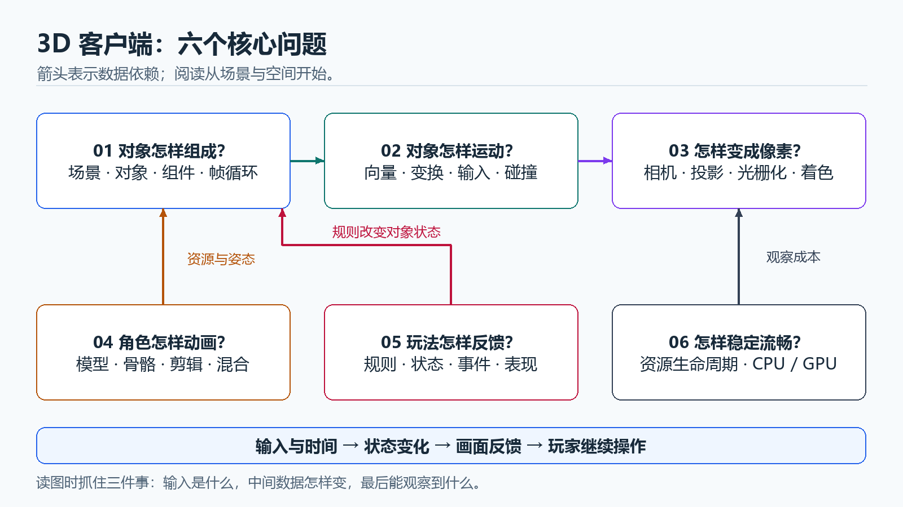
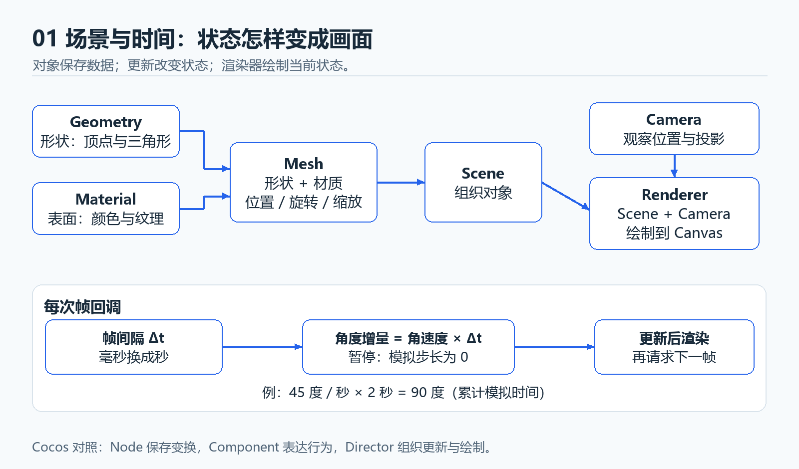
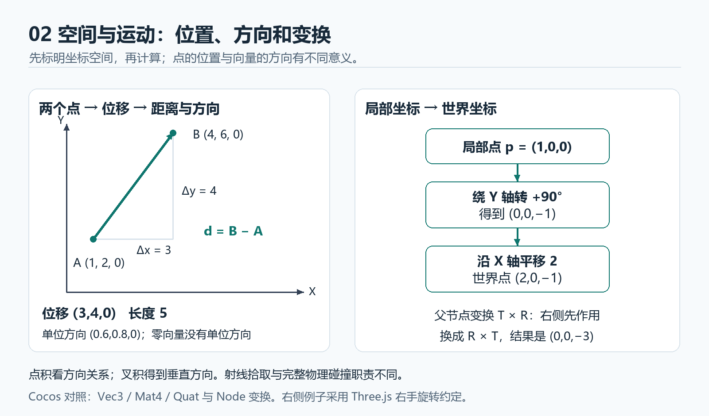
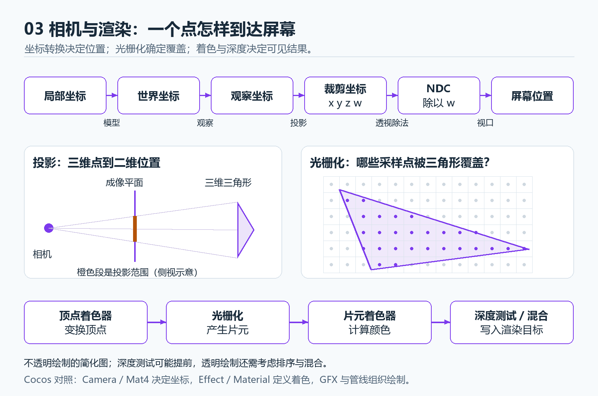
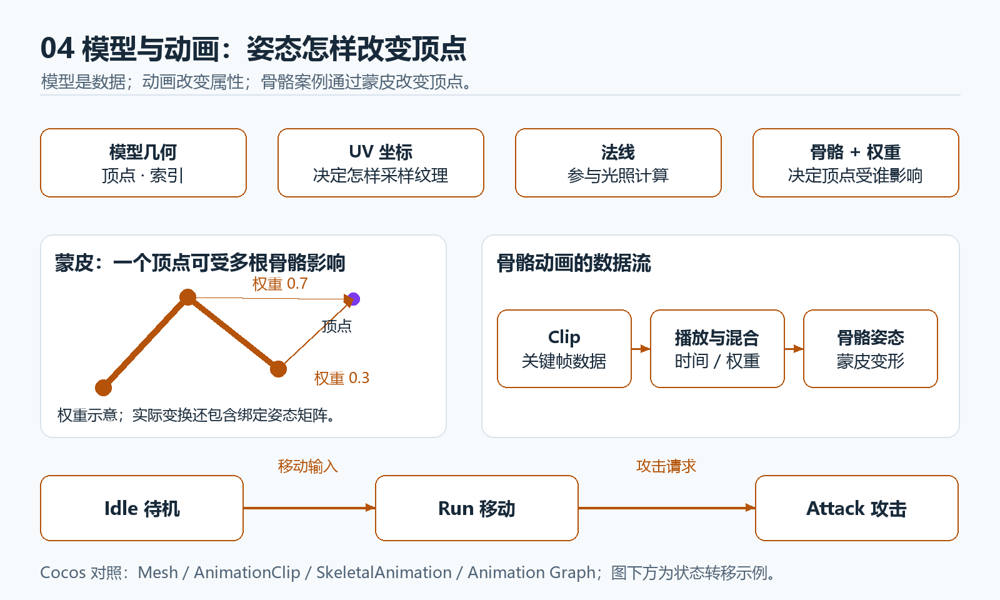
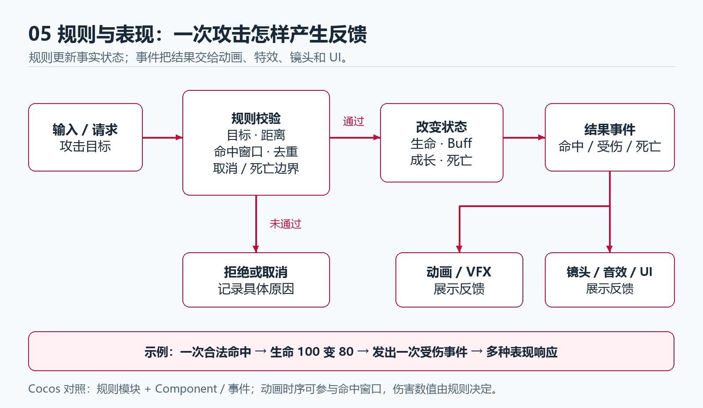
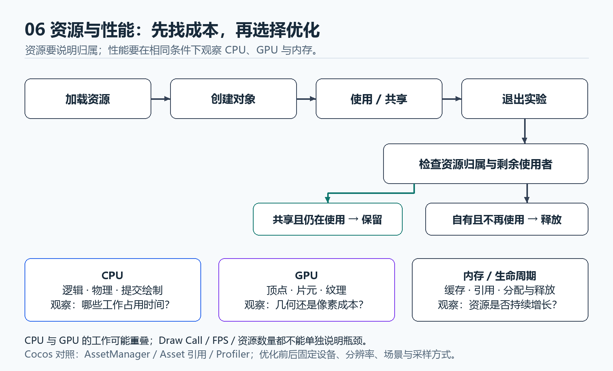

# 3D 客户端核心知识图册

先读图建立整体认识，再用小实验验证。首次只看总览、场景与时间、空间与运动；每次能解释一个变化就继续。

## 总览

## 01 场景与时间

**记住：对象保存状态，更新改变状态，渲染展示状态。** 练习中让模拟暂停、保留渲染；恢复时重建时间基准。

小实验：改变角速度，再暂停、继续。解释角度变化来自什么时间，而不是只看它是否转动。

## 02 空间与运动

**记住：点是位置，向量是方向与大小；变换顺序影响结果。** 图中坐标是例子的单位，迁移时核对轴向、角度单位和矩阵约定。

小实验：移动父节点、保持子节点局部位置，观察世界位置；用点积判断朝向，用射线查询目标，另做碰撞检测与响应。

## 03 相机与渲染

**记住：投影解决位置，光栅化确定覆盖，着色与深度影响可见结果。** 齐次裁剪发生在透视除法前，w=0 不能直接相除；材质参数、纹理、法线与光照参与具体着色计算。

小实验：改变相机位置与 FOV，追踪一个点的中间坐标；再让两个三角形重叠，解释深度测试的作用。

## 04 模型与动画

**记住：Clip 保存动画数据，播放状态控制时间与权重，蒙皮把骨骼姿态作用到顶点。** 动画也能改变普通节点属性；图中选用骨骼案例。

小实验：播放、暂停、切换两个动作，观察时间和混合权重；导入时检查模型比例、朝向、材质和骨骼。

## 05 规则与反馈

**记住：规则更新游戏事实，事件驱动表现。** 动画时序可参与命中窗口；目标是否合法、伤害是多少仍由规则判断。

小实验：重复提交同一次命中，检查伤害去重；取消攻击或让目标死亡，再检查状态、事件与表现。

## 06 资源与性能

**记住：先检查归属和使用者，再释放；先定位瓶颈，再选择优化。** 退出还需取消帧任务与监听；几何体、纹理数量不等于精确 GPU 内存字节数。

小实验：反复进入、重置、退出，检查资源数量是否持续增长；固定设备、分辨率与场景后比较耗时。

## 把理解变成证据

| 看懂这一张图后 | 能做的解释 |
| --- | --- |
| 场景与时间 | 调一个速度参数，预测 2 秒后的状态 |
| 空间与运动 | 指出当前坐标空间，预测父节点改变后的世界位置 |
| 相机与渲染 | 说明一个点到屏幕的过程，区分位置、颜色和深度 |
| 模型与动画 | 说明关键帧、骨骼、顶点、时间和权重的关系 |
| 规则与反馈 | 复现一次命中或取消，说明状态和事件怎样变化 |
| 资源与性能 | 指出谁拥有资源，说明实测成本和结论范围 |

图册建立日期：2026-10-09。它是核心知识资料，实验实现、运行验证和个人理解仍在[进度表](../../user-profile/progress/3d-game-client-progress.md)分别登记。

需要具体代码、课时或深入资料时再展开

| 问题 | 补充入口 |
| --- | --- |
| 怎样安排练习 | [第一周](../../user-profile/progress/3d-game-client-week-01.md) · [前四周](../../user-profile/progress/3d-game-client-month-01.md) |
| 对应哪些 Cocos 机制 | [数学](../../domains/game-engine/guides/cocos-source-learning/01-core-foundation/01-math-types.md) · [场景图](../../domains/game-engine/guides/cocos-source-learning/02-scene-graph/README.md) · [渲染](../../domains/game-engine/guides/cocos-source-learning/03-rendering/README.md) |
| 动画与资源怎样实现 | [动画](../../domains/game-engine/guides/cocos-source-learning/04-functional-modules/01-animation-system.md) · [资源管理](../../domains/game-engine/guides/cocos-source-learning/05-asset-management/README.md) |
| 玩法结构怎样验证 | [slayDemo 复盘](../../domains/game-engine/godotProjects/slayDemo/docs/project-retrospective.md) |
| 原始资料与访问异常 | [资料地图与备用入口](../../learning-routes/resources/3d-game-client-resources.md) · [24 周选读计划](../../user-profile/progress/3d-game-client-reading-plan.md) |
| 图中动画与释放概念的原始依据 | [SkinnedMesh](https://threejs.org/docs/pages/SkinnedMesh.html) · [AnimationAction](https://threejs.org/docs/pages/AnimationAction.html) · [Cleanup](https://threejs.org/manual/pages/cleanup.html) |
| 坐标与光栅化的原始依据 | [Matrix4](https://threejs.org/docs/pages/Matrix4.html) · [MIT 21](https://ocw.mit.edu/courses/6-837-computer-graphics-fall-2012/resources/mit6_837f12_lec21/) |

