# openClasses 学习内容图解

先看图理解关系，再按资料入口查细节。新的学习计划等确定新目标后制定。

## 一 六个领域怎样连接

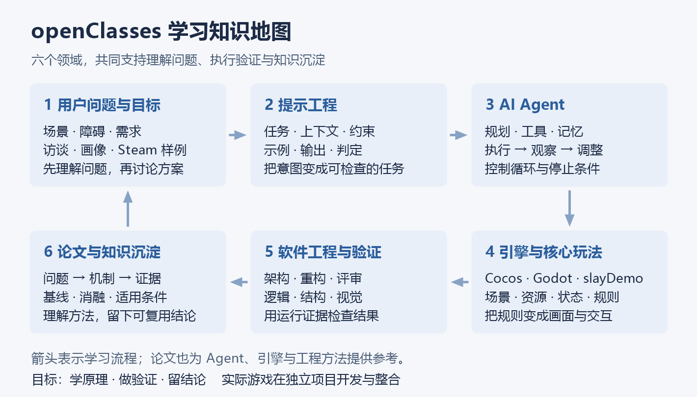

箭头表示一种学习与验证流程；论文也为 Agent、引擎和工程方法提供参考。

| 当前记录 | 依据 |
| --- | --- |
| CS146S、Hello-Agents、Prompt 课程已完成 | 既有学习档案记录 |
| OpenClaw 学习中 | 具体章节待补记 |
| 引擎源码、论文、软件工程与用户研究 | 有资料与样例，掌握程度按具体成果判断 |
| slayDemo | 保留学习资料；实际工程在独立 cocosProjects 项目 |

## 二 三门 Agent 课程的视角

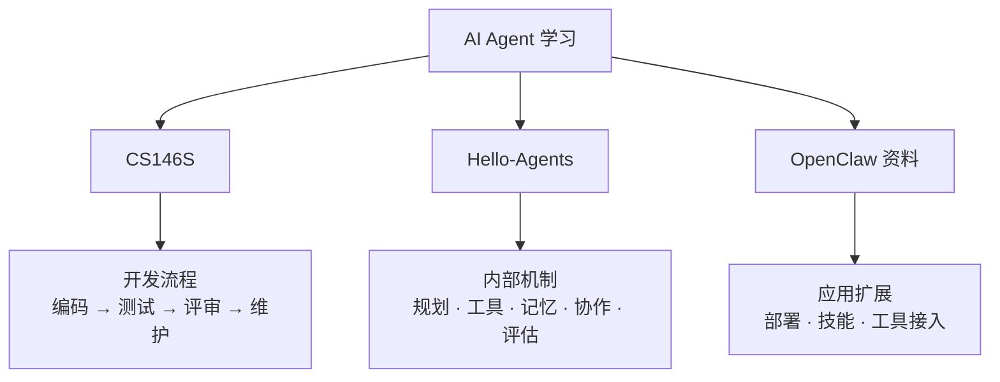

资料：[CS146S](../../domains/ai-agent/courses/CS146S-The-Modern-Software-Developer/README.md) · [Hello-Agents](../../domains/ai-agent/courses/Hello-Agents/README.md) · [OpenClaw](../../domains/ai-agent/courses/OpenClaw/README.md)

## 三 提示词负责把任务说明白

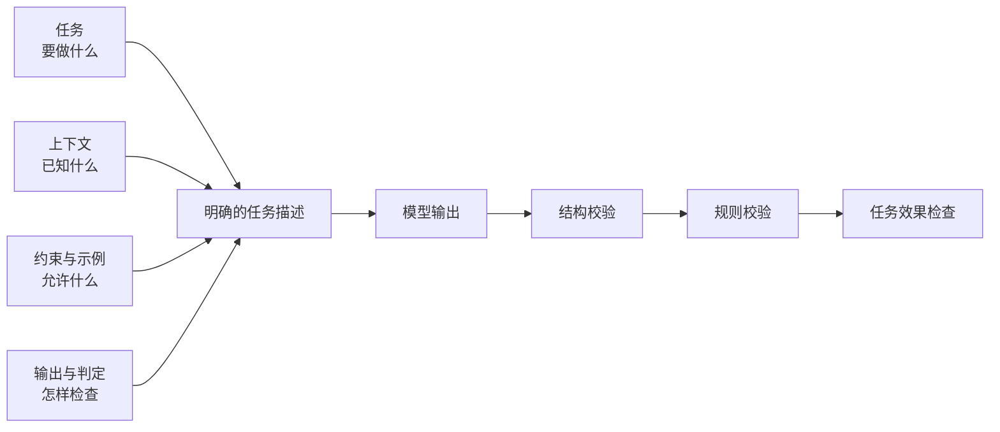

**记住：JSON 正确、动作合法、任务成功需要分别检查。**

资料：[提示工程综合指南](PROMPT_ENGINEERING_COMPREHENSIVE_GUIDE.md)

## 四 Agent 怎样执行任务

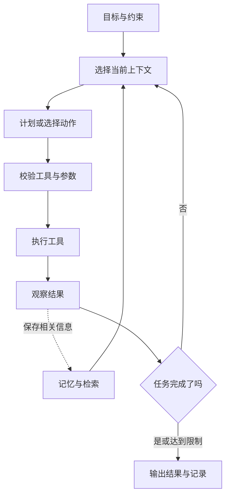

| 方法 | 图中的重点 |
| --- | --- |
| ReAct | 行动后读反馈，调整下一步 |
| Plan-and-Solve | 先拆出计划，再执行和修订 |
| Reflection | 根据评价修改结果，外部证据帮助纠错 |

资料：[行动模式](../../domains/ai-agent/courses/Hello-Agents/part2-building-agents/ch04-patterns/README.md) · [记忆](../../domains/ai-agent/courses/Hello-Agents/part3-advanced/ch08-memory/README.md) · [上下文](../../domains/ai-agent/courses/Hello-Agents/part3-advanced/ch09-context/README.md)

## 五 记忆 工具与协议的边界

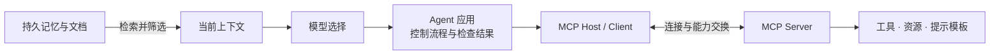

**记忆存下后还要取用；MCP 连接能力，应用负责决策流程。**

资料：[通信协议](../../domains/ai-agent/courses/Hello-Agents/part3-advanced/ch10-protocols/README.md) · [MCP 官方架构](https://modelcontextprotocol.io/docs/learn/architecture)

## 六 引擎把状态变成可交互的世界

以下是概念流程，实际调度顺序随引擎与项目实现变化。

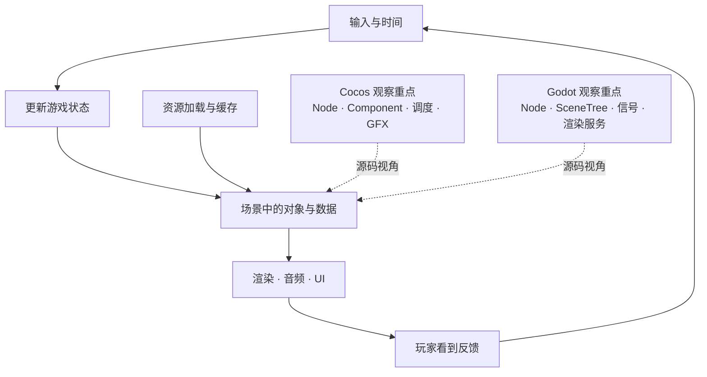

资料：[Cocos 源码指南](../../domains/game-engine/guides/cocos-source-learning/README.md) · [Godot 源码指南](../../domains/game-engine/guides/godot-source-learning/README.md)

## 七 slayDemo 的五层架构

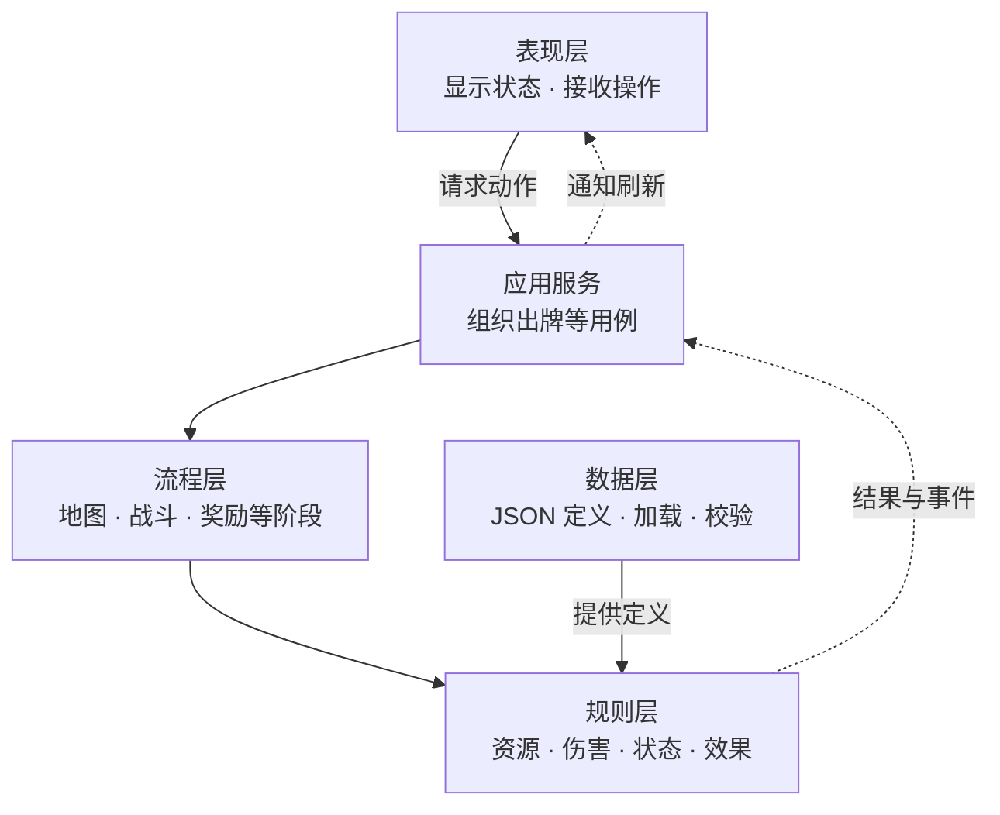

**静态卡牌定义与战斗临时状态分开；规则结果由程序计算，UI 负责展示。**

资料：[项目复盘](../../domains/game-engine/godotProjects/slayDemo/docs/project-retrospective.md) · [JSON 数据源 ADR](../../domains/game-engine/godotProjects/slayDemo/docs/adr/0001-use-json-as-source-data.md) · [状态效果设计](../../domains/game-engine/godotProjects/slayDemo/docs/design/06-status-and-buff-system.md)

## 八 工程验证覆盖三个层次

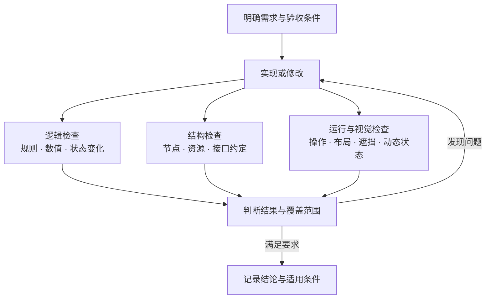

**截图相似不代表交互正确；测试通过只支持其覆盖的判定条件。**

归档前的 Godot 检查记录：864 项断言、5 项失败、3 条脚本错误。它不代表迁移后的 cocosProjects 工程状态。

资料：[软件工程](../../domains/software-engineering/README.md) · [UI 还原复盘](../../domains/game-engine/godotProjects/slayDemo/docs/tech/17-ui-restoration-lessons.md)

## 九 论文阅读要看机制与证据

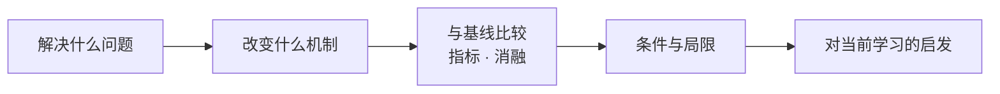

| 容易混淆的方法 | 改变的环节 |
| --- | --- |
| LoRA 等微调方法 | 模型参数的适配方式 |
| RAG | 外部知识获取与生成 |
| ReAct | 行动与反馈的组织方式 |

资料：[经典论文目录](../../domains/ai-papers/guides/classic-papers-learning/README.md) · [OpenGame](../../domains/ai-agent/papers/OpenGame_Analysis_Summary.md) · [GameDevBench](../../domains/game-engine/papers/GameDevBench/GameDevBenchSummary.md)

## 十 用户研究要区分事实 解释与方案

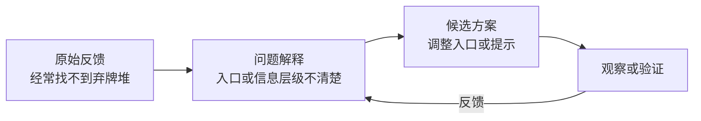

### Steam 历史样例的分类

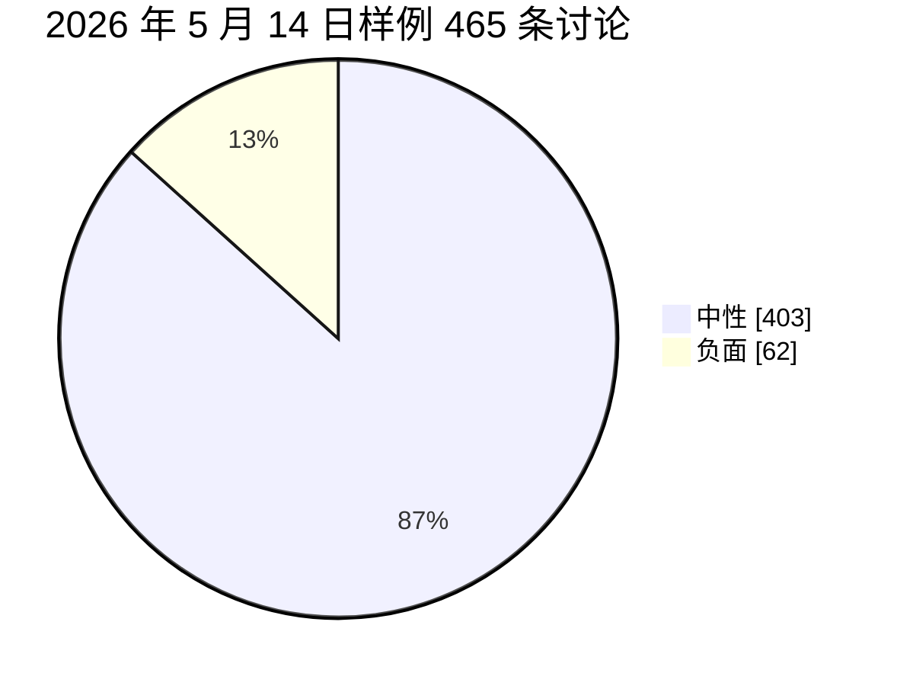

正面分类为 0。**非正面 100% ≠ 负面约 13.3%。** 标题关键词分类与板块采样也不代表全部玩家。

资料：[用户研究](../../domains/product-management/core-competencies/user-insight/user-research.md) · [Steam 历史报告](../../steam_data/user_insights_report.md)

## 十一 看图自测

| 看哪张图 | 能否独立解释 |
| --- | --- |
| 提示与校验 | 为什么格式正确仍可能执行失败？ |
| Agent 循环 | 如何停止，如何从错误反馈调整行动？ |
| 记忆与协议 | 存储、检索、上下文、工具分别做什么？ |
| 引擎与分层 | 点击如何改变状态，谁决定规则结果？ |
| 工程验证 | 逻辑、结构、视觉分别能发现什么问题？ |
| 论文与研究 | 方法的证据支持到哪里，数据结论是否成立？ |

[详细解释与 18 道自测题答案](2026-10-08-learning-review.md)
