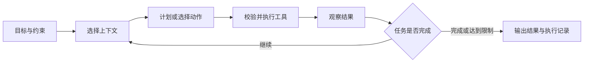

# openClasses 学习内容系统回顾

本次复习围绕已有课程、源码指南、玩法实验、论文笔记和用户研究资料，建立一张可以反复使用的知识地图。openClasses 的核心目标是理解原理、用小实验验证问题、留下可解释的结论；实际游戏开发和整合由独立项目承担。

现有内容可以串成一条主线：**理解问题 → 描述任务与上下文 → 编排行动 → 执行程序或游戏规则 → 检查结果 → 修正认识**。AI Agent、提示工程、游戏引擎、软件工程、论文和产品研究分别解决这条链上的不同问题。

复习日期为 2026 年 10 月 8 日。本次先回顾已有知识；新的学习方向与时间安排等你提供目标后再制定。

## 一 学习地图与成果依据

| 领域 | 已有资料 | 复习时要抓住的问题 | 个人学习记录 |
| --- | --- | --- | --- |
| AI Agent | CS146S、Hello-Agents、OpenClaw、研究助手和赛博小镇样例 | 系统如何从目标走到行动，再根据反馈调整？ | 档案记录前两门已完成；OpenClaw 进行中，章节进度待补记 |
| 提示工程 | 综合指南、分享文档、代码生成模板 | 怎样把模糊意图变成明确、可检查的任务？ | 档案记录 Prompt 设计与优化已完成 |
| 游戏引擎与玩法 | Cocos/Godot 源码指南、架构文档、slayDemo 设计与复盘 | 游戏状态如何演化，如何变成画面和交互？ | 已有资料和历史实验记录；源码章节掌握程度未完整登记 |
| 软件工程 | 设计模式、重构、架构、评审、AI 辅助开发、CLI 实践资料 | 怎样让修改更容易理解、验证和维护？ | 可结合已有代码和复盘复核 |
| AI 论文 | 十类经典论文资料、Agent Index、OpenGame、GameDevBench 分析 | 方法解决什么问题，证据支持到哪里？ | 已有阅读材料和分析笔记；逐篇个人进度待登记 |
| 产品与用户洞察 | 用户研究、访谈、画像、共情资料、Steam 分析样例 | 用户遇到什么问题，数据是否支持需求判断？ | 已有方法资料和历史分析样例 |

[学习档案](../../user-profile/learning-profile.md)中的课程完成记录来自此前登记；[技能矩阵](../../user-profile/skill-matrix.json)沿用 2026 年 4 月 17 日的自评。本次整理没有重新测试或提高技能等级。

阅读时区分三种成果：**资料收集**说明有材料可读；**笔记和代码样例**说明有理解或实现痕迹；**可复现的结果及其解释**才支持具体能力判断。课程完成记录值得保留，但不能替代每个知识点的独立验证。

源码和子模块是参考材料。阅读现有版本时应注意版本背景；这里不在子模块中开发、提交或推送。slayDemo 当前保留的是学习资料，实际工程已迁移至独立 cocosProjects 项目。

## 二 LLM 与提示工程

### 先理解模型在做什么

大语言模型根据输入上下文预测并生成后续 token。预训练让模型学习语言与数据中的模式，后续训练调整它完成任务、遵循指令等行为。生成结果可能流畅而错误，因此文字表达、事实正确性和程序执行正确性需要分别判断。

温度等采样设置影响输出的随机性，但降低随机性不能证明答案正确。上下文窗口限制一次请求能够容纳的信息；长期保存的文件或数据库不会自动进入当前请求，必须经过选择和读取。

### 一个可用提示词的组成

| 要素 | 要回答的问题 | 卡牌规则说明示例 |
| --- | --- | --- |
| 任务 | 要做什么？ | 从给定候选动作中选择一次行动 |
| 上下文 | 已知什么？ | 当前能量、手牌、敌人状态与规则 |
| 约束 | 哪些条件必须满足？ | 不选择不存在的卡牌；消耗不超过当前能量 |
| 示例 | 正确结果长什么样？ | 给出一个输入与合法输出对应的例子 |
| 输出格式 | 如何读取结果？ | 固定字段的 JSON，附简短决策理由 |
| 判定依据 | 怎样检查是否完成？ | 程序校验字段、目标和资源，再评估决策效果 |

Zero-shot 不提供演示例，Few-shot 提供少量例子帮助明确任务模式。例子需要覆盖真实变化，否则模型可能照搬样例中的偶然细节。

角色、CO-STAR 等框架帮助组织信息，核心仍是任务清楚、上下文相关、限制具体、结果可检查。让模型扮演专家不会自动增加事实可靠性；要求 JSON 也只约束表达结构，动作是否合法仍需规则程序判断。

复杂任务可以要求给出可检查的步骤、依据或简短理由。推理文字更长不代表更正确，也不需要把完整内部思考过程作为验收条件。

### 提示词与系统设计的边界

如果缺少资料，首先解决资料获取与筛选；如果缺少工具，首先提供可以执行的接口；如果输出非法，首先建立参数和规则校验。继续堆叠提示文字不能替代这些系统能力。

RAG 将检索到的外部材料用于生成，涉及检索与生成两个环节；它不是一句“请参考知识库”就能实现的能力。检索遗漏、材料错误和引用不匹配仍会导致错误。[RAG 原论文](https://arxiv.org/abs/2005.11401)解释了检索与生成结合的基本方法。

**复习资料**：[提示工程综合指南](PROMPT_ENGINEERING_COMPREHENSIVE_GUIDE.md)、[提示工程分享](PROMPT_ENGINEERING_SHARING.md)、[代码生成模板](../../domains/prompt-engineering/templates/code-generation.md)。

**回忆检查**：面对“帮我写一个游戏系统”，能否补全输入、规则、边界、输出与验证方式？能否解释为什么格式正确的输出仍可能执行失败？

## 三 Agent 的行动循环与系统组成

### Agent 如何完成任务

在本项目讨论的 LLM Agent 中，模型负责生成计划或行动选择，程序负责组织状态、调用工具、接收结果并决定是否继续。一次模型调用可以回答问题；Agent 系统进一步管理多步行动和环境反馈。

模型产生工具名与参数后，执行程序还要检查工具是否存在、参数是否有效、动作是否获准、错误是否需要重试。循环需要停止条件，例如任务完成、无可用动作、达到步数或时间限制。

### 三种常见模式

| 模式 | 核心做法 | 适合的问题 | 主要局限 |
| --- | --- | --- | --- |
| ReAct | 根据当前信息选择行动，读取观察，再调整后续行动 | 搜索、调试等需要环境反馈的任务 | 可能重复行动、陷入循环或被错误观察误导 |
| Plan-and-Solve | 先拆出计划，再执行各步骤；必要时修订计划 | 可以分解为相对明确步骤的任务 | 初始计划可能遗漏依赖，环境变化会让计划失效 |
| Reflection | 根据评价或反馈修改已有结果 | 可以明确评价不足的任务 | 自我评价可能延续原错误，需要外部证据或判定规则 |

这三种模式可以组合，不是必须三选一。ReAct 的关键是行动与观察交替；复盘时关注可观察的行动、结果和修订依据。[ReAct 原论文](https://arxiv.org/abs/2210.03629)提供了这一模式的研究背景。

### 记忆 上下文 检索与工具

- **上下文**是当前模型请求能看到的信息，包括目标、对话、状态和工具结果。上下文工程关注选什么、如何组织、何时更新或压缩。
- **记忆**是跨步骤或跨会话保留的信息。短期状态、历史事件、稳定事实、操作经验可以分别管理；保存后还要决定什么时候取用。
- **检索**帮助找到相关记忆或文档。相似度高不一定适用，仍需考虑时间、来源、条件和任务。
- **工具**提供执行或获取信息的能力。工具的返回结果是下一步判断依据，同时可能包含错误、过期数据或不可信文本。

记忆不等于模型参数，上下文不等于全部历史，RAG 不等于自动正确。课程中的人类记忆类比有助理解，但不能把“长期记忆永久保存”等表述直接当成软件系统的保留规则。

### 协议 框架与协作

MCP 以 Host、Client、Server 的结构连接应用与外部能力，服务器可提供工具、资源和提示模板。它规定信息与能力怎样交换；计划质量、上下文筛选和结果评估仍由应用设计决定。[MCP 官方架构说明](https://modelcontextprotocol.io/docs/learn/architecture)

A2A 相关章节关注 Agent 之间的任务协作与通信。复习时先分清“接入一个工具能力”与“委派一个任务”，再看协议如何表达请求、状态和结果；实现细节须结合对应版本。

多 Agent 可以按搜索、分析、汇总、评估等职责分工，但会增加通信、结果协调和成本。角色数量本身不是效果指标；必须说明分工解决了什么问题，如何判断各角色的输出。

### 评估与训练的区别

评估检查行为是否达到任务要求；训练改变模型参数或策略。调整提示、检索内容、工具和循环属于系统改进，不必然涉及训练。

评估至少分开观察：输出格式、动作合法性、任务结果、调用次数、耗时与失败原因。保持相同输入、规则和判定方式，比较才有意义。SFT、偏好学习和 Agentic-RL 是现有进阶材料中的训练主题，其材料存在不代表已经完成训练实验。

**复习资料**：[Hello-Agents 总览](../../domains/ai-agent/courses/Hello-Agents/README.md)、[第 4 章行动模式](../../domains/ai-agent/courses/Hello-Agents/part2-building-agents/ch04-patterns/README.md)、[第 7 章自定义框架](../../domains/ai-agent/courses/Hello-Agents/part2-building-agents/ch07-custom-framework/README.md)、[第 8 章记忆与检索](../../domains/ai-agent/courses/Hello-Agents/part3-advanced/ch08-memory/README.md)、[第 9 章上下文工程](../../domains/ai-agent/courses/Hello-Agents/part3-advanced/ch09-context/README.md)、[第 10 章通信协议](../../domains/ai-agent/courses/Hello-Agents/part3-advanced/ch10-protocols/README.md)、[第 12 章性能评估](../../domains/ai-agent/courses/Hello-Agents/part3-advanced/ch12-evaluation/README.md)。

## 四 课程内容如何连接到实际开发

### CS146S 关注软件开发的完整过程

十周内容可以按“理解模型 → 接入工具 → 开发 → 验证 → 维护”来回忆。

| 周次与资料 | 核心主题 | 应保留的理解 |
| --- | --- | --- |
| [第 1 周](../../domains/ai-agent/courses/CS146S-The-Modern-Software-Developer/week-01/SUMMARY.md) | LLM 基础与提示工程 | 输入描述和上下文影响输出，输出需要检查 |
| [第 2 周](../../domains/ai-agent/courses/CS146S-The-Modern-Software-Developer/week-02/SUMMARY.md) | Agent 架构与 MCP | 模型选择行动，系统执行工具并处理反馈 |
| [第 3 周](../../domains/ai-agent/courses/CS146S-The-Modern-Software-Developer/week-03/SUMMARY.md) | AI IDE 与 MCP 服务 | 代码上下文和工具接口如何进入开发过程 |
| [第 4 周](../../domains/ai-agent/courses/CS146S-The-Modern-Software-Developer/week-04/SUMMARY.md) | Claude Code 与自动化 | 将重复工作写成明确流程，保留检查与失败处理 |
| [第 5 周](../../domains/ai-agent/courses/CS146S-The-Modern-Software-Developer/week-05/SUMMARY.md) | 现代终端与命令行 | 命令执行结果是事实依据，需理解目录、参数和退出状态 |
| [第 6 周](../../domains/ai-agent/courses/CS146S-The-Modern-Software-Developer/week-06/SUMMARY.md) | 测试与安全 | 扫描、测试和人工判断各覆盖不同问题；静态扫描不能保证零误报 |
| [第 7 周](../../domains/ai-agent/courses/CS146S-The-Modern-Software-Developer/week-07/SUMMARY.md) | 软件支持与代码审查 | 检查需求、行为、边界、维护成本和验证证据 |
| [第 8 周](../../domains/ai-agent/courses/CS146S-The-Modern-Software-Developer/week-08/SUMMARY.md) | 自动化 UI 构建 | 看得像、结构正确、交互可用需要分别验证 |
| [第 9 周](../../domains/ai-agent/courses/CS146S-The-Modern-Software-Developer/week-09/SUMMARY.md) | 部署后的 Agent | 指标看趋势，日志看事件，追踪看一次请求的执行路径 |
| [第 10 周](../../domains/ai-agent/courses/CS146S-The-Modern-Software-Developer/week-10/SUMMARY.md) | AI 软件工程未来 | 讨论职责变化时仍需明确质量、责任和控制边界 |

复习优先使用各周 `SUMMARY.md` 找回结构，再进入详细材料或作业。旧合并文档可补充背景，但重复材料数量不等于独立学习成果。

### Hello-Agents 关注系统内部机制

16 章大致分为基础认知、构建方法、进阶机制、应用案例和综合实践。把第 4 章的模式、第 7 章的框架、第 8 至 10 章的记忆与通信、第 12 章的评估放在一起，可以解释一个 Agent 从输入到完成任务的全过程。

仓库中的[研究助手样例](../../domains/ai-agent/courses/Hello-Agents/part4-cases/ch14-research-agent/claudeImplement/README.md)包含规划、搜索、分析、汇总和评价角色，以及工具、消息和记忆组件。[赛博小镇样例](../../domains/ai-agent/courses/Hello-Agents/part4-cases/ch15-cyber-town-game/claudeImplement/README.md)把角色目标、记忆、行为、社交关系和世界时间组织在一起。两者都有实现资料，适合对照概念阅读；README 中的功能描述和历史测试报告不能直接代表当前运行状态。

### OpenClaw 资料关注应用与技能扩展

[现有课程目录](../../domains/ai-agent/courses/OpenClaw/README.md)覆盖基础、模型原理、部署、Skill 开发、记忆等进阶主题和应用案例。复习重点是：任务流程如何进入运行系统，工具怎样调用，技能怎样描述触发条件、步骤、输入输出和约束。

它与前两门课程存在重叠，可用已学过的模型、工具和记忆概念解释其应用结构。档案记录学习进行中，`PROGRESS.md` 仍需补充个人章节记录；模板勾选状态不能单独证明学过或没学过。旧资料中的“最火”、平台支持列表和部署命令属于时效内容，实际使用时需另行核对。

## 五 游戏引擎原理与源码阅读

### 两种引擎共同解决的问题

游戏引擎把对象、资源、输入和时间组织起来，更新游戏状态，再通过渲染、音频等系统产生反馈。读源码时应沿一个行为追踪调用与数据变化，例如“鼠标点击按钮后，谁接收事件、谁改变状态、谁更新画面”。

| 主题 | Cocos 资料中的观察重点 | Godot 资料中的观察重点 | 共通问题 |
| --- | --- | --- | --- |
| 对象与场景 | Node、Component、生命周期与场景图 | Object、Node、SceneTree、信号 | 对象如何创建、关联、更新和销毁？ |
| 帧循环 | 调度、组件更新、系统处理 | SceneTree 处理与物理处理 | 谁决定执行顺序，状态何时变化？ |
| 渲染 | GFX、渲染管线、材质与 Shader | 渲染服务、RenderingDevice、材质与 Shader | 场景信息怎样提交到 GPU？ |
| 资源 | 资源加载、依赖与缓存 | Resource、加载与导入流程 | 数据如何从文件变成运行时对象？ |
| 输入与 UI | 输入事件、控件与布局 | 输入传播、Control 与布局 | 谁接收操作，如何计算可交互区域？ |
| 平台 | PAL、脚本与原生接口 | 平台层、模块与脚本绑定 | 平台差异如何被封装？ |

组件式结构和节点式结构是组织方式，不宜直接判定谁更先进。Cocos 使用组件不代表其所有系统都是数据导向 ECS；Godot 的节点树也不意味着所有规则必须写在节点脚本中。

渲染管线可以先理解成“确定可见对象 → 准备绘制数据 → 执行渲染过程 → 输出画面”。具体阶段、接口和优化方式取决于引擎版本与项目配置。性能问题要通过测量区分 CPU、GPU、内存或资源加载瓶颈。

### 源码阅读要形成解释链

从公开接口找到实现入口，追踪关键调用、状态与资源所有权，再观察运行结果。一个函数的名字或一张架构图只能帮助定位；能够解释调用顺序、数据流和生命周期，才说明理解了该路径。

**复习资料**：[Cocos 源码学习总览](../../domains/game-engine/guides/cocos-source-learning/README.md)、[Godot 源码学习总览](../../domains/game-engine/guides/godot-source-learning/README.md)、[Cocos 架构](../game-engine/cocos-architecture.md)、[Godot 架构](../game-engine/godot-architecture.md)。主入口采用 `domains/game-engine/guides`；`docs/general` 中的旧副本可作为补充。

**回忆检查**：能否画出一次点击到游戏状态更新的路径？节点销毁后，订阅、缓存和资源引用由谁清理？

## 六 slayDemo 留下的玩法与工程知识

### 核心玩法是有约束的连续决策

卡牌玩法围绕能量、手牌、抽牌、弃牌、消耗、敌人意图和状态效果展开。玩家在有限资源下选择行动；战斗结果影响奖励与后续构筑，地图路线又改变接下来遇到的风险和收益。

单张卡牌的强弱需要放进状态与卡组中判断。眼前伤害、资源保留、后续抽牌和状态组合都可能改变选择。复习时重点解释“当前可选动作为什么不同”“选择如何改变未来状态”，不要只记卡牌数值。

状态效果需要明确触发时机、叠加方式、持续时间、作用对象和结算顺序。例如按资料中的逐段加力量规则，基础 5 点伤害打两段、力量为 2，会得到两段各 7 点伤害，总计 14；这与最后给总伤害加 2 不同。其他修正项按各自规则结算，不能从一个例子推断全部顺序。

### 分层架构把规则与画面分开

| 层次 | 主要职责 | 复习时的检查点 |
| --- | --- | --- |
| 表现 | 展示状态、接收用户操作 | UI 是否直接修改了战斗规则或静态数据？ |
| 应用服务 | 组织一次用例，如出牌或领取奖励 | 如何协调规则执行与事件通知？ |
| 流程 | 管理战斗、奖励、地图等阶段 | 哪些阶段允许哪些操作？ |
| 规则 | 计算战斗、状态和效果 | 能否在没有 UI 的情况下验证结果？ |
| 数据 | 加载并校验卡牌、敌人和其他定义 | ID、枚举、必填项和引用是否有效？ |

效果类型加参数可以让多张卡复用同一规则处理。静态定义和运行时状态要分开：共享卡牌定义描述“这张卡是什么”，本局或本次战斗中的对象保存升级、临时消耗等变化，避免修改共享定义影响其他实例。

[JSON 数据源 ADR](../../domains/game-engine/godotProjects/slayDemo/docs/adr/0001-use-json-as-source-data.md)记录了以 JSON 作为主要静态数据源、加载时校验再转换为运行对象的选择。早期技术设计中的 Resource 方案属于设计演进背景；复习实际结论时结合 ADR 与最终复盘。JSON 与引擎 Resource 的选择取决于编辑工作流、校验、引用和运行要求，不能概括为一种永远优于另一种。

### AI 辅助 UI 的价值在验证过程

资料中形成了从视觉目标、语义拆解、规格与资源清单，到渲染和检查的工作流。需要分别验证三类结果：

1. **逻辑**：按钮是否执行正确动作，状态变化是否符合规则。
2. **结构**：节点、容器、资源和动态元素是否满足约定。
3. **视觉**：位置、尺寸、字体、层级和遮挡是否符合目标。

结构测试依赖约定；布局改动后，旧测试也可能失效。视觉图看起来合理仍可能有无法点击、文本溢出或运行状态不一致的问题。复盘应记录症状、原因、修复、可复用规则与验证结果。

历史资料中的通过记录需要对应具体版本。迁移前最近一次本地 Godot 检查记录为 864 项断言、5 项失败，并出现 3 条脚本错误；不应沿用旧资料中的“全部通过”作为当前结论。旧运行工程已经归档，此处复习其方法与问题，不把历史测试报告作为独立 cocosProjects 工程的验证结果。

**复习资料**：[slayDemo 学习索引](../../domains/game-engine/godotProjects/slayDemo/docs/README.md)、[项目复盘](../../domains/game-engine/godotProjects/slayDemo/docs/project-retrospective.md)、[状态与 Buff 设计](../../domains/game-engine/godotProjects/slayDemo/docs/design/06-status-and-buff-system.md)、[UI 还原经验](../../domains/game-engine/godotProjects/slayDemo/docs/tech/17-ui-restoration-lessons.md)。

**回忆检查**：出牌检查应该在哪里做？UI 动画结束能否决定规则结果？为什么敌人状态机或固定意图也属于游戏 AI，却不必涉及 LLM Agent？

## 七 软件工程与 AI 协作开发

### 先找到变化点 再选择设计方式

SOLID、DRY、KISS 等原则帮助判断职责和依赖，不是要求增加抽象层。代码重复是否值得抽取，要看重复部分是否具有同一含义、是否会一起变化；视觉相似而规则不同的两段代码未必该合并。

设计模式可以按问题记忆：Strategy 组织可替换行为，Factory 集中对象创建，Observer 传播状态变化。事件适合通知“已经发生了什么”，命令适合请求“执行什么”；通知过多而缺少流程控制，会让执行顺序难以追踪。

分层架构的收益来自依赖边界。战斗规则依赖 UI 节点时，既难单独验证，也容易随布局变化出错；规则提供结果、UI 展示结果，有助于独立修改两部分。

### 重构 评审与测试各做什么

重构在保持可观察行为的前提下改善内部结构。功能增加、规则改变和性能优化可能伴随结构调整，但要分别说明行为变化与验证依据。

代码评审检查需求是否被正确实现、边界是否完整、依赖是否合理以及结果如何验证。测试通过说明受测范围符合判定条件；覆盖率高不代表断言有效，也不代表遗漏的需求已满足。

纯规则适合单元验证，多个模块组成的流程适合集成验证，UI 还需要实际交互和视觉检查。slayDemo 的结构与视觉问题说明：一个总通过数不能替代对各层验证范围的理解。

### AI 输出需要进入工程检查过程

明确任务范围与验收条件，给出相关代码和规则，检查生成的差异，再运行适用的验证。异常时保留输入、动作、错误与结果，避免只凭“模型说修好了”判断完成。

本仓库的工作流也落实了这些原则：仅在主仓库 `main` 开发，阶段检查通过后提交并推送；子模块作为学习引用，不在其中开发或推送。它解决的是变更可追踪与资料边界问题。

**复习资料**：[设计模式](../../domains/software-engineering/guides/foundations/design-patterns.md)、[重构](../../domains/software-engineering/guides/foundations/refactoring.md)、[代码评审](../../domains/software-engineering/guides/foundations/code-review.md)、[软件架构](../../domains/software-engineering/guides/foundations/software-architecture.md)、[AI 辅助开发](../../domains/software-engineering/guides/modern/ai-assisted-development.md)、[CLI 工具实践资料](../../domains/software-engineering/projects/cli-tool-development.md)。

## 八 AI 论文的知识结构与阅读方法

[经典论文学习目录](../../domains/ai-papers/guides/classic-papers-learning/README.md)分为十类。复习时按问题组织，比按年份背名称更容易形成联系。

| 类别 | 代表材料 | 应理解的问题 |
| --- | --- | --- |
| 基础架构 | Transformer、ResNet、GAN、BERT、GPT-2 | 网络怎样组织信息处理，训练目标怎样影响表示与生成？ |
| 规模与训练 | Scaling Laws、GPT-3、Chinchilla、PaLM | 模型、数据与计算预算怎样分配？规律在哪些实验条件下成立？ |
| 视觉 | ViT、CLIP、SAM、DeiT | 图像表示、图文对齐和分割分别解决什么问题？ |
| 生成 | Diffusion、Stable Diffusion、DALL-E、NeRF 等 | 如何生成图像或表达空间，控制能力与成本如何权衡？ |
| 对齐 | RLHF、InstructGPT、Constitutional AI、DPO | 怎样利用反馈改变行为，偏好目标与任务正确性有何差别？ |
| 效率 | LoRA、QLoRA、MoE、FlashAttention、Mamba 等 | 分别优化训练参数、精度、计算结构还是执行方式？ |
| 多模态 | GPT-4、Gemini、Gato 相关材料 | 多类输入输出如何进入任务，哪些机制有公开证据？ |
| 开放模型 | LLaMA、DeepSeek-V2 | 哪些权重、代码、训练细节开放，哪些条件限制复现？ |
| 推理 | CoT、AlphaGeometry、o1、DeepSeek-R1 相关材料 | 推理策略与验证如何影响任务表现？ |
| 应用 | RAG、Whisper、ReAct、Toolformer | 模型怎样结合检索、语音、行动或工具？ |

类别是资料组织方式，方法之间会交叉。论文目录中列出了模型或系统名称，也不意味着其内部机制全部公开。

例如 LoRA 冻结预训练权重，用可训练的低秩更新适配模型；RAG 引入外部检索材料；ReAct 组织行动与反馈。三者分别影响模型适配、知识获取和任务执行，不应统称为同一种“增强模型”。[LoRA 原论文](https://arxiv.org/abs/2106.09685)

### 一篇论文需要留下五项理解

1. **问题**：旧方法在哪些任务或条件下不足？
2. **机制**：新方法改变了哪个环节，数据怎样流动？
3. **证据**：与什么基线比较，指标怎样定义，有没有消融？
4. **边界**：依赖什么数据、模型、计算或判定规则？
5. **联系**：能解释当前哪个现象，哪些部分值得借鉴？

指标提高不等于适用于所有任务；作者提出的目标、论文测得的效果和仓库实际实现也要分开。市场规模、采用率和产品排名等旧数字只保留历史背景，不能直接当作当前事实。

### 已有专题分析的关联

[Agent Index 分析](../../domains/ai-agent/papers/2025_AI_Agent_Index/AI_Agent_Index_综合分析与总结.md)帮助从能力、控制、透明度与评估等维度观察产品；[OpenGame 分析](../../domains/ai-agent/papers/OpenGame_Analysis_Summary.md)关注游戏生成、可复用技能与生成结果评估；[GameDevBench 分析](../../domains/game-engine/papers/GameDevBench/GameDevBenchSummary.md)关注代码、资源、场景与视觉反馈共同构成的任务。

这些笔记与 slayDemo 的共同启发是：游戏开发结果需要检查规则、结构和实际表现，代码可编译只是其中一部分。这是跨资料的综合理解，不代表本仓库已经复现论文指标或验证通用效果。

## 九 产品与用户洞察

### 从现象走到需求

用户研究先理解人在什么场景下遇到什么障碍，再讨论解决方式。用户说“加一个按钮”是解决方案表达，需要继续理解他想完成的任务、当前操作和受阻原因。

访谈、观察、日记等定性方法帮助解释原因；问卷、行为日志和统计等定量方法帮助估计分布或比较差异。两者可以互相验证，但样本来源和问题设计会影响结论。

用户画像应归纳目标、场景、行为与约束，避免只填写年龄、职业或想象中的偏好。需求整理要区分原始证据、解释和方案，例如“多次找不到弃牌堆”是现象，“信息层级不清楚”是解释，“增加入口或提示”是候选方案。

### Steam 样例中的实际复习点

[历史用户洞察报告](../../steam_data/user_insights_report.md)记录了 2026 年 5 月 14 日的 465 条讨论，来自一般讨论、交易、公告和活动四个板块。报告中的分类为中性 403 条、负面 62 条、正面 0 条；它描述该次采样和分类结果，不能推出全部玩家的情绪比例。

[分析脚本](../../steam_discussions_analysis.py)通过标题中的正负关键词进行简单情感判断。它没有理解完整对话、否定或讽刺；交易和公告也不等同于玩家体验评价。高频词还可能受重复帖、置顶帖和采样方式影响，需要检查来源后才能解释。

脚本生成洞察时使用 `1 - positive_ratio` 描述“负面情绪”比例，实际把中性也算了进去。按报告的计数，非正面是 100%，负面分类占比却是约 13.3%。这说明**计算没有报错，解释仍可能错误**。复习中保留这一问题说明，历史脚本与报告没有在本次改写或重新采集。

可靠的需求判断要经过“检查来源与样本 → 核对分类方式 → 阅读具体反馈 → 区分事实与解释 → 判断需求”。AI 可以帮助归类，但归类标签本身仍需要检查。

**复习资料**：[用户研究](../../domains/product-management/core-competencies/user-insight/user-research.md)、[访谈技巧](../../domains/product-management/core-competencies/user-insight/interview-skills.md)、[用户画像](../../domains/product-management/core-competencies/user-insight/persona-building.md)、[共情训练](../../domains/product-management/core-competencies/user-insight/empathy-training.md)。

## 十 跨领域联系与容易混淆的概念

### 用一次出牌串起六个领域

玩家的目标和困惑属于产品与玩法问题；提示工程把决策任务、状态和约束说明白；Agent 根据上下文选择行动；规则程序校验并执行；引擎展示反馈；软件工程保证职责与验证清楚；论文提供可借鉴的方法与评估视角。

这是一条解释知识联系的例子。确定性规则和敌人意图本身就能实现游戏玩法，是否引入 LLM 取决于具体学习问题与收益，并不是完成卡牌系统的必需条件。

| 容易混淆的说法 | 更准确的理解 |
| --- | --- |
| 课程完成就是每个知识点都熟练 | 完成记录与独立解释、迁移、实验能力需要分别看 |
| Prompt 写得长就更好 | 关键是相关信息、明确限制与可检查结果 |
| JSON 输出就是正确决策 | 结构、合法性和决策效果分别检查 |
| Agent 就是一个强模型 | 系统还包含状态、工具、控制、反馈与停止条件 |
| 记忆保存了就会被模型使用 | 必须检索、筛选并纳入当前上下文 |
| MCP 接入后自动获得规划能力 | 协议提供连接与能力交换，应用负责决策流程 |
| 多 Agent 越多效果越好 | 分工收益要与协调、成本和错误传播一起评估 |
| 敌人 AI 一定是 LLM | 状态机、行为树、效用选择等都可形成游戏 AI |
| UI 截图相似就完成了 | 还要检查结构、规则、交互和动态状态 |
| 测试全绿或覆盖率高就没有问题 | 测试范围和判定条件决定结论边界 |
| 论文结果就是当前项目能力 | 复现条件、输入分布和实现差异仍需确认 |
| 非正面反馈等于负面反馈 | 中性、未知和负面要分开，样本也未必代表全部用户 |

学习时可以用“能解释原理、能找出例子、能说明边界、能用结果支撑”检查理解。[学习方法资料](LEARNING_OPTIMIZATION_PRINCIPLES.md)与[学习档案](../../user-profile/learning-profile.md)提供组织方式；学习模式和模板是方法工具，不代表已部署了对应系统。

## 十一 自测题与参考答案

先不看答案，用自己的话作答。答不上来时回到对应章节；能说出术语但解释不了例子，也属于需要复习的部分。这些题用于回忆检查，没有执行个人能力测评或产生新评分。

### 自测题

1. 为什么模型输出语法正确的 JSON，仍可能不能执行？
2. Few-shot 示例需要注意什么，为什么过于相似的例子会误导？
3. RAG、微调和上下文整理分别改变什么？
4. ReAct 与先制定完整计划有什么区别？
5. 一条记忆保存到数据库后，怎样才能影响下一次决策？
6. Agent 调用失败时，怎样区分选择、参数、执行和评估问题？
7. 如何追踪一次 UI 点击到游戏状态变化的路径？
8. 卡牌静态定义为什么应与战斗中的临时状态分开？
9. UI、流程控制与战斗规则应分别承担什么职责？
10. Observer 和 Strategy 分别适合什么变化？
11. 怎样判断一个修改是重构还是规则改变？
12. 为什么单元测试通过后仍需要流程、交互或视觉检查？
13. 阅读论文时为什么需要基线和消融？
14. LoRA、RAG 和 ReAct 能否互相替代？
15. 游戏生成的评估为什么不能只看代码能否编译？
16. 用户说“增加一个功能”时，首先需要理解什么？
17. 403 条中性、62 条负面、0 条正面能否推出全部玩家都不满意？
18. 一次学习实验记录中，哪些内容能支持结论？

### 参考答案

| 题号 | 回答要点 |
| --- | --- |
| 1 | 字段正确只是结构要求；动作、资源、目标和当前阶段仍可能违反规则。 |
| 2 | 示例应覆盖任务变化并保持输入输出一致；过于相似会诱导照搬表面模式。 |
| 3 | RAG 取回外部材料；微调改变模型参数；上下文整理选择本次可见信息。 |
| 4 | ReAct 随行动结果逐步调整；先计划再执行提前分解任务，也需要根据反馈修订。 |
| 5 | 建立检索或读取方式，筛选相关记录，并把所需内容纳入当前请求。 |
| 6 | 查看输入、动作名、参数、程序返回和判定依据，定位哪个环节偏离预期。 |
| 7 | 找输入入口、事件接收者、用例处理、规则计算、状态更新及表现刷新。 |
| 8 | 共享定义描述固定规则；临时状态属于实例，混用会污染其他对象。 |
| 9 | UI 收集操作并展示；流程决定阶段与允许操作；规则计算合法性和结果。 |
| 10 | Observer 通知多个订阅者状态变化；Strategy 封装可替换的行为算法。 |
| 11 | 比较可观察行为与既定规则；行为不变而结构改善是重构，规则变化需新验收依据。 |
| 12 | 它们覆盖不同层次；独立函数正确不保证组合、布局和交互正确。 |
| 13 | 基线帮助判断相对收益；消融帮助判断哪个组件贡献了效果。 |
| 14 | 不能直接替代；它们分别处理参数适配、外部知识获取和行动反馈，可以组合。 |
| 15 | 可编译不保证资源、场景、玩法、交互与视觉符合要求。 |
| 16 | 用户的目标、使用场景、现有行为、障碍及影响，再讨论解决方案。 |
| 17 | 不能；中性不等于负面，样本与关键词分类也不代表全部玩家。 |
| 18 | 问题、条件、输入、规则、执行版本、结果、失败、解释及适用边界。 |

这些资料共同积累了对任务描述、行动编排、状态与规则、工程验证和证据判断的理解。当前先用它们恢复知识联系；新学习目标确定后，再选择需要深入的方向与验收方式。
