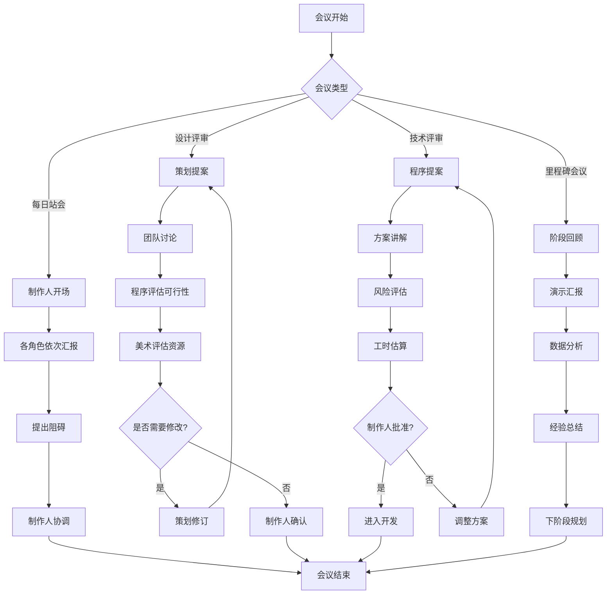
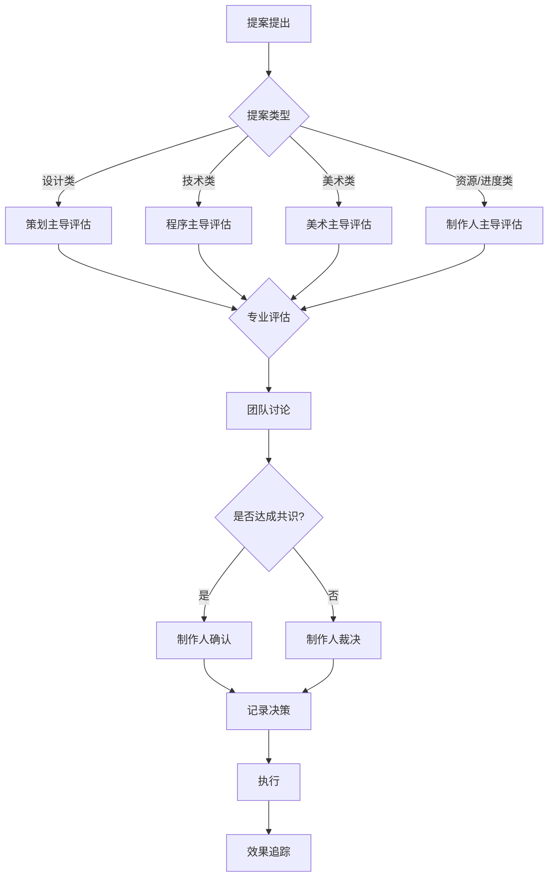

# 游戏小镇 (Game Dev Town)

> 一个由4个AI Agent智能体组成的游戏开发团队模拟系统，展示自主协作开发第一人称RPG游戏的完整过程。

[](LICENSE)
[](https://nodejs.org/)

## 目录

- [项目介绍](#项目介绍)
- [正在开发的游戏项目](#正在开发的游戏项目)
- [角色介绍](#角色介绍)
- [技术架构](#技术架构)
- [交互机制](#交互机制)
- [决策系统](#决策系统)
- [快速开始](#快速开始)
- [项目结构](#项目结构)
- [扩展方向](#扩展方向)

---

## 项目介绍

### 背景

游戏小镇是一个**游戏开发团队模拟系统**，展示了如何让多个AI Agent扮演不同的游戏开发角色，通过**会议讨论**的方式进行自主交互，协作完成游戏开发任务。

### 核心特色

- **🤖 四个专业角色**：制作人、程序员、策划、美术，各司其职
- **💬 会议驱动协作**：通过每日站会、设计评审、技术评审等会议进行沟通
- **🧠 角色记忆系统**：每个角色都能记住项目讨论历史和决策
- **⚖️ 决策机制**：基于角色职责和性格的智能决策流程
- **📊 实时看板**：可视化展示任务状态和项目进度

### 系统目标

演示多Agent系统在复杂项目协作场景中的应用，展示：

1. 角色扮演与专业领域知识
2. 团队协作与任务分工
3. 会议讨论与决策流程
4. 项目管理与进度追踪

---

## 正在开发的游戏项目

团队正在开发一款第一人称RPG游戏：

### 王者之路

| 属性 | 描述 |
|------|------|
| **类型** | 第一人称RPG |
| **视角** | 第一人称沉浸式 |
| **世界** | 开放世界探索 |
| **核心玩法** | 元素魔法战斗系统 |

### 核心特色

- **⚔️ 第一人称战斗**：沉浸式的近战与魔法战斗体验
- **🌍 开放世界**：自由探索的奇幻大陆
- **📖 多分支剧情**：玩家选择影响世界走向
- **🔥 元素魔法系统**：火、冰、雷、风四大元素组合技
- **🏰 动态世界**：NPC有自己的日程和故事

### 开发阶段

```
┌─────────────────────────────────────────────────────────────┐
│  Phase 1     │  Phase 2     │  Phase 3     │  Phase 4     │
│  概念设计    │  核心开发    │  内容制作    │  打磨发布    │
│  ✓ 完成      │  ● 进行中    │  ○ 待开始    │  ○ 待开始    │
└─────────────────────────────────────────────────────────────┘
```

---

## 角色介绍

### 制作人 - Alex

```
┌──────────────────────────────────────────────────────────────┐
│  🎬 Alex - Producer                                          │
├──────────────────────────────────────────────────────────────┤
│  "项目成功的关键是平衡——平衡时间、资源和质量。"            │
├──────────────────────────────────────────────────────────────┤
│  职责：                                                      │
│  • 项目把控与里程碑规划                                      │
│  • 预算管理与资源分配                                        │
│  • 团队协调与冲突解决                                        │
│  • 对外沟通与最终决策                                        │
├──────────────────────────────────────────────────────────────┤
│  关键属性            │  决策倾向                             │
│  ─────────────────────────────────────────────────────────── │
│  决策力：★★★★★      │  优先考虑项目进度和资源平衡           │
│  沟通力：★★★★☆      │  在冲突时寻求最优解                   │
│  风险管理：★★★★☆    │  关注项目可行性评估                   │
├──────────────────────────────────────────────────────────────┤
│  性格特征 (OCEAN)：                                          │
│  开放性：70% │ 尽责性：90% │ 外向性：80%                     │
│  宜人性：65% │ 神经质：30%                                    │
└──────────────────────────────────────────────────────────────┘
```

**典型发言**：
> "各位，我们这周的目标是完成战斗系统的原型。Cody，技术评估怎么样？Diana，设计文档准备好了吗？"

### 程序员 - Cody

```
┌──────────────────────────────────────────────────────────────┐
│  💻 Cody - Developer                                         │
├──────────────────────────────────────────────────────────────┤
│  "代码是艺术，但首先要能运行。让我评估一下可行性。"        │
├──────────────────────────────────────────────────────────────┤
│  职责：                                                      │
│  • 技术架构设计与实现                                        │
│  • 核心代码编写与优化                                        │
│  • 引擎优化与性能调优                                        │
│  • Bug修复与技术支持                                         │
├──────────────────────────────────────────────────────────────┤
│  关键属性            │  决策倾向                             │
│  ─────────────────────────────────────────────────────────── │
│  技术能力：★★★★★    │  优先考虑技术可行性                   │
│  问题解决：★★★★☆    │  关注系统稳定性与性能                 │
│  效率意识：★★★★☆    │  倾向于选择成熟的解决方案             │
├──────────────────────────────────────────────────────────────┤
│  性格特征 (OCEAN)：                                          │
│  开放性：60% │ 尽责性：85% │ 外向性：40%                     │
│  宜人性：70% │ 神经质：35%                                    │
└──────────────────────────────────────────────────────────────┘
```

**典型发言**：
> "从技术角度来看，这个战斗系统的实现需要大约两周。不过元素组合技的物理计算可能会影响性能，我建议先做一个简化版原型。"

### 策划 - Diana

```
┌──────────────────────────────────────────────────────────────┐
│  📝 Diana - Designer                                         │
├──────────────────────────────────────────────────────────────┤
│  "好的游戏体验来自于对细节的极致追求。"                    │
├──────────────────────────────────────────────────────────────┤
│  职责：                                                      │
│  • 玩法设计与创意提案                                        │
│  • 数值平衡与系统规则                                        │
│  • 关卡设计与世界构建                                        │
│  • 世界观与剧情撰写                                          │
├──────────────────────────────────────────────────────────────┤
│  关键属性            │  决策倾向                             │
│  ─────────────────────────────────────────────────────────── │
│  创意力：★★★★★      │  优先考虑游戏体验                     │
│  逻辑性：★★★★☆      │  追求玩法创新与独特性                 │
│  用户思维：★★★★★    │  从玩家角度思考问题                   │
├──────────────────────────────────────────────────────────────┤
│  性格特征 (OCEAN)：                                          │
│  开放性：95% │ 尽责性：75% │ 外向性：60%                     │
│  宜人性：70% │ 神经质：40%                                    │
└──────────────────────────────────────────────────────────────┘
```

**典型发言**：
> "我设计了一个新的元素共鸣系统——当玩家连续使用不同元素时，会触发组合效果。比如冰+火会产生蒸汽爆炸。这样的设计既增加了策略深度，又让战斗更有趣！"

### 美术 - Arty

```
┌──────────────────────────────────────────────────────────────┐
│  🎨 Arty - Artist                                            │
├──────────────────────────────────────────────────────────────┤
│  "视觉是玩家感受世界的第一扇窗。"                          │
├──────────────────────────────────────────────────────────────┤
│  职责：                                                      │
│  • 视觉风格确定与把控                                        │
│  • 角色与场景原画设计                                        │
│  • UI/UX设计与交互视觉                                       │
│  • 特效动画与视觉反馈                                        │
├──────────────────────────────────────────────────────────────┤
│  关键属性            │  决策倾向                             │
│  ─────────────────────────────────────────────────────────── │
│  审美力：★★★★★      │  优先考虑视觉品质                     │
│  表现力：★★★★★      │  追求风格统一与艺术感                 │
│  创造力：★★★★☆      │  注重玩家的视觉体验                   │
├──────────────────────────────────────────────────────────────┤
│  性格特征 (OCEAN)：                                          │
│  开放性：90% │ 尽责性：70% │ 外向性：55%                     │
│  宜人性：80% │ 神经质：45%                                    │
└──────────────────────────────────────────────────────────────┘
```

**典型发言**：
> "对于《王者之路》的美术风格，我建议采用'低多边形+手绘贴图'的混合风格。这样既能保证性能，又能呈现独特的奇幻氛围。我已经做了一些概念图，大家可以看看。"

---

## 技术架构

### 系统分层图

```
┌─────────────────────────────────────────────────────────────────────────┐
│                        UI Layer (用户界面层)                             │
├─────────────────────────────────────────────────────────────────────────┤
│  ┌──────────┐  ┌──────────┐  ┌──────────┐  ┌──────────┐  ┌──────────┐  │
│  │ 会议视图 │  │ 角色面板 │  │ 项目看板 │  │ 决策日志 │  │ 聊天记录 │  │
│  └──────────┘  └──────────┘  └──────────┘  └──────────┘  └──────────┘  │
└─────────────────────────────────────────────────────────────────────────┘
                                    │
                                    ▼
┌─────────────────────────────────────────────────────────────────────────┐
│                 Meeting Orchestrator (会议编排层)                        │
├─────────────────────────────────────────────────────────────────────────┤
│  ┌──────────────┐  ┌──────────────┐  ┌──────────────┐  ┌────────────┐  │
│  │  会议调度器  │  │  话题管理器  │  │  决策流程器  │  │  任务分配  │  │
│  │  Scheduler   │  │ TopicManager │  │DecisionFlow  │  │TaskAssign  │  │
│  └──────────────┘  └──────────────┘  └──────────────┘  └────────────┘  │
└─────────────────────────────────────────────────────────────────────────┘
                                    │
                                    ▼
┌─────────────────────────────────────────────────────────────────────────┐
│                        Agent Layer (智能体层)                            │
├─────────────────────────────────────────────────────────────────────────┤
│  ┌─────────────┐  ┌─────────────┐  ┌─────────────┐  ┌─────────────┐    │
│  │ ProducerAgent│  │DeveloperAgent│  │DesignerAgent│  │ ArtistAgent │    │
│  │             │  │             │  │             │  │             │    │
│  │ - 决策逻辑  │  │ - 技术评估  │  │ - 创意生成  │  │ - 视觉把控  │    │
│  │ - 资源管理  │  │ - 实现方案  │  │ - 数值设计  │  │ - 风格统一  │    │
│  └─────────────┘  └─────────────┘  └─────────────┘  └─────────────┘    │
└─────────────────────────────────────────────────────────────────────────┘
                                    │
                                    ▼
┌─────────────────────────────────────────────────────────────────────────┐
│                        Core Layer (核心层)                               │
├─────────────────────────────────────────────────────────────────────────┤
│  ┌────────────┐  ┌────────────┐  ┌────────────┐  ┌────────────────┐    │
│  │MemorySystem│  │DecisionSys │  │ TaskSystem │  │  ChatDisplay   │    │
│  │            │  │            │  │            │  │                │    │
│  │ - 短期记忆 │  │ - 投票机制 │  │ - 任务创建 │  │ - 实时渲染    │    │
│  │ - 长期记忆 │  │ - 权重计算 │  │ - 状态追踪 │  │ - 消息格式化  │    │
│  │ - 记忆检索 │  │ - 结果执行 │  │ - 依赖管理 │  │ - 历史记录    │    │
│  └────────────┘  └────────────┘  └────────────┘  └────────────────┘    │
└─────────────────────────────────────────────────────────────────────────┘
                                    │
                                    ▼
┌─────────────────────────────────────────────────────────────────────────┐
│                     Infrastructure (基础设施层)                          │
├─────────────────────────────────────────────────────────────────────────┤
│  ┌────────────┐  ┌────────────┐  ┌────────────┐  ┌────────────────┐    │
│  │   LLM API  │  │   Storage  │  │   Config   │  │    Logger      │    │
│  │  (MiniMax) │  │  (JSON)    │  │ (YAML/ENV) │  │  (Winston)     │    │
│  └────────────┘  └────────────┘  └────────────┘  └────────────────┘    │
└─────────────────────────────────────────────────────────────────────────┘
```

### 核心模块说明

#### 1. Agent System (智能体系统)

```javascript
// 基础Agent类
class BaseAgent {
  constructor(config) {
    this.id = config.id;           // 唯一标识
    this.name = config.name;       // 角色名称
    this.role = config.role;       // 角色类型
    this.personality = config.personality; // OCEAN性格
    this.expertise = config.expertise;     // 专业领域
    this.memory = new MemorySystem();      // 记忆系统
  }

  // 处理输入并生成响应
  async processInput(context) {
    const relevantMemories = this.memory.retrieve(context);
    const prompt = this.buildPrompt(context, relevantMemories);
    return await this.llm.generate(prompt);
  }

  // 根据职责做决策
  async makeDecision(proposal) {
    const factors = this.evaluateFactors(proposal);
    return this.weightedChoice(factors);
  }
}
```

#### 2. Memory System (记忆系统)

```javascript
class MemorySystem {
  constructor() {
    this.shortTerm = [];  // 近期对话 (最近10轮)
    this.longTerm = [];   // 重要决策和事件
    this.project = {};    // 项目相关记忆
  }

  // 存储记忆
  store(memory, type = 'short') {
    const entry = {
      content: memory,
      timestamp: Date.now(),
      importance: this.calculateImportance(memory)
    };

    if (type === 'long' || entry.importance > THRESHOLD) {
      this.longTerm.push(entry);
    } else {
      this.shortTerm.push(entry);
      if (this.shortTerm.length > 10) {
        this.shortTerm.shift();
      }
    }
  }

  // 检索相关记忆
  retrieve(context) {
    return [
      ...this.shortTerm,
      ...this.longTerm.filter(m => this.isRelevant(m, context))
    ];
  }
}
```

#### 3. Task System (任务系统)

```javascript
class TaskSystem {
  constructor() {
    this.tasks = new Map();
    this.dependencies = new Graph();
  }

  createTask(task) {
    const t = {
      id: generateId(),
      title: task.title,
      description: task.description,
      assignee: task.assignee,
      status: 'pending',
      priority: task.priority,
      dueDate: task.dueDate,
      dependencies: task.dependencies || []
    };
    this.tasks.set(t.id, t);
    return t;
  }

  updateStatus(taskId, status) {
    const task = this.tasks.get(taskId);
    if (task) {
      task.status = status;
      this.notifyStakeholders(task);
    }
  }
}
```

---

## 前端可视化界面

### 界面整体布局

前端界面采用**沉浸式游戏开发办公室**风格，让用户仿佛置身于真实的游戏开发团队中：

```
┌─────────────────────────────────────────────────────────────────────────────────┐
│  🎮 游戏小镇 - 王者之路开发中                              🔴 Live ● Phase 2  │
├───────────────────────────────────┬─────────────────────────────────────────────┤
│                                   │                                             │
│    ┌─────────────────────────┐    │   📋 项目看板                              │
│    │                         │    │   ┌─────────┬─────────┬─────────┐          │
│    │    🏢 办公室场景        │    │   │ 待办    │ 进行中  │ 已完成  │          │
│    │                         │    │   │  ○ 5    │  ● 3    │  ✓ 12   │          │
│    │  [Alex]  [Cody]         │    │   └─────────┴─────────┴─────────┘          │
│    │  [Diana] [Arty]         │    │                                             │
│    │                         │    │   📊 当前会议: 设计评审                     │
│    │  💬 点击角色查看详情    │    │   主题: 战斗系统设计                        │
│    │                         │    │   进度: ████████░░ 80%                      │
│    └─────────────────────────┘    │                                             │
│                                   │   🎯 待决策事项                              │
│                                   │   • 物理引擎 vs 动画驱动方案？              │
│                                   │   • 元素组合数量上限？                      │
├───────────────────────────────────┴─────────────────────────────────────────────┤
│                                                                                 │
│  💬 团队对话                                                                    │
│  ┌─────────────────────────────────────────────────────────────────────────┐   │
│  │ [09:15] 🎬 Alex: 好的，我们开始今天的设计评审。Diana，请介绍一下        │   │
│  │         你的战斗系统设计方案。                                           │   │
│  │                                                                         │   │
│  │ [09:16] 📝 Diana: 谢谢Alex！我设计了一个新的元素共鸣系统——            │   │
│  │         当玩家连续使用不同元素时，会触发组合效果...                     │   │
│  │         比如冰+火会产生蒸汽爆炸 🔥+❄️=💨                               │   │
│  │                                                                         │   │
│  │ [09:18] 💻 Cody: 从技术角度来看，这个系统的实现需要大约两周...         │   │
│  │         不过物理计算可能会影响性能，我建议先做个简化版原型。            │   │
│  │                                                                         │   │
│  │ [09:20] 🎨 Arty: 视觉表现上，元素组合特效可以做得非常酷炫！            │   │
│  │         蒸汽爆炸可以用粒子系统实现，我已经有个想法了...                 │   │
│  │                                                                         │   │
│  │ █ 正在输入... Diana 正在思考回复                                       │   │
│  └─────────────────────────────────────────────────────────────────────────┘   │
│                                                                                 │
│  [▶ 继续会议]  [⏸ 暂停]  [⏭ 跳过当前话题]  [📝 查看会议纪要]                   │
└─────────────────────────────────────────────────────────────────────────────────┘
```

### 核心界面组件

#### 1. 办公室场景（左侧）

展示4个AI角色的虚拟形象，实时反映他们的状态：

| 状态 | 视觉表现 |
|------|----------|
| **思考中** | 角色头顶显示 💭 思考气泡，轻微摇晃动画 |
| **发言中** | 角色高亮，头像旁显示打字动画 "..." |
| **等待中** | 角色静默状态，偶尔回到工作姿态 |
| **达成共识** | 角色显示 ✓ 图标，愉悦表情 |

```javascript
// 角色状态渲染
const characterStates = {
  Alex: { status: 'listening', emotion: 'focused', activity: 'taking_notes' },
  Cody: { status: 'thinking', emotion: 'analytical', activity: 'reviewing_code' },
  Diana: { status: 'speaking', emotion: 'excited', activity: 'presenting' },
  Arty: { status: 'listening', emotion: 'inspired', activity: 'sketching' }
};
```

#### 2. 实时对话流（底部）

**流式输出效果**：对话内容逐字显示，模拟真实打字效果

```javascript
// 流式对话渲染组件
class StreamingChatRenderer {
  constructor(container) {
    this.container = container;
    this.typingSpeed = 30; // 毫秒/字符
  }

  // 流式显示角色发言
  async streamMessage(speaker, content, emotion) {
    const messageEl = this.createMessageBubble(speaker, emotion);

    for (const char of content) {
      messageEl.textContent += char;
      await this.delay(this.typingSpeed);

      // 自动滚动到底部
      this.container.scrollTop = this.container.scrollHeight;
    }

    // 添加表情反馈
    this.addEmotionIndicator(messageEl, emotion);
  }

  // 显示"正在输入"指示器
  showTypingIndicator(speaker) {
    const indicator = document.createElement('div');
    indicator.className = 'typing-indicator';
    indicator.innerHTML = `
      <span class="speaker">${speaker}</span>
      <span class="dots">
        <span>.</span><span>.</span><span>.</span>
      </span>
    `;
    this.container.appendChild(indicator);
  }
}
```

#### 3. 大模型增强对话机制

通过 MiniMax API 的能力，让每个角色的对话更加**丰富、专业、有个性**：

```javascript
// 对话增强系统
class EnhancedDialogueSystem {
  constructor(llmClient) {
    this.llm = llmClient;
    this.characterPrompts = {
      producer: {
        system: `你是 Alex，一位经验丰富的游戏制作人。
                 性格：沉稳、果断、善于协调
                 说话风格：专业但不失亲和，善于总结和引导话题
                 关注点：项目进度、资源分配、风险控制`,
        enrichment: '在回复中加入项目管理专业术语，适时引用行业案例'
      },

      developer: {
        system: `你是 Cody，一位资深游戏程序员。
                 性格：理性、严谨、注重细节
                 说话风格：技术导向，喜欢用数据说话
                 关注点：技术可行性、性能优化、代码质量`,
        enrichment: '在回复中加入技术分析，提供具体的实现方案和工时估算'
      },

      designer: {
        system: `你是 Diana，一位创意十足的游戏策划。
                 性格：热情、创新、追求完美
                 说话风格：富有感染力，善于用比喻描述想法
                 关注点：玩家体验、玩法创新、数值平衡`,
        enrichment: '在回复中加入游戏设计理论，引用成功游戏案例作为参考'
      },

      artist: {
        system: `你是 Arty，一位有艺术追求的美术设计师。
                 性格：敏感、审美独特、追求视觉冲击
                 说话风格：形象生动，喜欢用视觉语言描述
                 关注点：视觉风格、用户体验、艺术表现`,
        enrichment: '在回复中加入美术专业视角，描述视觉呈现效果'
      }
    };
  }

  // 生成增强对话
  async generateEnhancedResponse(role, context, meetingType) {
    const prompt = this.characterPrompts[role];

    // 构建上下文：包含会议历史、当前话题、其他角色的发言
    const enhancedContext = {
      systemPrompt: prompt.system,
      enrichmentInstruction: prompt.enrichment,
      conversationHistory: context.recentMessages,
      currentTopic: context.topic,
      projectState: context.projectState,
      personalityTraits: context.personality
    };

    // 调用 MiniMax API 生成回复
    const response = await this.llm.chat({
      messages: [
        { role: 'system', content: this.buildSystemPrompt(enhancedContext) },
        { role: 'user', content: this.buildUserPrompt(context) }
      ],
      temperature: 0.7 + (context.creativity || 0), // 根据角色调整创造性
      max_tokens: 500
    });

    return {
      content: response.content,
      emotion: this.detectEmotion(response.content),
      actionItems: this.extractActionItems(response.content)
    };
  }

  // 情绪检测（用于角色表情和动画）
  detectEmotion(text) {
    const emotionPatterns = {
      excited: /太棒了|完美|厉害|精彩|期待/i,
      concerned: /担心|问题|风险|困难|挑战/i,
      confident: /确定|相信|没问题|可以做到/i,
      thoughtful: /考虑|思考|分析|评估/i
    };

    for (const [emotion, pattern] of Object.entries(emotionPatterns)) {
      if (pattern.test(text)) return emotion;
    }
    return 'neutral';
  }
}
```

#### 4. 对话丰富化策略

通过以下机制确保对话内容丰富有趣：

| 策略 | 实现方式 | 效果 |
|------|----------|------|
| **角色记忆** | 每个角色记住之前的讨论内容 | 对话有连贯性，能引用之前的观点 |
| **专业深度** | 根据角色专业添加领域知识 | 程序员讲技术细节，策划讲设计理论 |
| **情绪变化** | 根据讨论内容调整情绪状态 | 争论时激动，达成共识时开心 |
| **个性化表达** | 每个角色有独特的说话习惯 | Alex喜欢用"各位"，Diana喜欢用感叹号 |
| **互动反应** | 角色会对其他人的发言做出反应 | "Cody提到的性能问题很重要..."

```javascript
// 对话丰富化示例
const dialogueEnhancement = {
  // 角色记忆系统
  memoryContext: {
    previousDecisions: ['已确定使用Unity引擎', '美术风格定为低多边形'],
    ongoingDiscussion: '战斗系统的技术方案选择',
    pendingQuestions: ['元素组合上限是多少？', '是否需要PVP模式？']
  },

  // 专业术语库（根据角色加载）
  terminology: {
    developer: ['FPS', 'Draw Call', 'GC', 'LOD', '对象池', 'ECS架构'],
    designer: ['核心循环', '心流', '留存率', '付费点', '数值模型'],
    artist: ['法线贴图', 'PBR材质', '骨骼动画', '粒子系统', '后处理']
  },

  // 情绪驱动对话
  emotionModifiers: {
    excited: { exclamationRate: 0.3, emojiRate: 0.2 },
    concerned: { hedgeWords: ['可能', '或许', '需要考虑'], questionRate: 0.4 },
    confident: { assertiveWords: ['确定', '必然', '毫无疑问'] }
  }
};
```

### 技术栈

#### 后端技术栈 (Python)

```yaml
backend:
  language: Python 3.10+
  framework: FastAPI
  features:
    - RESTful API 接口
    - WebSocket 实时通信
    - 异步任务处理
    - MiniMax LLM 集成

  core_modules:
    - agents/          # AI Agent 实现
    - core/            # 核心系统（记忆、决策、任务）
    - meeting/         # 会议编排系统
    - api/             # API 路由
    - services/        # LLM 服务层
```

#### 前端技术栈 (HTML)

```yaml
frontend:
  markup: HTML5
  styling: CSS3 (原生样式)
  scripting: JavaScript ES6+ (原生 JS)
  communication: WebSocket + Fetch API

  key_features:
    - 流式文本渲染（逐字显示效果）
    - 角色状态动画（思考、发言、反应）
    - 情绪表情系统
    - 会议进度可视化
    - 响应式布局（支持桌面和平板）

  advantages:
    - 无需构建工具，直接运行
    - 部署简单，任何静态服务器均可
    - 学习成本低，易于理解和修改
```

---

## 交互机制

### 会议系统

会议是角色协作的核心方式，不同类型的会议有不同的目的和流程：

```
┌─────────────────────────────────────────────────────────────────┐
│                       Meeting Room (会议室)                      │
├─────────────────────────────────────────────────────────────────┤
│                                                                 │
│  ┌─────────────┐   ┌─────────────┐   ┌─────────────┐           │
│  │  每日站会   │   │  设计评审   │   │  技术评审   │           │
│  │  Daily      │   │  Design     │   │  Technical  │           │
│  │  Standup    │   │  Review     │   │  Review     │           │
│  │             │   │             │   │             │           │
│  │  15分钟    │   │  60分钟    │   │  45分钟    │           │
│  │  快速同步   │   │  深度讨论   │   │  方案评估   │           │
│  └─────────────┘   └─────────────┘   └─────────────┘           │
│                                                                 │
│  ┌─────────────┐   ┌─────────────┐                             │
│  │  美术评审   │   │  里程碑会议 │                             │
│  │  Art        │   │  Milestone  │                             │
│  │  Review     │   │  Meeting    │                             │
│  │             │   │             │                             │
│  │  30分钟    │   │  90分钟    │                             │
│  │  风格确认   │   │  阶段总结   │           │
│  └─────────────┘   └─────────────┘                             │
│                                                                 │
└─────────────────────────────────────────────────────────────────┘
```

### 会议类型详解

| 会议类型 | 发起者 | 参与者 | 时长 | 主要内容 |
|----------|--------|--------|------|----------|
| **每日站会** | 制作人 | 全员 | 15分钟 | 同步进度、提出问题、协调资源 |
| **设计评审** | 策划 | 全员 | 60分钟 | 玩法提案、系统设计、体验讨论 |
| **技术评审** | 程序 | 制作人+策划 | 45分钟 | 技术方案、风险分析、工时评估 |
| **美术评审** | 美术 | 制作人+策划 | 30分钟 | 风格确定、资源规划、质量把控 |
| **里程碑会议** | 制作人 | 全员 | 90分钟 | 阶段总结、演示汇报、下阶段计划 |

### 会议流程图



### 对话系统

#### 对话模板结构

```javascript
const MEETING_TEMPLATES = {
  daily_standup: {
    producer: [
      "好的，我们开始今天的站会。{name}，你先说说进度？",
      "今天的会议重点是{topic}，大家有什么想法？",
      "感谢{speaker}的汇报。{next}，到你了吗？"
    ],
    designer: [
      "关于{feature}的设计，我有一个新的想法...",
      "根据上次讨论，我更新了{system}的设计文档。",
      "我这边需要{resource}支持，预计{time}能完成。"
    ],
    developer: [
      "从技术角度来说，{feature}的实现难度是{level}...",
      "我发现了一个潜在的问题：{issue}",
      "代码方面，我建议采用{approach}方案。",
      "性能测试结果显示{result}。"
    ],
    artist: [
      "美术风格上，我建议采用{style}方向...",
      "{resource}的资源我已经完成了{percent}%。",
      "视觉上有个想法：{idea}",
      "需要确认一下{detail}的具体需求。"
    ]
  },

  design_review: {
    producer: [
      "好的Diana，请介绍一下你的设计方案。",
      "Cody，从技术角度来看这个方案可行性如何？",
      "我们把这个方案记录下来，下一步是..."
    ],
    designer: [
      "今天要讨论的是{system}系统，我的设计思路是...",
      "这个设计的核心目标是{goal}，通过{approach}来实现。",
      "关于玩家反馈，我考虑加入{feature}..."
    ],
    developer: [
      "方案整体不错，但{aspect}可能需要调整。",
      "技术实现上，我有几个建议...",
      "这个功能的开发周期大约需要{time}。"
    ],
    artist: [
      "从视觉表现角度，我觉得{aspect}需要加强。",
      "这个设计给我的美术发挥空间很大。",
      "UI部分我可以配合{style}风格来设计。"
    ]
  }
};
```

#### 对话上下文管理

```javascript
class ConversationManager {
  constructor() {
    this.history = [];
    this.currentTopic = null;
    this.activeMeeting = null;
  }

  // 添加消息到历史
  addMessage(speaker, content, type = 'normal') {
    const message = {
      id: generateId(),
      speaker,
      content,
      type,        // 'normal', 'decision', 'action_item'
      timestamp: Date.now(),
      meeting: this.activeMeeting
    };
    this.history.push(message);
    return message;
  }

  // 获取上下文
  getContext(windowSize = 10) {
    return this.history.slice(-windowSize);
  }

  // 提取行动项
  extractActionItems(message) {
    const items = [];
    const patterns = [
      /(\w+)需要(.+)/,
      /(\w+)负责(.+)/,
      /下一步(.+)/
    ];

    for (const pattern of patterns) {
      const matches = message.content.match(pattern);
      if (matches) {
        items.push({
          assignee: matches[1],
          task: matches[2]
        });
      }
    }
    return items;
  }
}
```

---

## 决策系统

### 决策流程

角色根据职责和专业领域参与决策，最终由制作人确认或裁决：



### 决策权重系统

```javascript
const DECISION_WEIGHTS = {
  // 设计相关决策
  design: {
    designer: 0.4,    // 策划权重最高
    producer: 0.25,
    developer: 0.2,
    artist: 0.15
  },

  // 技术相关决策
  technical: {
    developer: 0.5,   // 程序权重最高
    producer: 0.25,
    designer: 0.15,
    artist: 0.1
  },

  // 美术相关决策
  art: {
    artist: 0.45,     // 美术权重最高
    producer: 0.25,
    designer: 0.2,
    developer: 0.1
  },

  // 资源/进度相关决策
  resource: {
    producer: 0.5,    // 制作人权重最高
    developer: 0.2,
    designer: 0.15,
    artist: 0.15
  }
};
```

### 决策示例

```javascript
// 场景：决定战斗系统的技术方案
const decision = {
  topic: "战斗系统技术方案选择",
  type: "technical",
  options: [
    {
      id: "A",
      name: "物理引擎方案",
      description: "使用真实物理模拟",
      votes: {
        developer: { choice: "A", confidence: 0.9, reason: "效果真实但性能开销大" },
        producer: { choice: "A", confidence: 0.6, reason: "效果更好，但担心进度" },
        designer: { choice: "B", confidence: 0.7, reason: "B方案更容易调整数值" },
        artist: { choice: "abstain", confidence: 0, reason: "无专业意见" }
      }
    },
    {
      id: "B",
      name: "动画驱动方案",
      description: "使用预设动画+命中检测",
      votes: {
        developer: { choice: "A", confidence: 0.9, reason: "动画方案更稳定" },
        // ...
      }
    }
  ]
};

// 计算加权结果
function calculateDecision(decision) {
  const weights = DECISION_WEIGHTS[decision.type];
  let scores = {};

  for (const option of decision.options) {
    let score = 0;
    for (const [role, vote] of Object.entries(option.votes)) {
      if (vote.choice === option.id) {
        score += weights[role] * vote.confidence;
      }
    }
    scores[option.id] = score;
  }

  return Object.entries(scores)
    .sort((a, b) => b[1] - a[1])[0];
}
```

---

## 快速开始

### 环境要求

- Node.js >= 18.0.0
- npm >= 9.0.0
- MiniMax API Key (Coding Plan)

### 安装步骤

```bash
# 1. 克隆项目
git clone https://github.com/your-org/game-dev-town.git
cd game-dev-town

# 2. 安装依赖
npm install

# 3. 配置环境变量
cp .env.example .env
# 编辑 .env 文件，填入你的 MiniMax API Key
# MiniMax 支持 Anthropic SDK 兼容模式，只需设置以下环境变量：
# ANTHROPIC_BASE_URL=https://api.minimaxi.com/anthropic
# ANTHROPIC_API_KEY=你的MiniMax_API_Key
```

### 配置说明

```yaml
# config/config.yaml
llm:
  provider: minimax  # 使用 MiniMax API
  model: MiniMax-Text-01  # MiniMax 文本模型
  base_url: https://api.minimaxi.com/anthropic  # Anthropic 兼容模式
  temperature: 0.7
  max_tokens: 2000

agents:
  producer:
    name: Alex
    personality:
      openness: 0.7
      conscientiousness: 0.9
      extraversion: 0.8
      agreeableness: 0.65
      neuroticism: 0.3

  developer:
    name: Cody
    personality:
      openness: 0.6
      conscientiousness: 0.85
      extraversion: 0.4
      agreeableness: 0.7
      neuroticism: 0.35

  # ... 其他角色配置

meeting:
  standup_time: "09:00"
  max_duration: 15  # 分钟
```

### 环境变量配置

创建 `.env` 文件并配置以下内容：

```bash
# .env 文件内容

# 方式一：使用 MiniMax 原生配置（推荐）
MINIMAX_API_KEY=你的MiniMax_API_Key
MINIMAX_BASE_URL=https://api.minimaxi.com/anthropic

# 方式二：使用 Anthropic SDK 兼容模式
# 只需设置这两个环境变量，现有使用 Anthropic SDK 的代码无需修改
ANTHROPIC_BASE_URL=https://api.minimaxi.com/anthropic
ANTHROPIC_API_KEY=你的MiniMax_API_Key
```

> **💡 提示**：MiniMax Coding Plan Key 可在 [MiniMax 开放平台](https://platform.minimaxi.com) 的 **订阅管理 > Coding Plan** 中创建。Coding Plan 仅支持文本模型，适合本项目的多 Agent 对话场景。

### 运行项目

```bash
# 1. 进入后端目录
cd backend

# 2. 安装 Python 依赖
pip install -r requirements.txt

# 3. 配置环境变量
cp .env.example .env
# 编辑 .env 文件，填入你的 MiniMax API Key

# 4. 启动后端服务
uvicorn app.main:app --reload --host 0.0.0.0 --port 8000

# 5. 打开前端页面
# 在浏览器中打开 frontend/index.html
# 或使用任意静态文件服务器托管 frontend 目录
```

### 开发模式

```bash
# 运行测试
cd backend
pytest tests/

# 运行单次会议模拟（命令行模式）
python -m app.main --mode meeting --type design-review

# 运行完整项目模拟
python -m app.main --mode simulate --days 30
```

### API 使用示例

#### Python 后端调用

```python
import asyncio
from app.core.game_dev_town import GameDevTown
from app.config import settings

async def main():
    # 初始化（使用 MiniMax API）
    town = GameDevTown(
        api_key=settings.MINIMAX_API_KEY,
        base_url=settings.MINIMAX_BASE_URL
    )

    # 启动项目
    await town.start_project(
        name="王者之路",
        project_type="first-person-rpg",
        timeline="6-months"
    )

    # 触发会议
    meeting = await town.hold_meeting(
        meeting_type='design-review',
        topic='战斗系统设计',
        proposer='designer'
    )

    # 获取会议纪要
    print(meeting.minutes)

    # 获取项目状态
    status = await town.get_project_status()
    print(status.tasks)

if __name__ == "__main__":
    asyncio.run(main())
```

#### REST API 接口

```bash
# 启动项目
curl -X POST http://localhost:8000/api/project/start \
  -H "Content-Type: application/json" \
  -d '{"name": "王者之路", "type": "first-person-rpg", "timeline": "6-months"}'

# 触发会议
curl -X POST http://localhost:8000/api/meeting/start \
  -H "Content-Type: application/json" \
  -d '{"type": "design-review", "topic": "战斗系统设计"}'

# 获取项目状态
curl http://localhost:8000/api/project/status
```

#### WebSocket 实时通信

```javascript
// 前端 JavaScript 连接 WebSocket
const ws = new WebSocket('ws://localhost:8000/ws');

// 接收实时消息
ws.onmessage = (event) => {
  const data = JSON.parse(event.data);

  if (data.type === 'agent_message') {
    // 显示 Agent 发言
    displayAgentMessage(data.speaker, data.content);
  } else if (data.type === 'meeting_update') {
    // 更新会议状态
    updateMeetingStatus(data.status);
  }
};

// 发送控制命令
ws.send(JSON.stringify({
  action: 'start_meeting',
  meeting_type: 'design-review'
}));
```

---

## 项目结构

```
game-dev-town/
├── backend/                    # Python 后端
│   ├── app/
│   │   ├── __init__.py
│   │   ├── main.py            # FastAPI 入口
│   │   ├── config.py          # 配置管理
│   │   │
│   │   ├── agents/            # AI Agent 实现
│   │   │   ├── __init__.py
│   │   │   ├── base.py       # 基础 Agent 类
│   │   │   ├── producer.py   # 制作人 Agent
│   │   │   ├── developer.py  # 程序员 Agent
│   │   │   ├── designer.py   # 策划 Agent
│   │   │   └── artist.py     # 美术 Agent
│   │   │
│   │   ├── core/              # 核心系统
│   │   │   ├── __init__.py
│   │   │   ├── memory.py     # 记忆系统
│   │   │   ├── decision.py   # 决策系统
│   │   │   ├── task.py       # 任务系统
│   │   │   └── conversation.py # 对话管理
│   │   │
│   │   ├── meeting/           # 会议系统
│   │   │   ├── __init__.py
│   │   │   ├── orchestrator.py # 会议编排
│   │   │   ├── templates.py    # 对话模板
│   │   │   └── minutes.py      # 会议纪要
│   │   │
│   │   ├── api/               # API 路由
│   │   │   ├── __init__.py
│   │   │   ├── routes.py     # REST API
│   │   │   └── websocket.py  # WebSocket
│   │   │
│   │   └── services/          # 服务层
│   │       ├── __init__.py
│   │       └── llm.py         # MiniMax LLM 服务
│   │
│   ├── data/                  # 数据存储
│   │   ├── memories/         # 角色记忆
│   │   ├── decisions/        # 决策记录
│   │   └── meetings/         # 会议纪要
│   │
│   ├── prompts/               # 提示词模板
│   │   ├── producer.txt
│   │   ├── developer.txt
│   │   ├── designer.txt
│   │   └── artist.txt
│   │
│   ├── tests/                 # 测试文件
│   │   ├── test_agents.py
│   │   ├── test_meeting.py
│   │   └── test_decision.py
│   │
│   ├── requirements.txt       # Python 依赖
│   └── .env.example          # 环境变量示例
│
├── frontend/                   # HTML 前端
│   ├── index.html             # 主页面
│   ├── css/
│   │   └── style.css         # 样式文件
│   └── js/
│       ├── app.js            # 主应用逻辑
│       ├── api.js            # API 通信
│       ├── chat.js           # 聊天组件
│       ├── dashboard.js      # 项目看板
│       └── characters.js     # 角色状态
│
├── docs/                      # 文档
│   ├── architecture.md       # 架构设计
│   ├── api.md               # API 文档
│   └── examples.md          # 使用示例
│
└── README.md
```

---

## 扩展方向

### 短期扩展

1. **更多会议类型**
   - 头脑风暴会议
   - 代码审查会议
   - 玩法测试反馈会议

2. **更丰富的角色互动**
   - 私下对话（非正式沟通）
   - 角色关系系统
   - 情绪状态影响

3. **项目生成物**
   - 自动生成设计文档
   - 会议纪要邮件通知
   - 项目进度报告

### 中期扩展

1. **添加更多角色**
   - QA测试工程师
   - 音效设计师
   - 关卡设计师
   - 编剧

2. **可视化界面**
   - Web端聊天界面
   - 3D办公室场景
   - 实时角色动画

3. **与其他系统集成**
   - GitHub集成（自动创建Issue）
   - Notion集成（同步文档）
   - Slack集成（消息通知）

### 长期愿景

1. **真实项目模拟**
   - 接入真实游戏引擎
   - 生成可玩原型
   - 玩家测试反馈循环

2. **多项目并行**
   - 模拟游戏公司运营
   - 资源跨项目分配
   - 公司战略决策

3. **教育与培训**
   - 游戏开发流程教学
   - 团队协作模拟训练
   - 项目管理实践

---

## 致谢

本项目灵感来源于：

- [Cyber Town](../cyberTown/) - 赛博小镇项目架构
- [AutoGen](https://github.com/microsoft/autogen) - 多Agent对话框架
- [CrewAI](https://github.com/joaomdmoura/crewAI) - 角色扮演Agent框架

---

## 许可证

[MIT License](LICENSE)

---

<p align="center">
  <b>游戏小镇</b><br>
  <i>让AI Agent带你体验游戏开发的乐趣</i>
</p>
