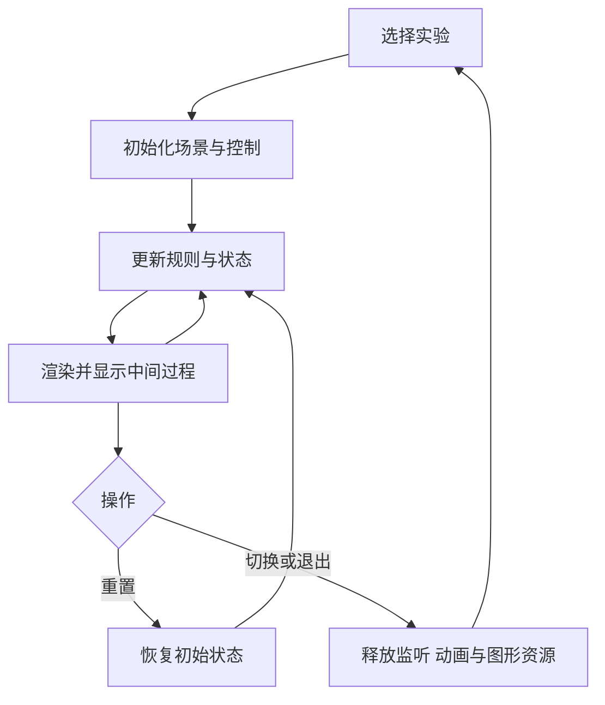

# Web3D 客户端学习实验

一个 Web 工程承载多个独立实验，使用 TypeScript + Three.js，并用原生 WebGL 小实验观察底层渲染过程。每个实验同时说明 Cocos 对应机制，Tuntun 玩法作为学习案例。

**[实现记录] 阶段 0 立方体实验已可运行，支持速度、暂停／继续、重置、相机视角、固定步长对比与退出重入。** 数值检查和核心浏览器交互已验证；后台恢复与 WebGL2 不可用提示待桌面浏览器实测，个人理解待验收。详见[实践步骤与验证记录](docs/stage-00-lab.md)。

**[实现记录] 2026-10-10，阶段 1 坐标实验台首版已建立。** 点与向量、父子变换、投影三页显示计算过程，提供边界案例与个人记录下载；15 项数值测试、构建和核心浏览器检查通过。今天先做[点与向量三轮实践](docs/stage-01-lab.md)，个人理解继续单独验收，阶段 0 未验收项保留。

## 直接开始实践

[启动] 从当前仓库根目录执行：

```powershell
$labRunner = '.\domains\game-engine\experiments\web3d-learning\tools\run.ps1'
powershell -NoProfile -ExecutionPolicy Bypass -File $labRunner install
powershell -NoProfile -ExecutionPolicy Bypass -File $labRunner dev
```

启动器寻找隔离 Node 24.12+，只为当前进程选择运行时，并在本实验目录执行命令。若没有自动找到，为命令传入 `-NodePath` 指定自己的 Node 24 node.exe。打开终端给出的地址，`?lab=space` 进入阶段 1，`?lab=time` 进入阶段 0；默认地址保留阶段 0。

[验证] `npm test` 检查独立时间与角度逻辑；`npm run build` 执行类型检查和构建。依赖版本由 package-lock.json 固定。

也可使用启动器的 `test`／`build` 命令，避免终端默认 Node 18 与学习工程要求不一致。测试同时覆盖时间、向量、变换与投影的固定输入及边界。

## 入口

| 内容 | 入口 |
| --- | --- |
| 总路线与资料导航 | [3D 客户端学习路线](../../../../learning-routes/topic-index/3d-game-client.md) |
| 原推荐互联网资料与章节 | [学习资料地图](../../../../learning-routes/resources/3d-game-client-resources.md) |
| 第一周读什么、怎样练习 | [15 小时阅读与实验计划](../../../../user-profile/progress/3d-game-client-week-01.md) |
| 首个实验 | [阶段 0 立方体规格](docs/stage-00-spec.md) |
| 动手实践与实际证据 | [阶段 0 实践](docs/stage-00-lab.md) |
| 下一阶段实践 | [阶段 1 坐标实验台](docs/stage-01-lab.md) |
| 空间数学规格与自测 | [阶段 1 规格](docs/stage-01-spec.md) |
| 每个实验的说明格式 | [实验模板](docs/lab-template.md) |
| 阶段通过条件 | [验收规范](docs/acceptance.md) |
| 实际学习记录 | [进度表](../../../../user-profile/progress/3d-game-client-progress.md) |

## 实验内容与生命周期



| 约定 | 后续实现职责 |
| --- | --- |
| 初始化 | 创建实验自身的画布、场景、输入、参数与初始状态 |
| 更新 | 接收明确的模拟时间步长，更新规则；显示时间单位与中间状态 |
| 渲染 | 展示场景、辅助图形和状态；与暂停的模拟时间区分 |
| 重置 | 恢复参数、模拟时间和对象状态，清理临时结果 |
| 释放 | 注销监听与更新任务，停止动画，释放自身拥有的图形资源 |

实验切换界面负责选题与主循环；每个实验拥有明确的资源边界。共享资源需记录所有权，避免一个实验退出时释放另一个仍在使用的资源。

## 每个实验必须能说明什么

| 学习内容 | 展示方式 |
| --- | --- |
| 机制 | 架构图、流程图或坐标图 |
| 实现 | 关键代码及数据流；标明库完成的工作 |
| 过程 | 参数、中间数据、状态、播放时间或事件记录 |
| 结果 | 可重复的操作与预期结果 |
| Cocos 对照 | 机制、API／源码入口、实现差异与迁移检查 |
| 理解 | 自测答案、验证结论和尚未验证的问题 |

玩法规则组织为独立 TypeScript 模块，渲染适配层展示结果。学习页面采用实验选择、3D 画面、参数与过程、原理和 Cocos 对照的组织方式，复杂内容按需展开。

## 阶段 0 的工程准备约束

- 依赖安装、构建与本地服务均在本目录执行。系统 Node 18.15 保留，学习工程使用隔离 Node 24 进程。
- 核对 TypeScript、Vite、Three.js 与类型定义的版本兼容性，提交依赖清单和锁文件；仅为本目录的锁文件添加 Git 忽略例外。
- 使用桌面 Chrome／Edge 的 WebGL2。依赖由工程管理，实验代码不依赖外部 CDN 在运行时加载库。
- 阶段检查按文档事实、纯逻辑、生命周期与浏览器运行分别执行，通过后在主仓库 main 提交推送。

本目录用于学习验证。实际游戏整合与 Cocos 复现后续在明确的项目边界内安排。
