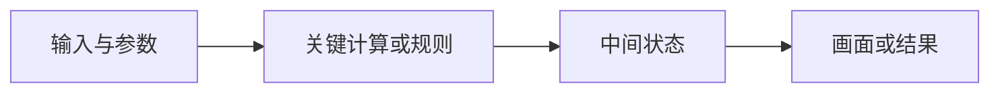

# Web3D 实验说明模板

每个实验复制本模板，替换示例标签并填写实际内容。七个部分都需要保留；尚未实现或验证的项目明确标注状态。

## 一 学习目标

| 项目 | 填写内容 |
| --- | --- |
| 实验编号与名称 | 所属阶段及要观察的机制 |
| 当前状态 | 规格／实现中／待验证／已验收 |
| 核心问题 | 一个能够用实验回答的问题 |
| 前置知识 | 必要概念及资料入口 |
| 必读资料与范围 | 官方或原始资料；具体小节、停止位置与参考用时 |
| 阅读检查 | 合上资料后要画出的图、要解释的问题；另列条件补读与后续选读 |
| 完成条件 | 可以观察、计算或解释的结果 |

## 二 机制图

标注图中各阶段的坐标空间、单位、资源或时间。复杂机制拆为多张小图。

## 三 操作步骤

| 步骤 | 操作 | 预期观察 |
| --- | --- | --- |
| 初始状态 | 打开并重置实验 | 记录默认参数与对象状态 |
| 对比 | 改变一个参数 | 说明哪个中间值与结果发生变化 |
| 边界 | 使用一个边界输入 | 记录合理结果或明确错误 |
| 恢复 | 重置或切换实验 | 确认恢复与资源清理 |

## 四 关键代码与数据流

关联实际代码入口，解释输入怎样经过计算变成结果。区分自己实现的部分、Three.js 或浏览器完成的部分；避免用整份代码替代关键步骤说明。

## 五 中间数据与结果

| 数据 | 单位与空间 | 如何观察 | 预期与实际 |
| --- | --- | --- | --- |
| 参数 | 按实际实验填写 | 控件或固定输入 | 实际记录 |
| 中间值 | 时间／坐标／矩阵／权重等 | 辅助图形或过程面板 | 实际记录 |
| 结果 | 状态／画面／性能指标等 | 日志、图形或统计 | 实际记录 |

## 六 Cocos 对照

| Web 机制 | Cocos 对应机制与源码入口 | 差异与复现检查 |
| --- | --- | --- |
| 本实验的核心步骤 | 对应版本、概念、API 或源码 | 坐标、单位、生命周期、导入或渲染差异 |

迁移检查使用相同输入、状态变化与可观察结果。需要转换的 API、资产和配置单独记录。

## 七 自测与结论

- 能否不看代码解释机制图和一个关键中间值？
- 改变条件后，能否预测结果并用实验验证？
- 能否说明 Cocos 对应机制，以及至少一个实现差异？

| 证据字段 | 实际填写 |
| --- | --- |
| 环境与代码版本 | 设备、浏览器、分辨率、依赖锁版本和提交 |
| 验证记录 | 用例、输入、结果、错误与复现步骤 |
| 学习结论 | 实验支持的结论与适用条件 |
| 个人理解 | 自测答案与待补充内容 |
| 下一问题 | 由本次实验产生的具体问题 |
