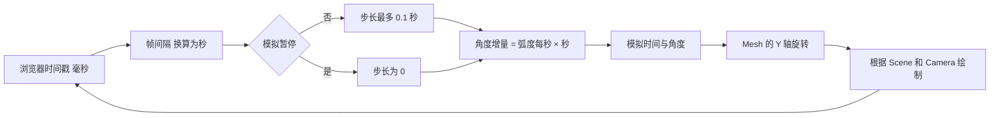
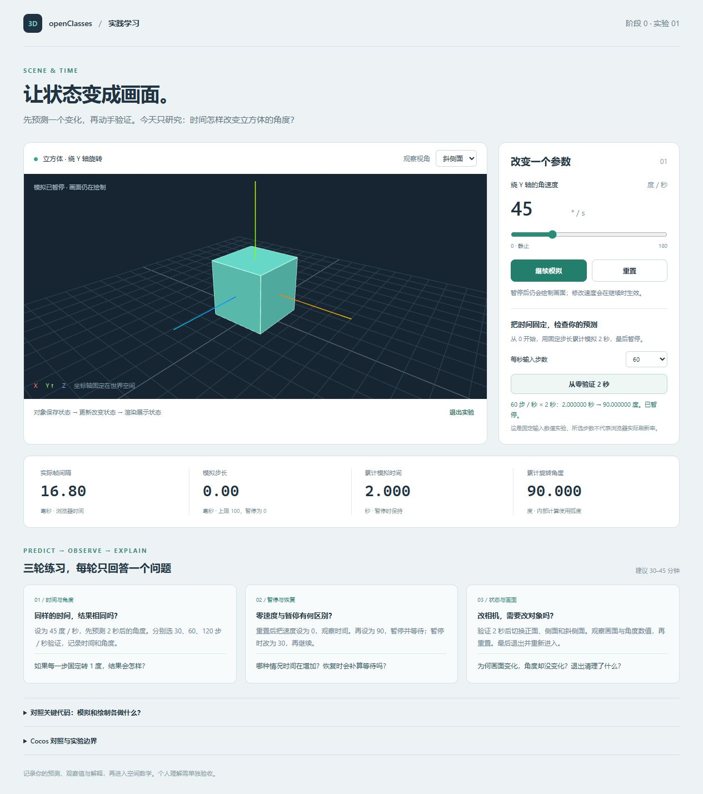

# 阶段 0 实践：立方体、时间与状态

## 一 学习目标

[实现记录] 首个 TypeScript + Three.js 实验已建立。数值检查、类型检查、构建与核心浏览器交互已通过；后台恢复与 WebGL2 不可用提示尚待桌面浏览器实测。个人理解待验收。

[用户报告] 2026-10-09，学习者表示已看完相关基础原理；尚未据此评定掌握程度。本次直接进入“预测 → 操作 → 记录 → 解释”。

| 项目 | 内容 |
| --- | --- |
| [目标] 核心问题 | 时间步长怎样改变角度？模拟暂停时为什么仍能绘制？ |
| [前置] 概念 | Scene、Camera、Mesh、Renderer，速度与时间单位；回看[核心图册](../../../../../docs/game-engine/3d-client-core-visual.md#01-场景与时间)即可 |
| [资料] 条件回读 | [Three.js Fundamentals](https://threejs.org/manual/pages/fundamentals.html)中对象关系与旋转；[Cleanup](https://threejs.org/manual/pages/cleanup.html)开头到手动释放 |
| [检查] 阅读确认 | 能自行画出 Geometry／Material → Mesh → Scene，以及 Scene／Camera → Renderer |
| [计划预算] 实践 | 页面操作 30–45 分钟，代码改动 20–30 分钟；记录实际投入 |
| [验收目标] 完成条件 | 有参数预测、实际结果、自己的解释；通过[阶段 0 五个自测](stage-00-spec.md#五-自测) |

## 二 机制图



[实现约定] 切回页面和暂停／继续时重建时间基准。固定输入按钮使用单独的 30／60／120 步数值计算，累计模拟 2 秒并暂停；它不会改变浏览器实际刷新率。

## 三 操作步骤

[启动] 2026-10-10 起使用工程启动器，从当前仓库根目录执行下列命令，再访问终端给出的地址并加上 `?lab=time`。首版历史验证使用 Node 24.12.0；本轮启动器验证使用隔离 Node 24.19.0。

```powershell
$labRunner = '.\domains\game-engine\experiments\web3d-learning\tools\run.ps1'
powershell -NoProfile -ExecutionPolicy Bypass -File $labRunner install
powershell -NoProfile -ExecutionPolicy Bypass -File $labRunner dev
```

[启动条件] 启动器会寻找兼容的 Node 24.12+；其他机器未自动找到时，可传入 `-NodePath` 指定自己的 Node 24 node.exe。依赖由锁文件固定。Vite 的最低要求见[官方说明](https://vite.dev/guide/)，本工程按 Node 24 约定运行。

| 轮次 | 先预测，再操作 | 记录内容 |
| --- | --- | --- |
| [练习] 1 时间与角度 | 45 度／秒模拟 2 秒会转多少？依次用 30、60、120 步／秒验证 | 三组模拟时间和累计角度；为何浮点数可能有微小误差 |
| [练习] 2 零速度与暂停 | 重置，把速度设为 0，观察时间；再设为 90 并暂停，等 2 秒，改为 30 后继续 | 零速度、暂停、继续时哪几个数值变化；恢复是否补算等待 |
| [练习] 3 相机与生命周期 | 固定模拟 2 秒后切换观察视角，重置，退出并重新进入 | 角度未变时画面为何改变；重置与退出各做什么 |
| [边界] 窗口与后台 | 调整窗口尺寸，切到另一个页面再回来 | 立方体比例是否变化；返回是否出现角度大跳 |

[记录模板] 每轮写四行：输入与预测、实际观察、原因解释、仍不确定的问题。先写预测，再点击按钮。

## 四 关键代码与数据流

| 文件 | 本轮只读的入口 |
| --- | --- |
| [代码] [simulation.ts](../src/simulation.ts) | `createSimulation` 默认状态；`advance` 的时间与角度两行；`FrameClock.consume` 毫秒转秒和步长上限 |
| [代码] [cube-view.ts](../src/cube-view.ts) | Geometry／Material／Mesh 初始化；`render`；`setCamera`；`dispose` |
| [代码] [stage-00.ts](../src/stage-00.ts) | `tick` 先更新后绘制；暂停／重置事件；`stopLab` 取消任务与监听；main.ts 负责按地址选择实验 |

[练习 A] 在 `cube-view.ts` 修改材质颜色，观察哪些面板数值不变；恢复原值。解释为何渲染结果变化不一定代表模拟状态变化。

[练习 B] 在 `simulation.ts` 的 `advance` 中临时把角度更新改成“每次固定增加 1 度”，运行 `npm test`，观察帧率对比为什么失败；恢复原来的“角速度 × 秒数”，重新运行测试。这是故意制造错误的学习练习，完成后恢复正确实现。

[分工] 浏览器提供帧回调；本实验计算模拟时间与角度；Three.js 处理对象、几何体、矩阵与绘制。原生 WebGL 的内部步骤留到渲染阶段。

## 五 中间数据与结果

| 数据 | 单位与观察方式 | 当前证据 |
| --- | --- | --- |
| [已验证] 固定输入 | 45 度／秒，30／60／120 步／秒，各累计模拟 2 秒 | 数值测试和页面三组均为 90 度；数值测试时间误差小于 1e-9 秒，角度误差小于 1e-9 度 |
| [已验证] 零速度 | 速度 0，模拟推进 0.1 秒 | 角度 0，模拟时间 0.1 秒 |
| [已验证] 暂停改速 | 45 度／秒运行 1 秒，暂停并设为 90，再模拟 1 秒 | 暂停不改变状态，继续后累计 2 秒、135 度 |
| [已验证] 长帧与基准 | 输入 5 秒间隔；重建时间基准 | 实际间隔 5 秒，模拟步长 0.1 秒；恢复的首帧步长 0 |
| [已验证] 浏览器画面与交互 | Codex 内置 Chromium 页面操作；宽度 700 与默认 1265 像素 | 显示立方体与坐标轴；暂停改速和相机切换保留 2 秒、90 度；继续后按 30 度／秒更新；零速度时角度保持 532.506 度，模拟时间从 37.367 增至 37.467 秒；退出画布为 0，重入为 1 且恢复默认参数；无浏览器错误 |
| [待验证] 桌面浏览器边界 | 后台返回与 WebGL2 不可用 | 内置浏览器切换标签后仍报告 visible，不能据此验收真正的后台恢复；不可用提示已实现，尚未实测 |
| [待登记] 个人预测与解释 | 学习者自己的回答 | 尚未验收 |

[测量边界] 数值测试不能替代实际浏览器交互；角度显示累计值，画面朝向具有整圈重复和立方体对称性，需看数值判定结果。

## 六 Cocos 对照

| Web 机制 | Cocos 3.8.8 对照 | 需要解释的差异 |
| --- | --- | --- |
| [源码依据] Mesh 位置与旋转 | [Node](../../../engines/cocos-engine/cocos/scene-graph/node.ts) 的 `_lpos`、`_lrot`、`_lscale` | Mesh 不是 Node／Component 完整生命周期的等价物 |
| [源码依据] 帧回调更新 | [Director.tick](../../../engines/cocos-engine/cocos/game/director.ts) 调用组件 start／update／lateUpdate，再组织绘制 | 浏览器回调由浏览器驱动，Cocos 按引擎流程组织 |
| [源码依据] 更新行为 | [ComponentScheduler](../../../engines/cocos-engine/cocos/scene-graph/component-scheduler.ts) 的阶段回调 | 游戏里的行为通常由组件更新回调表达 |
| [对照] 实验释放 | Node 销毁、监听与资源生命周期 | 从场景移除对象仍需检查图形资源和回调归属 |

## 七 自测与结论

[自测] 完成页面练习后，回答[阶段 0 规格的五个问题](stage-00-spec.md#五-自测)。先不看代码，用自己的话解释，再回到指定函数核对。

| 证据字段 | 当前记录 |
| --- | --- |
| [环境] 日期与运行时 | 2026-10-09；Node 24.12.0、npm-cli.js 11.6.2；Three.js 0.186.1、类型定义 0.186.0、Vite 8.3.4、TypeScript 7.0.2；具体锁定依赖见 package-lock.json |
| [代码] 版本 | 实验首版，提交后通过 `git log -1 --oneline -- src tests` 定位 |
| [验证] 数值 | 6 项测试通过，覆盖三种输入帧率、零速度、暂停改速、长帧上限与恢复、重置和非法输入 |
| [验证] 浏览器 | 内置 Chromium 1265×712 默认视口，另测宽度 700×850；画面、固定步长、暂停／改速／继续、零速度、相机切换、重置、尺寸变化和退出重入已检查；后台恢复和无 WebGL2 待桌面 Chrome／Edge 验证 |
| [待登记] 个人理解 | 基础原理已阅读来自用户反馈；预测、操作记录与五个自测答案尚未提交 |
| [下一问题] 后续 | 阶段 0 理解验收后，进入向量与父子变换实验 |

[运行截图] 固定输入 60 步／秒，累计模拟 2 秒、角度 90 度，处于暂停状态。


