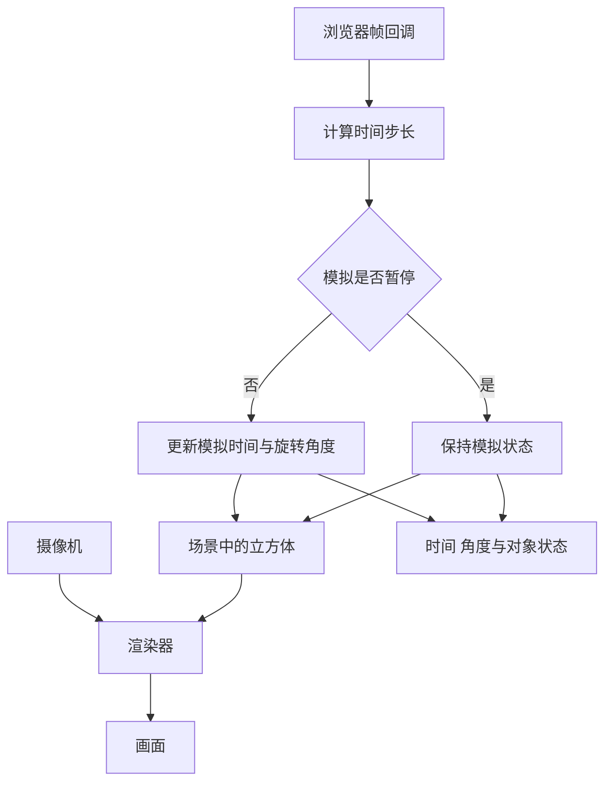

# 阶段 0 立方体与帧循环实验规格

本实验回答：**时间步长怎样改变对象状态，状态怎样通过场景、摄像机与渲染器变成画面？** 当前为规格，尚未实现或验收。

先按[第一周阅读与练习计划](../../../../../user-profile/progress/3d-game-client-week-01.md)阅读指定资料，画图与预测，再开展下面的实现和检查。

## 一 实验结构

## 二 功能与观察项

| 内容 | 阶段 0 要求 |
| --- | --- |
| 场景 | 立方体、可见坐标轴、摄像机与基础照明；标注坐标方向 |
| 旋转 | 可调整绕 Y 轴的角速度，控件与过程面板明确角度单位 |
| 暂停／继续 | 暂停后模拟时间和角度不变，画面与参数仍可查看 |
| 重置 | 恢复默认参数、初始角度和模拟时间；恢复默认摄像机状态 |
| 过程 | 显示实际帧间隔、用于更新的时间步长、模拟时间与旋转角度 |
| 代码解释 | 关联场景初始化、时间更新、旋转与渲染的关键代码 |
| 错误 | WebGL2 不可用时说明原因与浏览器检查方式，保留原理资料入口 |

首版约定默认角速度 45 度／秒、可调范围 0 至 180 度／秒、初始角度 0。代码内部用弧度，每次更新按 `角度增量 = 角速度 × 时间步长` 计算，并在说明中展示度与弧度的换算。

初始状态自动播放。重置恢复自动播放和默认参数；暂停期间修改参数只影响后续模拟。

浏览器实际帧间隔与模拟步长分别显示。为避免后台返回后的突然大跳，实际更新步长上限为 0.1 秒；暂停与切回页面时重建时间基准，不把暂停期间的时间补进模拟。

## 三 操作与验收

| 操作 | 预期结果 |
| --- | --- |
| 打开实验 | 看到立方体与坐标轴，能辨认 Scene、Camera、Mesh 与 Renderer 的职责 |
| 默认速度累计模拟 2 秒 | 计算结果为 90 度；连续画面按模拟时间呈现 |
| 角速度设为 0 | 时间可继续，角度保持不变 |
| 暂停后等待 2 秒 | 模拟时间与角度保持不变 |
| 暂停时改速度，再继续 | 继续后按新速度更新，没有补算暂停时间 |
| 重置 | 时间与角度回到 0，速度回到 45 度／秒，摄像机回到初始状态 |
| 调整窗口大小 | 画布尺寸和摄像机宽高比同步，立方体不被拉伸 |
| 模拟不同帧率输入 | 相同累计模拟时间得到相同角度，计算误差在约定浮点容差内 |
| 切换或销毁实验 | 注销监听与更新任务，释放该实验自身拥有的资源 |

纯角度计算使用数值验证；暂停、重置、尺寸变化和资源清理使用浏览器操作检查。帧率测试比较累计模拟时间，不把被截断的后台墙钟时间作为运动预期。

## 四 Cocos 对照

| Web 步骤 | Cocos 对应原理 | 阅读入口 |
| --- | --- | --- |
| 创建对象与层级 | Node 容器、Component 行为与生命周期 | [场景图](../../../guides/cocos-source-learning/02-scene-graph/README.md)、[Node 源码](../../../engines/cocos-engine/cocos/scene-graph/node.ts) |
| 按时间更新旋转 | 调度循环、更新回调、Quat 与局部变换 | [调度器](../../../guides/cocos-source-learning/01-core-foundation/04-scheduler.md)、[数学库](../../../guides/cocos-source-learning/01-core-foundation/01-math-types.md) |
| 创建观察视角 | Camera 与观察／投影矩阵 | [Camera 源码](../../../engines/cocos-engine/cocos/misc/camera-component.ts) |
| 绘制场景 | 引擎渲染流程与底层图形 API 抽象 | [渲染管线](../../../guides/cocos-source-learning/03-rendering/02-render-pipeline.md)、[GFX](../../../guides/cocos-source-learning/03-rendering/01-gfx-abstraction.md) |
| 释放实验 | 对象销毁、监听注销与图形资源生命周期 | [资源管理](../../../guides/cocos-source-learning/05-asset-management/README.md) |

Web 的帧回调由浏览器驱动；Cocos 将更新组织在引擎调度流程中。区分实验模拟暂停、动画暂停和整个引擎暂停的范围。

### 工程准备检查

| 项目 | 创建代码时检查 |
| --- | --- |
| 运行时 | 学习工程进程使用隔离 Node 24；包管理器、TypeScript 与 Vite 的子进程使用同一运行时 |
| 工作目录 | 安装、构建与运行限定在 `web3d-learning`，系统默认 Node 和其他项目环境保持各自配置 |
| 依赖 | 固定兼容的依赖版本，提交清单与锁文件，并添加该工程锁文件的局部忽略例外 |
| 浏览器 | 验证 WebGL2 与画布尺寸，异常时显示说明 |

## 五 自测

1. 为什么按“每帧固定转动角度”实现，会受帧率影响？
2. 摄像机、Mesh 和渲染器分别提供哪些数据？
3. 暂停后继续，为什么要处理时间基准？
4. 为什么从场景移除对象后，还要检查监听与图形资源？
5. Cocos 中哪些机制对应本实验，哪些步骤由引擎管理？

实际回答与验证记录在实现后按[实验说明模板](lab-template.md)填写，并更新[学习进度](../../../../../user-profile/progress/3d-game-client-progress.md)。
