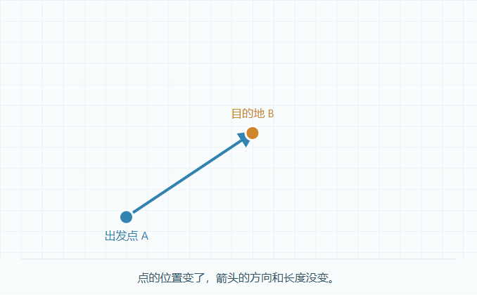
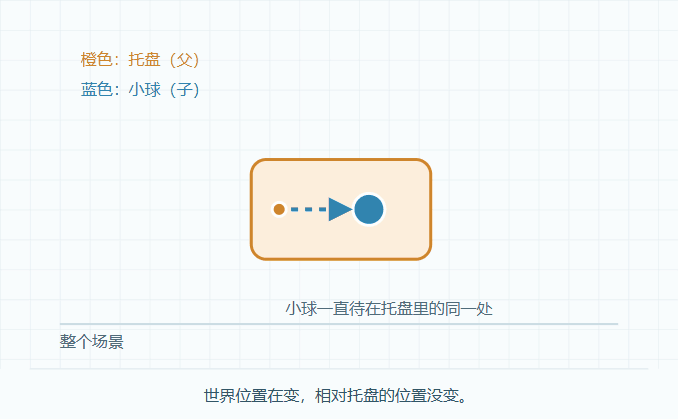
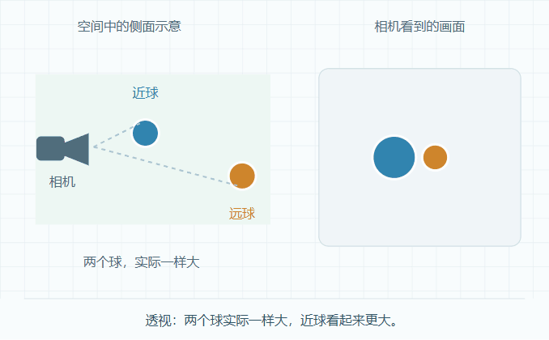
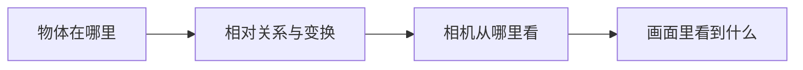

# 阶段 1：看动画，理解空间

## 一 学习目标

[当前方式] 2026-10-10，按学习者反馈，页面从填写、手算与记录下载改为自动播放动画、简单原理解释和一键对比。直接观看即可，需要时展开公式与 3D 观察。旧浏览器笔记没有删除，当前页面不再读取或写入它们。

| 项目 | 当前安排 |
| --- | --- |
| 核心问题 | 点与方向有何区别，父物体怎样影响子物体，相机怎样产生画面？ |
| 学习入口 | 开发服务地址加 `?lab=space`，先看“点与箭头” |
| 学习方式 | 一次看一个变化，配一句解释；点击按钮再看对比 |
| 按需补充 | [原理规格](stage-01-spec.md)、[核心知识图册](../../../../../docs/game-engine/3d-client-core-visual.md)、公式、源码与 3D 观察 |
| 个人理解 | 可在后续自然交流中确认，不强制填写、手算或答题 |

## 二 原理与动图

**点是位置，箭头是方向与距离。** 蓝点和橙点分别是出发点与目的地。它们一起换了位置，连接它们的箭头仍一样长、朝同一方向。这说明位移只关心“两点之间的关系”。



**父物体像托盘，子物体像小球。** 托盘移动，小球跟着移动；小球在整个场景里的位置变了，但它在托盘里的位置一直没变。前者叫世界位置，后者叫局部位置。



**透视会产生近大远小。** 左边两个球实际一样大；右边的相机画面中，近球更大。相机靠近时，近球的放大更明显。页面中点击“换成正交投影”，就会看到两球在画面里一样大，不再因距离缩放。





这些图表达机制，不要求通过画面测量或计算数字。

## 三 怎样观看

打开页面后，动画自动播放。点按钮即可对比一个变化，暂停可以停下来观察，重播可以重新看过程。右侧说明解释当前原理，下方“放进游戏里”连接角色移动、武器挂点与镜头等例子。

| 主题 | 直接点这些演示 |
| --- | --- |
| 点与箭头 | 把目的地拉远；一起搬走；只保留方向；比较朝向；交换叉积顺序 |
| 托盘与小球 | 换移动方向；换旋转方向；比较变换先后顺序 |
| 相机与画面 | 透视与正交切换；物体在镜头前方与后方 |

从当前仓库根目录启动：

```powershell
$labRunner = '.\domains\game-engine\experiments\web3d-learning\tools\run.ps1'
powershell -NoProfile -ExecutionPolicy Bypass -File $labRunner install
powershell -NoProfile -ExecutionPolicy Bypass -File $labRunner dev
```

需要 Node 24.12+，启动器自动寻找兼容运行时；未找到时使用 `-NodePath` 指定自己的 Node 24 node.exe。实际验证运行时为 Codex 随附 Node 24.19.0。

## 四 实现与过程

| 文件 | 职责 |
| --- | --- |
| [space-lab.ts](../src/space-lab.ts) | 原理说明、SVG 动画、按钮对比、播放状态与可选 3D；没有填写与记录导出流程 |
| [space-math.ts](../src/space-math.ts) | 向量、矩阵与投影计算；供深入对照与自动测试 |
| [space-view.ts](../src/space-view.ts) | 可选 Three.js 观察视角、图形资源与控制清理 |
| [capture-demo-frames.js](../tools/capture-demo-frames.js) | 从实际 SVG 页面逐帧捕获，10 帧／秒 |
| [render-demo-gifs.py](../tools/render-demo-gifs.py) | 使用统一调色板生成循环 GIF，验证动画与时长 |

网页图示使用 SVG 时间轴，暂停和重播直接控制图示时间。GIF 从同一页面捕获，不另画一套不同的数据。生成方式：在仓库根目录先建 `output/playwright/demo-frames/vector`、`parent`、`projection` 三个目录，启动开发服务，用 Playwright CLI 打开页面并执行捕获函数，再在实验目录用具有 Pillow 的 Python 运行 `tools/render-demo-gifs.py`。中间帧保持 Git 忽略，最终 GIF 随文档提交。

## 五 实际检查

| 检查项 | 结果与范围 |
| --- | --- |
| 数学与构建 | 既有 15 项测试覆盖向量、变换、投影与阶段 0；类型检查和构建通过 |
| 动画关系 | 浏览器在不同动画时刻检查两点实际移动，移动量相同、相对位移保持 |
| 播放与切换 | 暂停、重播、五个向量原理、三个父子原理、两个相机原理与一键对比通过 |
| 投影 | 近球的画面半径大于远球；正交切换后两球半径相同，说明随状态同步 |
| 可选 3D | 默认无画布，展开为 1，关闭为 0；资源和监听按归属释放 |
| 图形不可用 | 故障注入使 WebGL2 返回 null，可选 3D 提示原因，SVG 演示继续可用 |
| 布局与动画偏好 | 检查 1440×1000 与 390×844，无横向溢出；减少动画偏好默认暂停，可主动播放 |
| GIF | 678×420，向量 4 秒、父子与投影各 5 秒，循环播放；静止段会合并为较长帧，时长保留 |

本次检查不评定个人理解，也没有把既有阶段 0 的未验收项目改成已通过。GPU 精确内存与真实球体投影轮廓不属于这些机制示意图的验证范围。

## 六 Cocos 对照（按需）

| 直观原理 | Cocos 对应入口 |
| --- | --- |
| 位置、位移、方向与向量关系 | [Vec3](../../../engines/cocos-engine/cocos/core/math/vec3.ts)：subtract、len、normalize、dot、cross |
| 托盘与小球的父子关系 | [Node](../../../engines/cocos-engine/cocos/scene-graph/node.ts)：局部／世界变换与 updateWorldTransform |
| 旋转与变换组合 | [Quat](../../../engines/cocos-engine/cocos/core/math/quat.ts)、[Mat4](../../../engines/cocos-engine/cocos/core/math/mat4.ts) |
| 镜头与画面 | [Camera](../../../engines/cocos-engine/cocos/misc/camera-component.ts)：投影和 worldToScreen；迁移时核对坐标、视口、深度范围 |

先理解画面里的变化，再在需要时对应 API。零向量没有单位方向，零缩放丢失信息，裁剪坐标 w=0 不能进行透视除法；这些边界由代码与可选说明保留。

## 七 当前结论

阶段 1 已具备以动画理解原理的入口。学习者的明确偏好已登记到[学习偏好](../../../../../user-profile/learning-preferences.json)与[档案](../../../../../user-profile/learning-profile.md)：简明原理、交互演示或动图优先，不强制填写与测算。个人理解仍按实际交流确认，技能评分不因本轮实现自动更新。
