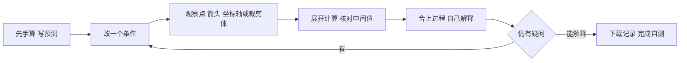
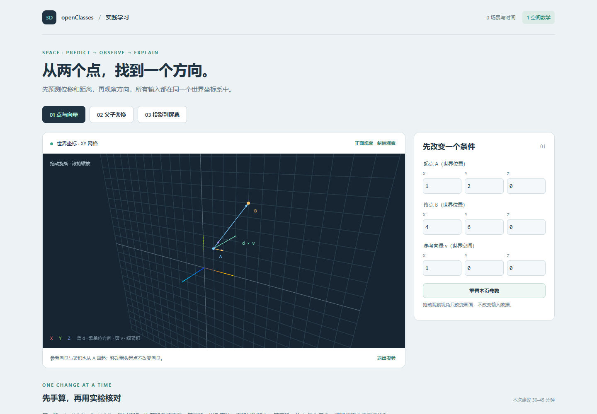

# 阶段 1 实践：点与向量、父子变换、投影

## 一 学习目标

[实现记录] 2026-10-10，阶段 1 坐标实验台首版已建立，包含三页练习。新增 9 项数学测试与原阶段 0 的 6 项共 15 项通过，类型检查和构建通过；浏览器核心交互、窄屏布局、记录下载和 WebGL2 失败提示已检查。个人理解待验收。

[执行调整] 学习者已明确要求开始下一阶段，以实践促进学习。本轮开始阶段 1；阶段 0 的桌面后台恢复、实际 WebGL2 不可用场景和个人五题自测继续保留待验收，未将阶段 0 标记为通过。

| 项目 | 内容 |
| --- | --- |
| 实验编号 | 阶段 1 · 坐标实验台 01／02／03 |
| 核心问题 | 坐标与变换怎样经过计算成为可观察的结果？ |
| 前置 | 场景对象、坐标轴、速度与时间概念；阶段 0 未补项目仍需回收 |
| 首次实践预算 | 30–45 分钟，先完成点与向量三轮；记录实际用时 |
| 资料与停止位置 | 先读 [Scratchapixel Points, Vectors and Normals](https://www.scratchapixel.com/lessons/mathematics-physics-for-computer-graphics/geometry/points-vectors-and-normals.html) 的点、向量、长度、归一化；后两页对应[前四周计划](../../../../../user-profile/progress/3d-game-client-month-01.md)第 3／4 周，按卡点回读 |
| 阅读检查 | 不看资料画出 A、B、B−A 与单位方向，说明在哪个空间中计算 |
| 完成条件 | 留下自己的预测、实际观察、机制解释和[六项自测](stage-01-spec.md#四-个人自测) |

资料网页无法访问时，先读[本地数学库](../../../guides/cocos-source-learning/01-core-foundation/01-math-types.md)的 Vec3 部分，备用入口沿用[资料访问记录](../../../../../learning-routes/resources/3d-game-client-resources.md#七-访问状态与备用阅读入口)。实践页面本身已包含本轮公式与边界说明。

## 二 机制图



三页数据流分别是：A、B→位移→长度与方向→向量关系；子局部矩阵→父矩阵相乘→子世界矩阵→逆变换；局部→世界→观察→裁剪→除以 w→NDC→屏幕。约定与边界见[实验规格](stage-01-spec.md)。

## 三 操作步骤

从当前仓库根目录执行；启动器使用工程锁文件与隔离 Node 24.12+，不会依赖旧工作区路径。它优先寻找显式 NodePath／WEB3D_NODE_PATH、当前兼容 Node、Codex 随附 Node 24 和 NVM 的 Node 24。系统 Node 18 可以保留。

```powershell
$labRunner = '.\domains\game-engine\experiments\web3d-learning\tools\run.ps1'
powershell -NoProfile -ExecutionPolicy Bypass -File $labRunner install
powershell -NoProfile -ExecutionPolicy Bypass -File $labRunner dev
```

打开终端给出的地址并加上 `?lab=space`，默认端口为 5173。若没有自动找到兼容运行时，为上述命令传入 `-NodePath`，值为自己机器上 Node 24 的绝对 node.exe 路径。

| 轮次 | 先预测，再操作 | 自己记录 |
| --- | --- | --- |
| 01-A 两点与位移 | 保持 A=(1,2,0)、B=(4,6,0)，写出 d、距离和单位方向；再展开计算 | 三个预期值与实际值；位置和位移的不同含义 |
| 01-B 运算顺序 | 选择“垂直轴”，预测叉积，再“交换 d 与 v”；比较同向与反向输入 | 叉积方向、点积、余弦与夹角；结果为零的原因 |
| 01-C 零向量 | 选择“重合点”，再重置 | 哪些结果仍有值、哪些未定义；恢复是否一致 |
| 02-A 父子变换 | 子局部 (1,0,0)，父绕 Z 转 90°、沿 X 平移 2；交换组合顺序 | 画两条变换路径；局部位置不变时世界位置的变化 |
| 02-B 逆变换 | 比较“非均匀缩放”与“零缩放”，看矩阵、方向 w=0 和逆变换 | 点与方向的区别；丢失一个维度后为什么不能唯一恢复 |
| 03-A 相机与屏幕 | 点先设为原点，再偏离中心；改变相机 Z，切换透视／正交 | 中间六步、相机距离对偏移的影响；原点与屏幕 Y 方向 |
| 03-B 裁剪边界 | 分别选择相机平面、相机后方、近裁剪面之前 | w、NDC、屏幕坐标与可见性各有什么区别 |

每页“预测、观察、解释、实际用时”自动保存到当前浏览器。下载按钮导出当前有效输入、自己的记录和计算快照，时间使用 Asia/Shanghai。重置、切页保留笔记；每页各一份，开始新的输入组合前可先下载已有记录。存储不可用时仍可下载。

今天只完成 01-A 至 01-C，再尝试不看结果解释：同时平移 A、B，位移变不变？零向量与平行向量为什么都可能有零叉积？不会的问题再回读，后两页按个人理解逐步进入。

## 四 关键代码与数据流

| 文件 | 只读这些入口 |
| --- | --- |
| [space-math.ts](../src/space-math.ts) | inspectVectors：B−A、长度、归一化和向量关系；inspectTransform：TRS／RTS、w=0、行列式；inspectProjection：Vector4 保留 w 和屏幕映射 |
| [space-view.ts](../src/space-view.ts) | 点与箭头、OrbitControls、setObjects 释放旧图形、dispose；网格和观察相机只帮助查看 |
| [space-lab.ts](../src/space-lab.ts) | 控件校验→数学结果→画面与面板；三页参数、个人笔记和记录导出 |
| [main.ts](../src/main.ts) | 按地址参数选择阶段 0 或阶段 1；浏览器导航切换工程入口 |
| [run.ps1](../tools/run.ps1) | 在实验目录执行安装、开发、测试或构建，并为子进程选用兼容 Node |

本实验组织学习输入、边界与中间过程；Three.js 实现向量／矩阵运算、投影矩阵、几何体和绘制。首版明确限制父旋转为单轴、子矩阵为平移、投影模型矩阵为平移，不能把这些用例理解为已覆盖一般模型层级与所有四元数组合。

## 五 中间数据与结果

| 检查 | 实际证据 |
| --- | --- |
| 位移与单位方向 | (3,4,0)、5、(0.6,0.8,0)；对 A、B 同时平移后位移保持 |
| 向量运算 | X×Y=+Z，交换后为−Z；同向／反向夹角与零输入有独立检查 |
| 父子组合 | TRS 世界 (2,1,0)，RTS 世界 (0,3,0)；w=0 方向 (0,1,0,0)，不加平移 |
| 缩放与恢复 | 非均匀缩放可恢复原局部位置；零缩放显示不可逆；面板矩阵没有误转置 |
| 投影 | 800×400 固定输入原点映射 (400,200)，WebGL near／far 对应 NDC −1／+1；透视偏移随距离变化，正交保持 |
| 浏览器过程面板 | 桌面视口 1440×1000，投影绘图区域 874×470；默认 P=(1,1,0) 为屏幕 (487.879,184.121) CSS 像素 |
| 输入与裁剪边界 | 空输入保留上一次有效结果；far≤near 提示；w=0、相机后方与 near 前方不显示屏幕点 |
| 布局 | Chromium 检查 1440×1000 与 390×844；窄屏无横向溢出，投影尺寸随实际视口更新 |
| 生命周期 | 退出画布 0，重入画布 1；六次往返切页始终只有一个画布；退出后切页仍禁用参数 |
| 记录 | 切页、重载保留各页笔记；Markdown 下载名称与内容已检查；验证使用的占位内容已清除，不代表个人回答 |
| 图形失败 | 用浏览器故障注入使 WebGL2 返回 null：显示提示、禁用图形参数，无残留画布，原理仍可阅读；没有冒称硬件不支持场景实测 |
| 阶段 0 回归 | 地址导航、45 度／秒固定输入 2 秒=90 度、退出与重入通过 |

数值测试容差为 1e-9，面板显示 3 位小数。资源清理检查依据代码归属与画布／交互结果，未进行精确 GPU 内存测量。截图不能独立替代数值判定。



## 六 Cocos 对照

以仓库 Cocos 3.8.8 源码为准；文档链接用于查原始 API，实际依赖仍以 package-lock.json 固定。

| 实验机制 | Cocos 源码与差异 |
| --- | --- |
| sub、length、normalize、dot、cross | [Vec3](../../../engines/cocos-engine/cocos/core/math/vec3.ts) 的 subtract、len、normalize、dot、cross；输出参数及是否修改对象要逐个核对；零向量返回零值仍没有单位方向 |
| 轴角四元数与父子变换 | [Quat](../../../engines/cocos-engine/cocos/core/math/quat.ts) 的 fromAxisAngle；[Node](../../../engines/cocos-engine/cocos/scene-graph/node.ts) 的 updateWorldTransform；以输入、局部／世界关系核对，Object3D 与 Node／Component 生命周期不同 |
| 点与方向 | Vec3.transformMat4 使用隐含 w=1 并处理透视除法；transformMat4Normal 在仿射矩阵下不加平移，不能因此省略法线的专用变换检查 |
| 逆变换 | [Mat4.invert](../../../engines/cocos-engine/cocos/core/math/mat4.ts) 不可逆时返回全零矩阵；实验先判断可逆性，避免把零返回误当合法坐标 |
| 观察、投影和屏幕转换 | [Camera](../../../engines/cocos-engine/cocos/misc/camera-component.ts) 的投影及 worldToScreen；必须分别核对图形后端深度范围、视口与屏幕原点，不直接照搬本页 WebGL 约定 |

Three.js 原始说明：[Vector3](https://threejs.org/docs/pages/Vector3.html)、[Matrix4](https://threejs.org/docs/pages/Matrix4.html)、[Vector4](https://threejs.org/docs/pages/Vector4.html)。尤其核对 Vector3.applyMatrix4 的隐含 w=1 与透视除法；观察裁剪坐标应使用 Vector4 保留四个分量。

## 七 自测与结论

| 证据字段 | 当前记录 |
| --- | --- |
| 日期与运行时 | 2026-10-10；Codex 随附 Node 24.19.0，调用现有 npm-cli.js；系统 Node 18.15.0 保留 |
| 依赖 | 沿用锁文件：Three.js 0.186.1、类型 0.186.0、Vite 8.3.4、TypeScript 7.0.2 |
| 代码版本 | 本阶段提交后可用 `git log -1 --oneline -- src/space-lab.ts src/space-math.ts` 定位 |
| 数值与构建 | 15／15 测试通过；tsc --noEmit 与 Vite 构建通过；Three.js 公共包仍有大于 500 kB 的构建体积提示 |
| 浏览器 | Playwright Chromium 核心交互、桌面／窄屏布局、生命周期、记录下载、阶段 0 回归与图形失败故障注入通过 |
| 个人理解 | 尚未提交学习者自己的预测、观察、六项自测及实际用时；技能评分不更新 |
| 下一问题 | 先完成点与向量三轮记录，再解释变换顺序和点／方向，最后追踪投影；阶段 0 未验收项继续补齐 |

实现与核心运行检查已具备开始实践的条件，个人学习阶段仍待验收。[进度表](../../../../../user-profile/progress/3d-game-client-progress.md)保持两类证据分开登记。
