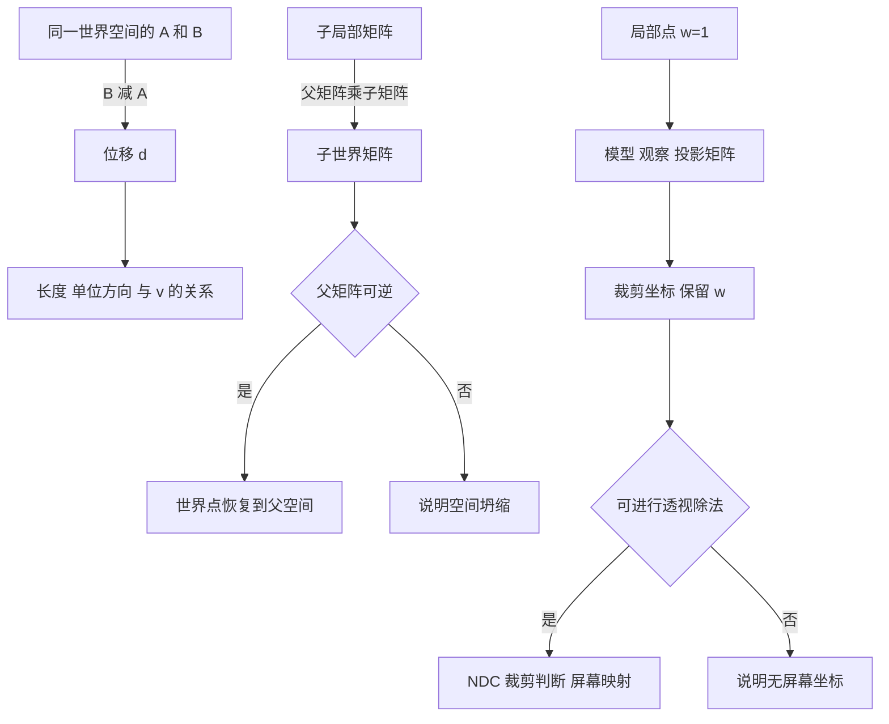

# 阶段 1 空间数学实验规格

[实现范围] 一个坐标实验台分为点与向量、父子变换、投影到屏幕三页，对应[前四周计划](../../../../../user-profile/progress/3d-game-client-month-01.md)的第 2 至 4 周。首版实现与证据见[实践记录](stage-01-lab.md)。实现、运行检查与个人理解分别登记；不会根据页面可运行自动判定阶段通过。

## 一 学习目标与入口

| 练习页 | 核心问题 | 必须显示 |
| --- | --- | --- |
| 01 点与向量 | 两点怎样得到方向和距离？ | 位移、长度、单位方向、点积、余弦、夹角、叉积 |
| 02 父子变换 | 局部位置不变，世界位置为什么变化？ | 父／子局部／子世界矩阵、世界位置、逆变换、轴角四元数、w=0 方向 |
| 03 投影到屏幕 | 一个局部点怎样到达屏幕？ | 局部、世界、观察、裁剪、NDC、CSS 屏幕坐标，M／V／P 与裁剪判断 |

入口为开发服务地址的 `?lab=space`。阶段 0 保留 `?lab=time`，默认地址仍进入阶段 0。练习页之间保留各页当前参数；重置只恢复本页参数和默认观察视角。开始时先练 01，后续按理解情况进入 02、03。

## 二 数学与画面约定

- 点与向量输入均以世界坐标表达；d、v、单位方向和叉积箭头都从 A 画起，箭头平移不改变向量。网格是 XY 平面；零向量不画方向箭头。
- 向量长度使用场景单位；输入为零时，单位方向或夹角显示未定义。点积没有单位化时不能直接称为夹角余弦。
- 变换使用列向量，组合式最右项先作用。父节点直接位于世界中，子节点首版只使用局部平移；父旋转为单轴轴角，角度面板用度，内部用弧度。矩阵数组按列存储，面板按行展示。
- TRS 表示先缩放、再旋转、再平移；RTS 表示先缩放、再平移、再旋转。w=1 的点受平移影响；w=0 的方向不加平移，但受旋转、缩放影响，不自动归一化。
- 逆变换前检查父矩阵行列式；绝对值不大于 1e-10 时不求逆，并显示不可逆原因。
- 投影的模型矩阵首版只使用平移；目标相机在世界 `(0,0,distance)`，朝向 −Z。旁观相机用于观察空间与裁剪体，不参与过程面板计算。
- 透视使用可调垂直 FOV；正交的上下界固定为 ±3，左右界由视口宽高比决定。near／far 是正距离且 far > near。
- WebGL 的 NDC 深度范围为 −1 到 +1。屏幕原点为左上，Y 向下，单位为视口 CSS 像素；下方屏幕预览按比例缩小。窗口变化时更新尺寸、aspect 和计算过程。

## 三 操作、记录与边界

每轮先写预测，再改一个条件，展开计算核对，最后写自己的解释。每页保存一份预测、观察、解释和实际用时到当前浏览器；可下载包含输入与计算快照的 Markdown。切页和重置保留笔记，不代写个人答案。

| 检查 | 输入与判定 |
| --- | --- |
| 3–4–5 位移 | A=(1,2,0)，B=(4,6,0)：d=(3,4,0)，距离 5，单位方向 (0.6,0.8,0) |
| 叉积顺序 | X×Y=+Z，交换后为 −Z；同向、反向与零输入分别解释 |
| 变换顺序 | 子局部 (1,0,0)，父绕 Z 90°、平移 (2,0,0)：TRS 世界 (2,1,0)，RTS 世界 (0,3,0) |
| 缩放与恢复 | 非均匀缩放可回到原局部点；零缩放显示不可逆 |
| 点与方向 | 同一父矩阵作用到 w=1 的点和 w=0 的方向，平移影响不同 |
| 投影 | 原点在屏幕中心；偏离中心的点在透视中随距离改变偏移，正交偏移保持 |
| 裁剪 | w≈0 无 NDC／屏幕坐标；相机后方、near 前方和范围外不得显示屏幕点 |
| 无效输入 | 空值、超出控件范围或 far≤near 给出提示，保留上一次有效画面与计算 |
| 生命周期 | 切页替换并释放旧辅助图形；退出停止观察控制和监听，画布为 0；重入恢复当前参数，画布为 1 |
| 图形失败 | WebGL2 创建失败显示原因、禁用图形参数，保留原理、切页和记录功能 |

数值验证误差为 1e-9；面板显示 3 位小数不能代替原始精度。截图需结合中间数值与操作步骤解释。

## 四 个人自测

1. 同时给 A、B 加上相同平移，位置和位移各怎样变化？为什么点与向量的三个分量可能相同，意义仍不同？
2. 归一化保留什么、丢失什么？零向量为什么没有单位方向？
3. 非单位向量的点积能否直接作为余弦？叉积为零有哪些原因，交换输入为何反向？
4. 用图解释 TRS 与 RTS 的计算顺序；给出同一矩阵作用到点与方向的不同结果。局部／世界各相对谁？
5. 非均匀缩放与零缩放的逆变换有何区别？轴角四元数为何不能直接当作三个欧拉角？
6. 合上计算过程，重画局部→世界→观察→裁剪→NDC→屏幕；说明 w、裁剪判断、Y 轴方向及旁观相机的职责。

首版用于建立上述机制；多轴四元数组合、复杂层级和一般模型变换在后续针对疑问扩展，不据此宣称已覆盖所有变换情形。个人自测和 Cocos 迁移说明通过后，才登记阶段理解通过。
