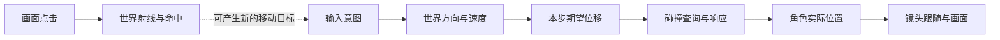
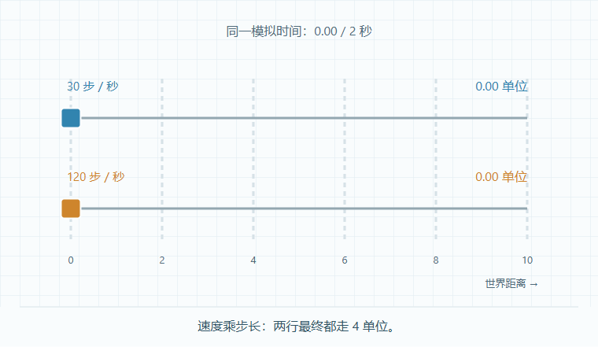
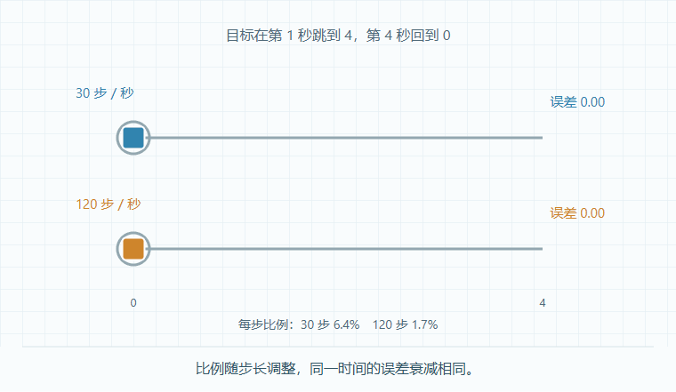
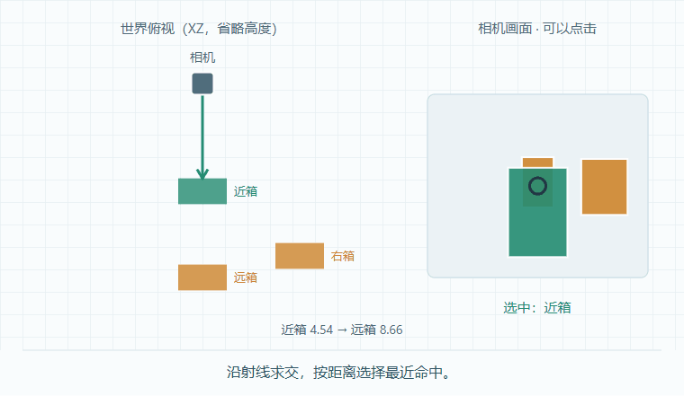
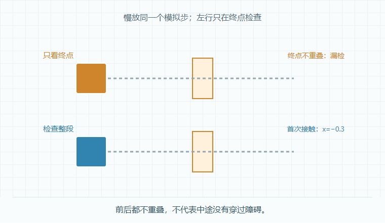

# 阶段 2：从输入到运动、镜头与碰撞

[当前演示] 2026-10-10，按学习者要求进入下一阶段并增加原理深度。入口为开发服务地址加 `?lab=motion`。先看动画，再看它下方的机制、公式和条件；可以暂停、逐步看、从头看与一键对比，无需填写或手算。

这条链说明：输入不直接等于位置，期望位移不直接等于实际位移，拾取到目标也不保证角色能安全走到那里。

## 一 方向与时间：为什么要归一化、乘步长

两方向输入 (1,1) 的长度为 √2；直接乘同一个速度，斜走就比单方向快。先取单位方向 d，再计算 `Δp=d×speed×Δt`，数字方向键的速度才能由 speed 单独决定。零输入时不做除法，直接保持位置。模拟摇杆则应保留轻推力度，只限制过大的输入长度。

`speed=2 单位／秒`表示一秒走 2 单位。30 次更新把一秒分成 30 步，120 次更新把它分成 120 步；各步距离不同，2 秒终点都为 4。反例“每帧走 0.04”则分别得到 2.4 和 9.6。

动图前半按时间更新，后半每帧固定距离。这里的 30／120 是模拟步数，不能当作浏览器实测帧率。恒速终点相同也不意味着不同步长下的碰撞或加速度模拟完全等效。[浏览器帧回调与时间戳说明](https://developer.mozilla.org/en-US/docs/Web/API/Window/requestAnimationFrame)

## 二 镜头：方向转换与逐渐消除误差

按“前进”先表达相对意图。镜头右方 R、地面前方 F 将其换成世界方向：`d=normalize(R×input.x+F×input.z)`。镜头转向后，同一输入可以沿不同世界路线移动。真实相机还要去掉竖直分量，并处理几乎竖直俯视时的退化方向。

平滑跟随不会立刻到位，而是每次消除一部分误差。`camera+=(target−camera)×α`。若每帧都用 α=0.1，120 次更新消除的误差更多，镜头响应会更快。

令 `α=1−e^(−λΔt)`，剩余误差每次乘 `e^(−λΔt)`；相同总时间的乘积是 `e^(−λT)`，因此静止目标的衰减按时间等效。λ 越大追得越快。本例 λ=2／秒，两种步长使用约 6.4% 和 1.7% 的单步比例。[Three.js MathUtils.damp](https://threejs.org/docs/pages/MathUtils.html)

动图前半使用时间相关比例，后半使用固定 10%；灰圈是目标，彩块是镜头位置。本例按两个切换时刻对齐的离散步数比较，不能推出持续运动目标在所有采样下都完全一致。这是指数平滑，未模拟弹簧、镜头避障或旋转。

## 三 拾取：点击为什么只能先得到射线

屏幕点只有两个坐标，缺少深度，不能唯一确定世界位置。先减去实际画面矩形的偏移，把坐标变成 NDC：`(2u−1,1−2v)`；再用相机把它反投影成世界射线 `origin+direction×t`。方向为单位向量，t 就是沿射线的距离。

射线与箱子表面求交，得到交点和距离；本演示选择最近命中，空白正常返回无命中。三个箱子是真实 BoxGeometry，由 Three.js Raycaster 查询；右图只画投影包围矩形，矩形空角可能不命中。[Raycaster 文档](https://threejs.org/docs/pages/Raycaster.html)

页面右侧相机画面也可以直接点击。白点只是标示这次查询的路径，不是射线传播耗时。射线没有宽度：角色中心线经过墙边而未命中，角色碰撞盒仍可能撞墙；“射线未命中”不能证明角色能通过。

## 四 碰撞：检测和响应是两个步骤

检测先找到本步首次接触时间 τ。角色中心在 `p_start+Δp×τ`，角色前沿应贴住墙面，不能等中心已经进入墙里才停止。响应再决定剩余位移如何处理：直接停止丢弃它，沿墙滑动则移除向墙内的法线分量。

`r_slide=r−min(0,r·n)×n`，其中 r 是接触后的剩余位移，n 是朝墙外的单位法线。图中墙外方向是左方，因此只去掉向右的部分，保留沿墙运动。

只检查终点还可能漏检：一步从 x=−2 跳到 x=2，起点、终点都不在墙内，但中途经过墙。扫掠检查整段路径，会在中心 x=−0.3 时接触，对应 τ=0.425。

动图慢放一个模拟大步；左行没有在慢放期间额外检测。页面可切换短步，让终点进入墙内，此时离散检测能发现重叠，但仍要响应纠正位置。固定步长降低漏检概率，不能保证任意速度都安全。

本例是一个固定朝向方块与一面静止墙的二维运动学模型：扩大墙的轴向边界，再对中心线段求交，对本例平移 AABB 等价。多面墙、墙角、旋转体、初始重叠纠正、摩擦、重力与反弹不在本次实现中。

## 五 Web 与 Cocos 对照

| 机制 | 本例 Web 计算 | Cocos 3.8.8 对照与差异 |
| --- | --- | --- |
| 时间更新 | 独立 move，单位为秒；rAF 时间戳控制演示时钟 | [Component](../../../engines/cocos-engine/cocos/scene-graph/component.ts) 的 update(dt)，dt 为秒 |
| 输入方向 | 归一化与地面镜头基向量 | Vec3 和 Node 世界旋转；核对镜头局部前方约定，模拟摇杆保留力度 |
| 镜头顺序 | 目标先更新，镜头再消除误差 | Component.lateUpdate 在 update 后，读取本帧角色位置 |
| 点击生成射线 | 实际画面坐标 → NDC → Raycaster.setFromCamera | [Camera.screenPointToRay](../../../engines/cocos-engine/cocos/misc/camera-component.ts) 使用左下屏幕原点，浏览器事件以左上为原点 |
| 查询对象 | 渲染网格的三角形 | [PhysicsSystem.raycastClosest](../../../engines/cocos-engine/cocos/physics/framework/physics-system.ts) 查询物理碰撞体，需核对层、触发器和距离 |
| 碰撞响应 | 单墙平移 AABB 扫掠，手动停止／滑动 | Collider、CharacterController 或具体物理后端；本例不替代刚体求解器，不声称各后端 CCD 接口相同 |

## 六 实现与验证记录

| 文件 | 职责 |
| --- | --- |
| [motion-math.ts](../src/motion-math.ts) | 方向、时间位移、镜头平滑、实际射线查询、平移盒扫掠与响应 |
| [motion-lab.ts](../src/motion-lab.ts) | 八个动画、解释、公式、实际画面点击与播放生命周期 |
| [motion-math.test.ts](../tests/motion-math.test.ts) | 八组机制与边界测试 |
| [capture-motion-frames.js](../tools/capture-motion-frames.js) | 捕获实际页面图示，10 帧／秒 |
| [render-demo-gifs.py](../tools/render-demo-gifs.py) | `--stage 2` 生成四段动图；默认阶段 1 |

实际检查：原有 15 项加本轮 8 项，共 23 项数值测试通过；类型检查与构建通过。浏览器检查八个原理与对照状态、无输入、实际画面点击、最近命中／空白、停止／滑动、大步／短步、暂停／重播／逐步、1440×1000 与 390×844、减少动画偏好与阶段 1 导航，未发现页面脚本异常。窄屏图示局部可横滑，保留字号，页面本身无横向溢出。

[浏览器页面截图](images/stage-02-browser.png)保留图示、原理解释、公式与条件的实际布局。

GIF 从当前页面逐帧截取，前后对照与实时演示用同一个计算模块；时长分别为位移 6 秒、镜头 8 秒、拾取 6 秒、穿墙 6 秒，10 帧／秒，静止段可合并。中间帧放在被忽略的 `output/playwright/demo-frames/motion-*`，最终动图随文档提交。

启动方法沿用[工程 README](../README.md)。捕获前创建上述四个中间帧目录，启动开发服务，在仓库根目录用 Playwright CLI 执行捕获函数，再用具有 Pillow 的 Python 执行 `tools/render-demo-gifs.py --stage 2`。

本轮完成原理演示与核心运行检查；个人理解可在自然交流中确认，技能自评不因演示制作或测试通过自动更新。阶段 3 资产与动画尚未开始。
