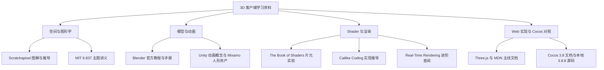
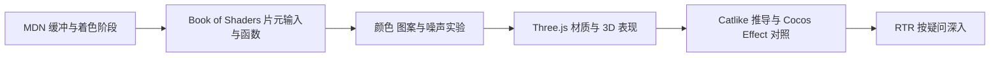

# 3D 游戏客户端互联网学习资料地图

来源：用户提供的《3D 游戏客户端开发成长路线》资料清单。本页收录原清单的九个课程／教程／参考入口，并补充当前 Web 实验需要的官方文档。资料整理完成，个人阅读与理解进度待登记。

总体阶段以[当前 24 周路线](../topic-index/3d-game-client.md)为准；每课从本地图选出具体章节，配合[第一周计划](../../user-profile/progress/3d-game-client-week-01.md)这样的阅读、实验与自测安排。Tuntun 用于学习案例，正式游戏开发在独立项目进行。

[计划] 九个主要入口已对应到[24 周资料阅读计划](../../user-profile/progress/3d-game-client-reading-plan.md)，逐周安排选读范围、时间预算和读后产出；本页保留资料导航，实际阅读用时与完成状态在学习记录中填写。

## 一 先按问题找资料

## 二 原推荐的九个入口全部收录

“主线必读”表示在对应阶段选读指定章节；“辅助参考”用于补充解释；“扩展选读”在基础实验通过后按问题查阅。资产网站另注明用途。每周阅读仍在原有 5 小时预算内安排。

| 编号 | 原推荐资料 | 放在哪个阶段 | 当前用法 |
| --- | --- | --- | --- |
| O01 | [Scratchapixel](https://www.scratchapixel.com/) | 1 空间数学；2 摄像机；5 渲染 | 主线必读：点／向量、变换、投影；按问题看图和推导 |
| O02 | [MIT 6.837](https://ocw.mit.edu/courses/6-837-computer-graphics-fall-2012/) | 1、2、3、5 | 辅助参考：选相应讲义，与实验图对照 |
| O03 | [Blender 官方教程](https://www.blender.org/support/tutorials/) | 3 资产与动画 | 主线必读：检查模型、简单修改、导出；完整建模与绑定作为扩展 |
| O04 | [Unity Learn 原动画教程](https://learn.unity.com/tutorial/animation) | 3 动画；4 状态结构 | 辅助参考：原链接为 2D 动画示例，另补 3D 课程和状态机文档 |
| O05 | [Mixamo](https://www.mixamo.com/) | 3 骨骼动画 | 资产练习入口：使用人形角色和动作观察蒙皮与播放 |
| O06 | [Cocos 原手册入口](https://docs.cocos.com/creator/manual/zh/)；本路线固定 [3.8 中文手册](https://docs.cocos.com/creator/3.8/manual/zh/) | 贯穿各阶段 | 主线对照：通用入口本次跳转 4.0，学习使用 3.8 文档并核对仓库 3.8.8 源码 |
| O07 | [The Book of Shaders](https://thebookofshaders.com/)／[中文版](https://thebookofshaders.com/?lan=ch) | 5 渲染与表现 | 主线必读：片元、输入参数、函数、颜色与程序图案 |
| O08 | [Catlike Coding](https://catlikecoding.com/unity/tutorials/) | 1、3、5、6 | 辅助参考：图、数学与实现思路；记录 Unity 管线和语言差异 |
| O09 | [Real-Time Rendering](https://www.realtimerendering.com/) | 5、6 与深度渲染扩展 | 扩展选读：管线、GPU、材质、纹理与优化，网站提供书目和配套资料 |

## 三 对应阶段具体读哪里

| 阶段 | 主线必读 | 辅助参考／扩展选读 | 阅读后交给实验的问题 |
| --- | --- | --- | --- |
| 0 场景与帧循环 | Three.js 基础与安装；MDN 帧回调；按[第一周范围](../../user-profile/progress/3d-game-client-week-01.md)读 | TypeScript 遇到类型问题时补读 | Scene、Camera、Mesh、Renderer 如何协作？时间怎样改变角度？ |
| 1 空间数学 | Scratchapixel 的点与向量 → 坐标系 → 矩阵与对象变换 → 投影 | MIT 03／04；Catlike Rendering 中的矩阵推导 | 一个点从局部坐标到屏幕，经过哪些数值变化？ |
| 2 场景与运动 | Three.js 场景层级、摄像机与 Raycaster 文档；Cocos 坐标与生命周期对照 | Scratchapixel 的投影；MIT 09／10 的碰撞主题 | 摄像机、移动、拾取与碰撞分别依赖哪些数据？ |
| 3 资产与动画 | Blender 模型检查与 glTF 导出；Three.js 模型加载与 AnimationMixer | MIT 06；Unity 3D 动画、状态机与混合；Mixamo 人形练习资产 | 顶点、UV、法线、骨骼、权重与动画时间怎样影响结果？ |
| 4 客户端玩法 | 当前路线中的独立 TypeScript 规则、slayDemo 设计与复盘 | Unity 状态机图帮助比较组织方式 | 攻击、命中、吞噬与死亡的状态、事件和表现怎样协作？ |
| 5 渲染与表现 | MDN WebGL；The Book of Shaders 的片元基础到程序图案 | MIT 15／16／21／22；Catlike Rendering 的材质、纹理与透明；RTR 管线与着色主题 | CPU 数据怎样进入 Shader，哪些计算改变像素？ |
| 6 资源与性能 | Three.js Cleanup、WebGLRenderer 统计；本地资源生命周期资料 | Catlike 实例化；RTR 第 18／20 章主题资料 | 对象、绘制、透明开销与资源数量怎样影响实测结果？ |

阶段内必读范围在开始该课时继续细化为章节、停止位置、参考用时与自测。阶段 4 的已有本地资料与具体入口见[路线资料表](../topic-index/3d-game-client.md)。

### 空间数学：Scratchapixel 的顺序

| 阅读入口 | 本阶段取用范围 | 对应观察 |
| --- | --- | --- |
| [Geometry：点、向量与法线](https://www.scratchapixel.com/lessons/mathematics-physics-for-computer-graphics/geometry/points-vectors-and-normals.html) | 第一篇，再通过该页目录读坐标系、向量运算、矩阵与点／向量变换 | 位置与方向的区别；局部坐标轴；点积与叉积 |
| [4×4 矩阵与对象变换](https://www.scratchapixel.com/lessons/3d-basic-rendering/transforming-objects-using-matrices/using-4x4-matrices-transform-objects-3D.html) | 先读图与变换组合，再核对计算约定 | 平移、旋转、缩放顺序与父子层级 |
| [投影矩阵导论](https://www.scratchapixel.com/lessons/3d-basic-rendering/perspective-and-orthographic-projection-matrix/projection-matrix-introduction.html) | 导论与透视／正交投影主题；具体推导配合投影实验 | 观察、裁剪、透视除法与屏幕映射 |

阅读时标注坐标方向、矩阵乘法次序和单位，再对照 Three.js／Cocos 的实际 API。四元数按当前路线的本地数学库资料和相应 API 学习。

### 图形学：MIT 按讲义主题选读

使用官方[Lecture Notes 目录](https://ocw.mit.edu/courses/6-837-computer-graphics-fall-2012/pages/lecture-notes/)，按主题选读讲义、作业和考题资料。

| 当前阶段 | 讲义编号 | 选读主题 |
| --- | --- | --- |
| 1 | 03、04 | 坐标与变换、层级建模 |
| 2 | 09、10 | 碰撞检测与响应；数值积分细节按需求扩展 |
| 3 | 06 | 计算机动画中的蒙皮与包络 |
| 5 | 15、16、21、22 | 材质与着色、纹理、图形管线与光栅化 |
| 5／6 扩展 | 17、23 | 采样与 Mipmap、实时阴影 |

### 模型与动画：工具资料与概念资料配合

| 资料 | 取用范围 | 在 Web 学习中的做法 |
| --- | --- | --- |
| [Blender 官方入门视频入口](https://studio.blender.org/training/blender-fundamentals-45-lts/chapter/blender_4-5_lts_first-steps/) | 视口、选择、变换、对象组织；此入口版本为 4.5 LTS | 检查模型结构；工具界面按实际安装版本核对 |
| [Blender glTF 手册](https://docs.blender.org/manual/en/5.1/addons/import_export/scene_gltf2.html) | 网格、材质、动画的导入导出与限制；此手册版本为 5.1 | 导出测试 GLB，检查比例、方向、法线、材质与动画；按实际工具版本选手册 |
| [Unity 3D 动画课程](https://learn.unity.com/course/introduction-to-3d-animation-systems) | 作为 3D 动画主题导航 | 以 Three.js 动画实验为实现入口，Unity 内容用于概念比较 |
| [Unity 动画状态机](https://docs.unity3d.com/6000.0/Documentation/Manual/AnimationStateMachines.html)、[混合树](https://docs.unity3d.com/6000.0/Documentation/Manual/class-BlendTree.html) | 状态、参数、转移与混合的定义和图 | 观察 Clip、播放时间与权重，再说明各引擎的控制机制差异 |
| [Mixamo 官方 FAQ](https://helpx.adobe.com/creative-cloud/faq/mixamo-faq.html) | 支持的角色与自动绑定条件 | 骨骼实验用合适的人形角色；史莱姆先采用简单变形 |

原 Unity Learn 链接实际使用 Sprite Sheet 做 2D 动画，不能承担整套 3D 骨骼、混合树与 IK 课程。Mixamo 的自动绑定与动画库面向双足人形，原先“AI 模型 → Mixamo → 史莱姆”的流程需要先检查角色条件。[Unity 原教程](https://learn.unity.com/tutorial/animation)、[Adobe 说明](https://helpx.adobe.com/creative-cloud/faq/mixamo-faq.html)

### Shader：先小实验，再比较引擎实现

| 资料 | 阅读范围 | 本阶段边界 |
| --- | --- | --- |
| [The Book of Shaders 中文目录](https://thebookofshaders.com/?lan=ch) | 起步部分；05 至 09 的函数、颜色、形状、矩阵和图案；10 至 13 随随机／噪声实验选读 | 主线是片元入门。目录中部分后续主题尚未形成完整正文，纹理和 3D 光照另用 MDN 与对应文档 |
| [Catlike Rendering 系列](https://catlikecoding.com/unity/tutorials/rendering/) | 按问题读矩阵、Shader、纹理、光照、透明和实例化 | 该系列使用 Unity Built-in 管线；学习推导时记录语言、管线与 API 差异 |
| [Real-Time Rendering 配套资料](https://www.realtimerendering.com/) | 第 2／3／4／5／6 章的管线、GPU、变换、着色与纹理主题；第 18／20 章的优化主题 | 网站提供书籍配套资源与索引；整书按已有版本选章阅读 |

Book of Shaders 示例的 GLSL 写法需按实验所用 WebGL2 核对；Three.js 材质与 Cocos Effect 的输入绑定和内置变量也分别解释。进阶资料使用时先明确要回答的问题。

## 四 Web 主线与 Cocos 对照的固定入口

| 用途 | 官方资料 |
| --- | --- |
| 从立方体起步 | [Three.js 基础](https://threejs.org/manual/pages/fundamentals.html)、[安装](https://threejs.org/manual/pages/installation.html)、[MDN 帧回调](https://developer.mozilla.org/en-US/docs/Web/API/Window/requestAnimationFrame) |
| 场景与 API 查询 | [Three.js 文档](https://threejs.org/docs/)；按 Camera、Object3D、Raycaster 等主题查阅 |
| 模型与动画 | [模型加载](https://threejs.org/manual/pages/loading-3d-models.html)、[GLTFLoader](https://threejs.org/docs/pages/GLTFLoader.html)、[AnimationMixer](https://threejs.org/docs/pages/AnimationMixer.html) |
| 原生渲染与资源 | [MDN WebGL 教程](https://developer.mozilla.org/en-US/docs/Web/API/WebGL_API/Tutorial)、[Three.js Cleanup](https://threejs.org/manual/pages/cleanup.html)、[WebGLRenderer](https://threejs.org/docs/pages/WebGLRenderer.html) |
| 工程基础补读 | [TypeScript Everyday Types](https://www.typescriptlang.org/docs/handbook/2/everyday-types.html)、[Vite](https://vite.dev/guide/) |
| Cocos 机制 | [3.8 中文手册](https://docs.cocos.com/creator/3.8/manual/zh/)、[坐标与节点变换](https://docs.cocos.com/creator/3.8/manual/zh/concepts/scene/coord.html)；本地源码与指南入口见[路线映射表](../topic-index/3d-game-client.md) |

## 五 原清单中的 AI 资产工具

以下作为后续扩展资料保留，核心阶段的资产检查与动画学习使用现成资源或简单模型。

| 工具 | 官方入口 | 后续学习问题 |
| --- | --- | --- |
| 腾讯混元 3D | [Hunyuan3D-2 项目资料](https://github.com/Tencent-Hunyuan/Hunyuan3D-2) | 生成结果怎样经过网格、材质、比例与导出检查？此链接固定到该项目版本 |
| Meshy | [官方文档](https://docs.meshy.ai/en) | 输入、生成、编辑与导出的结果怎样接受同样的资产检查？ |
| Tripo | [官方图生 3D 说明](https://www.tripo3d.ai/help/features/how-to-use-the-image-to-3d-feature) | 图像输入到模型输出后，哪些客户端使用条件仍需验证？ |

工具具体版本、可用能力和资源使用条件在开展该扩展时核对。这里仅登记资料入口，尚未进行资产生成或流水线接入。

## 六 每次怎样使用这张资料地图

每课挑选与一个实验问题相关的主线章节，辅助资料在遇到疑问时加入，并把实际阅读用时计入每周预算。读后先画图和写预期，再调参数、观察数据、回答自测；使用[实验模板](../../domains/game-engine/experiments/web3d-learning/docs/lab-template.md)保存资料范围、自己的解释与证据。

核对日期：2026-10-08。核心入口、目录与关键适用范围已通过原站页面或官方搜索索引核对。Blender 教程／手册部分页面本次抓取未成功，已保留原站链接与官方索引信息；这是抓取限制，未判定页面失效。Mixamo 适用条件使用 Adobe FAQ 核对。以后开始相应课时复核页面、章节与版本。
