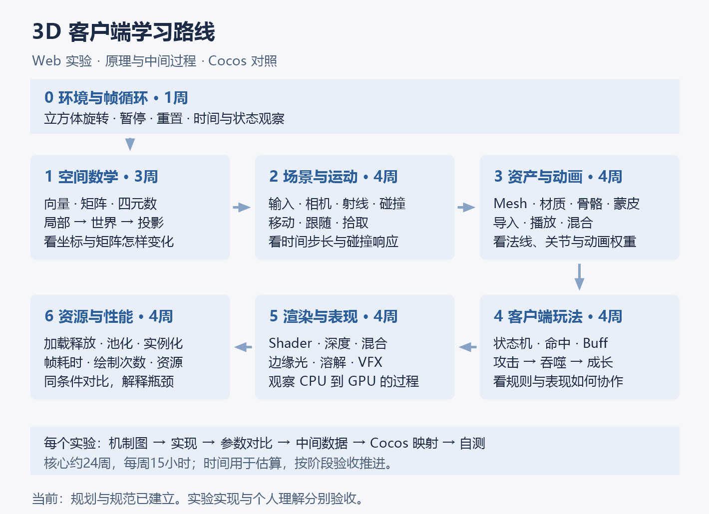
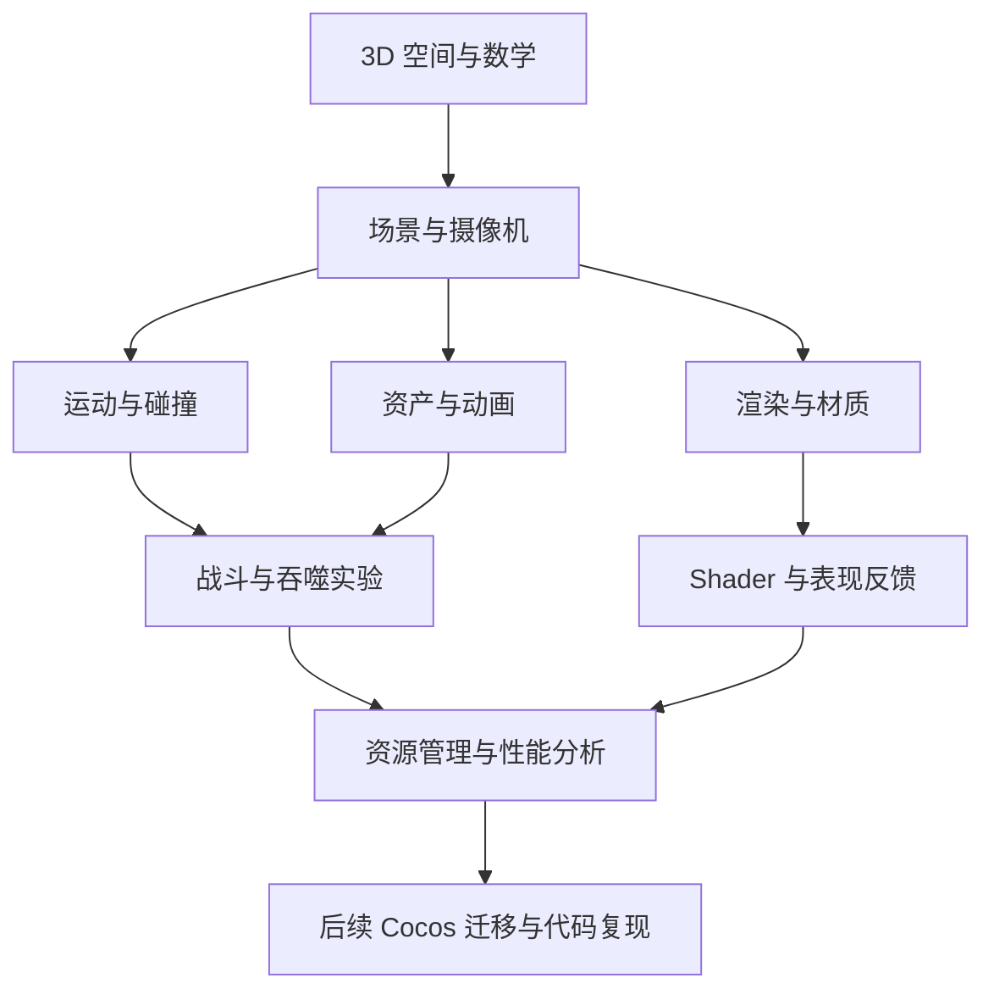
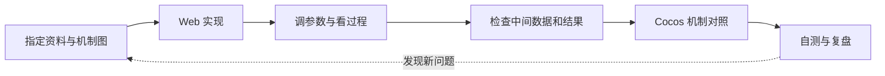
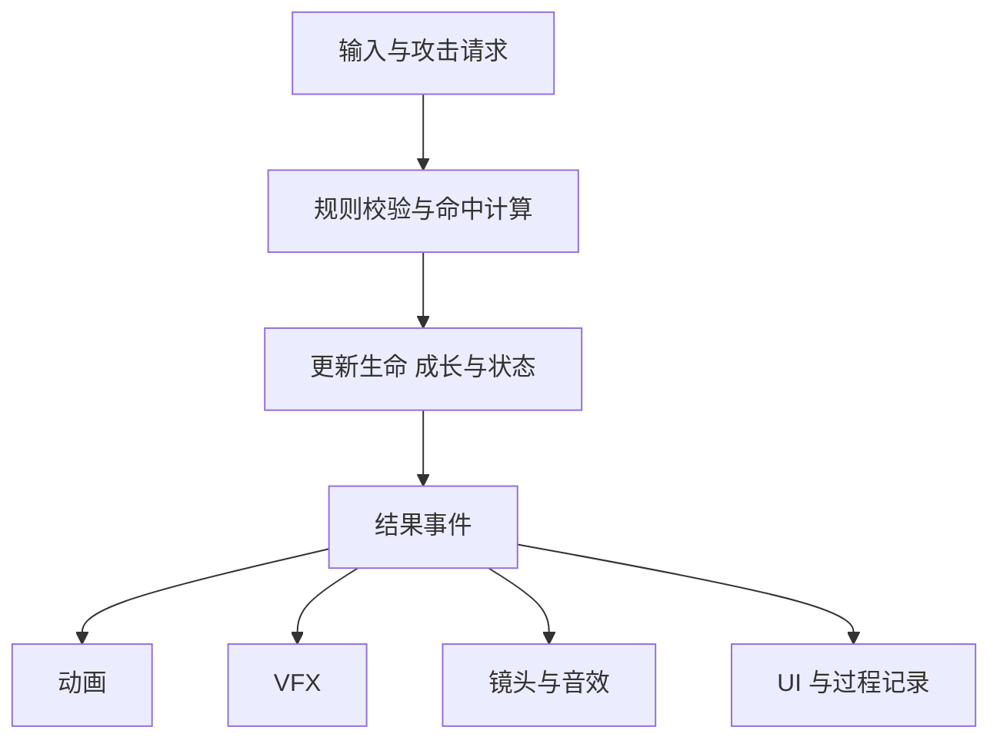

# 3D 游戏客户端学习路线

以 TypeScript + Three.js 开展 Web 实验，用原生 WebGL 拆解关键渲染机制。每个主题说明原理、实现过程、中间数据和 Cocos 对应机制。Tuntun 提供吞噬进化案例，正式游戏整合在独立项目进行。

**[实现记录] 2026-10-10，阶段 0 与阶段 1 首版已实现，数值、构建和核心浏览器交互已验证；阶段 2 至 6 尚未实现，个人学习成果尚未验收。** 当前按学习者安排从[阶段 1 点与向量实践](../../domains/game-engine/experiments/web3d-learning/docs/stage-01-lab.md)开始；阶段 0 未验收项继续补齐。

先读[核心知识图册](../../docs/game-engine/3d-client-core-visual.md)：七张图提炼对象、空间、画面、动画、规则和成本；下面的完整阶段与资料作为按需查阅的安排。

## 一 路线总图

核心路线按每周 15 小时估算约 24 周、360 小时。每周参考分配为原理与源码 5 小时、实验 7 小时、检查与复盘缓冲 3 小时。时间是预算，进入下一阶段以验收结果为准；8 至 12 周扩展按后续目标选择。

[计划] 互联网资料阅读按[24 周阅读与阶段计划](../../user-profile/progress/3d-game-client-reading-plan.md)执行：原推荐九个入口均有阅读落点，每周列出选读范围、5 小时预算和读后产出；实际阅读状态在学习时登记。

### 知识依赖

### 每次实验的学习过程

## 二 阶段与成果

| 阶段 | 参考时间 | 核心知识 | 实验成果 | 要解释的中间过程 |
| --- | --- | --- | --- | --- |
| 0 环境与基础诊断 | 1 周 | TypeScript、浏览器调试、场景入口、帧循环 | 立方体旋转、暂停、重置 | 时间步长如何改变角度，场景怎样交给渲染器 |
| 1 空间数学 | 3 周 | 向量、点积、叉积、矩阵、四元数、坐标转换 | 坐标实验台 | 局部／世界坐标、父子矩阵、观察与投影结果 |
| 2 场景与运动 | 4 周 | 输入、层级、摄像机、时间步长、射线、碰撞 | 移动、镜头跟随、拾取、障碍 | 方向与速度、射线路径、碰撞体与响应 |
| 3 资产与动画 | 4 周 | Mesh、UV、法线、材质、骨骼、蒙皮、混合 | 模型与动画检查器 | 顶点与法线、骨骼姿态、播放时间、动画权重 |
| 4 客户端玩法 | 4 周 | 状态机、数据驱动、命中、Buff、敌人行为 | 吞噬成长实验 | 攻击请求、规则判定、状态变化、表现事件 |
| 5 渲染与表现 | 4 周 | 顶点／片元、纹理、深度、混合、光照、Shader、VFX | WebGL 三角形与纹理；边缘光、溶解、受击反馈 | CPU 输入、Shader 计算、深度与混合状态、最终像素 |
| 6 资源与性能 | 4 周 | 加载与释放、对象池、Draw Call、实例化、LOD、透明开销 | 可调对象数量和表现开关的压力实验 | 对象与资源数量、绘制次数、帧耗时与瓶颈变化 |

骨骼与蒙皮使用现成角色学习，史莱姆先采用简单变形动画。资产制作以客户端检查、简单修改、导入与动画接入为核心。

### 首个实验

阶段 0 从[第一周阅读与练习计划](../../user-profile/progress/3d-game-client-week-01.md)开始，明确每次读到哪里、练什么、怎样自测，再按[立方体实验规格](../../domains/game-engine/experiments/web3d-learning/docs/stage-00-spec.md)建立可观察的帧循环。后续实验使用[统一说明模板](../../domains/game-engine/experiments/web3d-learning/docs/lab-template.md)，按[阶段验收规范](../../domains/game-engine/experiments/web3d-learning/docs/acceptance.md)登记证据。

阶段 1 的[坐标实验台规格](../../domains/game-engine/experiments/web3d-learning/docs/stage-01-spec.md)与[实践记录](../../domains/game-engine/experiments/web3d-learning/docs/stage-01-lab.md)分别说明输入、计算过程、边界、个人自测和验证证据。三页对应点与向量、父子变换、投影，先做向量练习再按理解进入后两页。

### 扩展主题

| 方向 | 学习问题 | 进入条件 |
| --- | --- | --- |
| 移动端与小游戏 | 输入、资源、构建和真机瓶颈怎样变化？ | Web 实验已通过，明确目标设备与平台 |
| 复杂动画 | 分层、重定向、IK 与 Root Motion 解决什么问题？ | 已能解释 Clip、蒙皮与基础混合 |
| 深度渲染 | 后处理、渲染目标与管线组织如何影响画面和成本？ | 基础 Shader 与性能实验已通过 |
| Cocos 复现 | 怎样复现同样输入、状态变化和可观察结果？ | Web 实验具有规则说明、数据与验证用例 |
| 网络与 AI 流水线 | 同步、资产自动化与 Agent 协作何时有收益？ | 出现明确学习问题后单独制定范围 |

商业发布、完整美术制作与正式游戏整合在独立项目安排。

## 三 Web 与 Cocos 原理映射

对照以仓库 Cocos 3.8.8 源码为基准。映射说明机制与差异，迁移时分别处理 API、坐标约定、导入选项、动画驱动和渲染配置。

| 主题 | Web 观察点 | Cocos 对照 | 本地资料 |
| --- | --- | --- | --- |
| 数学与变换 | Vector3、Quaternion、Matrix4、父子变换 | Vec3、Quat、Mat4、Node 局部／世界变换 | [数学库](../../domains/game-engine/guides/cocos-source-learning/01-core-foundation/01-math-types.md) |
| 场景与生命周期 | Scene、Object3D、更新与释放 | Scene、Node、Component、调度 | [场景图](../../domains/game-engine/guides/cocos-source-learning/02-scene-graph/README.md)、[调度器](../../domains/game-engine/guides/cocos-source-learning/01-core-foundation/04-scheduler.md) |
| 摄像机与拾取 | 投影矩阵、屏幕坐标、Raycaster | Camera、坐标转换、射线查询 | [Camera 源码](../../domains/game-engine/engines/cocos-engine/cocos/misc/camera-component.ts)、[3D 物理](../../domains/game-engine/guides/cocos-source-learning/04-functional-modules/02-physics-system.md) |
| 模型与资源 | glTF／GLB、几何体、纹理生命周期 | Mesh、Prefab、AssetManager、资源引用 | [资源管理](../../domains/game-engine/guides/cocos-source-learning/05-asset-management/README.md)、[3D 渲染](../../domains/game-engine/guides/cocos-source-learning/03-rendering/05-3d-rendering.md) |
| 动画 | Clip、AnimationMixer、播放与混合权重 | AnimationClip、骨骼动画、Animation Graph | [动画系统](../../domains/game-engine/guides/cocos-source-learning/04-functional-modules/01-animation-system.md) |
| 材质与渲染 | Material、Shader、缓冲与绘制 | Material、Effect、GFX、渲染管线 | [材质](../../domains/game-engine/guides/cocos-source-learning/03-rendering/03-shader-material.md)、[GFX](../../domains/game-engine/guides/cocos-source-learning/03-rendering/01-gfx-abstraction.md)、[管线](../../domains/game-engine/guides/cocos-source-learning/03-rendering/02-render-pipeline.md) |
| 玩法与状态 | 独立 TypeScript 规则、事件、表现 | 游戏逻辑与组件表现协作 | [slayDemo 复盘](../../domains/game-engine/godotProjects/slayDemo/docs/project-retrospective.md) |
| 资源与性能 | 帧耗时、绘制次数、对象与资源数量 | 引擎统计、批处理、实例化、资源生命周期 | [资源加载](../../domains/game-engine/guides/cocos-source-learning/05-asset-management/03-loading-pipeline.md)、[高级主题](../../domains/game-engine/guides/cocos-source-learning/08-advanced-topics/README.md) |

**两个区别需要单独演示：**Raycaster 拾取不等于完整物理碰撞；Object3D 层级也不等同于 Cocos 的 Node 与 Component 生命周期。

### 坐标变化需要看到每一步

### 规则与表现分工

动画时机可参与攻击流程，但伤害判定依据来自规则与命中窗口。一次命中怎样去重、取消和停止，需要在阶段 4 写清楚。

## 四 资料导航与实验工程

原规划中的互联网资料完整收录在[学习资料地图](../resources/3d-game-client-resources.md)：保留九个原推荐入口，标明主线必读、辅助参考与扩展选读，并给出具体章节、平台差异与适用条件。

### 主线资料

| 阶段 | 官方或原始资料 | 选读重点 |
| --- | --- | --- |
| 0 | [Three.js 安装](https://threejs.org/manual/pages/installation.html)、[基础](https://threejs.org/manual/pages/fundamentals.html)、[Vite](https://vite.dev/guide/) | 场景、摄像机、Mesh、渲染器与开发环境 |
| 1 | [Scratchapixel](https://www.scratchapixel.com/)、[MIT 6.837 讲义](https://ocw.mit.edu/courses/6-837-computer-graphics-fall-2012/pages/lecture-notes/)、本地数学库资料 | 点／向量、变换与投影；Scratchapixel 主线选读，MIT 03／04 辅助 |
| 2 | [Three.js 文档](https://threejs.org/docs/)、本地场景图与物理资料 | 层级、Camera、Raycaster；明确时间与坐标约定 |
| 3 | [Three.js 模型加载](https://threejs.org/manual/pages/loading-3d-models.html)、[GLTFLoader](https://threejs.org/docs/pages/GLTFLoader.html)、[AnimationMixer](https://threejs.org/docs/pages/AnimationMixer.html)、[Blender glTF 导出参考](https://docs.blender.org/manual/en/5.1/addons/import_export/scene_gltf2.html)、[Cocos 模型导入](https://docs.cocos.com/creator/3.8/manual/en/asset/model/mesh.html)、[动画系统](https://docs.cocos.com/creator/3.8/manual/en/animation/) | 资产结构、导入检查、骨骼、播放与混合；Blender 资料按实际软件版本核对 |
| 4 | [slayDemo 设计资料](../../domains/game-engine/godotProjects/slayDemo/docs/design/)、[项目复盘](../../domains/game-engine/godotProjects/slayDemo/docs/project-retrospective.md)、[软件架构](../../domains/software-engineering/guides/foundations/software-architecture.md) | 规则与表现分离、状态结算、数据定义与事件顺序 |
| 5 | [MDN WebGL 教程](https://developer.mozilla.org/en-US/docs/Web/API/WebGL_API/Tutorial)、[The Book of Shaders 中文版](https://thebookofshaders.com/?lan=ch)、[Catlike Rendering](https://catlikecoding.com/unity/tutorials/rendering/)、[WebGLRenderer](https://threejs.org/docs/pages/WebGLRenderer.html) | MDN 与片元实验为主线，Catlike 推导辅助；缓冲、纹理、深度与混合按 WebGL2 核对 |
| 6 | [WebGLRenderer 统计接口](https://threejs.org/docs/pages/WebGLRenderer.html)、[Cleanup](https://threejs.org/manual/pages/cleanup.html)、[Real-Time Rendering](https://www.realtimerendering.com/)、本地资源资料 | 绘制统计、释放与同条件比较；RTR 优化主题扩展选读；区分数量统计和内存字节测量 |

Three.js 场景与原生 WebGL 实验使用不同抽象层；每个实验标明由库代做的步骤，以及本次实际观察的步骤。[Three.js 基础说明](https://threejs.org/manual/pages/fundamentals.html)

阶段 3 同时保留[Blender 官方教程](https://www.blender.org/support/tutorials/)、[Unity 3D 动画资料](https://learn.unity.com/course/introduction-to-3d-animation-systems)和[Mixamo 资产入口](https://www.mixamo.com/)，具体阅读范围与角色适用条件见资料地图。各主题的 Cocos 对照使用[3.8 中文手册](https://docs.cocos.com/creator/3.8/manual/zh/)与仓库源码。

MDN 教程用于理解基础步骤。原生实验明确使用 WebGL2，Shader 语法、接口和状态按实际上下文检查，避免直接混用不同版本示例。

### 工程组织

[Web3D 学习工程说明](../../domains/game-engine/experiments/web3d-learning/README.md)规定一个工程、多独立实验，以及初始化、更新、重置、释放约定。[实现记录] 阶段 0 的 TypeScript、Vite 和 Three.js 工程已建立，运行与验证步骤见[实践记录](../../domains/game-engine/experiments/web3d-learning/docs/stage-00-lab.md)。

默认桌面 Chrome／Edge 与 WebGL2。项目进程使用隔离 Node 24 运行时，保留系统 Node 18.15 给已有项目使用；安装与构建均在学习工程目录执行。当前 Vite 要求 Node 20.19+ 或 22.12+，初始化时核对锁定版本的要求。[Vite 官方说明](https://vite.dev/guide/)

工程依赖通过锁文件固定，阶段 0 为该工程的锁文件添加局部 Git 忽略例外。源码与子模块只做参考，不在其中开发、提交或推送。

## 五 验收与进度

| 验收对象 | 必查场景 | 必留证据 |
| --- | --- | --- |
| 数学与运动 | 父子变换、坐标转换、不同帧率下的运动 | 输入、计算过程、预期与实际值 |
| 动画与规则 | 暂停、切换、混合、重复命中、取消、死亡状态 | 时间、权重或事件顺序与状态 |
| 实验生命周期 | 重置与切换；监听、动画与图形资源清理 | 初始状态、操作步骤、资源归属与释放记录 |
| 异常 | 资源缺失、Shader 编译失败、WebGL2 不可用 | 可理解的错误信息和复现步骤 |
| 性能 | 同设备、浏览器、分辨率、场景与采样方式比较 | 环境、指标、原始记录与结论范围 |
| 学习理解 | 解释机制图、中间数据、关键代码与 Cocos 差异 | 自测回答、复盘与待验证问题 |

详细规则见[阶段验收规范](../../domains/game-engine/experiments/web3d-learning/docs/acceptance.md)，实际成果在[学习进度表](../../user-profile/progress/3d-game-client-progress.md)登记。规划状态、实验实现状态与个人理解验收分别记录，技能自评依据具体新成果更新。

路线建立日期：2026 年 10 月 8 日。
