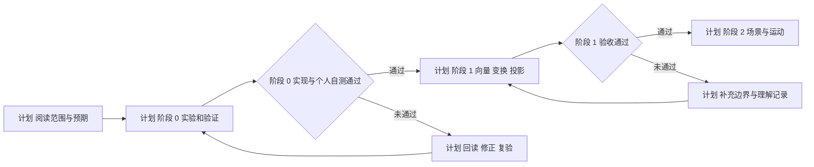

# openClasses 当前进展与四周学习计划

本计划建立于 2026-10-08；[2026-10-09 最新核查与阶段 0 启动安排](2026-10-09-stage-00-start-plan.md)补充执行顺序与当前环境。下方运行时版本和路径是 10 月 8 日的快照，创建工程前按最新核查重新验证。

[已核查] 截至 2026 年 10 月 8 日，当前主线是 [3D 游戏客户端 Web 实验与 Cocos 原理映射](../../learning-routes/topic-index/3d-game-client.md)。路线、资料地图和验收规范已经建立；Web3D 实验目录目前只有四份说明文档，阶段 0 的代码、运行结果和个人自测均待开展。

[建议] 下一步先完成阶段 0 的立方体与帧循环实验，再进入阶段 1 的空间数学。沿用[第一周计划](3d-game-client-week-01.md)的阅读范围与六次学习安排；本计划补充进展依据、后三周重点和阶段转换条件。

[计划] 你提供的 Scratchapixel、MIT 6.837、Blender、Unity 动画、Mixamo、Cocos、Book of Shaders、Catlike Coding 与 Real-Time Rendering 均已纳入[24 周资料阅读计划](3d-game-client-reading-plan.md)。该计划逐周列出链接、选读范围、阅读预算与读后产出；第 1 至 4 周的阅读计入本计划每周 5 小时预算。

## 当前进展与依据

| 方向 | 当前状态 | 依据与下一步 |
| --- | --- | --- |
| 基础课程 | [档案记录] CS146S、Hello-Agents、Prompt 设计与优化记录为已完成 | [学习档案](../learning-profile.md)和课程笔记；本次没有重新验收个人掌握程度 |
| Agent 进阶 | [档案记录] OpenClaw 进行中，具体章节与实践结果待补记 | 按[课程入口](../../domains/ai-agent/courses/OpenClaw/README.md)登记实际阅读；本阶段以 Web3D 为主线 |
| Cocos 与 Godot | [已核查] 已有源码学习指南；本周需要的 Cocos Node、Director、ComponentScheduler 文件存在 | [第一周源码范围](3d-game-client-week-01.md#cocos-源码只沿本周的问题读)；围绕实验问题选读 |
| slayDemo | [已核查] 主仓库保留设计、技术与复盘资料 | [资料入口](../../domains/game-engine/godotProjects/slayDemo/README.md)；本次没有运行或检查独立游戏工程 |
| Web3D | [已核查] 目录包含 README、阶段 0 规格、实验模板、验收规范，尚无工程代码 | [实验目录](../../domains/game-engine/experiments/web3d-learning/README.md)；先建立可运行的阶段 0 实验 |
| 技能评定 | [档案记录] 技能矩阵最后更新为 2026-04-17 | [技能矩阵](../skill-matrix.json)；以新的个人自测和实验记录复核评分 |

[已核查] 此前的学习准备提交已补充 Web3D 路线与验收、第一周计划、互联网资料地图。它们体现规划与资料准备进展；阶段实现和个人理解状态见[学习进度表](3d-game-client-progress.md)。

## 四周安排

[假设] 每周预算沿用[学习偏好](../learning-preferences.json)中的 15 小时，四周共 60 小时；每周阅读与源码 5 小时、实验 7 小时、验证与复盘缓冲 3 小时。预算尚未由本次实际投入验证，实际开始日期待登记，以下周次从开始学习时计算。

[计划] 每周产出按下表验收。若前一阶段未通过，后续周次顺延；24 周总路线仍以阶段验收推进。

| 周次 | 核心问题与阅读范围 | 实验任务 | 可检查的产出 |
| --- | --- | --- | --- |
| 第 1 周 阶段 0 | [计划] 场景如何变成画面，时间如何改变状态？按[第一周 R1 至 R6](3d-game-client-week-01.md#本周资料每次只读指定范围)读 Three.js、MDN 和本地 Cocos 资料 | [计划] 建立 TypeScript／Vite／Three.js 工程，完成立方体、坐标轴、速度、暂停、继续、重置与过程面板 | [验收目标] 运行记录、时间与角度验证、清理检查、个人自测和 Cocos 职责对照 |
| 第 2 周 阶段 1 入门 | [计划] 点与方向有什么区别，怎样得到方向与距离？读 [Scratchapixel Geometry](https://www.scratchapixel.com/lessons/mathematics-physics-for-computer-graphics/geometry/points-vectors-and-normals.html) 的 Points、Coordinate Systems、Math Operations；[MIT 03 坐标与变换](https://ocw.mit.edu/courses/6-837-computer-graphics-fall-2012/resources/mit6_837f12_lec03/)；对照[本地数学库](../../domains/game-engine/guides/cocos-source-learning/01-core-foundation/01-math-types.md) | [计划] 在坐标实验台显示点、向量、局部轴、长度、点积与叉积；先手算再观察 | [验收目标] 正常输入与零向量等边界的预期和实际值，解释单位、方向和坐标空间 |
| 第 3 周 阶段 1 变换 | [计划] 父节点如何影响子节点，变换顺序为何需要明确？读 [4×4 变换](https://www.scratchapixel.com/lessons/3d-basic-rendering/transforming-objects-using-matrices/using-4x4-matrices-transform-objects-3D.html)、[MIT 04 层级建模](https://ocw.mit.edu/courses/6-837-computer-graphics-fall-2012/resources/mit6_837f12_lec04/)、[Catlike 矩阵图](https://catlikecoding.com/unity/tutorials/rendering/part-1/)；选读本地四元数与 Node 变换 | [计划] 调整父子平移、旋转、缩放，展示局部／世界坐标与矩阵；比较变换组合及世界到局部转换 | [验收目标] 一组手算对照、父子变换记录、四元数旋转观察、不可逆变换的提示与解释 |
| 第 4 周 阶段 1 投影与复核 | [计划] 一个点怎样到达屏幕？读[投影导论](https://www.scratchapixel.com/lessons/3d-basic-rendering/perspective-and-orthographic-projection-matrix/projection-matrix-introduction.html)，对照本地 Camera 与数学资料 | [计划] 展示局部、世界、观察、裁剪、NDC 与屏幕坐标；比较透视／正交投影，检查重置、切换和清理 | [验收目标] 坐标过程图、固定输入的中间值、投影边界记录、Cocos 差异和阶段 1 自测结论 |

[计划] Agent 负责搭建实验、解释关键代码并记录运行结果；你负责阅读、先预测结果、操作观察、重画机制图和回答自测。实验实现、运行验证与个人理解分别登记。

[阅读预算] 第 2 周：Scratchapixel 3 小时＋MIT 1 小时＋Cocos 1 小时；第 3 周：Scratchapixel 2 小时＋Catlike 0.5 小时＋MIT 1 小时＋Cocos 1.5 小时；第 4 周：投影 2.5 小时＋Cocos 1.5 小时＋回读 1 小时。每次登记资料、版本、章节、实际用时、自己的机制图和自测状态；后续资料安排见[完整阅读计划](3d-game-client-reading-plan.md)。

## 第一次学习从这里开始

[计划] 先用 45 分钟阅读 [Three.js Fundamentals](https://threejs.org/manual/pages/fundamentals.html)，从对象关系图到第一次静态立方体和 `renderer.render(scene, camera)` 为止；阅读范围沿用现有第一周计划。

| 时间预算 | 动作 | 留下的结果 |
| --- | --- | --- |
| [计划] 10 分钟 | 辨认 Scene、Camera、Mesh、Renderer | 用自己的话写出四个职责 |
| [计划] 25 分钟 | 顺着创建对象到绘制的代码阅读 | 标出形状、材质、位置和观察视角来自哪里 |
| [计划] 10 分钟 | 合上资料重画对象关系图 | 解释立方体为何可能看起来像方块 |
| [计划] 15 分钟 | 填写开始日期、实际用时与卡住的问题 | 在[学习进度](3d-game-client-progress.md)登记阅读证据 |

[计划] 下一次学习接着读 [MDN requestAnimationFrame](https://developer.mozilla.org/en-US/docs/Web/API/Window/requestAnimationFrame) 的回调时间戳和 elapsed 示例，手算 45 度／秒累计模拟 2 秒的预期角度。随后按[阶段 0 规格](../../domains/game-engine/experiments/web3d-learning/docs/stage-00-spec.md)实现与验证。

## 阶段 0 启动前检查

| 项目 | 本次状态 | 实现时的动作 |
| --- | --- | --- |
| Node 与 npm | [已核查] 当前终端为 Node v24.12.0、npm 11.7.0；Node 位于 `D:\WorkSoftWare\node.exe` | [计划] 按仓库约定固定学习工程的 Node 24 进程；记录安装和构建实际使用的运行时，不再依据旧说明假定当前终端为 Node 18.15 |
| 工程依赖 | [已核查] Web3D 目录尚无 package.json 或锁文件 | [计划] 初始化时核对选定版本的 engines 和兼容性，提交依赖清单及锁文件，并添加该目录锁文件的局部 Git 忽略例外；[官方依据](https://vite.dev/guide/) |
| 浏览器与图形能力 | [待验证] 阶段 0 尚无浏览器运行记录 | [计划] 检查 Chrome／Edge 的 WebGL2、尺寸变化和后台恢复，保留错误提示与复现步骤 |
| Cocos 资料 | [已核查] 本周三个源码入口可读，目录 package.json 标记版本 3.8.8 | [计划] 阅读 Node 变换、Director.tick 与 ComponentScheduler 的指定范围，记录实际源码依据 |
| 子模块配置 | [已核查] `git submodule status` 报错：索引包含 `domains/ai-agent/papers/OpenGame_source`，但 .gitmodules 没有对应映射 | [计划] 全量子模块同步前先修正映射；本周直接阅读已存在的 Cocos 入口，Web3D 工程不依赖 OpenGame |

## 进入下一阶段的条件

[验收目标] 阶段 0 按[现有验收规范](../../domains/game-engine/experiments/web3d-learning/docs/acceptance.md)完成以下检查，未通过项保留失败步骤和待补问题。

- [ ] [验收目标] 累计模拟 2 秒、角速度 45 度／秒，计算预期为 90 度；记录实际值和浮点容差。
- [ ] [验收目标] 比较 30／60／120 帧输入下相同累计模拟时间的角度，解释帧间隔与模拟步长的区别。
- [ ] [验收目标] 完成零速度、暂停后改速度、继续、重置、窗口变化、后台恢复和退出清理检查；资源释放参考 [Three.js Cleanup](https://threejs.org/manual/pages/cleanup.html)。
- [ ] [验收目标] 保存个人对象关系图、帧循环图、[阶段 0 的五个自测答案](../../domains/game-engine/experiments/web3d-learning/docs/stage-00-spec.md#五-自测)和 Cocos 职责对照。
- [ ] [验收目标] 按[实验模板](../../domains/game-engine/experiments/web3d-learning/docs/lab-template.md)登记环境、代码版本、输入、预期、实际结果和下一问题，再分别更新实现、运行验证与个人理解状态。

[计划] 每周结束依据实际用时、失败项和个人回答调整下一周安排。阶段 1 通过后，再细化场景、摄像机、输入与运动实验。

[仓库记录] [Agent 评估方案](2026-10-agent-evaluation-plan.md)仍作为候选资料保留，尚未启动。当前四周安排围绕 Web3D 阶段 0 与阶段 1 展开。
