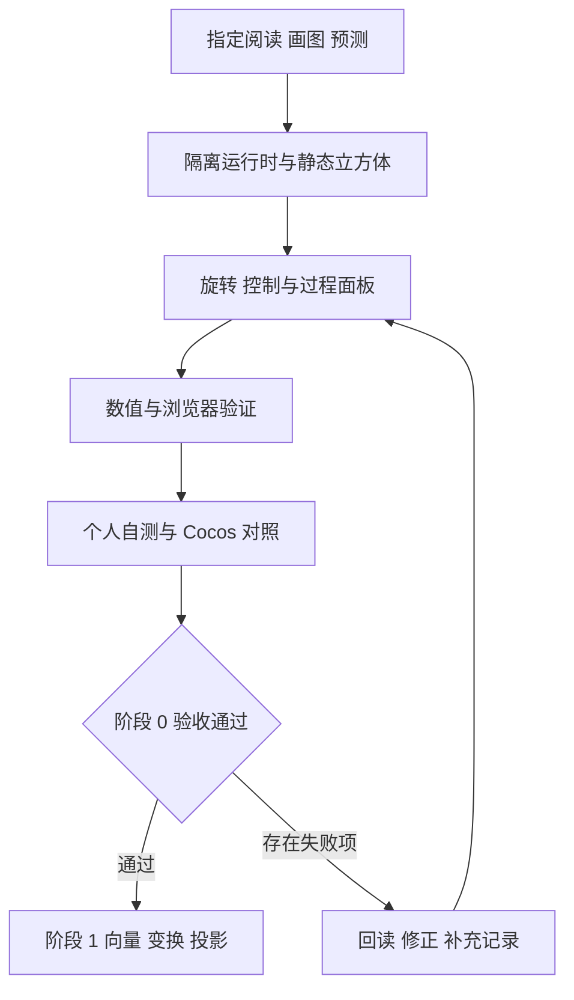

# openClasses 项目进展与阶段 0 启动计划

[后续实施记录] 本页保留阶段 0 实施前的环境与计划快照。本轮已定位 Node 24.12.0 并创建首版实验，数值、构建与核心浏览器交互已验证；当前状态见[实践记录](../../domains/game-engine/experiments/web3d-learning/docs/stage-00-lab.md)与[进度表](3d-game-client-progress.md)。后台恢复、WebGL2 不可用与个人自测仍待验收。

截至 2026 年 10 月 9 日，3D 客户端的路线、24 周阅读安排和阶段验收规范已经备齐，Web3D 目录仍只有四份说明文档。下一步是完成阶段 0 的立方体与帧循环实验，留下运行结果和个人理解记录，再进入空间数学。

沿用[四周学习计划](2026-10-08-project-review-and-next-plan.md)和[第一周六次学习安排](3d-game-client-week-01.md#六次学习安排)：每周 15 小时，阅读与源码 5 小时、实验 7 小时、检查与复盘缓冲 3 小时。实际开始日期待登记；准备工作计入预算，阶段未通过时顺延。

从[前四周学习内容与资料安排](3d-game-client-month-01.md)按课推进：每次明确资料、停止范围、机制图、实验任务与自测；九个原推荐入口继续纳入对应阶段。

## 当前进展

| 方向 | 当前状态 | 下一动作 |
| --- | --- | --- |
| 基础课程 | [档案记录](../learning-profile.md)中 CS146S、Hello-Agents、Prompt 设计与优化已完成 | 遇到具体问题时回读已有笔记 |
| 3D 客户端 | [路线](../../learning-routes/topic-index/3d-game-client.md)、[阅读计划](3d-game-client-reading-plan.md)、[实验规格](../../domains/game-engine/experiments/web3d-learning/docs/stage-00-spec.md)已建立；阶段 0 至 6 实验未开始 | 首先创建阶段 0 工程并验证 |
| Cocos 与 Godot | 已有源码指南；本周所需的 Cocos Node、Director、ComponentScheduler 文件可读，源码包版本为 3.8.8 | 随帧循环实验选读 Node 变换和组件调度 |
| OpenClaw 与 Agent 进阶 | 档案记录进行中，具体章节待补记；[Agent 评估实验](2026-10-agent-evaluation-plan.md)仍为候选 | 当前先完成 Web3D 检查点，再决定后续安排 |
| slayDemo | 保留设计、技术与复盘资料，实际工程由独立项目维护 | 作为玩法与验证方法的参考 |
| 技能评定 | [技能矩阵](../skill-matrix.json)仍为 2026-04-17 的自评与目标 | 以新的个人回答和实验记录复核能力 |

本轮进展是资料与学习安排准备完成。实验实现、运行验证和个人理解继续在[进度表](3d-game-client-progress.md)分别登记。

## 启动前需要处理的环境条件

| 条件 | 2026-10-09 核查结果 | 处理安排 |
| --- | --- | --- |
| Node 与 npm | 当前终端为 Node 18.15.0、npm 9.5.0，Node 来自 `C:\Program Files\nodejs\node.exe` | 创建工程前定位并验证隔离 Node 24，确保 npm、构建和开发服务使用同一运行时；当前 Vite 要求 Node 20.19+ 或 22.12+，[官方说明](https://vite.dev/guide/) |
| 昨天记录的运行时路径 | `D:\WorkSoftWare\node.exe` 当前不存在；隔离 Node 24 的可用位置待确认 | 昨天的 Node 24 记录作为当时快照，安装与构建前重新检查实际版本和路径 |
| 子模块 | `git submodule status` 仍报 OpenGame_source 缺少 .gitmodules 映射 | 全量同步前修正映射；阶段 0 使用独立 Web 工程与已存在的 Cocos 资料，可先开展 |
| 工程与依赖 | 尚无 package.json、锁文件或应用代码 | 在[Web3D 目录](../../domains/game-engine/experiments/web3d-learning/README.md)创建工程，固定兼容依赖并提交锁文件，添加该目录锁文件的局部忽略例外 |
| 浏览器 | 阶段 0 的 WebGL2、窗口变化和后台恢复待验证 | 运行首版后在桌面 Chrome／Edge 记录实际结果与失败步骤 |

环境准备计入第一周第 3 次学习。若占用超过原预算，记录原因并延长阶段 0。

## 下一步执行顺序

| 顺序 | 任务与分工 | 完成时应留下什么 |
| --- | --- | --- |
| 1 阅读与预测 | 你按第一周 R1、R2 阅读；Agent 解释对象职责、帧回调与模拟时间 | 自己的对象关系图、帧循环图，以及 45 度／秒累计模拟 2 秒的预期值 |
| 2 工程与首帧 | Agent 在 Web3D 目录验证运行时，创建 TypeScript／Vite／Three.js 工程和静态立方体 | 启动说明、依赖清单与锁文件、立方体与坐标轴画面、初始化代码解释 |
| 3 时间与控制 | Agent 实现角速度、暂停、继续、重置和过程面板；你预测改参数后的结果再操作 | 实际帧间隔、模拟步长、累计模拟时间和角度；暂停与恢复的操作记录 |
| 4 验证与对照 | Agent 检查数值、边界和生命周期；你完成 R4、R5 与 Cocos 职责对照 | 同模拟时间的帧率对比、零速度、重置、窗口变化、后台恢复、退出清理记录 |
| 5 自测与复盘 | 你回答[五个自测问题](../../domains/game-engine/experiments/web3d-learning/docs/stage-00-spec.md#五-自测)，按 R6 回读；Agent 依据实际证据更新状态 | 环境与代码版本、预期和实际值、个人答案、失败项与下一问题 |

## 本阶段通过条件

以下是待验证目标，实际结果按[实验模板](../../domains/game-engine/experiments/web3d-learning/docs/lab-template.md)记录。

- [ ] 45 度／秒累计模拟 2 秒得到 90 度；30／60／120 帧输入在相同累计模拟时间下结果一致，记录浮点容差。
- [ ] 零速度、暂停时改速度、继续和重置符合[阶段 0 规格](../../domains/game-engine/experiments/web3d-learning/docs/stage-00-spec.md)。
- [ ] 窗口变化、后台恢复、WebGL2 不可用提示与退出清理有实际检查记录。
- [ ] 能独立解释对象关系、时间步长、暂停的时间基准、资源归属及 Cocos 对应职责。
- [ ] 进度表分别登记实验实现、运行验证和个人理解；未通过项保留复现步骤与待补问题。

## 后三周安排与复盘

| 周次 | 重点 | 进入条件与产出 |
| --- | --- | --- |
| 第 2 周 | 点、向量、长度、点积与叉积 | 阶段 0 通过；留下手算、观察结果与零向量边界记录 |
| 第 3 周 | 父子变换、矩阵与四元数 | 能解释坐标空间；留下组合顺序和局部／世界坐标对照 |
| 第 4 周 | 观察、投影、NDC 与屏幕坐标 | 展示坐标变化的中间值；按阶段 1 要求完成自测与复核 |

四周参考总预算为 60 小时。每周结束比较实际投入、失败项和个人回答；只有前一阶段通过才进入下一阶段。资料选读继续按[24 周阅读计划](3d-game-client-reading-plan.md)推进。

第一次学习沿用 R1 的 45 分钟阅读与 75 分钟练习：读 [Three.js Fundamentals](https://threejs.org/manual/pages/fundamentals.html) 到首次 `renderer.render(scene, camera)`，观察官方示例后合上资料重画对象关系图，说明四个职责，并解释立方体为何可能只显示一个面。下一次再读 [MDN 帧回调](https://developer.mozilla.org/en-US/docs/Web/API/Window/requestAnimationFrame)，比较回调时间与可暂停的模拟时间。
