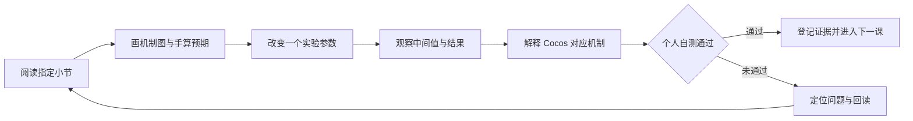
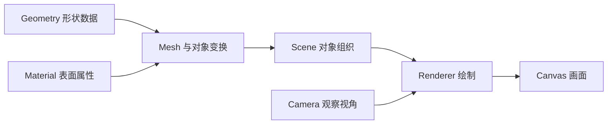
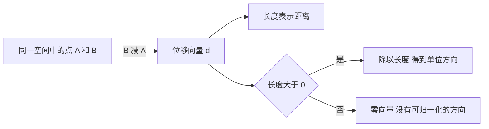
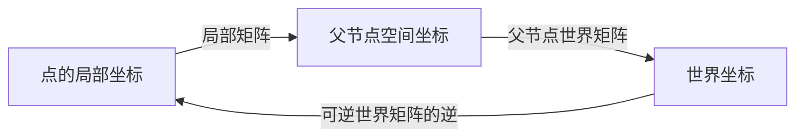

# 3D 客户端前四周学习内容与资料安排

[本轮进展] 2026-10-10，学习者要求进入下一阶段实践。[阶段 1 坐标实验台](../../domains/game-engine/experiments/web3d-learning/docs/stage-01-lab.md)的三页首版已建立并完成核心检查；当前从第 2 周的点与向量三轮练习开始。阶段 0 未验收项保留，个人实际用时与理解继续登记；下文课时是参考预算。

先用[核心知识图册](../../docs/game-engine/3d-client-core-visual.md)建立整体认识；本页作为具体阅读、实验与自测安排，在开展相应主题时查阅。

前四周学习场景与帧循环、向量、对象变换和投影。每次先读指定小节，画出机制并手算预期，再用 Web 实验观察中间值，最后解释 Cocos 对应机制。完成后应能说明一个对象如何随时间改变，以及它的一个点如何到达屏幕。

这是待执行的学习安排，实际阅读、实验和个人自测在[进度表](3d-game-client-progress.md)登记。每周 15 小时，其中阅读与源码 5 小时、实验 7 小时、检查与复盘缓冲 3 小时；四周共 60 小时。周次从实际开始学习计算，未通过的阶段顺延。工程启动条件见[最新核查](2026-10-09-stage-00-start-plan.md)。

2026-10-09 检查发现 Scratchapixel 部分页面访问不稳定。打不开时使用[访问记录与按周替换方案](../../learning-routes/resources/3d-game-client-resources.md#七-访问状态与备用阅读入口)，在原预算内改读 MIT、Catlike、Three.js 与本地源码，保留本页实验和自测目标。



## 九个原推荐资料怎样进入学习

下表沿用[24 周阅读计划](3d-game-client-reading-plan.md)的编号与时间安排。每次选读与当前实验有关的章节，整本书或整门课的完成情况另行登记。

| 编号与资料 | 阅读时间 | 要读什么并留下什么 |
| --- | --- | --- |
| O01 [Scratchapixel](https://www.scratchapixel.com/) | 第 2 至 4 周，之后随问题回读 | 点／向量、矩阵、变换、投影；留下手算和坐标变化图 |
| O02 [MIT 6.837 讲义](https://ocw.mit.edu/courses/6-837-computer-graphics-fall-2012/pages/lecture-notes/) | 第 2／3 周读 03／04；后续读碰撞、蒙皮、材质和管线 | 用讲义图核对机制，具体编号见完整阅读计划 |
| O03 [Blender 官方教程](https://www.blender.org/support/tutorials/) | 第 9 至 11 周 | 视口、模型变换、网格、UV、材质、骨骼与导出；留下客户端资产检查记录 |
| O04 [Unity 3D 动画课程](https://learn.unity.com/course/introduction-to-3d-animation-systems) | 第 12 周，第 13 周回读状态机 | Clip、状态、参数、转移与混合；画状态图，对照 Three.js 与 Cocos |
| O05 [Mixamo](https://www.mixamo.com/)与[官方 FAQ](https://helpx.adobe.com/creative-cloud/faq/mixamo-faq.html) | 第 11 周 | 先检查人形角色与绑定条件，再用现成动作观察蒙皮和播放；史莱姆使用简单变形实验 |
| O06 [Cocos 3.8 手册](https://docs.cocos.com/creator/3.8/manual/zh/) | 每个阶段 | 与仓库 3.8.8 源码对照场景、数学、动画、材质、资源和性能职责 |
| O07 [The Book of Shaders 中文目录](https://thebookofshaders.com/?lan=ch) | 第 17 至 20 周 | 起步，05 至 09 的函数／颜色／形状／变换／图案，10 至 13 随随机与噪声实验选读 |
| O08 [Catlike Rendering](https://catlikecoding.com/unity/tutorials/rendering/) | 第 3 周读 1；第 18 至 20 周读 2／3／4／11；第 23 周读实例化与 LOD 主题 | 学习数学和实现推导，在 Web 实验中核对语言、接口与管线差异 |
| O09 [Real-Time Rendering 配套站](https://www.realtimerendering.com/) | 第 19／20 周及第 22 至 24 周 | 查着色、纹理、透明、GPU 与优化主题；有书籍时登记版次和实际页码 |

第一周补充 Three.js、MDN、Vite 官方资料。后续的 Hunyuan3D、Meshy、Tripo 保留在[资料地图的 AI 资产扩展](../../learning-routes/resources/3d-game-client-resources.md#五-原清单中的-ai-资产工具)，资产检查与基础动画通过后再按问题安排。

## 第一周 场景与帧循环

### 要理解的过程

Geometry 保存形状数据，Material 描述表面属性，Mesh 将二者与对象变换联系起来。Scene 组织对象；Renderer 根据 Scene 和 Camera 绘制画面。Camera 可以独立传给 Renderer。[Three.js Fundamentals](https://threejs.org/manual/pages/fundamentals.html)



浏览器帧回调提供以毫秒计的时间戳。实验计算相邻回调间隔并换成秒，再按模拟步长更新角度；模拟暂停期间保持角度和模拟时间。[MDN requestAnimationFrame](https://developer.mozilla.org/en-US/docs/Web/API/Window/requestAnimationFrame)

```text
实际帧间隔（秒）=（本次时间戳 - 上次时间戳）/ 1000
播放时的模拟步长 = min(实际帧间隔, 0.1 秒)
角度增量（度）= 角速度（度／秒）× 模拟步长（秒）
暂停时：模拟步长为 0，画面和参数仍可查看
恢复时：重建时间基准，不补算暂停期间的时间
```

0.1 秒上限是[本实验的约定](../../domains/game-engine/experiments/web3d-learning/docs/stage-00-spec.md)，用于避免后台恢复后的大跳。代码内部使用弧度，面板展示角度单位。45 度／秒模拟 2 秒的预期为 90 度；在均匀步长下，30／60／120 次更新每秒分别增加 1.5／0.75／0.375 度。

暂停、重置和释放有不同职责：暂停保留模拟状态，重置恢复默认参数与对象状态，释放注销任务和监听并清理自有图形资源。从场景移除对象后，还需按资源归属处理 geometry、material 等资源。[Three.js Cleanup](https://threejs.org/manual/pages/cleanup.html)

### 六次学习怎样安排

时间单位为分钟，范围沿用[第一周 R1 至 R6](3d-game-client-week-01.md#本周资料每次只读指定范围)。

| 次数 | 资料与停止位置 | 阅读 | 实验／练习 | 检查／缓冲 | 留下什么 |
| --- | --- | ---: | ---: | ---: | --- |
| 1 | R1：[基础页](https://threejs.org/manual/pages/fundamentals.html)对象图至首次静态绘制 | 45 | 75 | 0 | 重画对象关系，解释为什么可能只看到立方体一个面 |
| 2 | R2：基础页旋转循环；[帧回调](https://developer.mozilla.org/en-US/docs/Web/API/Window/requestAnimationFrame)时间戳与 elapsed 示例 | 60 | 60 | 0 | 画时间更新流程，计算不同步长与相同模拟时间的角度 |
| 3 | R3：[安装](https://threejs.org/manual/pages/installation.html)的 npm／构建工具方案；[Vite](https://vite.dev/guide/)运行时要求与启动 | 45 | 135 | 0 | Agent 创建隔离运行时的工程与立方体；你辨认模块和初始化入口 |
| 4 | R4：[清理](https://threejs.org/manual/pages/cleanup.html)至手动 dispose；[取消帧回调](https://developer.mozilla.org/en-US/docs/Web/API/Window/cancelAnimationFrame) | 45 | 75 | 60 | 速度、暂停、继续、重置与过程面板；说明资源由谁释放 |
| 5 | R5：[Node 指南](../../domains/game-engine/guides/cocos-source-learning/02-scene-graph/01-node-system.md)、[调度器指南](../../domains/game-engine/guides/cocos-source-learning/01-core-foundation/04-scheduler.md)和本周指定源码函数 | 45 | 45 | 30 | Node、Director、ComponentScheduler 对照图，窗口与后台恢复记录 |
| 6 | R6：按卡点回读上述资料 | 60 | 30 | 90 | 五个个人自测答案、失败项、实际用时和阶段结论 |
| 合计 | 15 小时 | 300 | 420 | 180 | 阅读 5 小时＋实验 7 小时＋检查缓冲 3 小时 |

自测使用[阶段 0 的五个问题](../../domains/game-engine/experiments/web3d-learning/docs/stage-00-spec.md#五-自测)。在实验能运行后，独立解释时间更新、对象与渲染职责、恢复时的时间基准、资源清理和 Cocos 对照，才登记个人理解通过。

## 第二周 点与向量

### 要理解的过程

点表示位置，向量表示方向和大小。在同一坐标系中，两个点相减得到从起点指向终点的位移；长度给出距离，归一化保留方向并把长度变为 1。[Scratchapixel 点与向量](https://www.scratchapixel.com/lessons/mathematics-physics-for-computer-graphics/geometry/points-vectors-and-normals.html)



手算例子：A = (1, 2, 0)，B = (4, 6, 0)，则 d = (3, 4, 0)，距离为 5，单位方向为 (0.6, 0.8, 0)。长度归一化后，原来的距离信息需要另外保存。

点积用于观察方向关系，叉积生成垂直于两输入向量的向量；方向与输入顺序有关。先用单位轴计算，再用非单位向量比较数值变化。[Scratchapixel 向量运算](https://www.scratchapixel.com/lessons/mathematics-physics-for-computer-graphics/geometry/math-operations-on-points-and-vectors.html)

| 固定输入 | 手算预期 | 实验要解释什么 |
| --- | --- | --- |
| X = (1, 0, 0)，Y = (0, 1, 0) | X·Y = 0，X×Y = (0, 0, 1) | 垂直关系与叉积方向 |
| 交换 X 与 Y | Y×X = (0, 0, -1) | 为什么结果反向 |
| 两个同向单位向量 | 点积为 1，叉积为零向量 | 平行输入与零结果 |
| 两个点重合 | 位移与距离为 0 | 不能除以零求单位方向；实验应说明边界 |

### 六次学习怎样安排

| 次数 | 资料与停止位置 | 阅读 | 实验／练习 | 检查／缓冲 | 留下什么 |
| --- | --- | ---: | ---: | ---: | --- |
| 1 | Scratchapixel [Points, Vectors and Normals](https://www.scratchapixel.com/lessons/mathematics-physics-for-computer-graphics/geometry/points-vectors-and-normals.html)：点、向量、长度与归一化；法线先了解职责 | 45 | 75 | 0 | 画两个点与位移箭头，手算上面的 3-4-5 例子 |
| 2 | [Coordinate Systems](https://www.scratchapixel.com/lessons/mathematics-physics-for-computer-graphics/geometry/coordinate-systems.html)：原点、基向量、左右手约定 | 45 | 75 | 0 | 画局部与世界轴；每个数值标明坐标空间 |
| 3 | [Math Operations](https://www.scratchapixel.com/lessons/mathematics-physics-for-computer-graphics/geometry/math-operations-on-points-and-vectors.html)：加减、长度、归一化、点积、叉积 | 90 | 90 | 0 | 点积和叉积手算、交换顺序的预测 |
| 4 | [MIT 03 Coordinates and Transformations](https://ocw.mit.edu/courses/6-837-computer-graphics-fall-2012/resources/mit6_837f12_lec03/)：坐标、基与变换示意 | 60 | 60 | 60 | 在坐标实验台观察点与箭头，核对手算结果 |
| 5 | [本地数学库](../../domains/game-engine/guides/cocos-source-learning/01-core-foundation/01-math-types.md)：Vec3 操作及其源码入口 | 60 | 30 | 30 | Three.js Vector3 与 Cocos Vec3 的职责和边界对照 |
| 6 | 本周计算与操作复核，疑问留给下周回读 | 0 | 90 | 90 | 零向量、平行与反向输入记录；个人解释 |
| 合计 | Scratchapixel 180＋MIT 60＋Cocos 60 分钟 | 300 | 420 | 180 | 15 小时 |

通过问题：为什么坐标相同的点和方向仍有不同意义？归一化后丢失了什么信息？没有单位化的点积能否直接作为夹角余弦？叉积为零有哪些可能原因？

## 第三周 矩阵与父子变换

### 要理解的过程

矩阵将坐标从一个空间变到另一个空间。采用列向量表达时，`p世界 = M父世界 × M局部 × p局部`，右侧变换先作用。列向量数学约定与矩阵元素在内存中的排列分别核对；Three.js 的参数书写与元素存储也需要区分。[Three.js Matrix4](https://threejs.org/docs/pages/Matrix4.html)



在以下例子中，使用 Three.js 的右手旋转约定、列向量，缩放为 1，R 表示绕 Y 轴正向转 90 度，T 表示沿 X 平移 2，点 p = (1, 0, 0)。两种顺序的预期分别是 T×R×p = (2, 0, -1)，R×T×p = (0, 0, -3)。它们说明变换顺序需要明确。[Catlike Rendering 1](https://catlikecoding.com/unity/tutorials/rendering/part-1/)

四元数用于表达旋转。先读轴角输入，再观察绕单位 Y 轴旋转 π/2 弧度的结果；轴要归一化，输入角度使用弧度。完成后比较顺序不同的旋转，并了解 slerp 的用途。[Three.js Quaternion](https://threejs.org/docs/pages/Quaternion.html)

### 六次学习怎样安排

| 次数 | 资料与停止位置 | 阅读 | 实验／练习 | 检查／缓冲 | 留下什么 |
| --- | --- | ---: | ---: | ---: | --- |
| 1 | [Scratchapixel 4×4 变换](https://www.scratchapixel.com/lessons/3d-basic-rendering/transforming-objects-using-matrices/using-4x4-matrices-transform-objects-3D.html)：齐次坐标、平移、旋转与缩放 | 60 | 60 | 0 | 点的 w=1 与方向的 w=0 在仿射变换中的区别 |
| 2 | 同页变换组合与乘法顺序 | 60 | 60 | 0 | 手算并画出上面的 T×R 与 R×T 两条路径 |
| 3 | [Catlike Rendering 1](https://catlikecoding.com/unity/tutorials/rendering/part-1/)选读 Homogeneous Coordinates、Combining Matrices；[MIT 04](https://ocw.mit.edu/courses/6-837-computer-graphics-fall-2012/resources/mit6_837f12_lec04/)选读层级建模图 | 90 | 90 | 0 | 父子矩阵关系图与实验对照；Catlike 30＋MIT 60 分钟 |
| 4 | [数学库](../../domains/game-engine/guides/cocos-source-learning/01-core-foundation/01-math-types.md) Mat4；[Node 变换](../../domains/game-engine/guides/cocos-source-learning/02-scene-graph/01-node-system.md)局部／世界关系 | 45 | 75 | 60 | 父节点平移、旋转、缩放后，子节点局部／世界数值的记录 |
| 5 | 数学库 Quat，配合 Quaternion 轴角例子查询 | 45 | 45 | 30 | 旋转结果、角度单位及 Three.js／Cocos 对照 |
| 6 | 世界到局部转换、零缩放边界与个人自测 | 0 | 90 | 90 | 可逆条件、失败提示和两组旋转顺序的解释 |
| 合计 | Scratchapixel 120＋Catlike 30＋MIT 60＋Cocos 对照 90 分钟 | 300 | 420 | 180 | 15 小时 |

通过问题：父节点移动后，子节点的局部位置和世界位置分别怎样变化？T×R 与 R×T 为何不同？零缩放为什么可能使世界到局部转换无法唯一确定？迁移到 Cocos 时怎样核对约定？

## 第四周 观察与投影

### 要理解的过程

局部坐标经过模型矩阵到世界空间，再经过观察矩阵到相机空间，投影矩阵产生四维裁剪坐标。后续需要除以 w，得到 NDC，再映射到屏幕视口；透视投影会让远处物体的投影尺寸变小。[Scratchapixel 投影导论](https://www.scratchapixel.com/lessons/3d-basic-rendering/perspective-and-orthographic-projection-matrix/projection-matrix-introduction.html)


下面是本计划的手算例子，尚待实验核对：模型矩阵为单位矩阵，相机位于 (0, 0, 5)、朝向原点、Y 轴向上，透视垂直 FOV 为 90 度，aspect 为 1，near=1、far=10；采用 WebGL 的深度约定，视口为 800×800 像素，屏幕原点在左上角。

| 步骤 | 预期中间值 | 需要解释什么 |
| --- | --- | --- |
| 局部／世界点 | (2, 1, 0, 1) | 本例模型变换为单位矩阵 |
| 相机空间 | (2, 1, -5, 1) | 点相对相机的位置，前方对应负 Z |
| 裁剪坐标 | (2, 1, 35/9, 5) | 保留 w，尚未成为像素位置 |
| NDC | (0.4, 0.2, 7/9) | x、y、z 分别除以 w |
| 视口位置 | (560, 320) 像素 | x=(NDC.x+1)×400，y=(1-NDC.y)×400 |

### 六次学习怎样安排

| 次数 | 资料与停止位置 | 阅读 | 实验／练习 | 检查／缓冲 | 留下什么 |
| --- | --- | ---: | ---: | ---: | --- |
| 1 | [Scratchapixel 投影](https://www.scratchapixel.com/lessons/3d-basic-rendering/perspective-and-orthographic-projection-matrix/projection-matrix-introduction.html)：投影用途与透视几何图 | 60 | 60 | 0 | 从世界到观察空间的图，相机移动后的预期 |
| 2 | 同课程按目录读透视／正交投影与透视除法主题 | 60 | 60 | 0 | 近大远小与正交投影的比较图，FOV／aspect 的预测 |
| 3 | 投影主题回读 30 分钟；[Cocos 相机](https://docs.cocos.com/creator/3.8/manual/zh/editor/components/camera-component.html)参数 30 分钟 | 60 | 120 | 0 | 固定输入从局部到屏幕的逐步数值 |
| 4 | Cocos 相机与[Camera 源码](../../domains/game-engine/engines/cocos-engine/cocos/misc/camera-component.ts)中的投影、坐标转换入口 | 60 | 60 | 60 | Web 与 Cocos 的视口、坐标和深度约定对照 |
| 5 | 回读前两周暴露的坐标与矩阵问题 | 60 | 30 | 30 | 修正自己的图与解释，补齐窗口尺寸变化记录 |
| 6 | 投影边界、重置、切换与阶段 1 自测 | 0 | 90 | 90 | w=0、相机后方、近远裁剪范围的处理记录及验收结论 |
| 合计 | 投影 150＋Cocos 90＋回读 60 分钟 | 300 | 420 | 180 | 15 小时 |

通过问题：为什么必须保留裁剪坐标的 w？w=0 时能否直接做透视除法？改变 FOV、aspect 或相机位置，哪些中间值会变化？屏幕上的一个点能否在缺少深度信息时唯一还原为世界位置？

## 每次学习的记录与停止条件

每次结束填写实际日期、资料编号与版本、具体小节、用时、自己的图、预期和实际结果；详细记录使用[实验模板](../../domains/game-engine/experiments/web3d-learning/docs/lab-template.md)。阅读状态可记为未开始、阅读中、已读待自测、自测通过、需回读。四周安排当前均待执行。

| 检查对象 | 可以登记通过的证据 |
| --- | --- |
| 资料阅读 | 指定范围已读，能合上资料重画过程并说明用途 |
| 实验实现 | 代码实现指定功能，解释关键入口与库代做的步骤 |
| 运行验证 | 同输入的预期与实际值、边界、失败复现和恢复记录 |
| 个人理解 | 独立预测参数变化，解释中间过程，回答问题并指出 Cocos 差异 |

Agent 搭建实验、解释代码和记录运行结果；你完成阅读、预测、操作观察、机制图与个人回答。每周按[阶段验收](../../domains/game-engine/experiments/web3d-learning/docs/acceptance.md)检查；卡点超过缓冲预算时先延长当前阶段，之后按[完整阅读计划](3d-game-client-reading-plan.md)进入场景、运动、模型、动画与渲染。
