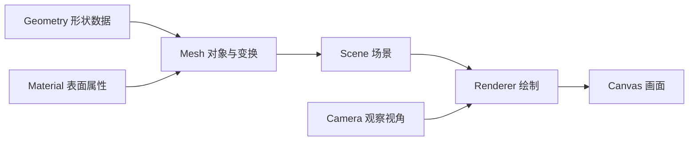
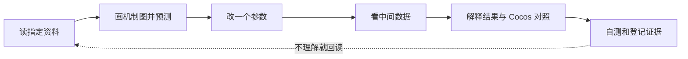

# 3D 客户端第一周：阅读与立方体实验

**[实现记录] 阶段 0 实验已可运行，核心数值与浏览器交互已验证。** [用户报告] 已看完相关基础原理；具体阅读范围、实际投入与个人自测仍待登记。已读基础后从[实践步骤](../../domains/game-engine/experiments/web3d-learning/docs/stage-00-lab.md)开始。计划制定日期：2026-10-08，周次按实际学习安排计算。

参考预算 15 小时：阅读与源码 5 小时、练习与实验 7 小时、检查与复盘缓冲 3 小时。完整方向见[24 周路线](../../learning-routes/topic-index/3d-game-client.md)，实验要求见[阶段 0 规格](../../domains/game-engine/experiments/web3d-learning/docs/stage-00-spec.md)。

具体概念、时间更新过程和后三周的学习单元见[前四周学习内容与资料安排](3d-game-client-month-01.md)。本页保留第一周的阅读停止位置与源码范围。

## 今天从这里开始

打开 [Three.js Fundamentals](https://threejs.org/manual/pages/fundamentals.html)，用约 45 分钟阅读开头的结构图，到第一次 `renderer.render(scene, camera)` 与静态立方体示例为止。

| 时间 | 做什么 | 留下什么 |
| --- | --- | --- |
| 10 分钟 | 看对象关系图，辨认 Scene、Camera、Mesh、Renderer | 用自己的词标注四个职责 |
| 25 分钟 | 顺着创建场景到绘制的代码阅读，查看页面内的立方体示例 | 标出形状、材质、对象位置、观察视角分别来自哪里 |
| 10 分钟 | 合上资料，重画下面的关系图 | 回答“为什么立方体看起来可能像一个方块？” |

这是职责关系图，Camera 可以独立传给 Renderer。[实现记录] 本仓库的学习工程已提供可运行立方体，按[实践说明](../../domains/game-engine/experiments/web3d-learning/docs/stage-00-lab.md)启动和操作。

## 本周资料：每次只读指定范围

完整互联网推荐见[学习资料地图](../../learning-routes/resources/3d-game-client-resources.md)，原规划中的 Scratchapixel、MIT、Blender、Unity 动画、Mixamo、Cocos、Book of Shaders、Catlike Coding 与 RTR 均已收录。下面是第一周选出的阅读范围。

| 编号 | 资料 | 阅读范围与停止位置 | 读完要能说明 |
| --- | --- | --- | --- |
| R1 | [Three.js 基础](https://threejs.org/manual/pages/fundamentals.html) | 开头结构图 → 第一次静态立方体绘制；45 分钟 | Scene、Camera、Mesh、Renderer 怎样协作 |
| R2 | 同页的旋转循环；[MDN requestAnimationFrame](https://developer.mozilla.org/en-US/docs/Web/API/Window/requestAnimationFrame) | Three.js 旋转示例；MDN 概述、回调时间戳与第一个 elapsed 示例；60 分钟 | 回调时间、帧间隔、角度单位；为什么刷新率不能决定运动速度 |
| R3 | [Three.js 安装](https://threejs.org/manual/pages/installation.html)、[Vite 入门](https://vite.dev/guide/) | 安装页 npm／构建工具方案的 Development 与 Addons；Vite 的环境要求与开发启动；45 分钟 | 本地服务、模块导入、依赖与运行时各负责什么 |
| R4 | [Three.js 清理](https://threejs.org/manual/pages/cleanup.html)、[MDN cancelAnimationFrame](https://developer.mozilla.org/en-US/docs/Web/API/Window/cancelAnimationFrame) | 清理页开头到手动 dispose；取消帧回调的语法与例子；45 分钟 | 移除对象、释放图形资源、注销监听、取消待执行回调的区别 |
| R5 | 本地 [Node 指南](../../domains/game-engine/guides/cocos-source-learning/02-scene-graph/01-node-system.md)、[调度器指南](../../domains/game-engine/guides/cocos-source-learning/01-core-foundation/04-scheduler.md)与下方源码 | Node 概述、核心属性与空间变换；调度器概述、帧循环流程；源码按指定函数读；45 分钟 | Web 的对象、更新、渲染分别对应 Cocos 的哪些职责 |
| R6 | 回读 R1 至 R5 中没能解释的部分 | 根据自测问题回读；60 分钟 | 找出证据，修正自己的图和解释 |

R2 的官方旋转示例直接使用回调时间设置角度。本实验另外管理可暂停的模拟时间：先计算帧间隔，再按模拟步长更新角度。照着示例接入暂停前，需要先画清这两个时间的区别。

本周先掌握手动资源释放；ResourceTracker 的完整实现留到资源阶段。灯光可在实验时回看基础页“DirectionalLight 与 MeshPhongMaterial”段落，解释基础材质与受光材质的区别。

**条件补读：**如果函数参数、对象类型或类型标注影响阅读，在 R6 中选读 [TypeScript Everyday Types](https://www.typescriptlang.org/docs/handbook/2/everyday-types.html) 对应小节。若超出缓冲预算，就延长阶段 0 并记录原因。

Scratchapixel 的点／向量、变换与投影从阶段 1 作为主线选读，MIT 对应讲义用于辅助；Book of Shaders 与完整 MDN WebGL 教程在阶段 5 配合原生实验学习。若本周想先了解空间概念，可在 R6 回读预算内预览 [Scratchapixel 的点与向量](https://www.scratchapixel.com/lessons/mathematics-physics-for-computer-graphics/geometry/points-vectors-and-normals.html)，约 15 分钟。后续每课都先明确必读范围，再安排实验与自测。

## 六次学习安排

可按自己的空闲时间分配这六次学习，每次结束记录实际用时。

| 次数 | 主题与动作 | 阅读 | 练习／实验 | 检查／缓冲 | 可检查的产出 |
| --- | --- | ---: | ---: | ---: | --- |
| 1 | 读 R1，看官方示例，重画对象关系 | 45 分钟 | 75 分钟 | 0 | 一张图与四个职责说明 |
| 2 | 读 R2，画帧循环，手算不同帧间隔的角度增量 | 60 分钟 | 60 分钟 | 0 | 30／60／120 帧输入下相同模拟时间的预期值 |
| 3 | 读 R3，创建 TypeScript／Vite 工程，显示立方体与坐标轴 | 45 分钟 | 135 分钟 | 0 | 可运行画面、模块入口与初始化说明 |
| 4 | 读 R4，实现速度、暂停、继续、重置与清理 | 45 分钟 | 75 分钟 | 60 分钟 | 时间与角度面板；暂停／重置／退出检查记录 |
| 5 | 读 R5，对照 Cocos，再检查窗口尺寸与后台恢复 | 45 分钟 | 45 分钟 | 30 分钟 | 一张职责对照图与差异记录 |
| 6 | 按 R6 回读，补齐失败项，做自测与复盘 | 60 分钟 | 30 分钟 | 90 分钟 | 实际验证结果、个人回答与下一问题 |
| 合计 | 15 小时 | 300 分钟 | 420 分钟 | 180 分钟 | 阅读 5 小时＋实验 7 小时＋检查缓冲 3 小时 |

[实现记录] 第 3、4 次所需工程、立方体和控制已由 Agent 实现并保留解释；个人学习仍需完成预测、观察与自测。运行检查与尚未验证的边界见[实践记录](../../domains/game-engine/experiments/web3d-learning/docs/stage-00-lab.md)，实现完成不等于个人理解通过。

## Cocos 源码只沿本周的问题读

| 问题 | 源码入口 | 本周范围 |
| --- | --- | --- |
| 对象保存什么变换？ | [Node](../../domains/game-engine/engines/cocos-engine/cocos/scene-graph/node.ts) | 查找 `_lpos`、`_lrot`、`_lscale`，对应局部位置、旋转、缩放 |
| 一帧先后发生什么？ | [Director](../../domains/game-engine/engines/cocos-engine/cocos/game/director.ts) | 阅读 `tick(dt)`，标出组件 start／update／lateUpdate 与绘制位置 |
| 谁组织组件回调？ | [ComponentScheduler](../../domains/game-engine/engines/cocos-engine/cocos/scene-graph/component-scheduler.ts) | 定位 `startPhase`、`updatePhase`、`lateUpdatePhase`，本周先认识职责 |

Cocos 3.8.8 的 `Director.tick` 将组件更新、系统更新与绘制组织在一帧内；组件回调由 ComponentScheduler 管理，定时任务还有 Scheduler 等机制。指南中的简化代码帮助理解，具体顺序以当前源码为准。

## 通过条件与实际记录

下面的数值是预期，不代表已运行的结果。

| 自测／操作 | 通过条件 |
| --- | --- |
| 合上资料画结构图 | 能解释对象数据、观察视角和绘制之间的联系 |
| 45 度／秒，累计模拟 2 秒 | 预期 90 度；能写出单位与计算过程 |
| 比较 30／60／120 帧输入 | 相同累计模拟时间得到相同角度，能说明浮点误差范围 |
| 暂停等待再继续 | 能解释模拟时间为何不增加，继续为何不补算暂停时间 |
| 后台返回 | 能区分实际帧间隔与上限 0.1 秒的模拟步长 |
| 重置与退出 | 能说明恢复哪些状态，哪些监听、任务与自有资源需要清理 |
| Cocos 对照 | 能指出 Node、ComponentScheduler、Director 的职责及与 Web 实验的差异 |

开始与结束时在[学习进度](3d-game-client-progress.md)登记；实现后的详细证据按[实验模板](../../domains/game-engine/experiments/web3d-learning/docs/lab-template.md)保存。未通过的项保留问题并回读、修正，再决定是否进入阶段 1。

| 待填写记录 | 内容 |
| --- | --- |
| 实际开始／结束日期 | 待登记 |
| 阅读范围与实际用时 | 待登记 |
| 实验版本、环境、输入与实际结果 | 待登记 |
| 自测回答、机制图与卡住的问题 | 待登记 |
| 预算调整与下一步 | 待登记 |
